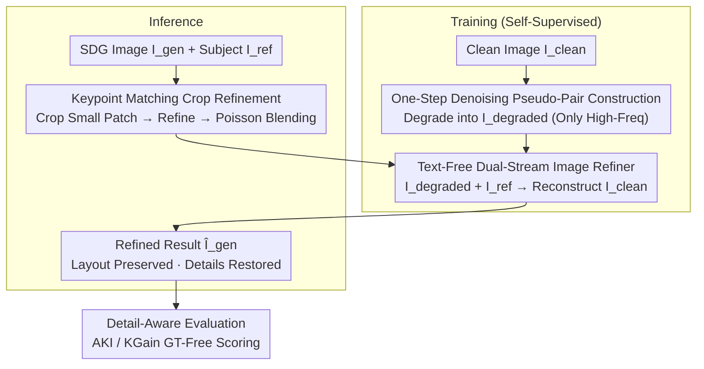

# FlowFixer: Towards Detail-Preserving Subject-Driven Generation

**Conference**: CVPR 2026  
**Paper**: [CVF Open Access](https://openaccess.thecvf.com/content/CVPR2026/html/Jun_FlowFixer_Towards_Detail-Preserving_Subject-Driven_Generation_CVPR_2026_paper.html)  
**Code**: None  
**Area**: Diffusion Models / Subject-Driven Generation  
**Keywords**: Subject-Driven Generation, Detail Fidelity, Self-Supervised Pseudo-Pairs, One-Step Denoising, Keypoint Matching Evaluation

## TL;DR
FlowFixer is a model-agnostic, prompt-free refiner. It does not re-generate the scene; instead, it takes images from any Subject-Driven Generation (SDG) model as input alongside the original subject image as a reference. Using a pure image-to-image dual-stream diffusion process, it restores high-frequency details such as lost logos, text, and textures. Training data is synthesized via "one-step denoising" to create self-supervised pseudo-pairs where only details are degraded while layouts remain intact. Coupled with ground-truth-free metrics (AKI / KGain) based on keypoint matching, it achieves new SOTA subject fidelity across three mainstream SDG backbones (average KGain 77.3%, dominating competitors in human preference).

## Background & Motivation
**Background**: Subject-Driven Generation (SDG) aims to insert a given subject (reference image) into a new scene described by text while preserving the subject's identity. Current methods follow two paths: subject-specific fine-tuning (DreamBooth, Textual Inversion, Custom Diffusion LoRA), which is expensive per subject, and encoder injection (IP-Adapter, BLIP-Diffusion, OminiControl), which feeds reference features into a diffusion backbone to avoid per-subject tuning.

**Limitations of Prior Work**: These methods perform well on subjects with simple textures (animals, plain objects) but fail significantly on **commercial-grade details**—product logos, small text, and complex patterns. In advertising, distorted logos render a brand useless, and blurred text makes images unusable. The root causes are twofold: (1) High-quality paired training data is extremely difficult to collect; ideally, one needs triplets of "Same Subject + Diverse Ground-Truth Scenes," whereas existing datasets like Subjects200K rely on synthetic images with poor detail alignment. (2) Existing conditioning mechanisms lack expressive power—text prompts provide only coarse semantics like "red sports car" and cannot specify pose/orientation/lighting. Even image conditions like depth or edge maps bias toward global scene consistency, sacrificing high-frequency information in texture-rich areas.

**Key Challenge**: Generating from scratch (generation) inherently involves a compromise between "overall plausibility" and "local high-frequency fidelity." The ambiguity of text prompts pushes the balance further toward global credibility at the expense of details. Attempting to preserve details by improving the generation process itself directly conflicts with the inductive biases of diffusion models.

**Goal**: To shift the paradigm—rather than modifying the upstream generation, treat it as a black box and perform "last-mile" refinement afterward. Simultaneously, address the engineering hurdles of scarce paired data and the lack of detail-level evaluation.

**Key Insight**: The authors observe that SDG distortions **concentrate in high-frequency details while global structures remain largely unchanged**. Thus, the refinement task can be framed as self-supervised: by taking a clean real image and artificially creating a degraded version where "details are broken but the layout is preserved," the model can learn to restore details from a reference without needing real triplets.

**Core Idea**: Utilize "one-step denoising" to synthesize pseudo-paired data that only degrades high frequencies. Train a **text-free, reference-to-generated dual-stream diffusion refiner** to transform detail preservation from "preserving during generation" to "restoring after generation."

## Method

### Overall Architecture
FlowFixer formulates the problem as text-free conditional diffusion refinement: given an image $I_{gen}$ generated by an upstream SDG model and the original subject reference $I_{ref}$, it starts from noise $z_1\sim p_s$ to solve $\hat I_{gen}=D_{refine}(z_1, I_{gen}, I_{ref})$. The output is required to **preserve the global layout of $I_{gen}$** while restoring subject details from $I_{ref}$. The system comprises training and inference pipelines: the training side uses "one-step denoising" to generate "degraded-clean" pseudo-pairs for supervision, while the inference side refines real SDG outputs using a "crop-refine-paste" strategy to save computation. The three main contributions—pseudo-pair construction, the dual-stream refiner, and crop refinement—along with detail-aware metrics, form the complete method.

### Key Designs

**1. One-Step Denoising Pseudo-Pair Construction: Creating "Detail-Degraded, Layout-Intact" Pairs from Scratch**

The refiner lacks training signals for pairs where "subject details are destroyed but global structure remains." Gathering such triplets is nearly impossible. The authors use one-step denoising for self-supervision: starting from a clean image $I_{clean}$, they apply forward diffusion noise and then use a pre-trained model (SDXL) for **single-step denoising** to obtain the degraded version $I_{degraded}$. Crucially, the degradation intensity is controlled by downsampling $I_{clean}$ to $1.0\times/0.5\times/0.25\times$ before VAE encoding—higher downsampling forced the single-step denoising to "imagine" more high-frequency content, creating distortions that simulate SDG detail loss during scale or perspective changes. Pixel-wise variance maps across 10 random seeds (Figure 4) confirm that variance **concentrates in high-frequency regions while smooth backgrounds remain static**, validating the premise of detail-only degradation. During training, $I_{degraded}$ serves as the $I_{gen}$ input, while $I_{ref}$ is a spatially perturbed version of $I_{clean}$ (random crop/rotation/color jittering), forcing the model to rely on **local correspondences** rather than pixel-level copying.

**2. Text-Free Dual-Stream Image Refiner: Bypassing Linguistic Ambiguity with Image Conditions**

Text prompts are fundamentally limited as they provide only coarse semantics. The authors discard the text channel entirely for pure image-to-image translation. Modified from FLUX.1-Kontext, the refiner discards original text tokens and adds an image input path. The network processes three inputs: noise $z_1$, generated image $I_{gen}$, and reference $I_{ref}$. Both $I_{gen}$ and $I_{ref}$ are encoded into latent tokens via a pre-trained VAE and concatenated with $z_1$ before entering the DiT backbone. To enable full cross-attention while maintaining stream distinguishability, the authors employ **3D RoPE with independent timestep offsets per stream** ($0$ for $z_1$, $1$ for $I_{gen}$, $2$ for $I_{ref}$). This attaches a unique "time-stamp" positional encoding to each stream, allowing the model to find dense correspondences between $I_{gen}$ and $I_{ref}$ without confusion. This explicit dual-stream architecture, combined with self-supervised training, focuses refinement on reference-guided local repair. The model is fine-tuned using LoRA (rank 192) for 50K steps with batch size 4, using MSE loss against the clean target.

**3. Keypoint-Matched Crop Refinement + Poisson Blending: Efficiency and Clarity**

Refining full-resolution images is slow and memory-intensive. Since FlowFixer only modifies details, it is sufficient to refine only the subject region. During inference, keypoint matching (OmniGlue) identifies the subject center between $I_{ref}$ and $I_{gen}$ to extract a subject-centric crop. Only this crop is refined and then merged back. Since the global structure is unchanged, simple **Poisson blending** ensures seamless integration without the need for user masks or inversion. This step not only saves resources but also improves accuracy: experiments (Figure 9) show that at the same evaluation resolution, crop refinement is **more accurate at restoring fine-grained details** (especially small text readability) than whole-image refinement because the computation is concentrated.

**4. Detail-Aware Evaluation Metrics AKI / KGain: Quantifying "Detail Restoration"**

Similarity metrics like CLIP-I or DINOv2 capture global semantics but are insensitive to high-frequency details. MSE/SSIM look at low-level differences, while FID/LPIPS often require ground truth images, which are unavailable in open-world generation. Based on the observation that "better subject fidelity leads to more matched keypoints," the authors propose two ground-truth-free metrics. **Absolute Keypoint Increment (AKI)** is defined as the difference in matched keypoints between the reference and the image before vs. after refinement: $\text{AKI}=N(M(I_{ref},\hat I_{gen}))-N(M(I_{ref},I_{gen}))$, where $N(M(a,b))$ is the number of keypoints matched by network $M$. A higher AKI indicates better detail restoration. However, because AKI depends on the matcher's calibration, the authors also define **Keypoint Matching Gain (KGain)**—the percentage of improved samples:

$$\text{KGain}=\frac{1}{N}\sum_{i=1}^{N}\delta(\text{AKI}_i,\tau)$$

Where $\delta$ is an indicator function that equals 1 if $\text{AKI}_i>\tau$ (default $\tau=0$). Using OmniGlue as the matcher, these metrics correlate well with human and VLM judgments, providing a reproducible measure for fine-grained fidelity.

### Loss & Training
The objective is the MSE between the refined output $\hat I_{gen}$ and the clean target $I_{clean}$. Each iteration samples a pseudo-pair according to Design 1, with degradation levels randomly selected from $1.0\times/0.5\times/0.25\times$. Only LoRA (rank 192) is used to fine-tune FLUX.1-Kontext, ensuring minimal parameter overhead.

## Key Experimental Results

Evaluation is conducted on the self-built **FidelityBench-258K** (258K subject-SDG pairs) and a fixed subset **FidelityBench-300**. Baselines include text editing (FLUX.1-Kontext) and OminiControl modified with the same pseudo-pair data.

### Main Results
Refinement performance across three SDG backbones on FidelityBench-258K (higher is better; AKI/KGain are relative improvements):

| SDG Backbone | Method | AKI ↑ | KGain ↑ | CLIP-I ↑ | DINO ↑ |
|--------------|--------|-------|---------|----------|--------|
| FLUX.1-Kontext-Pro | Text Edit | 7.5 | 52.7% | 0.763 | 0.647 |
| FLUX.1-Kontext-Pro | OminiControl+F-Dev | 29.0 | 53.9% | 0.724 | 0.551 |
| FLUX.1-Kontext-Pro | **FlowFixer** | **66.5** | **77.9%** | **0.778** | **0.668** |
| Qwen-Image-Edit | Text Edit | 11.1 | 54.1% | 0.762 | 0.647 |
| Qwen-Image-Edit | OminiControl+F-Dev | 0.48 | 43.8% | 0.724 | 0.552 |
| Qwen-Image-Edit | **FlowFixer** | **54.0** | **74.8%** | **0.777** | **0.668** |
| Nano-Banana-Edit | Text Edit | 61.7 | 77.0% | 0.782 | 0.691 |
| Nano-Banana-Edit | **FlowFixer** | 64.7 | **79.2%** | **0.796** | **0.711** |

FlowFixer leads in AKI/KGain across all backbones with an average KGain of 77.3%. Meanwhile, CLIP-I/DINO metrics remain stable or improve, indicating that detail restoration does not compromise global semantics.

### Ablation Study
Comparison on FidelityBench-300 including VLM (Claude 3.7) win rates:

| Method | AKI ↑ | KGain ↑ | VLM ↑ |
|--------|-------|---------|-------|
| Text Edit | 1.87 | 45.9% | 41.3% |
| OminiControl+F-Dev | 22.7 | 46.6% | 4.2% |
| OminiControl+F-Kontext | 11.1 | 38.4% | 25.2% |
| **FlowFixer** | **67.3** | **91.2%** | **79.0%** |

Other findings: **Degradation levels** (Figure 8)—training only on $1.0\times$ lacks robustness; incorporating $0.5\times$ and $0.25\times$ levels significantly improves restoration for large distortions. **Crop Refinement** (Figure 9)—crop-based refinement provides better legibility for small text compared to whole-image refinement at the same resolution.

### Key Findings
- **Keypoint metrics capture what perceptual metrics miss**: While FlowFixer significantly leads in AKI/KGain, CLIP-I/DINOv2 remain nearly unchanged, proving that standard perceptual metrics are insensitive to fine-structural fidelity.
- **Consistency is the moat**: While some OminiControl variants occasionally achieve high AKI, their KGain often drops below 50%, indicating inconsistent improvements. Scatter plots (Figure 6) show only FlowFixer maintains a consistent positive trend.
- **Text prompts are negligible for subject fidelity**: Human preferences for FlowFixer vs. baseline and FlowFixer vs. text-edit are nearly identical (64.9% vs. 64.4%), suggesting that text prompts contribute little to detail preservation; pure image-to-image is the key. ⚠️ Some methods on Nano-Banana inflate AKI by "copy-pasting" or generating larger subjects at the cost of CLIP-I/DINO, a phenomenon the evaluation warns against.

## Highlights & Insights
- **Paradigm shift to "Post-hoc Refinement"**: Rather than competing with diffusion models to preserve details during generation, treating it as a black-box post-process makes the method baseline-agnostic and easy to migrate.
- **One-step denoising for pseudo-pairs**: Using downsampling levels and single-step denoising to accurately simulate SDG high-frequency artifacts turns a data-scarce triplet problem into a self-supervised one.
- **3D RoPE with stream offsets**: Using "time-stamps" in the positional encoding to distinguish between multiple input streams allows for full cross-attention without "cross-stream leakage," a strategy transferable to any multi-image conditioning task.
- **Ground-truth-free AKI/KGain metrics**: Converting "detail restoration" into "keypoint match increment" bypasses the lack of ground truth in open-world generation and correlates highly with human/VLM judgments.

## Limitations & Future Work
- The authors identify two areas for improvement: **multi-reference refinement** (currently single-reference) and **user-interactive correction** (e.g., using scribble masks as auxiliary signals).
- ⚠️ The metrics and benchmark were developed alongside the method; AKI/KGain are naturally coupled with the design motivation (keypoint matching). While cross-validated by VLM/humans, their reliability on subjects with sparse keypoints remains to be explored.
- The pseudo-pair degradation is simulated by SDXL single-step denoising, which may not perfectly match the distortion distribution of other SDG backbones (FLUX/Qwen).
- Crop refinement depends on successful keypoint matching. If the subject is severely altered or occluded in the generated image, the localization and blending may fail.

## Related Work & Insights
- **vs DreamBooth / Textual Inversion**: These require per-subject fine-tuning (3-5 images) to preserve identity but are slow. FlowFixer is a "one-for-all" patch that avoids per-subject training.
- **vs IP-Adapter / OminiControl**: These excel at high-level semantics but miss low-level structural details. FlowFixer serves as the "last-mile" patch for missing high-frequency structures and can be stacked on top of them.
- **vs Editing-based methods**: Traditional editing requires masks or text prompts and often sacrifices original subject details. FlowFixer is automatic and relies solely on cross-image correspondence.

## Rating
- Novelty: ⭐⭐⭐⭐ The "post-hoc refinement + one-step denoising + GT-free keypoint metrics" combo is novel, though components are built on established parts.
- Experimental Thoroughness: ⭐⭐⭐⭐ Extensive benchmark (258K), human/VLM evaluation, and scatter analysis, though the metrics-method coupling slightly reduces persuasivity.
- Writing Quality: ⭐⭐⭐⭐ Clear mapping between motivation, obstacles, and solutions; the pipeline and variance maps are highly illustrative.
- Value: ⭐⭐⭐⭐ Model-agnostic and plug-and-play, offering high practical value for detail-sensitive commercial generation like e-commerce.

<!-- RELATED:START -->

## Related Papers

- [\[CVPR 2026\] Proxy-Tuning: Tailoring Multimodal Autoregressive Models for Subject-Driven Image Generation](proxy-tuning_tailoring_multimodal_autoregressive_models_for_subject-driven_image.md)
- [\[CVPR 2026\] Scone: Bridging Composition and Distinction in Subject-Driven Image Generation via Unified Understanding-Generation Modeling](scone_bridging_composition_and_distinction_in_subject-driven_image_generation_vi.md)
- [\[CVPR 2026\] Say Cheese! Detail-Preserving Portrait Collection Generation via Natural Language Edits](say_cheese_detail-preserving_portrait_collection_generation_via_natural_language.md)
- [\[CVPR 2026\] HiFi-Inpaint: Towards High-Fidelity Reference-Based Inpainting for Generating Detail-Preserving Human-Product Images](hifi-inpaint_towards_high-fidelity_reference-based_inpainting_for_generating_det.md)
- [\[CVPR 2026\] Disentangling to Re-couple: Resolving the Similarity-Controllability Paradox in Subject-Driven Text-to-Image Generation](disentangling_to_re-couple_resolving_the_similarity-controllability_paradox_in_s.md)

<!-- RELATED:END -->
