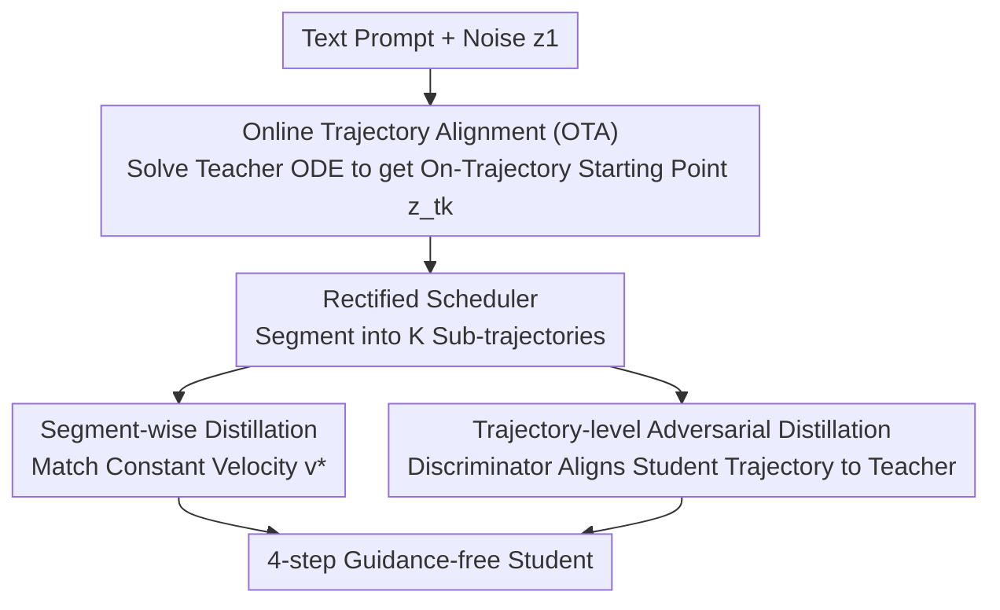

# FlowSteer: Guiding Few-Step Image Synthesis with Authentic Trajectories

**Conference**: CVPR 2026  
**Paper**: [CVF Open Access](https://openaccess.thecvf.com/content/CVPR2026/html/Ke_FlowSteer_Guiding_Few-Step_Image_Synthesis_with_Authentic_Trajectories_CVPR_2026_paper.html)  
**Code**: None  
**Area**: Diffusion Models / Image Generation  
**Keywords**: Few-step distillation, Rectified Flow, Trajectory Alignment, Adversarial Distillation, Flow Matching  

## TL;DR
FlowSteer supplements the neglected ReFlow/PeRFlow few-step distillation path by guiding the student model along the teacher's **authentic generation trajectories** (instead of linear interpolation). By integrating Online Trajectory Alignment (OTA), trajectory-level adversarial distillation, and a rectified scheduler, it achieves 4-step generation quality on SD3 that surpasses mainstream methods like PCM, Hyper-SD, and Flash Diffusion.

## Background & Motivation
**Background**: Flow Matching has become a dominant paradigm in visual generation, learning a "straight" velocity field from noise to data for theoretically efficient sampling. However, real-world data mappings are complex, and the learned trajectories are rarely perfectly straight, causing quality degradation in few-step inference. In the acceleration domain, ReFlow "straightens" ODE trajectories through iterative reflowing, while PeRFlow further divides the trajectory into K segments, straightening each independently via a divide-and-conquer approach.

**Limitations of Prior Work**: Despite its theoretical consistency with Flow Matching, the ReFlow/PeRFlow line has been overlooked by the community as its performance typically lags behind Consistency Distillation (CD) and Distribution Matching Distillation (DMD). The authors aim to answer: why does the theoretically sound PeRFlow fail in practice?

**Key Challenge**: The issue lies in the **training-inference mismatch** of PeRFlow. When PeRFlow constructs the starting point $z_{t_k}$ for each segment, it uses a **linear interpolation** of the ground-truth image $z_0$ and noise $\epsilon$ ($z_{t_k}=\sigma_k\epsilon+(1-\sigma_k)z_0$). In real inference, the state at $t_k$ is evolved along the teacher's non-linear velocity field. Since this interpolation point does not lie on the teacher's authentic trajectory, two problems arise: (a) **Teacher trajectory mismatch**—the teacher denoises from a point it never encounters during inference, providing "sub-optimal" distillation targets; (b) **Inter-segment distribution mismatch**—training segments are initialized with fresh interpolation points, while inference uses outputs from previous segments. These distributions are inherently different, and the authors prove that as long as the teacher is not a perfect Rectified Flow, this mismatch **cannot be eliminated**, causing errors to accumulate segment by segment.

**Goal**: Elevate the few-step quality of ReFlow-based methods to meet or exceed SOTA distillation methods without sacrificing theoretical consistency.

**Key Insight**: Replace linear interpolation with the teacher's **authentic generation trajectories** to guide the student. This ensures the teacher remains "on-trajectory" to produce clean distillation targets and aligns the training distribution with the inference distribution. This is further enhanced by adversarial distillation acting directly on ODE trajectories and fixing a neglected bug in the scheduler.

## Method

### Overall Architecture
FlowSteer adheres to the PeRFlow framework of "segmenting trajectories into K parts and distilling segment-by-segment." Given a text prompt (for online trajectory generation), it outputs a 4-step guidance-free student model. It replaces the offline interpolation data flow of PeRFlow with three synergistic components: (1) **OTA** simulates the teacher's inference online to generate "on-trajectory" starting points $z_{t_k}$ for each segment; (2) **Trajectory-level adversarial distillation** utilizes a DiT-backbone with a discriminator head to force the student's 4-step trajectory to perceptually match the teacher's multi-step trajectory; (3) The entire sub-trajectory segmentation is built on a **rectified scheduler** (shared by teacher and student) to eliminate scale misalignment at the final "jump to 0" step.

### Key Designs

**1. Online Trajectory Alignment (OTA): Aligning Points with the Authentic Trajectory**

As the core of FlowSteer, OTA directly addresses "teacher trajectory mismatch" and "inter-segment distribution mismatch." While PeRFlow uses static interpolation $z_{t_k}=(1-t_k)z_0+t_k\epsilon$ (Algorithm 1, line 5, *Off-Trajectory*), OTA solves the teacher's probability flow ODE online, integrating from initial noise $z_1\sim\mathcal{N}(0,I)$ to time $t_k$:

$$z_{t_k} = z_1 + \int_{1}^{t_k} v_T(z(s), s)\, ds$$

This corresponds to `ODESolve(vT, ε, 1, tk)` in Algorithm 2, line 5 (*On-Trajectory*). Ensuring $z_{t_k}$ lies on the authentic trajectory yields two benefits: first, the teacher evolves from a point it actually visits during inference, providing target velocities $v^*=(z_{t_{k-1}}-z_{t_k})/(t_{k-1}-t_k)$ derived from undistorted dynamics; second, the training starting distribution matches the intermediate state distribution during inference, closing the segment mismatch loop. While this requires more computation due to online ODE solving, the authors argue it is a necessary trade-off to suppress error propagation and achieve high-fidelity distillation. Table 1 supports this: the teacher's performance (PickScore/HPSv2) drops significantly when resuming from an interpolated point compared to its authentic trajectory.

**2. Adversarial Distillation on ODE Trajectories: Perceptual Alignment**

Adversarial distillation is effective for few-step models, but FlowSteer is the first to apply it to ReFlow trajectories. Adversarial loss is applied directly between the teacher and student **trajectories**. The discriminator reuses a pre-trained diffusion backbone with added heads (following LADD). The student $v_S$ acts as the generator, with time steps sampled from a discrete set $T_S=\{t_1,t_2,t_3,t_4\}$. The goal is to maximize the discriminator's score for student states $z_t^S$:

$$\mathcal{L}_{adv} = -\,\mathbb{E}_{z_t^S\sim v_S,\, t\sim p(t)}\big[D(z_t^S, t)\big]$$

To stabilize training, a feature matching loss minimizes the L2 distance between teacher and student states at the $l$-th feature map $D_l$: $\mathcal{L}_{FM}=\sum_{l=1}^{L}\mathbb{E}\big[\lVert D_l(z_t^T,t)-D_l(z_t^S,t)\rVert^2\big]$. The final student objective is a weighted sum: $\mathcal{L}_{student}=\mathcal{L}_{dist}+\lambda_{adv}\mathcal{L}_{adv}+\lambda_{FM}\mathcal{L}_{FM}$. Critically, adversarial distillation only succeeds because OTA provides on-trajectory data, making state-wise comparisons meaningful.

**3. Rectified FlowMatchEulerDiscreteScheduler: Fixing the Hidden Bug**

This discovery involves just a few lines of code but provides the largest individual gain. Standard schedulers define 1,000 steps, sample $N$ points for inference, and then **append** the final state $\sigma=0$. The problem: the step size from the last sampled $\sigma$ to 0 is **disproportionate** to other steps. For example, with shift=3, jumping from $\sigma=0.0089$ to 0 causes severe quality loss in few-step settings. The fix: add the endpoint $\sigma=0$ to the scheduler **before** sampling, then linearly sample $N+1$ points across the entire range. Table 2 shows that while negligible for many steps, this rectified scheduler significantly improves PickScore/HPSv2 as the number of steps ($N$) decreases, making it ideal for the few-step distillation task.

### Loss & Training
- The distillation backbone follows PeRFlow's segment-wise constant velocity matching $\mathcal{L}=\sum_k\mathbb{E}\int_{t_{k-1}}^{t_k}\lVert v_\theta(z_t,t)-v^*\rVert^2 dt$, but with $z_{t_k}$ generated via OTA.
- Total loss: $\mathcal{L}_{student}=\mathcal{L}_{dist}+\lambda_{adv}\mathcal{L}_{adv}+\lambda_{FM}\mathcal{L}_{FM}$. Hinge loss is used for stability.
- Base models: SD3-Medium / SD3.5-Large (MMDiT), efficient fine-tuning with LoRA. Training prompts from FluxReason-6M.
- **CFG Distillation**: Teacher CFG scale sampled from $U[7,13]$; student fixed at $\omega=0$ to bake guidance into weights, saving computational costs during inference. Main experiments focus on 4-step distillation.

## Key Experimental Results

### Main Results
Evaluated on COCO 10k + GenEval with NFE=4 (Note: PCM/Hyper-SD use 4x2 due to CFG).

| Method (SD3-Medium) | NFE | PickScore↑ | HPSv2↑ | CLIP↑ | GenEval Overall↑ |
|------|-----|-----------|--------|-------|------------------|
| SD3-Medium Pretrained | 20×2 | 22.41 | 28.02 | 32.78 | 0.6639 |
| PCM (Shift=3) | 4×2 | 22.28 | 27.68 | 32.05 | 0.6339 |
| Hyper-SD | 4×2 | 22.28 | 28.04 | 32.31 | 0.6336 |
| Flash Diffusion | 4×1 | 22.37 | 27.35 | 32.51 | 0.6672 |
| PeRFlow† | 4×1 | 22.19 | 26.36 | 32.55 | 0.6357 |
| **FlowSteer (Ours)** | 4×1 | **22.39** | **28.60** | **32.81** | **0.6859** |

- HPSv2 improved from PeRFlow's 26.36 to 28.60; GenEval score increased from 0.6357 to 0.6859. FlowSteer (4×1) outperforms PCM/Hyper-SD (4×2) using fewer steps.
- Similar gains are observed on SD3.5-Large (HPSv2 27.14→28.47), demonstrating scalability to larger backbones.

### Ablation Study
Incremental ablation of key components (Table 5, SD3-Medium, 4 steps):

| Configuration | PickScore↑ | HPSv2↑ | Description |
|------|-----------|--------|------|
| Baseline (PeRFlow) | 22.19 | 26.36 | Starting point |
| + OTA | 22.23 | 26.79 | Modest individual gain, but provides the "on-trajectory" foundation |
| + Adv. Distillation | 22.18 | 27.73 | Significantly boosts HPSv2 |
| + Scheduler | 22.50 | 27.75 | Largest individual gain |
| **Ours (Full)** | 22.39 | **28.60** | Synergistic effect |

Discriminator ablation (Table 4): 12-block backbone is optimal; head at the final layer (global judgment) is better than per-block; backbone requires **full fine-tuning** (better than Frozen/LoRA); **Hinge** GAN loss is most stable.

### Key Findings
- The rectified scheduler is the "largest single gain" component—a fix for a few-lines-of-code bug that was overlooked by the distillation community.
- While OTA's standalone improvement is modest, it is the **Core Idea** of FlowSteer; it provides the "on-trajectory" data required for adversarial and scheduler components to function synergistically.
- Verification of the "training-inference mismatch" hypothesis: the teacher's quality drops when starting from interpolated points (Table 1).

## Highlights & Insights
- **The "authentic trajectory" perspective is highly effective**: Precise diagnosis of PeRFlow's weakness as the distribution mismatch between interpolated training points and evolved inference points.
- **Moving Adversarial Distillation to the Trajectory**: Unlike prior methods matching final output distributions, FlowSteer aligns intermediate states along the ODE trajectory, achieving deeper perceptual consistency.
- **Highly Reusable Scheduler Fix**: As `FlowMatchEulerDiscreteScheduler` is a standard component in the `diffusers` library, this fix for disproportionate final steps is zero-cost and beneficial for any few-step inference task, even with un-distilled models.

## Limitations & Future Work
- Evaluation is limited to SD3-Medium / SD3.5-Large (MMDiT); cross-architecture transferability to SDXL/UNet or video generation remains to be tested.
- OTA requires online ODE solving, increasing training compute compared to PeRFlow's offline interpolation. The authors describe this as a "principled trade-off" but do not provide exact compute figures.
- The proof for the "inevitability" of inter-segment distribution mismatch is relegated to the supplementary material.
- Performance in extreme few-step scenarios (e.g., 1 or 2 steps) is not fully explored.

## Related Work & Insights
- **vs PeRFlow**: Both share the divide-and-conquer segmented straightening framework. FlowSteer replaces PeRFlow's off-trajectory interpolation with on-trajectory OTA, adding adversarial distillation and scheduler fixes. HPSv2 improved from 26.36 to 28.60.
- **vs CD / PCM / Hyper-SD**: Consistency models enforce a consistent mapping from trajectory points to the endpoint; FlowSteer maintains ReFlow's theoretical consistency with Flow Matching and outperforms these rivals using fewer total function evaluations (4×1 vs 4×2).
- **vs DMD / Flash Diffusion**: DMD matches output distributions; FlowSteer matches the trajectory itself (OTA + Trajectory Adversarial), emphasizing faithful reproduction of teacher dynamics.
- **vs LADD**: Inherits the discriminator architecture but shifts the objective from final outputs to states along the ODE trajectory.

## Rating
- Novelty: ⭐⭐⭐⭐ Precision in diagnosing trajectory mismatch and fixing it via online alignment is clear; adversarial and scheduler components are incremental but well-integrated.
- Experimental Thoroughness: ⭐⭐⭐⭐ Solid results on multiple backbones and detailed ablations, though limited to the SD3 family and lacking extreme few-step or training overhead analysis.
- Writing Quality: ⭐⭐⭐⭐ Logical progression in problem diagnosis; clear contrast between Algorithms 1 and 2.
- Value: ⭐⭐⭐⭐ Successfully revitalizes the ReFlow distillation path; the scheduler fix is a zero-cost win for the community.

<!-- RELATED:START -->

## Related Papers

- [\[CVPR 2026\] LeapAlign: Post-Training Flow Matching Models at Any Generation Step by Building Two-Step Trajectories](leapalign_post_training_flow_matching_models_at_any_generation_step.md)
- [\[CVPR 2026\] BiFM: Bidirectional Flow Matching for Few-Step Image Editing and Generation](bifm_bidirectional_flow_matching_for_few-step_image_editing_and_generation.md)
- [\[CVPR 2026\] Few-Step Diffusion Sampling Through Instance-Aware Discretizations](few-step_diffusion_sampling_through_instance-aware_discretizations.md)
- [\[CVPR 2026\] InverFill: One-Step Inversion for Enhanced Few-Step Diffusion Inpainting](inverfill_one-step_inversion_for_enhanced_few-step_diffusion_inpainting.md)
- [\[CVPR 2026\] Uni-DAD: Unified Distillation and Adaptation of Diffusion Models for Few-step Few-shot Image Generation](uni-dad_unified_distillation_and_adaptation_of_diffusion_models_for_few-step_few.md)

<!-- RELATED:END -->
