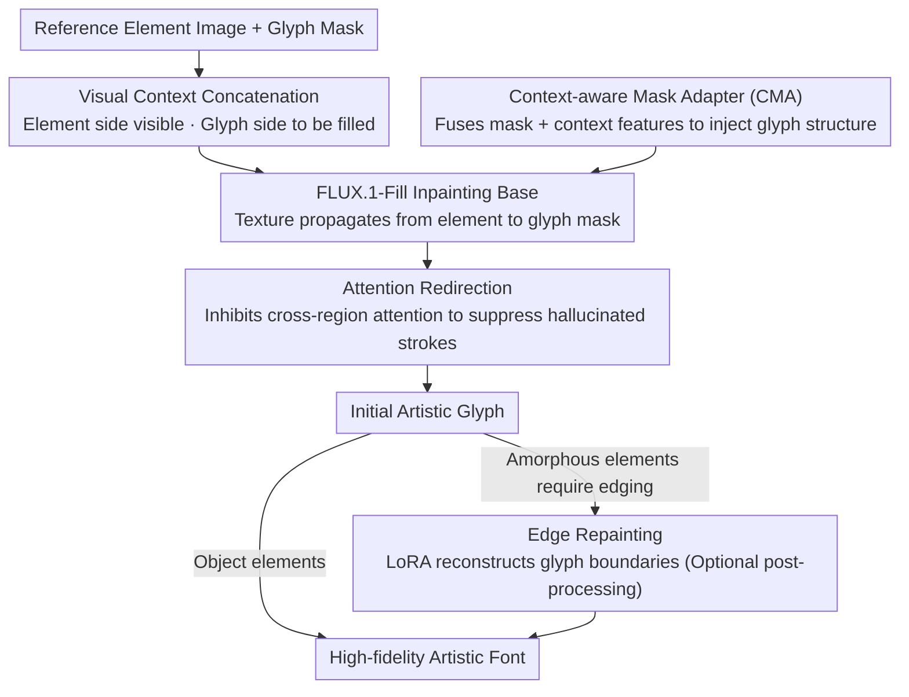

# FontCrafter: High-Fidelity Element-Driven Artistic Font Creation with Visual In-Context Generation

**Conference**: CVPR 2026  
**arXiv**: [2603.22054](https://arxiv.org/abs/2603.22054)  
**Code**: None  
**Area**: Diffusion Models / Image Generation  
**Keywords**: Artistic Font Generation, Element-driven, Visual In-context Generation, Image Inpainting, Style Control

## TL;DR
FontCrafter reformulates artistic font generation as a visual in-context generation task. By concatenating reference element images with a blank canvas and feeding them into a pre-trained inpainting model (FLUX.1-Fill), it achieves high-fidelity element-driven font creation, significantly outperforming existing methods in texture and structural fidelity.

## Background & Motivation

1. **Background**: Artistic font generation aims to synthesize stylized glyphs based on a reference style. Existing methods primarily follow two paradigms: GAN-based feature fusion methods and zero-shot methods based on diffusion models with adapters (e.g., IP-Adapter).
2. **Limitations of Prior Work**: GAN methods are limited by model capacity and small-scale training data with simple textures, leading to poor generalization. Diffusion methods capture only global features through Style Adapters, ignoring pixel-level details and making it difficult to precisely match the reference style. Both paradigms only support coarse-grained control (color/overall style).
3. **Key Challenge**: Preserving both the texture and structural information of reference elements with high fidelity while balancing style diversity and fine-grained control.
4. **Goal**: (a) How to achieve pixel-level element style transfer instead of just global semantic transfer? (b) How to control glyph shapes in a lightweight manner? (c) How to avoid hallucinated strokes in background regions?
5. **Key Insight**: The authors leverage the "context propagation" capability of image inpainting models (FLUX.1-Fill)—the model's ability to propagate visual cues from visible regions to masked regions. Using this property, the element image serves as the visible context and the glyph region as the masked area, naturally enabling style transfer.
6. **Core Idea**: Formulate artistic font generation as a visual context inpainting task, allowing reference elements to directly "fill" the glyph region in pixel space.

## Method

### Overall Architecture
This paper addresses "element-driven artistic font generation": given a reference element image (e.g., a cluster of flowers, a stone) and a glyph mask, the goal is to "grow" the element's texture and structure into the glyph with high fidelity. The core insight of FontCrafter is to treat this as an image inpainting problem—inpainting models (FLUX.1-Fill) are inherently skilled at propagating visual cues from visible regions to masked areas. Thus, the reference element is treated as the visible context, and the glyph region as the mask to be filled, allowing the style to be "filled in" directly in pixel space.

Specifically: The reference element image and a blank canvas are horizontally concatenated in pixel space to form an input image; the corresponding glyph mask is also concatenated with an all-zero region in the same layout. This concatenated pair is fed into FLUX.1-Fill. During inpainting, the texture from the element side is propagated into the glyph mask on the blank side. On top of this base, three additional components address specific weaknesses: CMA injects glyph structure, Attention Redirection suppresses hallucinated strokes in the background, and Edge Repainting refines glyph boundaries for a more natural look.

### Key Designs

**1. Context-aware Mask Adapter (CMA): Making shape control signals "aware" of reference elements**

The glyph mask itself only describes the outline. If the generation control signal is derived solely from the mask, it would have no relationship with the reference element—yet, the same glyph should grow completely different structural textures when using flower elements versus stone elements. CMA inserts a lightweight module (two linear layers with a GELU) at the end of each MM-DiT block. It concatenates the downsampled glyph mask with the output features of that block along the channel dimension. The first layer reduces the channels to 64, and the second restores the original dimension. Crucially, it fuses "contextual features"—the control signal thus gains element-awareness, adaptively providing structural guidance for different reference elements. This design accounts for only 0.5% of the model parameters (22.4M), yet controls shape more accurately than a standalone ControlNet (743.81M), proving that "task-specific information + context awareness" is more efficient than "stacking a large control network."

**2. Attention Redirection: "Pushing" hallucinated strokes back into the mask during inference**

Inpainting models occasionally generate redundant content outside the glyph region, known as hallucinated strokes. AR cures this during inference without training by modifying attention: define an attenuation matrix $M_{attenuate} \in \mathbb{R}^{L \times L}$, marking positions as 1 where token $i$ falls in the glyph background and token $j$ falls in the reference foreground. The logits in self-attention are rewritten as:

$$\hat{A} = A + M_{attenuate} \cdot \log_e(\lambda),\quad \lambda \in (0,1)$$

This effectively multiplies the cross-region attention weights from "reference foreground $\rightarrow$ glyph background" by a factor $\lambda$. As $\lambda$ decreases, the channel through which the background absorbs the reference style is cut off, restricting style transfer to the masked region where strokes should exist. This toggle also enables region-aware style mixing by adjusting the attention strength of different reference areas.

**3. Edge Repainting: Restoring the "natural texture edges" of the reference elements**

The glyph masks used during inference are from standard font libraries, which are uniform and clean. However, if the reference elements are amorphous objects like clouds or fire, the edges appear artificially smooth if the model strictly follows the clean boundary. Edge Repainting defines a narrow mask around the glyph outline and uses a fine-tuned FLUX.1-Fill LoRA to reconstruct only this area. This allows the boundary details to be restored to match the reference style (e.g., rough edges) using the surrounding visual context. It is an optional post-processing step specifically for amorphous elements.

### Loss & Training
The model is trained using flow matching loss with a learning rate of $1 \times 10^{-4}$. LoRA fine-tuning is applied to the linear layers of all MM-DiT blocks, and the CMA module is trained jointly with LoRA. Due to the significant differences between amorphous and object elements, independent LoRA and CMA parameters are used for each category. Text inputs are kept empty during training (as the reference image provides sufficient stylistic conditioning). Training data is constructed by randomly cropping texture patches (for amorphous elements) or concatenating segmented object instances (for object elements), with glyph composition and rotation augmentation to increase structural diversity.

## Key Experimental Results

### Main Results

| Method | Type | FID↓ | CLIPIm↑ | FIDp↓ | Consistency↑ | Legibility↑ | SR↑ |
|------|------|------|---------|-------|---------|---------|------|
| StyleAligned | Object | 200.3 | 0.70 | 291.2 | 78.8 | 2.5 | 73.2 |
| FontStudio | Object | 205.4 | 0.75 | 271.3 | 80.6 | 4.0 | 72.6 |
| **Ours (FontCrafter)** | **Object** | **127.5** | **0.91** | **190.6** | **94.2** | **93.5** | **92.0** |
| StyleAligned | Amorphous | 227.9 | 0.74 | 304.2 | 82.6 | 4.0 | 85.2 |
| FontStudio | Amorphous | 225.2 | 0.73 | 283.1 | 89.4 | 6.5 | 84.8 |
| **Ours (FontCrafter)** | **Amorphous** | **128.3** | **0.92** | **193.4** | **92.4** | **89.5** | **96.6** |

### Ablation Study

| Control Mode | Type | Params | FID↓ | CLIPIm↑ | FIDp↓ | Consistency↑ | Legibility↑ |
|---------|------|--------|------|---------|-------|---------|---------|
| w/ ControlNet | Object | 743.81M | 193.2 | 0.74 | 252.1 | 68.4 | 82.2 |
| w/ T2I-Adapter | Object | 79.03M | 183.1 | 0.75 | 246.2 | 81.2 | 86.8 |
| w/ IP-Adapter | Object | - | 213.2 | 0.71 | 283.2 | 62.2 | 89.0 |
| **Ours (CMA)** | **Object** | **22.4M** | **127.5** | **0.91** | **190.6** | **92.0** | **94.2** |

### Key Findings
- CMA achieves 33x better parameter efficiency, surpassing ControlNet (743.81M) and T2I-Adapter (79.03M) with only 22.4M parameters.
- IP-Adapter only provides coarse-grained control (color and category features) and cannot preserve fine-grained texture and structure; the visual in-context strategy leads by 0.20 in CLIPIm.
- Reducing the inhibition factor $\lambda$ in Attention Redirection progressively eliminates hallucinated strokes without affecting legitimate strokes.
- The method naturally supports cross-category style mixing, and the style proportion can be controlled by adjusting the density of elements in the reference area.

## Highlights & Insights
- **Ingenious Visual In-Context Design**: Transforming font generation into an inpainting task leverages the propagation capabilities of inpainting models for pixel-level style transfer, avoiding the limitations of global features or text descriptions.
- **Lightweight CMA**: By fusing context features with mask information, it achieves superior shape control than ControlNet with minimal parameters, proving "context-aware" designs are more effective than monolithic "large control networks."
- **Training-free Attention Redirection**: Manipulating the attention matrix during inference solves hallucination and enables regional style control, a strategy transferable to other tasks requiring spatial control.
- **ElementFont Dataset**: Covering 6,000 element types and 19,000 glyphs, the systematic construction (LLM generation → DALL·E 3 generation → SAM segmentation → GPT quality check) provides a standard dataset for future research.

## Limitations & Future Work
- Currently relies on FLUX.1-Fill as the base model, which is large and may result in slow inference.
- Amorphous and object elements require independent LoRA parameters; a unified treatment has not been achieved.
- Large-scale quantitative evaluation for complex glyphs like Chinese characters was not discussed (only qualitative results shown).
- Edge Repainting as an optional post-processing step increases the complexity of the pipeline.
- ElementFont uses DALL·E 3-generated images, which may contain model-specific generation biases.
- Evaluation of resolution limits and per-glyph inference time was not provided.

## Related Work & Insights
- **vs. FontStudio**: FontStudio uses shape-adaptive diffusion but relies on Style Adapters that only capture global style; FontCrafter achieves fine-grained control through pixel-space concatenation.
- **vs. Anything2Glyph**: Anything2Glyph uses text prompts for style control, supporting only coarse object categories and suffering from messy backgrounds (FID up to 297.8); FontCrafter provides precise control via reference images (FID reduced to 213.6).
- **vs. IP-Adapter**: IP-Adapter injects global features via cross-attention, failing to preserve pixel-level details; the visual in-context strategy propagates visual cues directly in pixel space.

## Rating
- Novelty: ⭐⭐⭐⭐ Using the context propagation of inpainting models for font generation is a novel perspective, though technical components are relatively standard.
- Experimental Thoroughness: ⭐⭐⭐⭐ Main experiments, ablations, user studies, style mixing, and generalization tests are comprehensive.
- Writing Quality: ⭐⭐⭐⭐ Clear motivation, intuitive method presentation, and detailed documentation of the ElementFont dataset.
- Value: ⭐⭐⭐⭐ Significant contribution to the artistic font generation field; both the dataset and method have practical utility.

<!-- RELATED:START -->

## Related Papers

- [\[CVPR 2026\] PosterOmni: Generalized Artistic Poster Creation via Task Distillation and Unified Reward Feedback](posteromni_generalized_artistic_poster_creation_via_task_distillation_and_unifie.md)
- [\[CVPR 2026\] DiT360: High-Fidelity Panoramic Image Generation via Hybrid Training](dit360_high-fidelity_panoramic_image_generation_via_hybrid_training.md)
- [\[CVPR 2026\] Rethinking Glyph Spatial Information in Font Generation](rethinking_glyph_spatial_information_in_font_generation.md)
- [\[CVPR 2026\] MMFace-DiT: A Dual-Stream Diffusion Transformer for High-Fidelity Multimodal Face Generation](mmface-dit_a_dual-stream_diffusion_transformer_for_high-fidelity_multimodal_face.md)
- [\[CVPR 2026\] MatPedia: A Universal Generative Foundation for High-Fidelity Material Synthesis](matpedia_a_universal_generative_foundation_for_high-fidelity_material_synthesis.md)

<!-- RELATED:END -->
