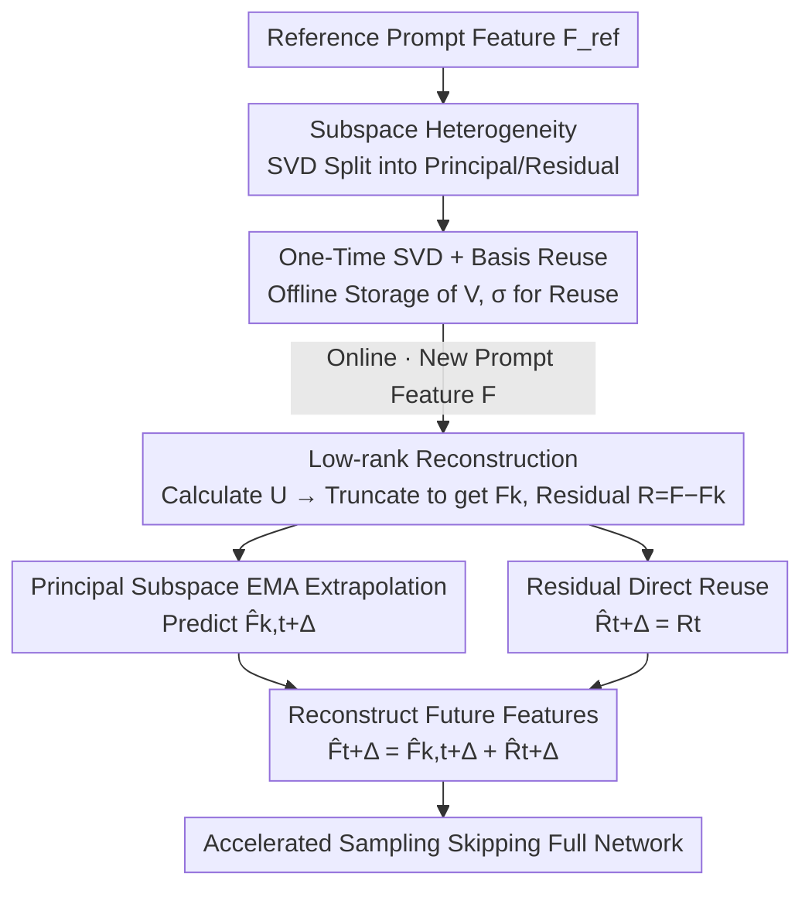

# Forecast the Principal, Stabilize the Residual: Subspace-Aware Feature Caching for Diffusion Transformers

**Conference**: CVPR 2026  
**Paper**: [CVF Open Access](https://openaccess.thecvf.com/content/CVPR2026/html/Chen_Forecast_the_Principal_Stabilize_the_Residual_Subspace-Aware_Feature_Caching_for_CVPR_2026_paper.html)  
**Code**: https://github.com/BlackMaple1203/SVDCache  
**Area**: Diffusion Models  
**Keywords**: Feature Caching, Diffusion Acceleration, SVD Low-rank Decomposition, Subspace-Aware, DiT  

## TL;DR
This work makes a key observation regarding training-free feature caching for Diffusion Transformers (DiT): in the feature space, only the low-rank principal subspace evolves smoothly and predictably over time, while the high-frequency residual subspace is jittery and hard to forecast. Consequently, SVD is employed to decompose features into two parts: EMA extrapolation is applied to the principal subspace, while the residual is directly reused. This achieves an nearly lossless 5.55× speedup on FLUX and HunyuanVideo.

## Background & Motivation
**Background**: DiTs demonstrate exceptional quality in image/video generation, but the iterative denoising process requires a full network pass at each step, leading to exorbitant inference costs. Training-free feature caching is currently one of the most cost-effective acceleration paths: it leverages the temporal coherence of hidden representations across adjacent timesteps to cache and reuse intermediate features, or even extrapolate and predict future features (e.g., DeepCache, FORA, ToCa, TaylorSeer).

**Limitations of Prior Work**: Existing methods treat the entire feature space as a homogeneous entity—either reusing all dimensions uniformly or applying the same predictor to all dimensions (such as the polynomial extrapolation in TaylorSeer). They implicitly assume that the "entire feature space is smooth and predictable over time."

**Key Challenge**: DiT features are extremely high-dimensional, and the assumption that all dimensions follow a globally smooth temporal trajectory is untenable. When the trajectory of the full feature space is visualized using PCA (Fig.1a), it is observed that while coherent, it exhibits significant oscillations. Thus, applying uniform extrapolation to the whole space is misled by these oscillating dimensions, causing prediction errors to be amplified and accumulated over timesteps.

**Key Insight**: What happens if the features are decomposed? The authors use SVD to split features into a rank-$k$ principal subspace and an orthogonal residual subspace. The principal subspace trajectory is smooth and allows for stable extrapolation; the residual subspace is high-frequency, low-energy, and inherently difficult to predict. This naturally suggests a "divide and conquer" strategy: predict where dynamics are stable, and maintain stability where predictions are unreliable.

**Core Idea**: Replace "unified prediction for the full space" with "principal subspace extrapolation + residual subspace direct reuse," making caching both fast and stable.

## Method

### Overall Architecture
The core of SVD-Cache is as follows: for each timestep requiring actual computation, the feature matrix $F$ is projected onto a set of pre-calculated SVD bases to be decomposed into low-rank principal components $F_k$ and residuals $R$. EMA extrapolation is applied to the smooth $F_k$ to forecast several future skipped timesteps, while the jittery $R$ is directly reused. Finally, the two are summed to reconstruct the features for future steps, thereby skipping the full network computation for those steps.

A critical observation for the practical deployment of this method: a naive approach would require performing an SVD for every prompt (which is expensive). However, the authors found that for different prompts, the singular values $\sigma$ and the right singular matrix $V$ remain almost unchanged (Fig. 1b, similarity >0.8 is considered stable and reusable). Only the left singular matrix $U$ varies, and $U$ can be calculated from the current features at a low cost. Thus, "One-Time SVD" is performed offline, while "All-Time Decomposition" occurs online with nearly zero extra cost—this is the prerequisite for the framework to actually speed up rather than being slowed down by SVD.

### Key Designs

**1. Subspace Heterogeneity: Splitting "Unified Full-Space Prediction" into Principal/Residual Treatment**

This is the foundation of the paper, addressing the pain point of one-size-fits-all approaches in existing caching methods. The authors perform SVD on the feature matrix $F \in \mathbb{R}^{N\times D}$ of a DiT block: $F = U\Sigma V^\top$, with singular values sorted in descending order. The rank $k$ is chosen using a cumulative energy threshold $\tau$:

$$\frac{\sum_{i=1}^{k}\sigma_i^2}{\sum_{i=1}^{r}\sigma_i^2}\ge\tau$$

The top-$k$ ($k\ll r$) components form the rank-$k$ approximation $F_k=U_k\Sigma_k V_k^\top$, and the rest is the residual. Through PCA trajectory visualization, the authors demonstrate that the principal subspace $F_k$ evolves smoothly across denoising steps and is extrapolatable; the residual $R$ is high-frequency, low-energy, and has weak temporal coherence, leading to error amplification if extrapolated. Because the "dynamic behaviors" of these two halves are fundamentally different, they deserve separate treatment—predict where it is stable, and avoid forced prediction where it is not.

**2. One-Time SVD and Basis Reuse: Enabling Nearly Zero-Cost Online Decomposition**

If SVD were performed for every prompt, the method would not achieve any speedup. The authors discovered that singular values $\sigma$ and the right singular matrix $V$ are approximately invariant to input prompts. Thus, SVD is performed once offline on a reference prompt to cache the right singular matrix $V_C\in\mathbb{R}^{D\times r}$ and singular value vector $\sigma_C$. For the features $F$ of any new prompt, SVD is not recalculated; instead, the left singular matrix is derived directly using the cached bases:

$$U = F\,V_C\,\mathrm{diag}(\sigma_C)^{-1}$$

Then, the top-$k$ components are truncated to obtain $F_k = U_k\,\mathrm{diag}(\sigma_{C,k})\,V_{C,k}^\top$, and the residual $R = F - F_k$. This step replaces "SVD decomposition" with "one matrix multiplication + truncation," which is the engineering key to the framework's time-saving capability.

**3. Principal Subspace EMA Extrapolation + Residual Direct Reuse: Divide and Conquer Prediction Strategy**

For the two parts identified in Design 1, the processing methods that best match their dynamics are applied. The low-rank principal feature $F_{k,t}$ is smooth and stable, so Exponential Moving Average (EMA) is used for temporal extrapolation, maintaining the EMA state:

$$\hat F_{k,t}=\beta\,\hat F_{k,t-\Delta}+(1-\beta)\,F_{k,t}$$

where $\beta\in(0,1)$ balances smoothness and responsiveness (fixed at $\beta=0.9$ in experiments). This is used to extrapolate the next step $\hat F_{k,t+\Delta}$. The residual $R$ has weak temporal coherence, and forced extrapolation would only amplify errors, so the value from the previous real step is simply reused: $\hat R_{t+\Delta}=R_t$. The final future feature is reconstructed by adding the two: $\hat F_{t+\Delta}=\hat F_{k,t+\Delta}+\hat R_{t+\Delta}$. Ablations prove that this combination of "Principal EMA + Residual Reuse" is superior to "Reuse for both" (significant quality drop) and "EMA for both" (error accumulation), and is key to achieving both predictability and stability.

### Loss & Training
The method is entirely training-free, requiring no retraining or fine-tuning, with caching logic inserted only during inference. Key hyperparameters: energy threshold $\tau$ (optimal at ~0.85), EMA coefficient $\beta=0.9$, and caching interval $N$ (controlling the frequency of real computations).

## Key Experimental Results

### Main Results
Evaluation Setup: Text-to-image uses FLUX.1-dev (DrawBench, metrics: ImageReward / CLIP Score / PSNR-SSIM-LPIPS), text-to-video uses HunyuanVideo (VBench). The following table compares different acceleration levels on FLUX.1-dev (partial selection, parentheses indicate change relative to the original model):

| Method | Latency(s) ↓ | FLOPs Speedup | ImageReward ↑ | CLIP ↑ |
|------|-------------|-----------|---------------|--------|
| Original (50 steps) | 25.82 | 1.00× | 0.9898 | 32.404 |
| TaylorSeer (N=5,O=2) | 7.46 | 4.16× | 0.9768 (-1.31%) | 32.467 |
| FoCa (N=6) | 7.54 | 4.99× | 0.9713 (-1.87%) | 32.922 |
| DuCa (N=9) | 7.27 | 5.39× | 0.8382 (-15.33%) | 31.759 |
| TeaCache (l=1) | 8.19 | 5.01× | 0.8379 (-15.36%) | 31.877 |
| **SVD-Cache (N=5)** | 7.62 | 4.16× | **1.0123 (+2.27%)** | **32.983** |
| **SVD-Cache (N=7)** | 6.43 | **5.55×** | 0.9938 (+0.40%) | 33.144 |
| **SVD-Cache (N=8)** | 4.99 | 6.24× | 0.9769 (-1.31%) | 32.848 |

A highlight is that at a 5.55× speedup, ImageReward remains higher than the original model (+0.40%), whereas FORA/ToCa/DuCa/TeaCache at the same level drop by over -15%. On text-to-video (HunyuanVideo / VBench): at N=5, it achieves a VBench score of 80.60 with 5.00× speedup, nearly matching the original 80.66; at N=6, it achieves a 29.77s latency and 5.56× speedup with a VBench score of 80.46, outperforming DuCa and ToCa.

Compatibility (Table 3): SVD-Cache can be stacked with quantization (FLUX.1-dev-int8, N=5 yields 0.9904 ImageReward, with PSNR/SSIM/LPIPS superior to the quantization baseline), step distillation (FLUX.1-schnell, N=3 yields 49.87× speedup and 0.9463 ImageReward, exceeding TaylorSeer/TeaCache at the same NFE), and sparse attention. It reaches a maximum total speedup of 29.01× on FLUX.1-schnell.

### Ablation Study
| Configuration | Phenomenon | Explanation |
|------|------|------|
| Principal EMA + Residual Reuse (Full) | Optimal | Validates the divide-and-conquer design choice. |
| Direct reuse for both components | Significant quality drop | Principal subspace is predictable but not forecasted, leading to underfitting. |
| EMA for both components | Error accumulation | Forced extrapolation of residuals amplifies noise. |
| Prediction on full space (no decomposition) | Worse than decomposition | Fig.5(a), confirming the necessity of subspace decomposition. |

### Key Findings
- **The primary contribution is "decomposition + differentiated treatment"**: Whenever the method reverts to unified prediction for the full space, performance drops. EMA and reuse must be applied to the correct subspaces; mismatching them (all reuse / all EMA) degrades results.
- **Energy threshold $\tau$ has an optimal point (~0.85)**: If $\tau$ is too large, high-frequency noise is forced into the low-rank subspace, weakening prediction stability; if $\tau$ is too small, the subspace is overly contracted, losing essential structures.
- **Low-rank temporal behavior is universal across architectures**: The authors verified the low-rank predictable/residual jitter phenomenon shown in Fig. 1 on FLUX.1-dev, Qwen-Image, and HunyuanVideo, indicating it is not an artifact of a specific model.
- **Advantages are more pronounced at aggressive acceleration levels**: While most baselines perform well at low speedups, they break down beyond 5.5×, whereas SVD-Cache remains nearly lossless. The suppression of error accumulation by the divide-and-conquer strategy truly proves its value under high pressure.

## Highlights & Insights
- **The perspective that "not all dimensions should be predicted" is clever**: It shifts the attribution of caching failure from "weak predictors" to "inherently unpredictable dimensions." The remedy is then targeted—extrapolate the predictable and reuse the unpredictable—rather than building a more complex full-space predictor.
- **The approximate invariance of singular values and right singular matrices to prompts** is an empirical observation that reduces "SVD per prompt" to "one offline pass + one online matrix multiplication." This is the engineering lifeblood of the framework's actual speedup and can be applied to other scenarios requiring online low-rank decomposition.
- **Completely training-free and orthogonally stackable with quantization/distillation/sparse attention**, meaning it can serve as a plug-and-play layer on top of existing acceleration stacks with minimal migration cost.

## Limitations & Future Work
- The "prompt invariance of singular values/right singular matrices" is an empirical observation. The authors acknowledge exceptions in extreme cases (e.g., nonsensical prompts) (Fig. 7), and there is a lack of quantitative boundaries on how much error basis mismatch introduces. ⚠️ Refer to the original paper for details.
- The rank $k$ is determined by a global energy threshold $\tau$. Whether different $k$ should be used for different blocks or timesteps, and whether a unified $\tau$ is sub-optimal, was not explored in depth.
- Direct "reuse" for the residual is the most conservative treatment. Whether an intermediate solution exists between "reuse" and "EMA"—such as light smoothing of residuals—to further improve quality is worth investigating.

## Related Work & Insights
- **vs TaylorSeer**: TaylorSeer is a representative of "cache-then-forecast," using polynomial extrapolation for unified prediction of the entire feature sequence. SVD-Cache points out that unified full-space extrapolation is misled by residual oscillations, correcting this by only extrapolating the principal subspace and reusing residuals, which suppresses visible artifacts/flickering at 5.5× speedup compared to TaylorSeer.
- **vs FORA / ToCa / DuCa / TeaCache**: These methods focus on caching granularity and update frequency but assume the entire space is cacheable. SVD-Cache differs by first "classifying" features by SVD subspaces before deciding the caching strategy, resulting in significantly less quality degradation at high acceleration ratios.
- **vs Model Compression (Quantization/Distillation/Pruning)**: That line of work modifies the network itself and often requires retraining. SVD-Cache is orthogonal, training-free, and can be layered on top of those techniques for further speedup.

## Rating
- Novelty: ⭐⭐⭐⭐⭐ The "dynamic heterogeneity of principal/residual subspaces" provides a fresh and convincing explanation for feature caching failures, directly leading to the divide-and-conquer strategy.
- Experimental Thoroughness: ⭐⭐⭐⭐⭐ Covers both image and video tasks, multiple acceleration levels, and verifies compatibility with quantization/distillation/sparse attention and universal applicability across architectures.
- Writing Quality: ⭐⭐⭐⭐ The observation-hypothesis-method chain is clear, and formulas correspond well with illustrations. Some tables are dense but the narrative is sufficient.
- Value: ⭐⭐⭐⭐⭐ Training-free, plug-and-play, and stackable with existing acceleration stacks. It has direct practical value in the nearly lossless 5.55× speedup range.

<!-- RELATED:START -->

## Related Papers

- [\[CVPR 2026\] ResCa: Residual Caching for Diffusion Transformers Acceleration](resca_residual_caching_for_diffusion_transformers_acceleration.md)
- [\[AAAI 2026\] ProCache: Constraint-Aware Feature Caching with Selective Computation for Diffusion Transformer Acceleration](../../AAAI2026/image_generation/procache_constraint-aware_feature_caching_with_selective_computation_for_diffusi.md)
- [\[CVPR 2026\] SenCache: Accelerating Diffusion Model Inference via Sensitivity-Aware Caching](sencache_accelerating_diffusion_model_inference_via_sensitivity-aware_caching.md)
- [\[CVPR 2026\] Adaptive Spectral Feature Forecasting for Diffusion Sampling Acceleration](adaptive_spectral_feature_forecasting_for_diffusion_sampling_acceleration.md)
- [\[CVPR 2026\] LESA: Learnable Stage-Aware Predictors for Diffusion Model Acceleration](lesa_learnable_stage-aware_predictors_for_diffusion_model_acceleration.md)

<!-- RELATED:END -->
