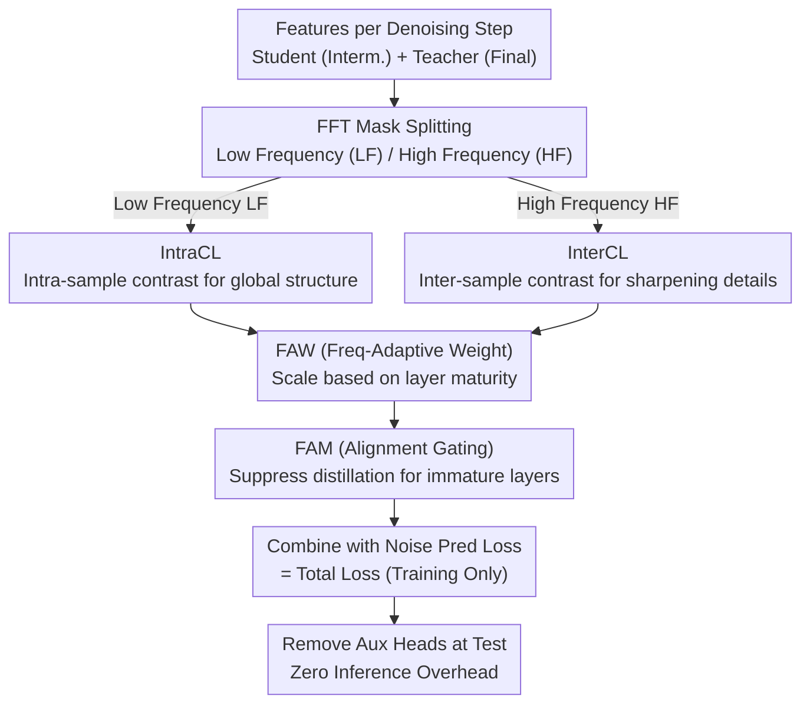

# FRAMER: Frequency-Aligned Self-Distillation with Adaptive Modulation Leveraging Diffusion Priors for Real-World Image Super-Resolution

**Conference**: CVPR 2026  
**arXiv**: [2512.01390](https://arxiv.org/abs/2512.01390)  
**Code**: [https://cmlab-korea.github.io/FRAMER/](https://cmlab-korea.github.io/FRAMER/)  
**Area**: Diffusion Models / Image Generation  
**Keywords**: Real-world Image Super-Resolution, Self-distillation, Frequency-aware, Diffusion Priors, Plug-and-play

## TL;DR
FRAMER proposes a frequency-aligned self-distillation training framework that uses final-layer feature maps as teachers to supervise intermediate layers. By applying IntraCL and InterCL contrastive losses for low-frequency (LF) and high-frequency (HF) components respectively, combined with Frequency-Adaptive Weighting (FAW) and Frequency-Alignment Masking (FAM), the method significantly enhances high-frequency detail restoration in diffusion models for real-world image super-resolution without altering architecture or inference workflows.

## Background & Motivation

1. **Background**: Real-world Image Super-Resolution (Real-ISR) aims to recover high-resolution (HR) images from inputs with complex unknown degradations. Diffusion models have surpassed GANs as the mainstream approach, with leveraging pre-trained T2I priors (e.g., SD2 U-Net, SD3 DiT) being a promising direction.
2. **Limitations of Prior Work**: Diffusion models struggle to reconstruct fine HF details, often producing over-smoothed results. Standard noise prediction losses apply uniform supervision across all layers and frequencies, ignoring the internal frequency hierarchy of the model.
3. **Key Challenge**: The authors trace this to a fundamental Low-Frequency (LF) bias originating from two aspects: (a) natural image distributions are dominated by LF, which is exacerbated in LR inputs, causing noise prediction loss to favor LF; (b) a "LF-first, HF-later" hierarchical structure exists along the network depth—LF features stabilize in early layers, while HF features converge only near the final layers.
4. **Goal**: How to apply targeted supervision to LF and HF during training to correct the LF bias without changing the inference architecture?
5. **Key Insight**: Self-distillation—using final-layer feature maps as teachers and intermediate layers as students. Compared to external frequency domain losses, teacher-student alignment within the same feature space avoids domain mismatch issues.
6. **Core Idea**: Decompose self-distillation signals by frequency. Apply intra-sample contrastive learning (IntraCL) for LF to stabilize structure and inter-sample contrastive learning (InterCL) for HF to sharpen details, using adaptive mechanisms to match internal frequency maturity.

## Method

### Overall Architecture
FRAMER addresses the persistent "insufficient HF detail" problem in diffusion-based SR by adding auxiliary supervision during the training phase only. For each denoising step, the feature map of the final layer is treated as the "teacher" (where HF has converged most fully), directing intermediate layer "students" to align with it. Crucially, alignment is not uniform: teacher and student features are split into LF and HF bands via FFT masks. LF features undergo IntraCL to stabilize global structure, while HF features undergo InterCL to sharpen instance-specific details. Two adaptive mechanisms, FAW and FAM, scale distillation intensity according to the maturity of each layer and frequency band. All auxiliary heads are removed at test time, resulting in zero inference overhead.

### Key Designs

**1. IntraCL (LF Intra-sample Contrastive): Stabilizing global structure across samples to avoid "false negative" bias.**

Directly applying a single noise prediction loss to all frequencies causes the model to favor the dominant LF and delay HF learning. IntraCL takes over the LF component: for each intermediate layer $i$, its LF representation $\mathbf{F}_{LF}^{(i)}$ and the teacher LF representation $\mathbf{F}_{LF}^{(n)}$ form a positive pair. LF representations from a random layer $j$ of the same image form negative pairs, optimized via log-softmax:

$$\mathcal{L}_{IntraCL}^{(i)} = -\log \frac{\exp(s_{+,LF}^{(i)})}{\exp(s_{+,LF}^{(i)}) + \exp(s_{-,LF}^{(i)})}$$

Negative samples are restricted to other layers of the *same* image rather than other images in the batch. Since LF features carry global structure shared across samples, treating other images as negative pairs would push away truly similar structures (false negatives). Layer-wise intra-sample contrast is sufficient for student-to-teacher LF convergence.

**2. InterCL (HF Inter-sample Contrastive): Direct sharpening signals for the slowest-to-converge HF.**

For HF, instance-specific details must be distinguished. InterCL pulls student HF closer to teacher HF while pushing away two types of negative samples: HF representations from random layers of the same image (encouraging hierarchical progression) and HF representations from other images in the batch (encouraging instance discrimination):

$$\mathcal{L}_{InterCL}^{(i)} = -\log \frac{\exp(s_{+,HF}^{(i)})}{\exp(s_{+,HF}^{(i)}) + \exp(s_{-,HF}^{(i)}) + S_{neg}^{(i)}}$$

Batch-wise negative samples are used here because HF carries specific details with low cross-sample similarity. Other images' HF components serve as information-rich "true negatives," providing a targeted optimization path to counteract LF bias.

**3. FAW (Frequency-Adaptive Weighting): Allocating distillation strength based on hierarchical maturity.**

Network depth exhibits a "LF-first, HF-later" maturity. FAW dynamically adjusts weights by calculating the mean FFT magnitudes $E_{LF}^{(i)}$, $E_{HF}^{(i)}$ for each layer and their relative difference $\Delta^{(i)}$ compared to the teacher. Weights are assigned as $w^{(i)} = 1/(1+\Delta^{(i)})$. Higher weights are given to frequency bands closer to the teacher, naturally focusing early layers on LF and deep layers on HF.

**4. FAM (Frequency-Alignment Masking): Suppressing immature early layers to prevent collapse.**

While FAW handles weight distribution, early layers far from the teacher risk collapsing under forced hard alignment. FAM introduces a gate based on student-teacher alignment scores (using ReLU and stop-gradient). This gate suppresses distillation signals when a layer is insufficiently aligned, gradually releasing the constraint as the layer matures.

### Loss & Training
The final training objective augments the original noise prediction loss with FRAMER auxiliary terms: $\mathcal{L}_{total} = \mathcal{L}_{noise} + \sum_i \mathcal{L}_{FRAMER}^{(i)}$, where each layer's term is the weighted sum of IntraCL and InterCL modulated by FAW and FAM. Auxiliary heads exist only during training, ensuring no added inference cost.

## Key Experimental Results

### Main Results

| Dataset | Metric | FRAMER_U (Ours) | PiSA-SR (Baseline) | Gain | FRAMER_D (Ours) | DiT4SR (Baseline) | Gain |
|--------|------|-----------------|----------------|------|-----------------|---------------|------|
| DrealSR | PSNR↑ | 26.96 | 26.18 | +3.0% | 24.73 | 23.64 | +4.6% |
| DrealSR | SSIM↑ | 0.786 | 0.752 | +4.5% | 0.687 | 0.640 | +7.3% |
| DrealSR | LPIPS↓ | 0.333 | 0.368 | +9.5% | 0.412 | 0.442 | +6.8% |
| DrealSR | MANIQA↑ | 0.595 | 0.490 | +21.4% | 0.514 | 0.441 | +16.6% |
| RealSR | PSNR↑ | 24.81 | 24.02 | +3.3% | 23.23 | 21.94 | +5.9% |
| RealSR | MANIQA↑ | 0.484 | 0.412 | +17.5% | 0.564 | 0.459 | +22.9% |

### Ablation Study
Ablations verified the effectiveness of the final-layer teacher and random-layer negatives. Core findings:

| Configuration | Effect Description |
|------|---------|
| Noise Pred Loss only (Baseline) | Severe LF bias, insufficient HF recovery |
| + IntraCL | Improved LF stability, more consistent structure |
| + InterCL | Significant sharpening of HF details |
| + FAW | Hierarchy-aware weight allocation, balanced improvement |
| + FAM | Prevents early layer collapse, stabilizes training |

### Key Findings
- FRAMER yields the most significant improvements in perceptual metrics (MANIQA, MUSIQ), with a 21.4% MANIQA gain on DrealSR, confirming enhanced HF restoration.
- Effective across both U-Net and DiT backbones, validating architecture agnosticism.
- Gains are even more pronounced on challenging datasets like RealLR200 and RealLQ250.
- Minimal training overhead (auxiliary loss calculation only) and zero inference overhead.

## Highlights & Insights
- **In-depth Frequency Hierarchy Discovery**: The paper goes beyond noting LF bias by revealing the "LF-first, HF-later" maturity through hierarchical cosine similarity analysis, providing strong empirical evidence for frequency-split self-distillation.
- **Differentiated LF/HF Contrastive Design**: Using intra-sample contrast for LF (to avoid false negatives) and inter-sample contrast for HF (to leverage true negatives) is a sophisticated design based on cross-sample similarity analysis.
- **Plug-and-play Utility**: It does not alter architecture or increase inference cost, making it highly practical for any diffusion-based SR framework.

## Limitations & Future Work
- Fixed binary FFT masks are used for LF/HF splitting; learnable frequency partitioning could be explored.
- U-Net integration requires additional 1x1 convolutions and resizing for dimensionality alignment, increasing complexity.
- Effectiveness on other low-level vision tasks (denoising, deblurring) has not yet been explored.
- Hyperparameters introduced by FAW/FAM (e.g., epsilon) might require tuning for different backbones.
- The binary LF/HF split might be too coarse; tri-band or continuous decomposition might yield better results.

## Related Work & Insights
- **vs SeeSR**: Unlike methods that use a unified loss across all layers and frequencies, FRAMER exploits internal frequency hierarchies through split distillation.
- **vs Frequency-aware Diffusion**: Existing methods (e.g., FreeU) rely on fixed inference-time modulation; FRAMER adaptively adjusts supervision during training based on layer states.
- **vs Self-distillation**: Traditional self-distillation aligns entire feature maps, implicitly inheriting LF bias. FRAMER explicitly counters LF bias via frequency separation.

## Rating
- Novelty: ⭐⭐⭐⭐ The framework for frequency-aligned self-distillation is novel, though individual components (contrastive learning, adaptive weighting) are standard.
- Experimental Thoroughness: ⭐⭐⭐⭐⭐ Extensive testing across four datasets, six metrics, two architectures (U-Net/DiT), and detailed ablations.
- Writing Quality: ⭐⭐⭐⭐ Clear motivation, logical progression from observation to methodology, and intuitive visualizations.
- Value: ⭐⭐⭐⭐ A plug-and-play training strategy with high applicability for enhancing existing SR methods without cost.

<!-- RELATED:START -->

## Related Papers

- [\[CVPR 2026\] OARS: Process-Aware Online Alignment for Generative Real-World Image Super-Resolution](oars_process-aware_online_alignment_for_generative_real-world_image_super-resolu.md)
- [\[AAAI 2026\] Realism Control One-step Diffusion for Real-World Image Super-Resolution](../../AAAI2026/image_generation/realism_control_one-step_diffusion_for_real-world_image_super-resolution.md)
- [\[CVPR 2026\] DUO-VSR: Dual-Stream Distillation for One-Step Video Super-Resolution](duo-vsr_dual-stream_distillation_for_one-step_video_super-resolution.md)
- [\[ICML 2026\] Q-DiT4SR: Exploration of Detail-Preserving Diffusion Transformer Quantization for Real-World Image Super-Resolution](../../ICML2026/image_generation/q-dit4sr_exploration_of_detail-preserving_diffusion_transformer_quantization_for.md)
- [\[CVPR 2025\] Self-Supervised ControlNet with Spatio-Temporal Mamba for Real-World Video Super-Resolution](../../CVPR2025/image_generation/self-supervised_controlnet_with_spatio-temporal_mamba_for_real-world_video_super.md)

<!-- RELATED:END -->
