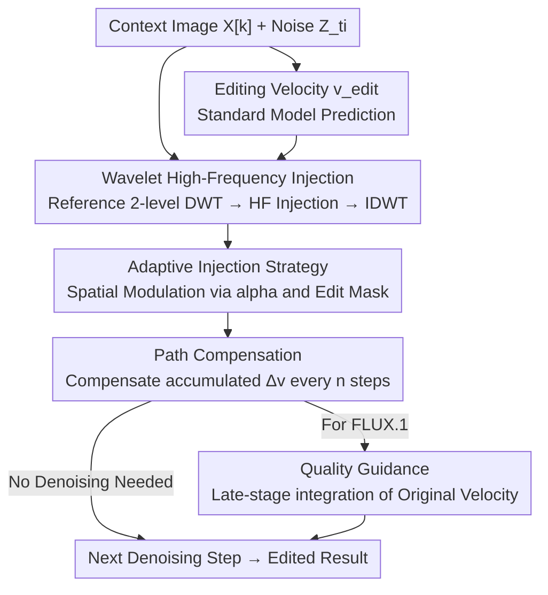

# FreqEdit: Preserving High-Frequency Features for Robust Multi-Turn Image Editing

**Conference**: CVPR 2026  
**Paper**: [CVF Open Access](https://openaccess.thecvf.com/content/CVPR2026/html/Liao_FreqEdit_Preserving_High-Frequency_Features_for_Robust_Multi-Turn_Image_Editing_CVPR_2026_paper.html)  
**Code**: https://freqedit.github.io/ (Project Page)  
**Area**: Image Editing / Diffusion Models  
**Keywords**: Multi-turn image editing, high-frequency features, wavelet transform, training-free, Rectified Flow  

## TL;DR
FreqEdit identifies the root cause of "performance breakdown in multi-turn instruction-based editing" as the continuous loss of high-frequency information during iterations. It constructs a reference velocity field from context images in early denoising stages and injects its high-frequency wavelet components into the editing velocity field in a spatially adaptive manner. Coupled with path compensation and quality guidance, this **training-free** framework enables FLUX.1 Kontext and Qwen-Image to perform stable editing for 10+ turns without geometric distortion.

## Background & Motivation
**Background**: Instruction-based image editing (directly modifying images using natural language prompts like "change hair to red") has matured significantly. Models based on in-context flow, such as FLUX.1 Kontext and Qwen-Image, achieve impressive results in **single-turn** editing. However, real-world creation is iterative—photographers adjust exposure, retouch skin, change hair color, and then add accessories, with each step building upon the previous result.

**Limitations of Prior Work**: Empirical tests by the authors reveal that even state-of-the-art (SOTA) models begin to degrade significantly after approximately **5 turns**, with catastrophic failure occurring beyond 10 turns. This manifests in three failure modes: ① **Subject distortion** (gradual deviation of character geometry and identity from the original); ② **Edge over-sharpening** (artificial enhancement of boundaries); and ③ **Texture collapse** (details like skin pores turning into over-smoothed surfaces or artifacts). Existing multi-turn methods (Emu Edit, MTC, VINCIE) only empirically mitigate error accumulation without clarifying the underlying degradation mechanism.

**Key Challenge**: The authors hypothesize that the root cause is the **cumulative error of high-frequency features**. To verify this, they conducted controlled experiments: applying unsharp masking (amplifying high-frequency edges) or bilateral filtering (suppressing high-frequency textures) to source images before editing. Both perturbations **significantly accelerated** degradation, with subject distortion appearing as early as turn 3. This suggests that high-frequency features serve as "identity anchors": they encode identity-specific structures and fine-grained details. Once these are lost during iteration, the generative model increasingly relies on learned priors, reverting to "standard faces" (average facial structures) in the training data.

*Why high frequencies are most fragile early on*: During early denoising stages, the latent image is close to Gaussian noise, and the predicted velocity field lacks sufficient information to recover high frequencies. Since early steps primarily establish low-frequency global structures, high-frequency details are easily suppressed.

**Core Idea**: The **context image (input image) of the current turn itself contains rich high-frequency information**, which can be used to construct a reference velocity field. Its high-frequency components can then be "replenished" into the editing velocity field during early denoising to offset progressive loss—all within a **training-free** process. The challenge lies in preventing crude uniform injection from over-constraining target edit regions and suppressing semantic changes. Thus, spatially adaptive injection and path compensation are required to balance "high-frequency preservation" and "editing flexibility."

## Method

### Overall Architecture
FreqEdit is an **inference-time plugin** for Rectified Flow-based editing models that does not modify model weights. For the $k$-th turn of editing at denoising step $t_i$, it performs four operations within each step: it constructs a **reference velocity field** $v^{\text{ref}}_{t_i}$ (pointing toward the "high-frequency-rich context image") while the model predicts the standard **editing velocity field** $v^{\text{edit}}_{t_i}$. It performs a 2-level wavelet decomposition on both, **injecting only the high-frequency components from the reference side into the editing side using spatially adaptive weights**. Low frequencies remain dominated by editing instructions. After reconstructing the corrected velocity $v^{\text{corr}}$ via IDWT, **accumulated trajectory deviations are periodically compensated** to prevent ghosting in edited areas. Finally, for models that accumulate noise (e.g., FLUX.1 Kontext), a quality guidance velocity from the original image is integrated in late denoising stages. High-frequency injection is active only during the first 30% of denoising steps.

### Key Designs

**1. Wavelet Domain High-Frequency Injection: Borrowing HF from Context to Supplement Editing Velocity**

**Design Motivation**: High frequencies are continuously lost during early denoising. The method constructs a reference velocity field from the context image $Z^{\text{ref}}_0 = X^{[k]}$. Generalizing from Euler discretization $v = \frac{Z_{t_{i-1}} - Z_{t_i}}{t_{i-1} - t_i}$, the average velocity pointing from the current position $Z_{t_i}$ to the context image $Z^{\text{ref}}_0$ is defined as the reference velocity:

$$v^{\text{ref}}_{t_i} = \frac{Z^{\text{ref}}_0 - Z_{t_i}}{t_0 - t_i}$$

This represents a linear trajectory in latent space leading directly to the context image, naturally carrying its high-frequency features. A **2-level Discrete Wavelet Transform (DWT)** is applied to both $v^{\text{ref}}$ and $v^{\text{edit}}$: Level 1 captures fine-grained details like skin pores and sharp edges, while Level 2 captures coarser textures. This yields low-frequency approximations $\mathrm{LL}^{(2)}$ and high-frequency details $D^{(\ell)} = \{\mathrm{LH}^{(\ell)}, \mathrm{HL}^{(\ell)}, \mathrm{HH}^{(\ell)}\}$. **Mechanism**: Only reference high-frequency components $\{D^{(2)}_{\text{ref}}, D^{(1)}_{\text{ref}}\}$ are injected, while low frequencies are kept from the editing side, as they encode global structure and semantic layout. Injection follows a linear extrapolation similar to CFG in the frequency domain:

$$\tilde{D}^{(\ell)} = D^{(\ell)}_{\text{edit}} + \alpha\,(D^{(\ell)}_{\text{ref}} - D^{(\ell)}_{\text{edit}})$$

The corrected velocity $v^{\text{corr}} = \mathrm{IDWT}(\mathrm{LL}^{(2)}_{\text{edit}}, \tilde{D}^{(2)}, \tilde{D}^{(1)})$ is then reconstructed. Ablations confirm that "HF injection only" is critical; injecting all components leads to editing failure due to high low-frequency semantic energy, while injecting only low frequencies fails to prevent subject distortion.

**2. Adaptive Injection Strategy: Distinguishing "Preservation Zones" from "Edit Zones" via Velocity Divergence**

**Constraint**: A uniform $\alpha$ across the image over-injects in regions requiring significant semantic change, forcibly retaining context features and suppressing desired transformations. The **Key Insight** is that the **local divergence between the editing and reference velocities indicates whether a location should be "preserved" or "changed."** Small divergence implies semantic consistency, where more high-frequency injection is needed; large divergence implies an active edit, where injection should be weakened to allow transformation. A 2D difference map $M = \|v^{\text{edit}} - v^{\text{ref}}\|_2$ is calculated using the L2-norm across channels, normalized, and inverted (small difference → high injection):

$$\tilde{M} = 1 - \frac{M - \min(M)}{\max(M) - \min(M)}$$

Exponential scaling is applied to enhance the contrast between preservation and edit zones: $\alpha = \alpha_0(e^{\gamma\tilde{M}} - 1)$, where $\alpha_0$ controls total intensity and $\gamma$ controls transition sharpness. The spatially adaptive intensity map $\alpha^{(\ell)}$ is then applied element-wise: $\tilde{D}^{(\ell)} = D^{(\ell)}_{\text{edit}} + \alpha^{(\ell)} \odot (D^{(\ell)}_{\text{ref}} - D^{(\ell)}_{\text{edit}})$. This ensures high fidelity in unedited areas and degrees of freedom in edit zones.

**3. Path Compensation: Periodic Re-alignment to Eliminate Ghosting**

**Function**: Adaptive injection reduces but does not eliminate HF injection in edit zones. When high injection intensity is needed globally to prevent distortion, residual HF signals in edit zones compete with the editing velocity, causing **ghosting** (overlapping visual elements from both the original and target images). The solution is a **periodic trajectory re-alignment every $n$ steps**. During injection, the cumulative difference $\Delta v_{t_i} = v^{\text{edit}}_{t_i} - v^{\text{corr}}_{t_i}$ is weighted by the time step interval and stored in a buffer $B \leftarrow B + (t_{i-1}-t_i)\cdot\Delta v_{t_i}$. Every $n$ steps, the offset is added back $Z_{t_{i-n}} \leftarrow Z_{t_{i-n}} + B$ and $B$ is cleared. This is mathematically **equivalent to a trajectory dominated by $v^{\text{edit}}$**, effectively "predicting $v^{\text{edit}}$ conditioned on reference high frequencies," ensuring both high-frequency replenishment and semantic alignment. In the paper, $n=4$.

**4. Quality Guidance: Late-stage Integration to Suppress Noise Accumulation**

**Function**: Certain models like FLUX.1 Kontext introduce noise in each turn, which accumulates into visible graininess. Based on the observation that the **late denoising stages** refine details rather than semantics and that the **original image** ($X^{[1]}$) has the highest quality, the editing velocity is mixed with an auxiliary velocity constructed from $X^{[1]}$ when $t_i < \tau_{\text{guide}}$:

$$v^{\text{final}}_{t_i} = (1-\lambda)\cdot v^{\text{edit}}_{t_i} + \lambda\cdot v_\theta(Z_{t_i}, t_i, X^{[1]}, p_{\text{neutral}})$$

Using a $p_{\text{neutral}}$ (e.g., "a high-quality picture.") avoids new semantics. This is enabled only for FLUX.1 Kontext (last 30% steps, $\lambda=0.3$).

### Loss & Training
**Ours** is completely **training-free** and introduces no additional training loss. All mechanisms are executed within the denoising loop of Rectified Flow inference. The base models are pre-trained FLUX.1-Kontext-dev and Qwen-Image with 28 denoising steps. DWT uses db4 wavelets, and HF injection occurs only in the first 30% of steps. Hyperparameters: $\alpha_0=1.6, \gamma=2.0$ for FLUX.1; $\alpha_0=2.0, \gamma=1.6$ for Qwen-Image; $n=4$.

## Key Experimental Results

### Main Results
The evaluation set consists of 70 source images (half real, half FLUX.1-synthesized). For each, Gemini 2.5 Pro generated 10 progressive edit instructions across five categories. Metrics include CLIP-I, LPIPS, and VLM compound scores inspired by EdiVal-Agent: Instruction Following (GPT-4o), Consistency (DINOv2+L1+GPT-4o), Quality (GPT-4o+HPSv3), and human preference. The table below shows results for **Turn 10**:

| Method | CLIP-I↑ | LPIPS↓ | Instruction Following↑ | Consistency↑ | Quality↑ | Human Preference↑ |
|:---|:---:|:---:|:---:|:---:|:---:|:---:|
| Qwen-Image | 0.871 | 0.566 | 0.809 | 0.767 | 0.713 | 5.177 |
| **Qwen-Image + FreqEdit** | **0.897** | **0.374** | 0.784 | **0.807** | 0.729 | **7.393** |
| FLUX.1 Kontext | 0.854 | 0.542 | 0.803 | 0.762 | 0.681 | 4.920 |
| **FLUX.1 Kontext + FreqEdit** | 0.884 | 0.418 | 0.790 | 0.798 | 0.712 | 6.910 |
| Nano Banana (Prev. SOTA) | 0.893 | 0.472 | 0.835 | 0.806 | 0.731 | 7.271 |
| MTC | 0.886 | 0.449 | 0.554 | 0.746 | 0.790 | 6.246 |

**Key Findings**: FreqEdit provides significant improvements in LPIPS, Consistency, and Quality for both open-source bases (Qwen-Image LPIPS 0.566→0.374, Human Preference 5.177→7.393). Instruction following shows only a **slight decrease** (FLUX.1 Kontext 0.803→0.790). This trade-off is worthwhile: while base models collapse by turn 10, FreqEdit preserves visual fidelity while maintaining editability. Qwen-Image+FreqEdit leads in consistency and even surpasses the closed-source SOTA Nano Banana in human preference.

### Ablation Study

| Configuration | Phenomena / Impact |
|:---|:---|
| Full model | Best balance of all three components. |
| w/o Adaptive Injection (AI) | Fails to complete large-scale semantic edits (e.g., background replacement). |
| w/o Path Compensation (PC) | Visible ghosting artifacts appear. |
| w/o Quality Guidance (QG) | FLUX.1 Kontext exhibits severe noise after multiple turns. |
| Inject HF+LF | Frequent editing failure due to high low-frequency semantic energy. |
| Inject LF only | Fails to prevent subject distortion; confirms HF as the key identity anchor. |

## Highlights & Insights
- **Attributing "Multi-turn Breakdown" to HF Loss**: The use of controlled bilateral/unsharp filtering experiments to verify causality provides strong justification for the method.
- **CFG-in-frequency-domain**: Applying the linear extrapolation logic of classifier-free guidance to wavelet high-frequency coefficients is a clean and reusable trick.
- **Mathematical Equivalence of Path Compensation**: The insight that the injection+compensation path is equivalent to a $v^{\text{edit}}$ trajectory allows for theoretical consistency in balancing fidelity and semantics.
- **Training-free and Plug-and-play**: Its applicability to any Rectified Flow editing model ensures low deployment costs.

## Limitations & Future Work
- **Dependency on Source Quality**: FreqEdit relies on the high-frequency content of the source image; performance may drop for low-resolution or blurred images.
- **Large Spatial Edits**: Performance decreases when a single edit spans a very large spatial area, as it reduces the available "preservation zones."
- **Hyperparameter Sensitivity**: Parameters like $\alpha_0, \gamma, \lambda, n$ are manually tuned for specific base models.

## Related Work & Insights
- **vs MTC**: Malthusian Trajectory Control (MTC) achieves high quality but low instruction following (0.554); FreqEdit maintains editability while significantly outperforming MTC in consistency.
- **vs VINCIE**: VINCIE requires training a block-causal transformer; FreqEdit is training-free and provides a deeper systematic diagnosis of the degradation mechanism.
- **vs Emu Edit**: Emu Edit uses pixel-wise thresholds for error correction; FreqEdit directly targets the root cause in the frequency domain.

## Rating
- Novelty: ⭐⭐⭐⭐
- Experimental Thoroughness: ⭐⭐⭐⭐
- Writing Quality: ⭐⭐⭐⭐
- Value: ⭐⭐⭐⭐

## Related Papers

- [\[CVPR 2026\] Frequency-Aware Flow Matching for High-Quality Image Generation](freqflow_frequency_aware_flow_matching.md)
- [\[ICCV 2025\] Multi-turn Consistent Image Editing](../../ICCV2025/image_generation/multi-turn_consistent_image_editing.md)
- [\[CVPR 2026\] Towards Robust Sequential Decomposition for Complex Image Editing](towards_robust_sequential_decomposition_for_complex_image_editing.md)
- [\[CVPR 2026\] Toward Diffusible High-Dimensional Latent Spaces: A Frequency Perspective](toward_diffusible_high-dimensional_latent_spaces_a_frequency_perspective.md)
- [\[CVPR 2026\] Preserving Source Video Realism: High-Fidelity Face Swapping for Cinematic Quality](preserving_source_video_realism_high-fidelity_face_swapping_for_cinematic_qualit.md)

<!-- RELATED:END -->

<!-- RELATED:START -->

## Related Papers

- [\[CVPR 2026\] CoD: A Diffusion Foundation Model for Image Compression](cod_a_diffusion_foundation_model_for_image_compression.md)
- [\[CVPR 2026\] Toward Diffusible High-Dimensional Latent Spaces: A Frequency Perspective](toward_diffusible_high-dimensional_latent_spaces_a_frequency_perspective.md)
- [\[CVPR 2026\] Preserving Source Video Realism: High-Fidelity Face Swapping for Cinematic Quality](preserving_source_video_realism_high-fidelity_face_swapping_for_cinematic_qualit.md)
- [\[CVPR 2026\] Editing Away the Evidence: Diffusion-Based Image Manipulation and the Failure Modes of Robust Watermarking](editing_away_the_evidence_diffusion-based_image_manipulation_and_the_failure_mod.md)
- [\[CVPR 2026\] FlowDC: Flow-Based Decoupling-Decay for Complex Image Editing](flowdc_flow-based_decoupling-decay_for_complex_image_editing.md)

<!-- RELATED:END -->
