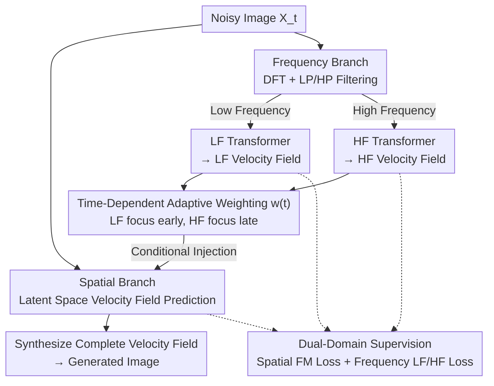

# Frequency-Aware Flow Matching for High-Quality Image Generation

**Conference**: CVPR 2026  
**arXiv**: [2604.15521](https://arxiv.org/abs/2604.15521)  
**Code**: [https://github.com/OliverRensu/FreqFlow](https://github.com/OliverRensu/FreqFlow)  
**Area**: Image Generation  
**Keywords**: Flow Matching, Frequency-Aware, Image Generation, Dual-Branch Architecture, Adaptive Weighting

## TL;DR

FreqFlow introduces explicit frequency-aware conditions into the flow matching framework. By employing a dual-branch architecture to separately process low-frequency global structures and high-frequency details, it achieves SOTA performance with a 1.38 FID on ImageNet-256.

## Background & Motivation

**Background**: Flow Matching has become a mainstream framework for image generation, achieving high-quality synthesis by learning continuous transformation paths from Gaussian noise to data distributions. Models like SiT and DiT have demonstrated significant success in large-scale generation tasks.

**Limitations of Prior Work**: Existing flow matching methods inject noise uniformly in the spatial domain, but the impact of noise on different frequency components in the latent space is non-uniform. During the reverse process, models tend to reconstruct low-frequency components (global structure) first, while high-frequency components (details such as textures and edges) only emerge later. However, the models themselves lack an explicit mechanism to distinguish and handle different frequency components, leading to blurred details in generated results.

**Key Challenge**: While flow matching models operate in the spatial domain, the corruption and recovery processes inherently affect images in a frequency-uneven manner—a characteristic that is neither explicitly modeled nor effectively utilized. Frequency error analysis shows that the high-frequency error of SiT (0.69) is significantly larger than its low-frequency error (0.08).

**Goal**: To explicitly introduce frequency domain information into the flow matching framework, allowing the model to correctly focus on corresponding frequency components at different stages of generation.

**Key Insight**: The authors observe that the reverse process of flow matching naturally follows a "low-frequency first, high-frequency later" reconstruction order, consistent with the coarse-to-fine human cognitive process. Explicitly embedding frequency domain conditions into the model can reinforce this natural frequency generation sequence.

**Core Idea**: Utilize a dedicated frequency branch to process low-frequency and high-frequency components separately, injecting frequency domain information into the spatial branch via time-dependent adaptive weighting to achieve frequency-aware flow matching.

## Method

### Overall Architecture

FreqFlow aims to address the issue where standard flow matching performs uniform denoising in the spatial domain, ignoring the "frequency non-uniformity" of image corruption and recovery. The reverse process always establishes low-frequency global structures before filling in high-frequency textures and edges, yet the model lacks an explicit mechanism for this. FreqFlow addresses this by adding a "frequency bypass": the network is split into two branches. The spatial branch predicts the velocity field in the latent space as usual, while the frequency branch decomposes the current noisy image $X_t$ into low-frequency and high-frequency paths for modeling, using their outputs as conditions for the spatial branch. In a single forward pass, the frequency branch first provides low/high-frequency velocity field predictions, which guide the spatial branch in synthesizing the complete velocity field. This transforms the "coarse-to-fine" generation order from an implicit preference into a controllable architectural feature.

### Key Designs

**1. Frequency Branch: Explicitly Modeling Reconstruction Stages**

The limitation is that the spatial branch perceives a unified noisy image, making it difficult to distinguish whether to reconstruct global contours or local textures. The frequency branch transforms $X_t$ to the frequency domain using the Discrete Fourier Transform (DFT), splits it into low-frequency and high-frequency components using filters, and processes them with independent Transformer blocks to output LF and HF velocity fields. During training, these paths are supervised by corresponding LF/HF velocity fields, forcing the model to decompose "global structure" and "local details" into two separately optimizable sub-problems. Consequently, frequency information previously merged in the spatial branch is explicitly decoupled, allowing reconstruction quality for each band to be controlled individually.

**2. Time-Dependent Adaptive Weighting: Phase-Specific Frequency Conditions**

Having dual frequency velocity fields is insufficient; they must act at the correct moments during generation. FreqFlow introduces a learnable, time-step-dependent weight $w(t)$ to regulate the intensity of frequency conditions injected into the spatial branch. Early on ($t$ near the noise end), low-frequency conditions dominate to establish the global structure. Later, high-frequency conditions increase to refine textures and edges. Since the reverse flow matching process naturally follows this order, encoding it into an adaptive weighting curve transforms the network's spontaneous preference into an explicit, learnable schedule—ensuring structural integrity is not disrupted by high-frequency noise early on, and details are amplified exactly when needed.

**3. Dual-Domain Supervision: Constraints in Frequency and Spatial Domains**

Calculating velocity field errors solely in the spatial domain cannot guarantee accurate reconstruction of frequency components—spatial loss provides insufficient constraints for high frequencies, leading to the high HF error (0.69) seen in SiT. FreqFlow maintains the standard flow matching loss for the spatial branch while adding auxiliary prediction losses for the LF and HF velocity fields in the frequency branch. This dual-representation optimization ensures global coherence via the spatial loss while targeting the accuracy of specific frequency bands via the frequency losses, preventing high-frequency details from being "averaged out" during optimization.

### Example: Frequency Condition Handover in Single Denoising Step

Consider generating an ImageNet figure. At an early step (e.g., near step 50), $w(t)$ assigns high weight to low-frequency conditions. The LF velocity field from the frequency branch dominates, allowing the spatial branch to lay down the general contours and color blocks of the subject while the HF channel contribution is minimal. As $t$ progresses toward the later stages (e.g., after step 200), $w(t)$ shifts weight to high frequencies. The HF velocity field then begins to overlay edges and textures. FreqFlow reaches its minimum log-amplitude at step 200 (compared to step 280 for SiT), indicating it establishes global structure earlier and allocates more steps to high-frequency refinement.

### Loss & Training

The total loss is a weighted combination of the spatial-domain flow matching loss and the frequency-domain (LF + HF) velocity field prediction losses, with both branches optimized jointly. Training follows the standard flow matching paradigm, with time steps $t$ sampled uniformly from $[0, 1]$.

## Key Experimental Results

### Main Results

| Model | FID ↓ | Parameters |
|------|-------|--------|
| DiT-XL | 2.17 | 675M |
| SiT-XL | 1.96 | 675M |
| DiMR-G | 1.53 | 1.1B |
| MAR-H | 1.45 | 943M |
| **FreqFlow-L (Ours)** | **1.44** | 625M |
| **FreqFlow-H (Ours)** | **1.38** | ~1B |

### Ablation Study

| Configuration | FID |
|------|-----|
| Spatial Branch Only (Baseline) | 1.96 |
| + Frequency Branch (No Adaptive Weighting) | 1.62 |
| + Time-Dependent Adaptive Weighting | 1.44 |

### Key Findings

- FreqFlow-L outperforms DiT-XL and SiT-XL with fewer parameters (625M vs 675M), improving FID by 0.73 and 0.52 respectively.
- Frequency error analysis confirms FreqFlow is significantly superior to SiT in both low-frequency (0.06 vs 0.08) and high-frequency (0.48 vs 0.69) reconstruction.
- FreqFlow establishes global structures earlier (reaching minimum log-amplitude at step 200 versus step 280 for SiT).

## Highlights & Insights

- **Revisiting Flow Matching from a Frequency Perspective**: Extending flow matching from pure spatial operations to frequency-aware modeling is a natural yet previously under-explored direction. Frequency decomposition provides new analytical tools for understanding and improving generative models.
- **Efficiency Advantages**: FreqFlow-L's ability to outperform larger models with fewer parameters suggests that frequency domain information is an efficient inductive bias, more effective than simply scaling model size.
- **Transfer Potential**: The design of frequency-aware conditioning can be transferred to other generation tasks necessitating multi-scale detail control, such as video or 3D generation.

## Limitations & Future Work

- The dual-branch architecture introduces additional computational overhead; making the frequency branch more lightweight is a worthwhile direction for exploration.
- Validation is currently limited to class-conditional generation (ImageNet-256), lacking evaluation on more complex tasks like text-to-image.
- Frequency decomposition relies on DFT, which may not be the optimal decomposition method for certain non-periodic textures.

## Related Work & Insights

- **vs SiT**: While SiT operates in the pure spatial domain, FreqFlow adds a frequency branch and adaptive weighting, resulting in significantly better high-frequency details.
- **vs FreeU**: FreeU balances frequencies by re-weighting U-Net skip connections; FreqFlow systematically designs dedicated frequency processing branches.
- **vs DiMR**: DiMR uses multi-resolution strategies, whereas FreqFlow uses frequency decomposition. Both address multi-scale issues but from different perspectives.

## Rating

- Novelty: ⭐⭐⭐⭐ The concept of introducing frequency awareness into flow matching is novel, though the implementation is straightforward.
- Experimental Thoroughness: ⭐⭐⭐⭐ Comprehensive comparisons on ImageNet-256 with in-depth frequency analysis.
- Writing Quality: ⭐⭐⭐⭐ Clear exposition of frequency-based motivation and intuitive diagrams.
- Value: ⭐⭐⭐⭐ Provides a new direction for improving flow matching models.

<!-- RELATED:START -->

## Related Papers

- [\[CVPR 2026\] Flow Matching for Multimodal Distributions](flow_matching_for_multimodal_distributions.md)
- [\[CVPR 2026\] Toward Diffusible High-Dimensional Latent Spaces: A Frequency Perspective](toward_diffusible_high-dimensional_latent_spaces_a_frequency_perspective.md)
- [\[CVPR 2026\] PosterReward: Unlocking Accurate Evaluation for High-Quality Graphic Design Generation](posterreward_unlocking_accurate_evaluation_for_high-quality_graphic_design_gener.md)
- [\[CVPR 2026\] FreqEdit: Preserving High-Frequency Features for Robust Multi-Turn Image Editing](freqedit_preserving_high-frequency_features_for_robust_multi-turn_image_editing.md)
- [\[CVPR 2026\] Spatiotemporal Pyramid Flow Matching for Climate Emulation](spatiotemporal_pyramid_flow_matching_for_climate_emulation.md)

<!-- RELATED:END -->
