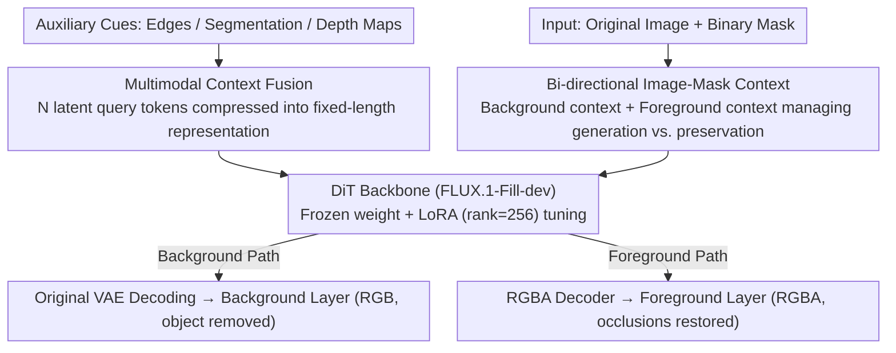

# From Inpainting to Layer Decomposition: Repurposing Generative Inpainting Models for Image Layer Decomposition

**Conference**: CVPR 2026  
**arXiv**: [2511.20996](https://arxiv.org/abs/2511.20996)  
**Code**: [https://inpaintinglayerdecomp.github.io/](https://inpaintinglayerdecomp.github.io/)  
**Area**: Diffusion Models / Image Editing  
**Keywords**: Layer Decomposition, Image Inpainting, Diffusion Models, Foreground Extraction, Parameter-Efficient Fine-Tuning

## TL;DR
This paper observes the intrinsic link between image layer decomposition and image inpainting/outpainting tasks. It proposes the Outpaint-and-Remove method, which efficiently adapts a pre-trained inpainting DiT model (FLUX.1-Fill-dev) into a layer decomposition model via lightweight LoRA fine-tuning. By introducing a multimodal context fusion module to preserve details and using only 100,000 synthetic training samples, it achieves SOTA performance.

## Background & Motivation

1. **Background**: Images can be viewed as a layered combination of foreground and background. Layer decomposition tasks require simultaneously extracting the foreground (including restoring occluded parts) and completing the background (object removal). Existing methods like LAYERDECOMP require full fine-tuning of closed-source large models, which involves extremely high computational and data costs.

2. **Limitations of Prior Work**: (1) High-quality layer annotation data is extremely scarce, with MULAN being the only standard open-source dataset; (2) Training from scratch or full fine-tuning of generative models requires significant computational resources and commercial datasets, making it difficult for independent researchers to reproduce; (3) Existing inpainting models only perform background filling and lack the capability to simultaneously extract foregrounds.

3. **Key Challenge**: Layer decomposition is conceptually highly similar to inpainting (background layer = filling masked areas, foreground layer = outpainting outside the mask), but existing inpainting models lack foreground extraction capabilities, while specialized layer decomposition methods require training from scratch.

4. **Goal**: Can high-quality layer decomposition be achieved with minimal modifications and data by leveraging existing powerful inpainting models?

5. **Key Insight**: Unify layer decomposition as a combined task of inpainting (background) + outpainting (foreground), utilizing the inherent region-filling capabilities of inpainting models.

6. **Core Idea**: Layer decomposition is essentially bi-directional inpainting—background for region filling and foreground for region expansion. An inpainting model with lightweight adaptation can handle both simultaneously.

## Method

### Overall Architecture
Outpaint-and-Remove is based on the pre-trained FLUX.1-Fill-dev (a DiT-based inpainting diffusion model). The input consists of the original image and a binary mask, and the output includes the background layer (RGB, clean background with objects removed) and the foreground layer (RGBA, extracted foreground with alpha channel and restored occluded parts). Key modifications include: (1) A multimodal context fusion module that compresses auxiliary information such as edges, segmentation, and depth into fixed-length tokens; (2) A bi-directional image-mask context design using background and foreground paths to guide background generation and foreground extraction respectively; (3) Freezing the base model and using LoRA + an independent RGBA encoder/decoder to learn new capabilities.

### Key Designs

**1. Multimodal Context Fusion Module: Compressing edges/segmentation/depth into fixed-length tokens to avoid attention explosion**

Relying solely on the original image makes it difficult for the model to determine the semantics for filling masked regions; this work feeds auxiliary cues like edge maps, segmentation maps, and depth maps as conditions. The straightforward approach of using the pre-trained DiT's VAE encoder to convert every modality into tokens and concatenating them results in an $O(K^2)$ complexity for standard attention, which explodes as the token count $K$ increases. The authors introduce a small number of fixed $N \ll K$ latent query tokens that "collect" information from all modality tokens via cross-attention, compressing these cues into an $N$-dimensional compact representation. This reduces complexity from $O(K^2)$ to nearly linear $O(KN)$, preserving details in latent space while providing spatial and semantic priors to assist the model in understanding the structure of the filled regions.

**2. Bi-directional Image-Mask Context: Using two context paths to manage "what to generate" and "what to preserve"**

Standard inpainting provides only a background context $c_{I-M}^b$, indicating which region inside the mask should be filled. Without additional signals, the model cannot distinguish whether the foreground area should be preserved or rewritten, often leading to hallucinations or content flickering on the foreground. This paper adds a foreground context $c_{I-M}^f$ pointing to the area outside the mask (to be outpainted), explicitly instructing the model that "the content within the mask must be preserved and not replaced." These two contexts are concatenated with corresponding noise tokens along the channel dimension as parallel inputs to the DiT—one guiding background filling and the other guiding foreground extraction—effectively decoupling the requirements for "generating new content" and "preserving existing content."

**3. Parameter-Efficient Fine-Tuning + RGBA Decoding: Freezing the base model and using LoRA to learn new capabilities**

To avoid disturbing the strong generative priors of the pre-trained inpainting model, the authors freeze all base DiT weights and only fine-tune the input projection layers and insert LoRA (rank=256) into each attention and FFN layer. The background layer is in RGB format and reuses the existing VAE; the foreground layer includes an alpha channel (RGBA), so a separate RGBA encoder-decoder is fine-tuned to handle transparency. The LoRA rank is a critical "knob": rank=128 is too small to learn the layer decomposition task, while rank=1024 is too large and overrides the pre-trained priors, leading to hallucinations—256 proves to be the sweet spot (see ablation table). With this lightweight adaptation, the model learns foreground extraction with minimal trainable parameters, significantly reducing training costs.

### Loss & Training
- Uses standard flow matching loss.
- Training data is constructed entirely from public resources: MULAN (real foregrounds but incomplete shapes) + LayerDiffuse (synthetic foregrounds with complete shapes but flawed textures) + OpenImages (backgrounds). This hybrid strategy leverages the advantages of both foreground types.
- Batch size 8, learning rate 5e-5, trained for 7200 iterations.
- Input resolution 1024×1024.
- Imperfect masks are used during training to enable the model to infer accurate object boundaries.

## Key Experimental Results

### Main Results—Background Removal (MULAN Test Set)

| Method | PSNR↑ | SSIM↑ | LPIPS↓ | FID↓ |
|------|-------|-------|--------|------|
| FLUX.1-Fill-dev (Baseline) | 25.59 | 0.92 | 0.09 | 35.96 |
| PowerPaint | 23.46 | 0.76 | 0.17 | 41.67 |
| OmniEraser | 21.45 | 0.72 | 0.31 | 55.80 |
| Qwen-Image-Edit | 19.07 | 0.64 | 0.24 | 63.49 |
| **Ours** | **27.30** | **0.93** | **0.08** | **25.97** |

Ours achieves a 1.71dB PSNR improvement and a 9.99 reduction in FID compared to the FLUX.1-Fill-dev baseline.

### Ablation Study

| Configuration | PSNR | FID | Description |
|------|------|-----|------|
| Ours (full, rank=256) | **27.30** | **25.97** | Full model |
| rank=128 | 26.34 | 33.92 | Insufficient rank for learning |
| rank=1024 | 27.15 | 27.32 | Rank too large, overrides priors |
| w/o foreground context $c_{I-M}^f$ | 27.04 | 27.49 | Foreground prone to hallucinations |
| w/o multimodal context $c_{MM}$ | 27.16 | 28.02 | Decreased semantic understanding |
| w/o synthetic foreground | 27.18 | 27.11 | Incomplete foreground shapes |
| Kontext baseline | 26.22 | 36.14 | Inpainting base is superior |

### Key Findings
- Inpainting models (FLUX.1-Fill-dev) are more suitable as a foundation for layer decomposition than general I2I models (FLUX-Kontext), validating the intrinsic link between inpainting and layer decomposition.
- The presence of foreground context has a massive impact on the quality of foreground extraction; without it, the model tends to hallucinate in foreground regions.
- There is a "sweet spot" for LoRA rank (256); too low fails to learn the new task, while too high damages pre-trained generative priors.
- In user studies, this method achieved a 59.51% preference rate, significantly outperforming matting-based methods.

## Highlights & Insights
- **Unified Perspective from Task Essence**: Decomposing layer decomposition into a combination of inpainting + outpainting is a concise yet profound observation that turns a complex task into a refocusing of existing capabilities.
- **Pure Public Data + Lightweight Adaptation**: No commercial datasets or full fine-tuning are required. Only 100k synthetic samples plus LoRA achieve SOTA performance. This "democratized" approach is highly valuable for the research community.
- **Hybrid Foreground Data Strategy**: Real foregrounds provide detail but lack complete shapes, while synthetic foregrounds offer complete shapes but poor textures. This complementary data design can be transferred to other domain-gap challenges.

## Limitations & Future Work
- Still fails in highly complex scenes (cluttered objects, large-area occlusions, or hands holding objects).
- Training data is synthetically constructed, leading to distribution gaps compared to the layered structure of real images.
- Alpha matting precision for foreground extraction may not match that of specialized matting methods.
- The evaluation benchmark is limited (MULAN is the only public layer dataset), which may introduce evaluation bias.

## Related Work & Insights
- **vs LAYERDECOMP**: The latter requires full fine-tuning of closed-source models and large-scale high-quality data. Ours achieves SOTA with only LoRA and public data, making it more practical.
- **vs MattingAnything / DiffMatte**: Matting methods only extract visible foreground contours without restoring occlusions; this work recovers the full foreground shape (outpainting capability).
- **vs LayerDiffuse**: The latter is a model for generating RGBA layers; this work uses it as a source of training data rather than a direct competitor.

## Rating
- Novelty: ⭐⭐⭐⭐ Re-interpreting inpainting as a unified view for layer decomposition is novel.
- Experimental Thoroughness: ⭐⭐⭐⭐ Comprehensive ablations, though evaluation benchmarks are limited.
- Writing Quality: ⭐⭐⭐⭐ Clear figures and intuitive motivating examples.
- Value: ⭐⭐⭐⭐ A lightweight, practical, and reproducible solution for layer decomposition.

<!-- RELATED:START -->

## Related Papers

- [\[CVPR 2026\] Qwen-Image-Layered: Towards Inherent Editability via Layer Decomposition](qwen-image-layered_towards_inherent_editability_via_layer_decomposition.md)
- [\[ICLR 2026\] Referring Layer Decomposition](../../ICLR2026/image_generation/referring_layer_decomposition.md)
- [\[CVPR 2025\] Generative Image Layer Decomposition with Visual Effects](../../CVPR2025/image_generation/generative_image_layer_decomposition_with_visual_effects.md)
- [\[CVPR 2026\] Cycle-Consistent Tuning for Layered Image Decomposition](cycle-consistent_tuning_for_layered_image_decomposition.md)
- [\[CVPR 2026\] LaRP: Efficient Multi-View Inpainting with Latent Reprojection Priors](larp_efficient_multi-view_inpainting_with_latent_reprojection_priors.md)

<!-- RELATED:END -->
