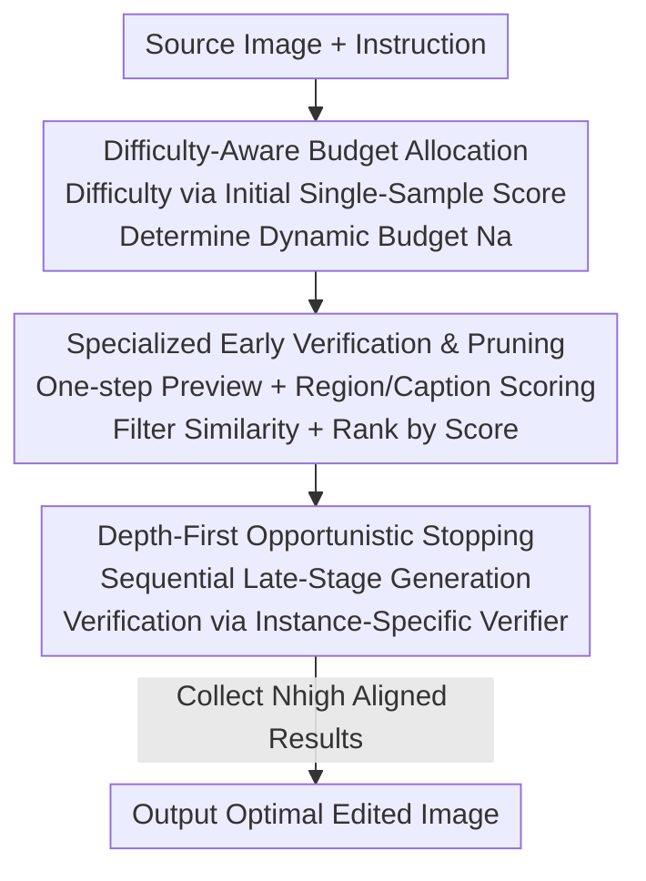

# From Scale to Speed: Adaptive Test-Time Scaling for Image Editing

**Conference**: CVPR 2026  
**Paper**: [CVF Open Access](https://openaccess.thecvf.com/content/CVPR2026/html/Qu_From_Scale_to_Speed_Adaptive_Test-Time_Scaling_for_Image_Editing_CVPR_2026_paper.html)  
**Code**: To be confirmed  
**Area**: Diffusion Models / Image Generation  
**Keywords**: Image Editing, Test-Time Scaling, Image-CoT, Adaptive Sampling, Early-Stopping Pruning

## TL;DR
Addressing the issue that T2I-oriented Image-CoT wastes computational power when directly applied to image editing, this paper proposes ADE-CoT. It dynamically allocates sampling budgets based on editing difficulty, replaces generic MLLM scoring with specialized "edit region + instruction consistency" verifiers for early pruning, and employs a depth-first "stop when sufficient" mechanism to eliminate redundant sampling. ADE-CoT achieves better image quality while accelerating inference by over 2× compared to Best-of-N across three SOTA editing models.

## Background & Motivation
**Background**: Image Chain-of-Thought (Image-CoT) is a training-free, plug-and-play "test-time scaling" strategy. It improves generation quality by sampling multiple candidates during inference and selecting the best one via a verifier. Originally designed for Text-to-Image (T2I), the standard approach involves perturbing initial noise to sample $N$ candidates followed by Best-of-N (BoN) selection. Advanced methods use MLLMs as verifiers to score intermediate states during denoising, pruning low-potential trajectories early to save computation.

**Limitations of Prior Work**: Fundamental differences exist between image editing and T2I. T2I is an open-ended task where large-scale sampling continuously yields diverse reasonable results. In contrast, editing is **goal-oriented**, where the solution space is strictly constrained by the source image and instructions; only a few correct answers exist regardless of noise perturbations or prompt rewriting. Applying T2I's Image-CoT directly to editing reveals three issues: (1) **Inefficient resource allocation**: All edits use a fixed budget (e.g., 32 samples), but simple edits (with high initial scores) gain almost nothing from Image-CoT, wasting power on easy samples. (2) **Unreliable early verification**: Edits often involve local or subtle changes difficult to distinguish in early denoising stages; generic MLLM scores misjudge these—40% of early low-scoring samples eventually achieve high scores but are erroneously pruned. (3) **Result redundancy**: Large-scale sampling produces multiple correct results with identical scores (edits with best scores in $[7,9)$ often have 15+ candidates sharing the top score), but editing only requires one result that aligns with the intent.

**Key Challenge**: The entire mechanism of existing Image-CoT (fixed budgets, general scoring, breadth-first parallel sampling of all candidates) is designed for "open-ended, the more the better" T2I, which is misaligned with the "goal-oriented, one is enough" nature of editing.

**Goal / Core Idea**: Shift the focus from "scale" to "speed." The paper proposes the on-demand ADE-CoT with three targeted strategies: dynamic budget allocation by difficulty, accurate early pruning using edit-specific metrics, and opportunistic depth-first stopping to cut redundancy—significantly improving efficiency while maintaining editing accuracy.

## Method

### Overall Architecture
ADE-CoT takes a source image $I_{src}$ and an editing instruction $c$ to produce an edited image $I$ semantically aligned with $c$. The pipeline transforms traditional BoN's "fixed budget + breadth-first sampling + general scoring" into a three-stage adaptive process.

First, the editing difficulty is estimated using the initial score of a single candidate to dynamically determine the total budget (difficulty-aware budget). Subsequently, a breadth-first search is conducted in the **early** stage of denoising, but with an edit-specific verifier (region localization + instruction-caption consistency) instead of general scores for pruning. Visually similar redundant candidates are discarded, and surviving candidates are ranked. Finally, the process switches to depth-first search in the **late** stage, generating candidates one by one based on early scores. Each is verified by an instance-specific verifier; the process stops immediately once $N_{high}$ intent-aligned results are collected. These stages correspond to "saving on simple samples," "pruning more accurately," and "cutting redundancy."

### Key Designs

**1. Difficulty-Aware Resource Allocation: Allocating less for simple edits and more for difficult ones**

This addresses the "fixed budget wastes compute" pain point. A single candidate is initially generated and scored by a verifier $\text{Vrf}$ to yield $S$, acting as a proxy for difficulty. A high score suggests a simple edit where further sampling offers diminishing returns, whereas a low score indicates difficulty justifying a larger search. The adaptive budget $N_a$ is allocated as:

$$N_a = N_{\min} + \lceil (N - N_{\min}) \times (1 - S/S_{\max})^{\gamma} \rceil$$

where $N_{\min}$ and $N$ are the minimum and original budgets, $S_{\max}$ is the maximum score, and $\gamma$ controls sensitivity. As $S \to S_{\max}$ (easy), $N_a$ converges to $N_{\min}$; as $S \to 0$ (difficult), $N_a$ approaches $N$. This directs computation precisely toward difficult edits. In experiments, $\gamma$ was set to 0.15, as NFE decreased steadily while quality remained stable until that point.

**2. Edit-Specific Verification + Similarity Filtering: Replacing generic scoring with "correctness of modification logic"**

Targeting the "40% misjudgment of high-potential samples by generic MLLMs" issue. This stage includes three components. First is **one-step preview**: scoring the noisy latent $x_{t_e}$ at early time $t_e$ directly is difficult. Since modern editing models often use flow matching, the authors use one-step extrapolation to approximate the clean latent $x_{0|t_e} = x_{t_e} - \sigma_{t_e}\epsilon_\theta(x_{t_e}, T_{t_e})$, decoded into a preview image without extra denoising steps.

Second, **two edit-specific verifiers** complement the general score $S_{gen}$. **Edit region correctness**: MLLMs are prompted with $P_{reg}$ to identify objects to be modified/retained, which are fed into Grounded SAM2 to generate a binary mask $M$ of the expected edit region. The mean change map $\Delta = \frac{1}{C}\sum_{c=1}^{C}|I_{(c)} - I_{src}^{(c)}|$ is calculated, and a pixel-level softmax weight is applied to $\Delta$ to aggregate the score within the mask: $S_{reg} = \sum_{H,W} M \odot \text{softmax}_{H,W}(\Delta)$. Higher $S_{reg}$ indicates changes concentrated in the intended area. **Instruction-caption consistency**: Since ground-truth captions are unavailable at test time, MLLMs generate a target caption $c_{cap}$ based on the source image and instruction via prompt $P_{cap}$, followed by calculating $S_{cap} = \text{CLIPScore}(I, c_{cap})$. The unified score $S = S_{gen} + \lambda_{reg}S_{reg} + \lambda_{cap}S_{cap}$ is used to prune candidates below a rejection threshold $S_{rj}$. Crucially, $S_{reg}$ and $S_{cap}$ require only one MLLM query per edit. This reduced misjudgments in the high-score range $[6,9)$ by 63% (235 to 86) while maintaining low-score pruning accuracy.

Third, **visual similarity filtering**: DINOv2 is used to extract visual embeddings of preview images; if the similarity between two candidates exceeds threshold $\tau_{sim}$, the lower-scoring one is discarded to eliminate redundancy. Remaining candidates are ranked by $S$ for the next stage.

**3. Depth-First Opportunistic Stopping: Stopping when sufficient rather than sampling all**

Targeting the redundancy of obtaining multiple identical correct results. Unlike the breadth-first approach of BoN/PRM/PARM, a **depth-first** approach is adopted: candidates are generated sequentially based on early scores. It consists of two parts. **Late-stage retention**: At a later time $t_l$ ($t_e < t_l < T$), a second preview and unified score are generated, using an adaptive threshold to prune sub-optimal samples. **Instance-specific verifier**: Generic scores $S_{gen}$ often fail to distinguish between multiple high-scoring candidates or miss subtle errors. The authors found that "two-stage QA" guides MLLMs to notice key details—first generating a set of yes/no questions (covering instruction following, aesthetics, etc.) via prompt $P_q$, then answering them via $P_a$. The instance-specific score $S_{spec}$ is the count of "yes" answers. This score punishes incorrect candidates. Generation stops once $N_{high}$ (default 4) intent-aligned results are collected, from which the highest scorer is output.

### Loss & Training
ADE-CoT is a training-free, plug-and-play test-time method. Key hyperparameters for three SOTA models: total steps $T=28/28/50$ (Kontext/BAGEL/Step1X-Edit), $t_e=8/8/16$, $t_l=16/16/36$. Qwen-VL-MAX is used for MLLM queries, VIE-Score for general scoring, and 5 yes/no questions per edit.

## Key Experimental Results

### Main Results
Evaluated on GEdit-Bench (real user edits), AnyEdit-Test (local/global/implicit edits), and Reason-Edit (complex reasoning) using FLUX.1 Kontext, BAGEL, and Step1X-Edit. Efficiency is measured by NFE (Total Denoising Steps), alongside **Inference Efficiency** $\eta = \frac{1}{M}\sum_i \sigma_i \cdot \frac{S(i)}{S_{\max}} \cdot \frac{NT}{NFE(i)}$ (where $\sigma_i=1$ if result is not inferior to BoN) and **Result Efficiency** $\xi = \frac{1}{M}\sum_i \sigma_i \frac{NFE(i)}{NFE^{min}(i)}$ (measuring redundancy). Main results on GEdit-Bench with fixed budget $N=32$:

| Model | Method | G_O ↑ | η ↑ | ξ ↑ |
|------|------|-------|-----|-----|
| FLUX.1 Kontext | BoN | 6.641 | 0.66 | 0.12 |
| FLUX.1 Kontext | TTS-EF | 6.376 | 0.98 | 0.57 |
| FLUX.1 Kontext | **ADE-CoT** | **6.695** | **1.47** | **0.66** |
| BAGEL | BoN | 6.908 | 0.69 | 0.14 |
| BAGEL | **ADE-CoT** | **6.972** | **1.27** | **0.62** |
| Step1X-Edit | BoN | 7.157 | 0.72 | 0.13 |
| Step1X-Edit | **ADE-CoT** | **7.196** | **1.45** | **0.62** |

ADE-CoT improves inference efficiency $\eta$ by over 2× compared to BoN. Result efficiency $\xi$ improves by 4.9×/2.7×/2.9× on average across benchmarks. Baselines fail because PRM/PARM misjudge early previews, and TTS-EF is unreliable when sampling scales up.

### Ablation Study (Incremental addition, GEdit-Bench, G_O / NFE)

| Configuration | Kontext | BAGEL | Step1X-Edit |
|------|---------|-------|-------------|
| Baseline (BoN) | 6.641 / 896 | 6.908 / 1600 | 7.157 / 896 |
| + Difficulty-Aware Budget | 6.641 / 797 | 6.909 / 1391 | 7.157 / 778 |
| + Early Pruning ($S_{gen}$) | 6.642 / 719 | 6.912 / 1351 | 7.157 / 719 |
| + Early Pruning (Unified $S$) | 6.647 / 673 | 6.916 / 1290 | 7.161 / 638 |
| + Similarity Filtering | 6.651 / 508 | 6.915 / 1087 | 7.162 / 522 |
| + Late Retention | 6.652 / 464 | 6.935 / 972 | 7.163 / 462 |
| + Instance-Specific Verifier | 6.702 / 464 | 6.984 / 972 | 7.206 / 462 |
| + Opportunistic Stop (Full) | 6.695 / 418 | 6.972 / 882 | 7.196 / 434 |

### Key Findings
- **NFE reduction primarily comes from "similarity filtering + opportunistic stopping"**: NFE dropped from 896 to 418 (≈2.1× speedup) on Kontext, with similarity filtering and stopping contributing most.
- **Instance-specific verifier is the main driver for quality improvement**: It captures detailed errors (e.g., "head tilted rather than forward") that generic scores miss, significantly boosting $G_O$.
- **Unified score $S$ is more accurate and efficient than $S_{gen}$**: Using $S$ allows for higher rejection thresholds, further reducing NFE without losing quality. One-step preview via flow-matching extrapolation outperformed adding extra denoising steps.
- **$N_{high}=4, \gamma=0.15$ are optimal balance points**: Performance saturates after $N_{high} \ge 4$ while NFE continues to rise; quality declines only after $\gamma$ exceeds 0.15.

## Highlights & Insights
- **The insight "task nature determines scaling strategy" is compelling**: T2I is open-ended (more is better), while editing is goal-oriented (one is enough). This dichotomy makes the shift from "scale" to "speed" logical rather than just a collection of tricks.
- **One-step preview with flow-matching** is clever: providing an early glimpse of the clean latent without extra cost serves as a cheap foundation for all subsequent verification.
- **Two-stage yes/no QA** transforms generic scoring into a "task-specific checklist," effectively adding targeted attention to the verifier—a concept transferable to any scenario where generic scores fail to distinguish candidates.
- **$S_{reg}$ using Grounded SAM2** quantifies "modifying the right area" without requiring ground truth, a rarity in specialized region verification for editing tasks.

## Limitations & Future Work
- The pipeline **heavily relies on external models** (Qwen-VL, SAM2, CLIP, etc.); the reliability of $S_{reg}/S_{cap}$ is capped by these components. MLLM errors propagate to pruning and stopping decisions.
- **Difficulty proxy = single candidate score** is a coarse estimation. Randomness in a single sample might lead to budget misallocation, a point requiring further variance analysis.
- **Hyperparameter sensitivity**: Several thresholds ($\gamma, \tau_{sim}, \lambda, S_{rj}, t_e, t_l$) require tuning across models. While default values worked for three models, the generalization across broader datasets and models remains to be fully explored.
- The framework is **bound by the base model's editing capability**: It optimizes selection within a model's output distribution rather than fundamentally improving the model's intrinsic editing ability.

## Related Work & Insights
- **vs Best-of-N (BoN)**: BoN uses a fixed budget and breadth-first sampling. ADE-CoT uses dynamic budgets and opportunistic stopping, achieving 2× acceleration with equal or superior quality.
- **vs PRM / PARM**: These also prune during denoising but rely on generic MLLM scores that misjudge subtle editing details; ADE-CoT's specialized verifiers reduce high-score region misjudgments by 63%.
- **vs TTS-EF (ICEdit)**: TTS-EF introduced Image-CoT to editing via extra denoising steps for early previews but only selects a single best candidate (unreliable for large scales). ADE-CoT uses "one-step previews," specialized scores, and depth-first stopping for a win-win in efficiency and quality.

## Rating
- Novelty: ⭐⭐⭐⭐ The shift from open-ended to goal-oriented scaling is a strong design principle. While individual components (pruning/QA/budget) are known, their synthesis is highly effective.
- Experimental Thoroughness: ⭐⭐⭐⭐⭐ Extensive benchmarks, three SOTA models, clear ablation of every strategy, and well-designed efficiency metrics ($\eta, \xi$).
- Writing Quality: ⭐⭐⭐⭐ Clear problem analysis and motivation; mathematical formulations are straightforward.
- Value: ⭐⭐⭐⭐ Training-free and plug-and-play; 2× speedup is highly practical for deploying Image-CoT in real-world editing applications.

<!-- RELATED:START -->

## Related Papers

- [\[CVPR 2026\] Progress by Pieces: Test-Time Scaling for Autoregressive Image Generation](progress_by_pieces_test-time_scaling_for_autoregressive_image_generation.md)
- [\[CVPR 2026\] Test-Time Instance-Specific Parameter Composition: A New Paradigm for Adaptive Generative Modeling](test-time_instance-specific_parameter_composition_a_new_paradigm_for_adaptive_ge.md)
- [\[CVPR 2026\] Test-Time Alignment of Text-to-Image Diffusion Models via Null-Text Embedding Optimisation](test-time_alignment_of_text-to-image_diffusion_models_via_null-text_embedding_op.md)
- [\[CVPR 2026\] Rethinking Prompt Design for Inference-time Scaling in Text-to-Visual Generation](rethinking_prompt_design_for_inference-time_scaling_in_text-to-visual_generation.md)
- [\[CVPR 2026\] MRT: Masked Region Transformer for Layered Image Generation and Editing at Scale](mrt_masked_region_transformer_for_layered_image_generation_and_editing_at_scale.md)

<!-- RELATED:END -->
