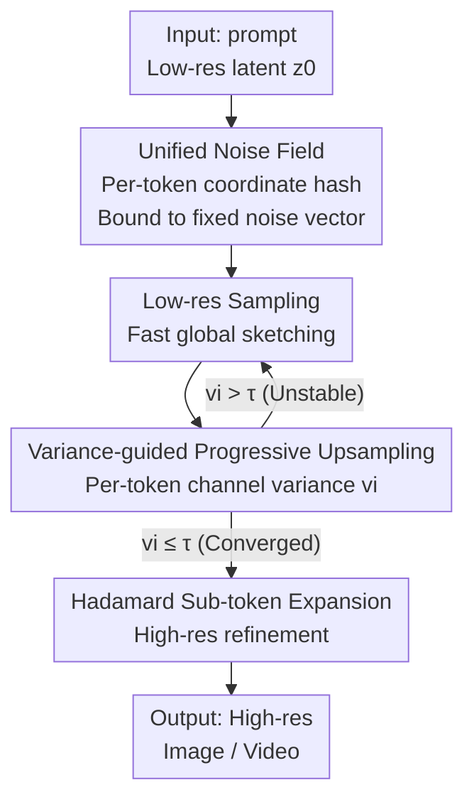

# From Sketch to Fresco: Efficient Diffusion Transformer with Progressive Resolution

**Conference**: CVPR 2026  
**Paper**: [CVF Open Access](https://openaccess.thecvf.com/content/CVPR2026/html/Zheng_From_Sketch_to_Fresco_Efficient_Diffusion_Transformer_with_Progressive_Resolution_CVPR_2026_paper.html)  
**Code**: https://github.com/DarrenZheng303/Fresco  
**Area**: Diffusion Models / Image Generation  
**Keywords**: Dynamic Resolution Sampling, Diffusion Acceleration, Unified Noise Field, Progressive Upsampling, Training-free  

## TL;DR
Fresco replaces the fragmented stage-by-stage re-noising in traditional dynamic resolution sampling with a "coordinate-bound unified noise field" + "token variance-adaptive progressive upsampling." This ensures that low-resolution sketches and high-resolution refinements converge toward the same target. It is training-free and accelerates FLUX by 10× and HunyuanVideo by 5×. It is orthogonal to distillation/feature caching, reaching up to 22× speedup when combined.

## Background & Motivation
**Background**: Diffusion Transformers (DiT) achieve high quality in image/video generation but suffer from slow inference due to dozens of sampling steps, each passing through a large transformer. Acceleration mainly follows two paths: reducing steps (high-order solvers, distillation, consistency models) and reducing per-step compute (sparse attention, feature caching). A third emerging path is **dynamic resolution sampling**: running early steps at low resolution and upsampling later, as early details are less critical.

**Limitations of Prior Work**: The issue with dynamic resolution lies in the "resolution switch." At each resolution increase, the latent noise variance mismatches the current diffusion trajectory, necessitating "re-noise" to align with the forward diffusion process. Existing methods (e.g., bottleneck sampling) rely on complex re-noising schedules and stage-specific heuristic parameters, which are hard to tune and limit acceleration.

**Key Challenge**: There are two fundamental problems. First, each switch **independently samples a new noise field**, decoupling the denoising trajectory from previous stages. A low-resolution sketch that has already converged toward a meaningful global structure is subjected to a "destructive reset," forcing the model to relearn global semantics at high resolution rather than refining details. This results in texture flickering, geometric breakage, and limited acceleration. Second, existing methods apply a **one-size-fits-all upsampling** to the entire latent, regardless of whether specific regions have converged, leading to aliasing, ringing, and fragmented geometry in unstable areas.

**Goal**: Maintain global structure and semantic consistency throughout the process—ensuring that low-resolution fast convergence and high-resolution refinement move toward the **same final target** without being interrupted by repeated re-noising.

**Core Idea**: Bind a **fixed noise vector** to each token based on its spatial coordinates to form a "unified noise field" shared across all stages. This ensures stochastic evolution remains continuous across scales; simultaneously, only **tokens with reduced variance (stable semantics)** are upsampled, allowing upsampling to happen progressively and on-demand.

## Method

### Overall Architecture
Fresco is a **training-free** progressive resolution framework. The pipeline starts from a **downsampled low-resolution** latent $z_0$, allowing early steps to establish the global structure at low cost ("sketch"). During sampling, it tracks the channel variance of each token across timesteps. Tokens with low variance (meaning semantics are stable at the current scale) are upsampled for high-resolution refinement ("fresco"), while high-variance tokens remain at low resolution. Crucially, regardless of the scale or stage, a token's noise is retrieved from the same **coordinate-bound unified noise field**, avoiding trajectory resets caused by independent stage-wise re-noising.

### Key Designs

**1. Token-level Unified Noise Field: Replacing stage-wise re-noising with a cross-scale deterministic reference**

Traditional dynamic resolution performs independent noise injection at each resolution increase, potentially resetting converged trajectories. Fresco pre-defines a global noise field where each latent token at coordinate $(y,x)$ and feature dimension $d$ deterministically retrieves a fixed Gaussian vector via a hash function:

$$\epsilon_{y,x,d} = \mathcal{N}(0,1;\ \text{seed}=h(y,x,d)),$$

where $h(\cdot)$ ensures the same token always receives the same noise value throughout the sampling trajectory. During resolution switches, the latent state is updated using this unified field: $z^{(s+1)} = \beta_s z^{(s)} + \alpha_s \epsilon_{y,x,d}$, where $(\alpha_s,\beta_s)$ control the stochastic contribution. When upsampling, coordinates of new tokens are derived from the parent token, and **noise is queried from the same field using the new coordinates**. Coordinate consistency ensures continuous stochastic evolution cross-scale without destructive resets. Proposition 1 in the paper states that the state $\hat{X}_e$ from unified re-noising is closer to the target $X(t_e)$ than the state $\tilde{X}_e$ from independent re-noising, which has an irreducible lower bound $\mathbb{E}[\|\tilde{X}_e - X(t_e)\|^2] \ge b^2 d$ (where $b$ is noise intensity and $d$ is feature dimension). Intuitively, shared noise re-noising acts as a **temporal reparameterization** along the same generation path with negligible drift.

**2. Variance-guided Progressive Upsampling: Upsampling only "converged" tokens**

To address the aliasing caused by bulk upsampling of unstable regions, Fresco uses the **channel variance** of each token across timesteps to evaluate convergence:

$$v_i = \mathrm{Var}_t\big(z_i^{(t)}\big).$$

Smaller $v_i$ indicates more stable semantic structure. A threshold $\tau$ controls the selection ratio (trading off efficiency and detail): tokens satisfying $v_i \le \tau$ are considered converged and are upsampled early for refinement; those with $v_i > \tau$ remain at low resolution for efficient denoising. This **on-demand, progressive** upsampling naturally fits the "global-to-local" evolution of the diffusion process.

**3. Hadamard Sub-token Expansion: Increasing resolution without destroying parent structure**

Simple interpolation for upsampling often leads to blurring. Fresco uses an orthogonal Hadamard transform to expand each parent token $z_{\text{parent}} \in \mathbb{R}^D$ into 4 sub-tokens. It samples 3 independent Gaussian vectors $\epsilon_1, \epsilon_2, \epsilon_3 \sim \mathcal{N}(0,I)$, then:

$$[z_1,z_2,z_3,z_4] = H_4 \cdot [z_{\text{parent}},\ \epsilon_1,\ \epsilon_2,\ \epsilon_3],$$

where $H_4$ is a $4\times4$ Hadamard matrix. The orthogonal transform mixes the parent's coarse semantics with three controlled orthogonal perturbations into the 4 sub-tokens. The parent path preserves the coarse structure, while the noise paths provide the stochastic degrees of freedom needed for fine-scale textures.

## Key Experimental Results

### Main Results
Text-to-Image (T2I) was evaluated on FLUX.1-dev and Text-to-Video (T2V) on HunyuanVideo. T2I used DrawBench with 200 prompts @1024×1024 (ImageReward / CLIP Score), and T2V used VBench @720×1280 with 125 frames.

| Task / Model | Method | FLOPs Gain | Quality Metric | Comparison |
|------|------|------|------|------|
| T2I / FLUX.1-dev | Fresco (NFE 30) | 2.87× | ImageReward **1.0527** | TeaCache 0.9449 / Bottleneck 0.9739 |
| T2I / FLUX.1-dev | Fresco (NFE 18) | 4.72× | ImageReward **1.0369** | TaylorSeer 0.9857 / RALU 0.9481 |
| T2I / FLUX.1-schnell | Fresco (NFE 9) | **10.27×** | ImageReward 0.9825 | Higher than original FLUX/schnell |
| T2V / HunyuanVideo | Fresco (NFE 23) | 3.91× | Total **81.10** | TeaCache 78.96 / Jenga-ProRes 79.16 |
| T2V / HunyuanVideo | Fresco (NFE 18) | 4.92× | Total 80.76 | Best in class |

Notably, at 4.72× acceleration, Fresco's ImageReward (1.0369) is **higher than original FLUX** (0.9736), suggesting that the coarse-to-fine approach mitigates structural degradation issues in native high-resolution FLUX sampling.

**Orthogonal Combination** with other methods (Table 3):

| Combination | Gain | CLIP-IQA | Note |
|------|------|------|------|
| Fresco + TaylorSeer (Caching) | 9.23× | 0.9116 (+0.07%) | Completely training-free |
| Fresco + FLUX.1-lite-8B (Distill) | 10.03× | 0.9518 (+4.48%) | — |
| Fresco + schnell (Step Distill, NFE 4) | **22.10×** | 0.8693 | Quality preserved under extreme speedup |

### Ablation Study

| Config | Gain | ImageReward | CLIP Score | Note |
|------|------|------|------|------|
| Random selection | 4.90× | 0.9143 | 31.277 | Random token upsampling |
| Edge detection | 4.47× | 0.9482 | 32.316 | Edge-based selection |
| Attention score | 4.21× | 0.9849 | 32.324 | Attention-based selection |
| w/o unified re-noise | 4.13× | 0.9632 | 31.264 | Removed unified noise field |
| Interpolated upsampling | 4.63× | 0.9876 | 32.132 | Replaced Hadamard with interpolation |
| **Fresco (Full)** | 4.51× | **1.0369** | **32.581** | Full model |

### Key Findings
- **Variance-guided selection is critical**: Random, edge, or attention-based selections significantly drop quality; the variance criterion (convergence detection) is the correct signal.
- **Unified noise field is indispensable**: Removing it causes ImageReward to drop from 1.0369 to 0.9632, confirming the importance of consistent noise scheduling for cross-stage coherence.
- **Hadamard expansion exceeds interpolation**: The interpolation version yields lower quality, proving that sub-tokens need controlled orthogonal perturbations for detail freedom.
- **Higher returns at higher resolutions**: Acceleration gain increases from 4.51× at 1024² to 5.68× at 2048² due to higher redundancy.
- **Improved convergence**: Fresco establishes coherent global layouts within the first 7-8 low-res steps, where full-res samplers are still submerged in noise.

## Highlights & Insights
- **Reinterpreting "re-noise" as temporal reparameterization**: Instead of treating re-noise as a necessary destructive disturbance, Fresco shows that coordinate-bound noise implementation reduces re-noise to a negligible drift along the same generation path.
- **Variance as a convergence probe**: Using channel variance across timesteps is a lightweight and physically intuitive signal for region-specific early stopping or resolution scaling.
- **Compounding returns via orthogonality**: Since Fresco does not modify training or conflict with step reduction/caching, it can be layered directly on distilled models to achieve >20× speedup.
- **Mitigating high-res degradation**: Starting from a low-res "sweet spot" before upsampling bypasses the structural fragmentation issues DiT faces in native high-resolution distributions.

## Limitations & Future Work
- The variance threshold $\tau$ is a key hyperparameter for the efficiency/detail trade-off; its sensitivity across different models/resolutions requires further study.
- Proposition 1's bound $b^2 d$ depends on specific noise and dimension assumptions; the quantitative relationship between drift and quality in complex DiT dynamics needs deeper verification.
- Validated primarily on FLUX and HunyuanVideo; generalizability to U-Net architectures or other DiTs (e.g., SD3, PixArt) remains to be confirmed.
- Hadamard expansion is currently designed for 2× spatial scaling; extensions to more aggressive or non-square upsampling were not detailed.

## Related Work & Insights
- **vs Bottleneck Sampling**: Also training-free dynamic resolution, but relies on complex re-noise scheduling and heuristic parameters. Fresco uses a unified field to eliminate scheduling complexity and variance-guided selection for superior quality and speed.
- **vs Feature Caching (TeaCache/TaylorSeer)**: These reduce per-step compute but can crash in quality when aggressive. Fresco operates on the spatial dimension and is orthogonal to caching.
- **vs Distillation**: These reduce step counts; Fresco is complementary, as demonstrated by the 22.10× speedup when combined with schnell.
- **vs Cascade Diffusion**: Both are coarse-to-fine, but cascades usually require separate training or upsampler modules. Fresco is entirely training-free and happens within a single sampling process.

## Rating
- Novelty: ⭐⭐⭐⭐⭐ Clear reinterpretation of re-noising combined with variance-guided logic.
- Experimental Thoroughness: ⭐⭐⭐⭐ Covers T2I/T2V and multiple combinations, though missing some $\tau$ sensitivity analysis.
- Writing Quality: ⭐⭐⭐⭐ Logical flow from motivation to propositions; diagrams are intuitive.
- Value: ⭐⭐⭐⭐⭐ Plug-and-play, training-free, and brings significant speedups (10×-22×) while often improving quality.

<!-- RELATED:START -->

## Related Papers

- [\[CVPR 2026\] Towards High-resolution and Disentangled Reference-based Sketch Colorization](towards_high-resolution_and_disentangled_reference-based_sketch_colorization.md)
- [\[CVPR 2026\] Training-free, Perceptually Consistent Low-Resolution Previews with High-Resolution Image for Efficient Workflows of Diffusion Models](training-free_perceptually_consistent_low-resolution_previews.md)
- [\[CVPR 2026\] DiT-IC: Aligned Diffusion Transformer for Efficient Image Compression](ditic_aligned_diffusion_transformer_for_efficient.md)
- [\[CVPR 2026\] NAMI: Efficient Image Generation via Bridged Progressive Rectified Flow Transformers](nami_efficient_image_generation_via_bridged_progressive_rectified_flow_transform.md)
- [\[CVPR 2026\] STCDiT: Spatio-Temporally Consistent Diffusion Transformer for High-Quality Video Super-Resolution](stcdit_spatio-temporally_consistent_diffusion_transformer_for_high-quality_video.md)

<!-- RELATED:END -->
