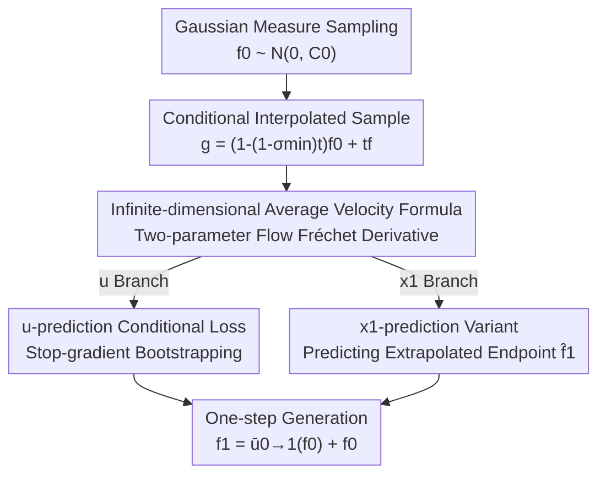

# Functional Mean Flow in Hilbert Space

**Conference**: CVPR 2026  
**Paper**: [CVF Open Access](https://openaccess.thecvf.com/content/CVPR2026/html/Li_Functional_Mean_Flow_in_Hilbert_Space_CVPR_2026_paper.html)  
**Code**: Undisclosed  
**Area**: Image Generation / Diffusion Models  
**Keywords**: Functional Space Generation, Mean Flow, One-step Generation, Flow Matching, Hilbert Space

## TL;DR
This work extends the "one-step generation" of Mean Flow from finite-dimensional Euclidean space to infinite-dimensional Hilbert (functional) space. By reconstructing the training target for the average velocity field using Fréchet derivatives of two-parameter flows and introducing a more stable x1-prediction variant, it enables high-quality single-step sampling for various functional data types, including time series, images, PDEs, and 3D shapes.

## Background & Motivation
**Background**: Functional Generative Models treat data as continuous functions rather than discrete grids, such as viewing an image as a function $f:\mathbb{R}^2\to\mathbb{R}^3$ defined over pixel coordinates. This approach allows "sub-sampling coordinates"—training on a random 1/4 of pixels from a 256x256 image while generating at any resolution (64, 128, 256, 512, 1024) during inference, effectively decoupling GPU memory/computation from data resolution. Representatives of this direction include Infty-Diff and Functional Flow Matching (FFM).

**Limitations of Prior Work**: Similar to standard Diffusion or Flow Matching models, functional generative models require dozens to thousands of numerical integration steps during inference (Table 1 shows FFM takes 300–700 NFE, FDDPM takes 1000, and DDO takes 2000), which severely limits speed. In finite dimensions, Mean Flow achieves one-step sampling by "predicting the time-averaged velocity," yielding FID improvements of 60%–90% over previous one-step methods, but it cannot be directly applied to functional spaces.

**Key Challenge**: In infinite-dimensional Hilbert spaces, finite-dimensional intuition fails. The derivation of Mean Flow relies on the consistency where the "marginal of the conditional velocity field equals the true marginal velocity field" (which holds in FFM). However, in two-parameter flows, this consistency is **broken**—taking the expectation of the conditional two-parameter flow does not yield the directly defined marginal two-parameter flow (Statement 1). Furthermore, computing Fréchet derivatives for operator-valued velocity fields is numerically unstable, often leading to optimization divergence.

**Goal**: (1) Provide a mathematically consistent formula for average velocity in infinite-dimensional space that bypasses conditional/marginal inconsistency; (2) Formulate it as a trainable conditional loss; (3) Resolve the training collapse stability issues of u-prediction in specific tasks.

**Key Insight**: Instead of force-fitting finite-dimensional formulas, the authors start from the derivative of the two-parameter flow with respect to the initial time $t$. By proving $\partial_t\phi_{t\to r}(g)=-D\phi_{t\to r}(g)[u_t(g)]$, the closed-form-lacking average velocity $\bar u_{t\to r}$ is rewritten as a conditional target containing itself, which can be bootstrapped using stop-gradient. Additionally, an x1-prediction variant that predicts the endpoint instead of velocity is proposed to replace the fragile u-prediction.

## Method

### Overall Architecture
FMF is built upon Functional Flow Matching (FFM). FFM learns a time-varying velocity field $u(t,f)$ on a separable Hilbert space $\mathcal F$ to transport a reference Gaussian measure $\mu_0=\mathcal N(m_0,C_0)$ to a target distribution $\mu_1=\nu$ along a continuous measure path $(\mu_t)$. Sampling starts from $f_0\sim\mu_0$ and integrates the ODE $\frac{\mathrm df_t}{\mathrm dt}=u(t,f_t)$ to obtain $f_1\sim\nu$. It utilizes conditional paths $\mu_t^f=\mathcal N(m_t^f,(\sigma_t^f)^2C_0)$ (choosing $m_t^f=tf$ and $\sigma_t^f=1-(1-\sigma_{\min})t$) to make the loss tractable.

FMF compresses the "multi-step integration" into "one step." The overall pipeline is: **Sample a noise function from the Gaussian measure → Construct an interpolated sample $g$ at $t$ → Calculate the conditional target for the sample (average velocity for the u-version, extrapolated endpoint for the x1-version) → Use stop-gradient to bootstrap an optimizable conditional loss to train a function-to-function network (Neural Operator) → Direct jump from $f_0$ to $f_1$ in one step during inference.** There are two equivalent but differently stable branches: u-prediction and x1-prediction.

### Key Designs

**1. Infinite-dimensional average velocity formula: Bypassing inconsistency via initial time derivatives of two-parameter flows**

The derivation of finite-dimensional Mean Flow assumes that the "expectation of conditional velocity fields equals the marginal velocity field." FMF finds that this fails for two-parameter flows: the expectation of conditional two-parameter flows $\phi_{t\to r}^f=\phi_r^f\circ(\phi_t^f)^{-1}$, denoted as $\phi^{(1)}_{t\to r}$, does not equal the directly defined $\phi^{(2)}_{t\to r}=\phi_r\circ\phi_t^{-1}$ (Statement 1). The authors redefine average velocity as $\bar u_{t\to r}=\frac{1}{r-t}(\phi_{t\to r}-\mathrm{Id}_{\mathcal F})$, where $\phi_{t\to r}=\phi_r\circ\phi_t^{-1}$. They prove (Theorem 3.1) that under FFM conditions, the two-parameter flow is differentiable with respect to $t$, Fréchet differentiable with respect to $g$, and satisfies:

$$\frac{\partial}{\partial t}\phi_{t\to r}(g)=-D\phi_{t\to r}(g)[u_t(g)],$$

where $D\phi_{t\to r}(g):\mathcal F\to\mathcal F$ is the Fréchet derivative. Substituting this back into the average velocity definition and expanding with the product rule yields the self-consistent identity:

$$\bar u_{t\to r}(g)=(r-t)\Big(\frac{\partial}{\partial t}\bar u_{t\to r}(g)+D\bar u_{t\to r}(g)[u_t(g)]\Big)+u_t(g).$$

This step serves as the theoretical foundation: it bypasses the broken consistency and expresses the "closed-form-lacking average velocity" in infinite dimensions using its own derivative and instantaneous velocity, providing a mathematically sound definition of Mean Flow in Hilbert space for the first time.

**2. Stop-gradient bootstrapped conditional loss: Making self-containing targets trainable**

The right side of the above equation still contains $\bar u_{t\to r}$, making it unsuitable as a direct regression target. Following Mean Flow / Consistency Models, the authors use the current model prediction $\bar u_{t\to r}^\theta$ to estimate this term and apply stop-gradient ($\mathrm{sg}$) to freeze its gradient. By replacing the marginal velocity $u_t$ with the conditional velocity $u_t^f$ (leveraging the fact that $u_t$ is the marginal of $u_t^f$), they derive an optimizable conditional loss:

$$\mathcal L_c^M(\theta)=\mathbb E_{t,r,g\sim\mu_t^f,f\sim\mu_1}\Big[\big\|(r-t)\,\mathrm{sg}\big(\tfrac{\partial}{\partial t}\bar u_{t\to r}(g)+D\bar u_{t\to r}(g)[u_t^f(g)]\big)+u_t^f(g)-\bar u_{t\to r}^\theta(g)\big\|_{\mathcal F}^2\Big],$$

where the conditional velocity has a closed form $u_t^f(g)=\frac{1-\sigma_{\min}}{1-(1-\sigma_{\min})t}(tf-g)+f$. Theorem 3.2 proves that this conditional loss differs from the true marginal loss $\mathcal L^M(\theta)$ only by a constant $C$ independent of $\theta$. Implementation-wise, derivatives involving $\partial_t$ and $D[\cdot]$ are computed via Jacobian-vector products (JVP) in auto-diff frameworks, avoiding explicit construction of Fréchet derivative operators.

**3. x1-prediction variant: Predicting extrapolated endpoints to solve u-prediction instability**

u-prediction predicts the average velocity $\bar u_{t\to r}$. In certain tasks (especially SDF-based 3D shape generation), training suffers from "spatial variance collapse"—the network output degrades into a constant field and never recovers. Borrowing from standard Flow Matching's x1-prediction, the authors instead predict the intersection of the average velocity line extrapolated to $t=1$, i.e., the expected endpoint:

$$\hat f_{1,t\to r}=(1-t)\,\bar u_{t\to r}+\mathrm{Id}_{\mathcal F}.$$

Similarly, $\hat f_{1,t\to r}$ cannot be directly optimized, so the authors derive its conditional counterpart $\hat f_{1,t}^f(g)=\frac{\sigma_{\min}}{1-(1-\sigma_{\min})t}(g-tf)+f$ and provide an x1 version of the conditional loss $\tilde{\mathcal L}_c^M(\theta)$. Theorem 3.3 proves this also maintains constant-difference equivalence with the marginal loss. The distinction from existing methods is critical: Consistency Models / Flow Map Matching predict the true future state $f_r$, while this work predicts the intersection of the velocity line with $t=1$. Unlike CM (which lacks gradient information) or FMM (where optimization inside the gradient operator is unstable and expensive), the x1 version is theoretically equivalent to the u version but avoids these issues. Empirically, both yield similar results for most tasks, but the x1 version remains stable where the u version collapses (Figure 6).

### Loss & Training
**Training** (Algorithm 1): Sample $f\sim\mathcal D$, $f_0\sim\mathcal N(0,C_0)$, $t,r\sim\mathcal T$. Create the interpolated sample $g=(1-(1-\sigma_{\min})t)f_0+tf$. Calculate the conditional target and loss according to the u or x1 branch, then perform gradient descent. **Inference** (Algorithm 2) yields results in one step: $f_1=\bar u_{0\to1}^\theta(f_0)+f_0$ for the u-version, and $f_1=\hat f_{1,0\to1}^\theta(f_0)$ for the x1-version. The architecture follows existing multi-step Neural Operators (FNO / Mixed Sparse-Dense Neural Operator / Point-based Functional Diffusion), only replacing the single time variable $t$ with the $(t,r)$ pair. Initial noise is parameterized using Gaussian Processes with Matérn kernels or white noise with mollifiers, as white noise is undefined in infinite-dimensional space.

## Key Experimental Results

### Main Results
Testing covers three categories: real-world function generation (1D time series + 2D Navier–Stokes), functional image generation, and SDF-based 3D shape generation.

On 1D statistical datasets (Table 1, MSE between generated function statistics and ground truth, lower is better), FMF with 1-step NFE outperforms other one-step methods and approaches multi-step baselines:

| Dataset | Metric (Mean ↓) | FMF (u, 1-step) | FMF (x1, 1-step) | GANO (1-step) | FFM-VP (multi-step) |
| :--- | :--- | :--- | :--- | :--- | :--- |
| AEMET | Mean | 5.3e-1 | 5.4e-1 | 6.5e+1 | 1.3e-1 (488 NFE) |
| Genes | Mean | 1.6e-3 | 2.1e-3 | 4.6e-2 | 4.2e-4 (290 NFE) |
| Labor | Variance | 7.1e-8 | 1.2e-7 | 2.4e-7 | 3.5e-7 (320 NFE) |

Navier–Stokes (Table 2, Density/Spectra MSE ↓): FMF(x1) achieves Density 8.0e-5 and Spectra 5.6e2, significantly outperforming the one-step baseline GANO (2.5e-3 / 3.2e4) and nearing multi-step FFM-OT (3.7e-5 / 9.3e1).

Image generation (Table 3, FID$_\text{CLIP}$ ↓, trained on 1/4 pixels at 256x256, one-step generation) achieves SOTA among functional one-step methods:

| Method | Steps | CelebAHQ-64 | CelebAHQ-128 | FFHQ-256 | Church-256 |
| :--- | :--- | :--- | :--- | :--- | :--- |
| GASP | 1 | 9.29 | 27.31 | 24.37 | 37.46 |
| GEM | 1 | 14.65 | 23.73 | 35.62 | 87.57 |
| **FMF (Ours)** | **1** | **3.48** | **7.18** | **11.37** | **26.57** |
| ∞-Diff | 100 | 4.57 | 3.02 | 3.87 | 10.36 |

Notably, FMF in one step (3.48) performs better than ∞-Diff in 100 steps (4.57) at 64 resolution. While FMF still trails multi-step ∞-Diff at higher resolutions, the authors note that functional generation generally has slightly lower perceptual fidelity than pixel-level diffusion in exchange for resolution flexibility.

### Ablation Study
Resolution generalization (Table 4, trained at 256, FID$_\text{CLIP}$ ↓ across resolutions using the same model) validates "train once, generate at any resolution":

| Dataset | 64 | 128 | 256 | 512 | 1024 |
| :--- | :--- | :--- | :--- | :--- | :--- |
| CelebA-HQ | 3.48 | 5.86 | 9.17 | 9.70 | 10.96 |
| FFHQ | 4.42 | 7.70 | 11.37 | 12.34 | – |
| AFHQ (Cond) | 3.10 | 6.19 | 9.24 | 11.55 | – |

3D Shape Reconstruction (Table 5, reconstructing the full SDF from 64 surface points): Ours in 1 step (Chamfer 0.060) outperforms 3DS2VS in 18 steps (0.144) and FD in 64 steps (0.101), though the F-Score (0.584) is slightly lower than multi-step baselines, indicating overall comparable precision.

### Key Findings
- **u-prediction suffers from "spatial variance collapse" in 3D SDF tasks**: Figure 6 shows that even with small learning rates, the u-version's output variance drops to zero and the network degrades into a constant field. The x1-version remains stable with smooth loss curves—this directly motivated the x1 variant.
- **Theoretical consistency is vital**: The constant difference between conditional and marginal loss (Theorem 3.2/3.3) ensures that training with the tractable conditional target is equivalent to optimizing the true target, which is the prerequisite for safely porting Mean Flow to infinite dimensions.
- **Minimal architecture changes**: Simply replacing the time variable $t$ with the $(t,r)$ pair allows existing multi-step Neural Operators to be converted into one-step generators, proving FMF is a plug-and-play training paradigm rather than a new network architecture.

## Highlights & Insights
- **Bypassing broken consistency**: Instead of forcing finite-dimensional formulas, the authors use the identity for the initial time derivative of two-parameter flows ($\partial_t\phi_{t\to r}=-D\phi_{t\to r}[u_t]$) to reconstruct the average velocity from scratch—a critical move to migrate Mean Flow to Hilbert space.
- **First introduction of x1-prediction to Mean Flow**: Predicting the "intersection of the velocity line with $t=1$" instead of the velocity itself preserves theoretical equivalence while fixing u-version collapse. This stability trick could potentially be transferred back to finite-dimensional Mean Flow.
- **Engineering value of resource-resolution decoupling**: Training on 25% of pixels while generating at any resolution (even extrapolating to 1024) is highly practical for memory-intensive high-resolution or large-scale generation scenarios.

## Limitations & Future Work
- **Perceptual fidelity trails pixel-level diffusion**: The authors admit that one-step functional generation FID still lags behind multi-step ∞-Diff at high resolutions, making it more suitable for scenarios prioritizing resolution flexibility over absolute image quality.
- **u-prediction is not universal**: The u-version collapses on 3D SDF and requires switching to x1; the paper does not provide a formal criterion for "when to use which," making the choice largely empirical.
- **Strong theoretical assumptions**: Theorem 3.1 requires $\int_{\mathcal F}\|f\|_{\mathcal F}^2\mathrm d\nu(f)<\infty$ and specific FFM conditions. Many proofs are relegated to the appendix, making full self-verification from the main text difficult.
- **Improvement directions**: Combining the stability of x1 with higher fidelity at high resolutions, or introducing few-step sampling instead of pure one-step for better quality, are potential future directions.

## Related Work & Insights
- **vs. Mean Flow (Finite-dimensional)**: This work adopts the concept of "predicting time-average velocity for one-step generation" into infinite-dimensional Hilbert space. The key difference is handling the broken conditional/marginal consistency in two-parameter flows via Fréchet derivatives and the x1 variant.
- **vs. Functional Flow Matching (FFM)**: FFM is the multi-step foundation for this work. FMF compresses its integration into a single step; FMF in one step approaches FFM in hundreds of steps at the cost of slight quality reduction.
- **vs. Consistency Models / Flow Map Matching**: CM/FMM predict true future states $f_r$, whereas FMF's x1 variant predicts the intersection of the velocity line with $t=1$. FMF is theoretically equivalent to the velocity-based version, utilizes gradient information more effectively, and avoids the instability and high overhead of FMM's internal gradient optimization.

## Rating
- Novelty: ⭐⭐⭐⭐⭐ First to bring Mean Flow one-step generation to infinite-dimensional Hilbert space; introduces the first x1-prediction variant for Mean Flow.
- Experimental Thoroughness: ⭐⭐⭐⭐ Covers 1D/PDE/Image/3D tasks with resolution generalization and stability ablations, though high-resolution quality still lags behind multi-step models and 3D metrics are mixed.
- Writing Quality: ⭐⭐⭐⭐ Clear theoretical derivation and well-structured motivation, although core proofs are heavily condensed into the appendix.
- Value: ⭐⭐⭐⭐ Provides a plug-and-play one-step training paradigm for functional generation; resolution-resource decoupling is practical for large-scale generation.

<!-- RELATED:START -->

## Related Papers

- [\[CVPR 2026\] Improved Mean Flows: On the Challenges of Fastforward Generative Models](improved_mean_flows_on_the_challenges_of_fastforward_generative_models.md)
- [\[ICLR 2026\] RMFlow: Refined Mean Flow by a Noise-Injection Step for Multimodal Generation](../../ICLR2026/image_generation/rmflow_refined_mean_flow_by_a_noise-injection_step_for_multimodal_generation.md)
- [\[ICLR 2026\] CMT: Mid-Training for Efficient Learning of Consistency, Mean Flow, and Flow Map Models](../../ICLR2026/image_generation/cmt_mid-training_for_efficient_learning_of_consistency_mean_flow_and_flow_map_mo.md)
- [\[CVPR 2026\] Scale Space Diffusion：把尺度空间塞进扩散过程](scale_space_diffusion.md)
- [\[CVPR 2026\] CaTok: Taming Mean Flows for One-Dimensional Causal Image Tokenization](catok_taming_mean_flows_for_one-dimensional_causal_image_tokenization.md)

<!-- RELATED:END -->
