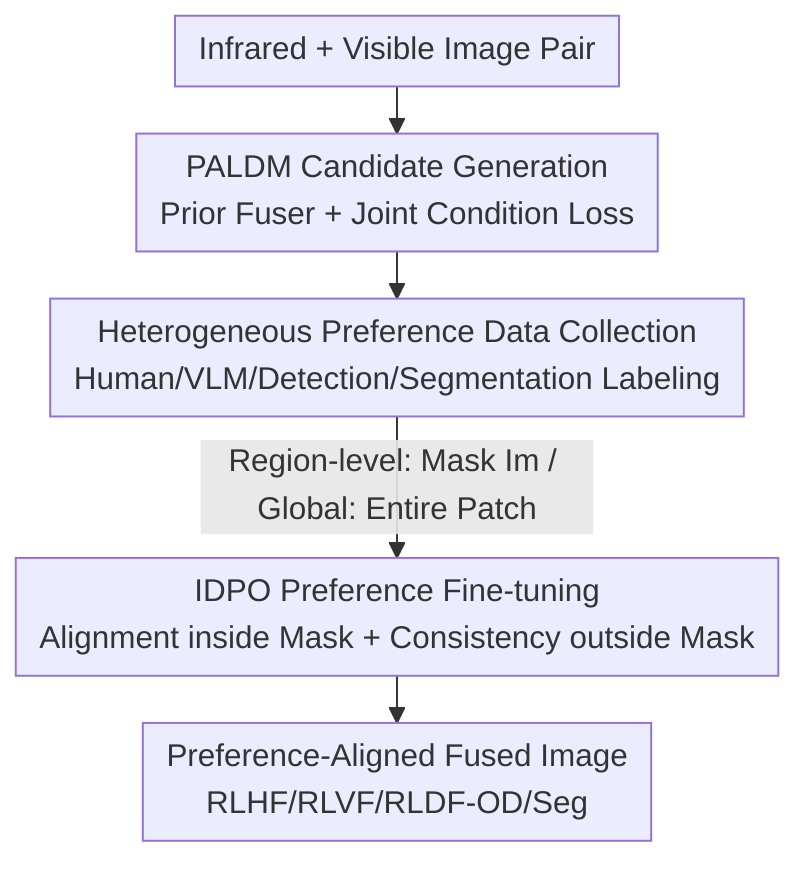

# Fusion in Your Way: Aligning Image Fusion with Heterogeneous Demands via Direct Preference Optimization

**Conference**: CVPR 2026  
**arXiv**: [2605.06049](https://arxiv.org/abs/2605.06049)  
**Code**: https://github.com/suweijian1996/DPOFusion (Available)  
**Area**: Diffusion Models / Multimodal Image Fusion / Preference Alignment  
**Keywords**: Infrared and Visible Image Fusion, Direct Preference Optimization, Latent Diffusion, Heterogeneous Demands, Region-level Alignment

## TL;DR
DPOFusion adapts Direct Preference Optimization (DPO) from LLMs for infrared-visible image fusion. It first utilizes an attribute-aligned latent diffusion model to generate diverse fusion candidates, then applies "instance-level DPO" to fine-tune preferences only within regions of interest while enforcing consistency with a reference model elsewhere. This single framework simultaneously satisfies four types of heterogeneous preferences: human, VLM, detection, and segmentation.

## Background & Motivation

**Background**: The goal of infrared-visible image fusion (IVIF) is to integrate thermal radiation from infrared images and texture details from visible images into a single result, serving both human perception and downstream tasks like detection or segmentation. Recent learning-based methods have achieved "preference-aware fusion" by aligning with perceptual quality, specific regions, or evaluation metrics.

**Limitations of Prior Work**: However, these methods mostly follow a "one model per demand" paradigm: training separate models for aesthetic quality or detection tasks. This requires independent networks and complex training strategies, leading to poor flexibility and scalability. In practice, requirements from different users or applications for the same scene are **heterogeneous** (e.g., overall image quality, natural appearance, or task-specific compatibility), and a unified framework to adapt to these diverse preferences is missing.

**Key Challenge**: IVIF is an **unsupervised** task lacking ground-truth fused images. The solution space is vast, and most candidates are neither clear enough nor semantically accurate. Furthermore, preference adaptation requires the model to cater to preferences only in local regions. However, modifying shared network parameters typically affects unrelated areas, causing global structural inconsistency and visual fragmentation. Thus, achieving **local adjustability** alongside **global consistency** is the core contradiction.

**Key Insight**: The authors observe that while user preferences vary, the **underlying standards for judging fusion quality are consistent**. This implies that one can first train a high-quality "prior fuser" to generate a candidate pool and then perform lightweight fine-tuning with small amounts of preference data, rather than training from scratch for every demand.

**Core Idea**: DPO is introduced to IVIF, directly fine-tuning diffusion policies using preference pairs (preferred vs. rejected) to bypass explicit reward models. Preference supervision is further **restricted within masked regions** (instance-level DPO), while consistency constraints lock regions outside the mask, achieving "fusion in your way."

## Method

### Overall Architecture
DPOFusion follows a three-stage pipeline: **candidate generation → preference data collection → preference fine-tuning**. First, a Prior Attribute-aligned Latent Diffusion Model (PALDM) is trained as a frozen base. It takes infrared/visible pairs and outputs a pool of high-quality fusion candidates with different attributes. Then, humans, VLMs, or detection/segmentation models assign preference labels to these candidates, providing "better/worse" pairs and a region-of-interest mask $I_m$. Finally, the Preference-Controllable Latent Diffusion Model (PCLDM) is fine-tuned via Instance-level DPO (IDPO), catering to preferences within the mask while maintaining consistency with the base model outside the mask. The entire mechanism operates within the VAE latent space.

### Key Designs

**1. PALDM Attribute-aligned Candidate Generation: Teaching multiple attributes of the same scene to the prior model via joint condition loss.**

The unsupervised fusion solution space is too large, and directly generated candidates vary in quality. The authors first train a prior fuser $\epsilon_{\text{lfm}}$ (Restormer architecture) that concatenates infrared/visible latent codes $z_{\text{ir}}, z_{\text{vis}}$ into $z_c$ to predict the fusion latent $z_{\text{fusion}}$. An intensity and gradient maximum preservation loss is used: $\mathcal{L}_{\text{fusion}} = \sigma_1 |\max(I_{\text{ir}}, I_{\text{vis}}) - I_{\text{fusion}}| + \sigma_2 |\max(\nabla I_{\text{ir}}, \nabla I_{\text{vis}}) - \nabla I_{\text{fusion}}|$ (where $\nabla$ is the Sobel operator).

The **joint condition loss** is the key innovation: To cover multiple "attributes," an attribute interpolation latent is constructed by sampling $k$ from $N$ levels. With interpolation coefficient $\alpha = k/(N-1)$, they define $z_{\text{fusion}}' = \frac{1}{2}(\alpha \cdot z_{\text{ir}} + (1-\alpha) \cdot z_{\text{vis}}) + \frac{1}{2} z_{\text{fusion}}$, which slides between "infrared-dominant" and "visible-dominant." The diffusion model $\epsilon_{\text{ref}}$ then learns to denoise the standard fusion latent under a general prompt $c_t$ and the interpolated latent under an attribute-specific prompt $c_t'$:

$$\mathcal{L}_c = \mathbb{E}_{z_c,k,t,\epsilon}\left[\mathcal{L}_{\text{denoise}}(z_{\text{fusion}}, c_t) + \lambda \mathcal{L}_{\text{denoise}}(z_{\text{fusion}}', c_t')\right]$$

This allows a single model to generate candidates with different attribute tendencies based on text prompts.

**2. IDPO Instance-level Direct Preference Optimization: Restricting preference supervision to masks to solve the "local adjustment vs. global consistency" conflict.**

Standard DPO is a global image-level alignment. For fusion, this can damage unrelated areas while adjusting specific regions. IDPO splits the loss into alignment inside the mask and strict consistency outside. Inside the mask, error differences $\mathcal{P}_w, \mathcal{P}_l$ relative to the reference model are defined (e.g., $\|(\epsilon - \epsilon_\theta)\odot z_m\|_2^2 - \|(\epsilon - \epsilon_{\text{ref}})\odot z_m\|_2^2$). Outside the mask, consistency terms $\mathcal{O}_w, \mathcal{O}_l = \|(\epsilon_\theta - \epsilon_{\text{ref}})\odot z_m^c\|_2^2$ anchor the trainable branch to the frozen reference model. The total loss is:

$$\mathcal{L}_{\text{IDPO}} = \mathbb{E}\left[\underbrace{-\log\sigma(-\beta_t \cdot (\mathcal{P}_w - \mathcal{P}_l))}_{\text{preference region}} + \mu \cdot \underbrace{(\mathcal{O}_w + \mathcal{O}_l)}_{\text{other regions}}\right]$$

This mechanism ensures precise adaptation within the region of interest without destroying global visual consistency.

**3. Dual-source Preference Collection + Zero-initialized Bypass: Supporting four types of heterogeneous preference signals.**

Heterogeneous demands provide signals in different forms: some include precise regions (human preference, segmentation), while others lack instance masks (VLM, detection). The authors design two modes: **Region-level collection** provides exact masks $I_m$ with preferred/rejected pairs. **Global-level collection** filters pairs and extracts local patches, treating the entire patch as the mask $I_m$. This unifies RLHF, RLVF, RLDF-OD, and RLDF-Seg into a common format $(z_c, I_0^w, I_0^l, I_m)$.

Architecturally, PCLDM $\epsilon_\theta$ inherits from PALDM. The frozen reference branch $\mathcal{F}_{\text{ref}}$ uses prompt $c_t$, while the trainable branch $\mathcal{F}_\theta$ uses $c_t'$. They are combined via a **zero-initialized $1\times1$ convolution** $\mathcal{Z}$: $y_p = \mathcal{F}_{\text{ref}}(x, c_t) + \mathcal{Z}(\mathcal{F}_\theta(x, c_t'))$. This prevents random noise gradients from the bypass during early fine-tuning, preserving original fusion capabilities.

### Loss & Training
- PALDM Prior Fuser: $\mathcal{L}_{\text{fusion}}$ with $\sigma_1=4, \sigma_2=10$.
- PALDM Diffusion: Joint condition loss $\mathcal{L}_c$ with $\lambda=2$, CLIP ViT-L/14 for text encoding.
- PCLDM Fine-tuning: $\mathcal{L}_{\text{IDPO}}$ for 20 epochs, learning rate $1\times10^{-5}$, batch size 8. $\beta_t=10$ (RLHF/RLVF/Seg), $\beta_t=500$ (Detection).
- Dataset: LLVIP cropped to $256\times256$; trained on 2×RTX 4090.

## Key Experimental Results

### Main Results (IVIF Quality, Table 1)

| Dataset | Metric | DPOFusion-RLHF | DPOFusion-RLVF | Prev. SOTA |
|--------|------|------|------|------|
| LLVIP | EN / SD | **7.725** / **61.911** | 7.554 / 53.299 | 7.441 / 51.270 |
| LLVIP | MUS / CNN | 57.295 / 0.655 | 57.280 / **0.660** | 56.683 / 0.649 |
| MSRS | EN / SD | 7.138 / 53.385 | **7.203** / **56.614** | 7.040 / 44.591 |
| MSRS | AG / MUS | 5.601 / 39.140 | **5.782** / **39.684** | 3.936 / 38.902 |
| RoadScene | EN / AG | 7.210 / 5.957 | **7.574** / **8.622** | 7.499 / 6.413 |

RLVF excels in EN/SD/AG (emphasizing texture), while RLHF performs better in MUSIQ/CNNIQA (closer to human perception). Both variants complement each other.

### Main Results (Downstream Tasks, Table 2)

| Task / Dataset | Metric | RLDF (Ours) | Gain |
|------|------|------|------|
| Segmentation / MSRS | mIoU | 55.96 | +0.5% over 2nd best |
| Detection / M3FD | mAP@.5:.95 | 43.40 | +4.2% mAP |

RLDF-OD utilizes YOLOv11 responses as feedback, achieving 43.40 mAP. This demonstrates that the fused images are effectively aligned toward directions beneficial for downstream models.

### Ablation Study (Table 3)

| Config | EN | SD | MUS | CNN | Description |
|------|----|----|-----|-----|------|
| PALDM w/ $\mathcal{L}_{\text{ST}}$ | 7.647 | 58.215 | 55.515 | 0.649 | Single-target loss |
| PALDM w/ $\mathcal{L}_{\text{ET}}$ | 7.470 | 53.612 | 53.848 | 0.608 | Multi-target without joint |
| PALDM w/ $\mathcal{L}_c$ | **7.680** | **60.806** | **56.154** | **0.659** | Joint condition loss (Full) |
| PCLDM w/ $\mathcal{L}_{\text{DPO}}$ | 7.600 | 57.089 | 53.850 | 0.652 | Standard global DPO |
| PCLDM w/ $\mathcal{L}_{\text{contrast}}$ | 7.352 | 51.077 | 55.303 | **0.694** | Contrastive loss |
| PCLDM w/ $\mathcal{L}_{\text{IDPO}}$ | **7.725** | **61.911** | **57.295** | 0.655 | Instance-level DPO (Full) |

### Key Findings
- **Joint condition loss is essential for candidate quality**: $\mathcal{L}_c$ outperforms variants across metrics like SD, proving that learning standard and interpolated attributes simultaneously creates a superior candidate pool.
- **IDPO outperforms standard DPO**: While global DPO yields minimal gains for segmentation (55.20 vs. 55.21), IDPO significantly improves mIoU to 55.96 by locking regions outside the mask.
- **RLHF metrics are relatively lower on RoadScene**: The authors explain that in complex scenes, human judges prioritize overall visual coordination over local details.
- **Alignment accuracy**: CLIP-I and DINO similarity confirm that IDPO outputs are closest to the ground-truth preferred images.

## Highlights & Insights
- **Clean translation of LLM alignment to unsupervised fusion**: By identifying that fusion lacks GT and is essentially a preference problem, the authors elegantly migrate DPO to vision, eliminating explicit reward models.
- **Practicality of mask-based partitioning**: The "alignment inside + consistency outside" paradigm is highly versatile and applicable to any controllable generation task where local edits must preserve global structure.
- **Diversity via attribute interpolation**: Using an interpolation axis $\alpha$ allows a single model to cover a spectrum of styles, avoiding the need for separate training for each attribute.
- **Stability via zero-init bypass**: Leveraging ControlNet-like structures protects pre-trained capabilities and enables "one base + multiple lightweight heads."

## Limitations & Future Work
- **Per-preference fine-tuning**: Although the base is shared, separate PCLDM weights are needed for RLHF, RLVF, etc. It is not yet a truly "zero-shot preference switching" model.
- **Hyperparameter sensitivity**: $\beta_t$ varies drastically (10 vs. 500) between tasks, requiring careful tuning for new domains.
- **Moderate downstream gains**: While visual metrics improve significantly, the mIoU gain (+0.5%) for segmentation is relatively modest.
- **Dependency on annotation pipelines**: High-quality alignment relies on the cost and consistency of human labeling, VLM scoring, and model feedback.
- **Subjective verification**: Most results rely on no-reference quality metrics; large-scale human subjective verification is still needed.

## Related Work & Insights
- **Comparison to Diffusion-DPO/PatchDPO**: Unlike those methods which focus on global text-to-image preference, this work restricts DPO to arbitrary mask regions with explicit consistency constraints.
- **Comparison to Text-IF/EMMA**: These often provide a single direction of control, whereas this framework covers four types of heterogeneous demands through a unified preference mechanism.

## Rating
- Novelty: ⭐⭐⭐⭐ Systematically introduced DPO to IVIF; IDPO partitioning is original.
- Experimental Thoroughness: ⭐⭐⭐⭐ Covers multiple preferences and datasets with detailed ablations.
- Writing Quality: ⭐⭐⭐⭐ Clear structure and derivation.
- Value: ⭐⭐⭐⭐ Provides a unified framework for heterogeneous demands and a reusable IDPO structure.

<!-- RELATED:START -->

## Related Papers

- [\[CVPR 2026\] Compositional Text-to-Image Generation Via Region-aware Bimodal Direct Preference Optimization](compositional_text-to-image_generation_via_region-aware_bimodal_direct_preferenc.md)
- [\[CVPR 2026\] MagicFuse: Single Image Fusion for Visual and Semantic Reinforcement](magicfuse_single_image_fusion_for_visual_and_semantic_reinforcement.md)
- [\[CVPR 2026\] Towards Fine-Grained Attribution: Instance-Aware Preference Optimization for Aligning Diffusion Models](towards_fine-grained_attribution_instance-aware_preference_optimization_for_alig.md)
- [\[CVPR 2026\] NEAF: Natural Image Editing with Attention Fusion for Generalizable Test-time Optimization in Text-Guided Image Editing](neaf_natural_image_editing_with_attention_fusion_for_generalizable_test-time_opt.md)
- [\[CVPR 2026\] GlyphPrinter: Region-Grouped Direct Preference Optimization for Glyph-Accurate Visual Text Rendering](glyphprinter_region-grouped_direct_preference_optimization_for_glyph-accurate_vi.md)

<!-- RELATED:END -->
