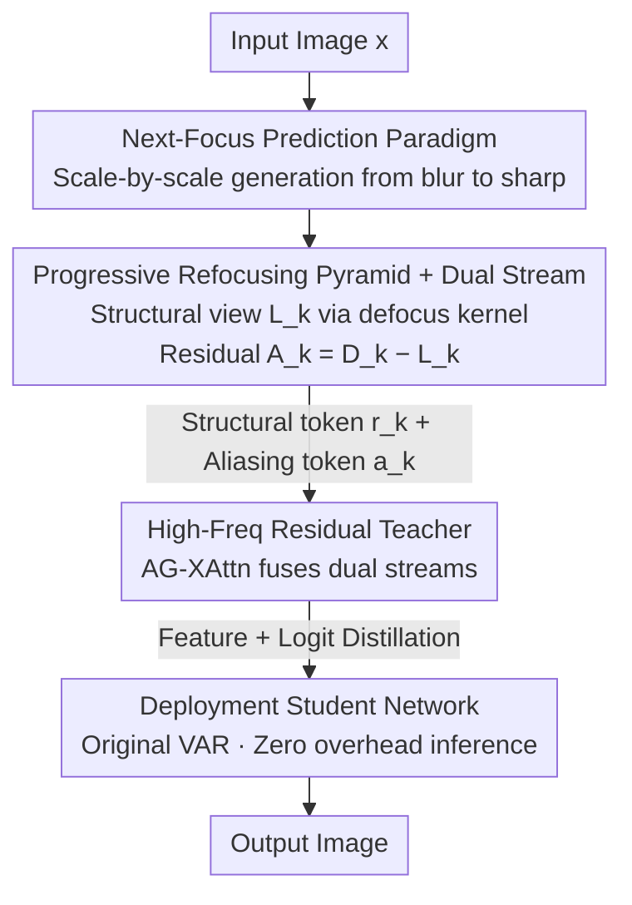

# FVAR: Next-Focus Prediction for Visual Autoregressive Modeling

**Conference**: CVPR 2026  
**Paper**: [CVF Open Access](https://openaccess.thecvf.com/content/CVPR2026/html/Li_FVAR_Next-Focus_Prediction_for_Visual_Autoregressive_Modeling_CVPR_2026_paper.html)  
**Code**: Not released  
**Area**: Visual Autoregressive Generation  
**Keywords**: Visual Autoregressive, Anti-aliasing, Defocus Kernel, Multi-scale Pyramid, Knowledge Distillation  

## TL;DR
FVAR reformulates the "next-scale prediction" of Visual Autoregressive (VAR) modeling into "next-focus prediction." By constructing a pyramid from blur to clarity using physically consistent defocus kernels, it eliminates aliasing (jaggies/Moiré patterns) caused by uniform downsampling at the source. Additionally, a high-frequency residual teacher, present only during training, distills aliasing information into the original VAR student network, achieving zero extra inference overhead while outperforming VAR / M-VAR on ImageNet across all FID metrics.

## Background & Motivation
**Background**: The VAR series reformulates image autoregression as "next-scale prediction"—first encoding an image into a multi-scale token pyramid (coarse to fine resolution), then training a Transformer to predict scale by scale. This paradigm offers advantages in scalability and speed over diffusion models and has become a mainstream backbone for discrete token autoregressive generation.

**Limitations of Prior Work**: When building the pyramid, almost all VAR variants use **uniform downsampling** to generate low-resolution views. Without anti-aliasing pre-filtering, downsampling "folds" high-frequency content exceeding the Nyquist frequency back into the baseband, directly producing aliasing artifacts such as jagged edges and Moiré patterns. These artifacts are particularly prominent in regular textures and small fonts.

**Key Challenge**: Aliasing is "burned into" the training data during the pyramid construction stage. Consequently, the autoregressive Transformer is forced to perform two tasks simultaneously: de-aliasing (repairing artificially introduced artifacts) and generating fine details. These conflicting objectives lead to unstable training and ultimately sacrifice detail fidelity and text readability.

**Key Insight**: The authors shift perspectives from "digital signal processing" to "optical imaging physics." Real camera imaging does not obtain coarse versions by reducing resolution; instead, it transitions from blurry to sharp through a **focusing** process where optical blur monotonically decreases. Blurry views are naturally band-limited and free of aliasing.

**Core Idea**: Replace "next-scale prediction" with "next-focus prediction." Instead of predicting a lossy, downsampled coarser scale, the model predicts a **refocused state with less blur**. A naturally alias-free pyramid is built using defocus kernels with monotonically shrinking radii. Meanwhile, high-frequency residuals filtered out from downsampled views are modeled separately and distilled back into the standard VAR via a training-time teacher.

## Method

### Overall Architecture
FVAR addresses the root problem where "aliasing introduced during pyramid construction pollutes autoregressive training." The overall process is as follows: given an image, apply a set of defocus kernels with decreasing radii to obtain a **focus sequence** from the blurriest ($\rho_1$) to the sharpest ($\rho_K=0$). This forms the alias-free structural view pyramid. Simultaneously, for each scale, the structural view is subtracted from the traditional downsampled view to obtain a **high-frequency residual**. The structural views and residuals are quantized into "structural tokens" $r_k$ and "aliasing tokens" $a_k$ using dual codebooks. During training, two networks are run: the **Teacher Network** uses Alias-Gate Cross-Attention to process both tokens, while the **Student Network (deployment network)** only processes structural tokens, maintaining the original VAR architecture. The teacher transfers high-frequency knowledge to the student via feature alignment and logit distillation. At inference, only the student network is used, ensuring zero extra overhead and behavior identical to standard VAR.

### Key Designs

**1. Next-Focus Prediction Paradigm: Replacing "Downsampling" with "Deblurring"**

The root of aliasing in VAR lies in using lossy resolution reduction to create coarse scales. FVAR replaces this step by modeling an optical focusing process where blur monotonically decreases instead of resolution decreasing. This is formalized by applying a set of defocus kernels with decreasing radii to the original image:

$$\mathcal{F}: x \to \{F_{\rho_1}(x), F_{\rho_2}(x), \dots, F_{\rho_K}(x)\},\quad F_{\rho_k}(x) = (k_{\rho_k} \star x),\ \ \rho_1 > \rho_2 > \cdots > \rho_K = 0$$

This definition provides three direct benefits: each focus state $F_{\rho_k}(x)$ is **band-limited** by the PSF's frequency response, preventing aliasing at the source (Spectral Preservation); these states form a continuous manifold in the blur-kernel space, allowing smooth interpolation (Continuity); and information increases monotonically as $\rho_k \to 0$ (Information Monotonicity), aligning with the autoregressive direction of incremental information addition. This is a proactive prevention strategy compared to VAR's reactive approach of "folding high-frequencies first, then fixing them with the Transformer."

**2. Progressive Refocusing Pyramid + Dual Tokenization: Creating Alias-free Views and Isolating High-frequencies**

The defocus PSF is approximated as a normalized disk kernel $k_\rho$ representing a circular aperture. Its radius decreases according to a cosine schedule to ensure a smooth transition:

$$\rho_k = \rho_{\max} \cdot \frac{1 - \cos\!\left(\pi \frac{k-1}{K-1}\right)}{2},\quad k = 1, 2, \dots, K$$

However, pure optical low-pass filtering removes useful high-frequency information. Thus, the authors use a **dual-path** strategy: the physical focus view $L_k = (k_{\rho_k} \star x)\!\downarrow_{s_k} + \beta_k\varepsilon$ (where $\beta_k\varepsilon$ is a noise term ensuring full-rank covariance and training stability), the traditional downsampled view $D_k = x\!\downarrow_{s_k}$, and the **high-frequency residual** $A_k = D_k - L_k$. The paper justifies this decomposition in the frequency domain: under ideal low-pass conditions, $\hat L_k(\omega) = X(\omega)$ (no aliasing in the passband), while the residual $\hat A_k$ aggregates the folded supra-Nyquist high frequencies (encoding edge orientation, texture, and fine structures). $L_k$ is quantized via structural codebook $\mathcal{C}_L$ (size 8192) and $A_k$ via a smaller aliasing codebook $\mathcal{C}_A$ (size 512, reflecting high-frequency sparsity) into $r_k = Q_L(L_k)$ and $a_k = Q_A(A_k)$. This step produces both "clean structure" and "high-frequency evidence" tokens, paving the way for distillation.

**3. High-Freq Residual Teacher + Alias-Gate Cross-Attention: Learning High-frequencies during Training, Preserving VAR for Deployment**

While valuable, directly feeding high-frequency residuals into the deployment network would break VAR's architectural compatibility. The authors decouple "aliasing-aware training" from "inference." The **Teacher Network** introduces Alias-Gate Cross-Attention (AG-XAttn), applied only to the final $M\in\{1,2\}$ autoregressive scales to save computation. AG-XAttn performs window self-attention on structural tokens, then uses structural tokens as Query and aliasing tokens as Key/Value to selectively fuse high-frequency information:

$$Z = \text{WSA}(E(r_k)) + \text{Attn}\big(Q = X_L W_Q,\ K = E_a(a_k)W_K,\ V = E_a(a_k)W_V\big)$$

The authors interpret this through a Wiener filtering lens: after local linearization, this step approximates a data-dependent gated residual $Z \approx X_L + \alpha \odot \tilde A_k$, where the optimal gain $\alpha \in [0,1]^d$ corresponds to the classic Wiener filter $\alpha^*(\omega) = S_{xx}(\omega)/(S_{xx}(\omega)+S_{nn}(\omega))$. Intuitively, attention **amplifies reliable, edge-aligned frequencies while suppressing aliasing patterns prone to Moiré.** Note: This Wiener equivalence is an approximation; refer to the original text for rigor. Aliasing tokens are excluded from the autoregressive sequence; the student network omits AG-XAttn and processes only structural tokens with standard self-attention, remaining identical to standard VAR. Online distillation transfers teacher capabilities to the student, after which the teacher is discarded for zero-overhead inference.

### Loss & Training
The student network aligns with the teacher through multi-level objectives. The total loss for scale $k$ is:

$$\mathcal{L}_{\text{total}} = \mathcal{L}^{\text{stu}}_{\text{AR}}(r_{k-1}, p_{\text{stu}}) + \lambda_{\text{feat}}\sum_\ell \big\| F^{(\ell)}_{\text{stu}} - \text{sg}(F^{(\ell)}_{\text{tea}}) \big\|_2^2 + \lambda_{\text{logit}}\cdot \text{KL}(p_{\text{tea}} \| p_{\text{stu}})$$

The first term is the standard autoregressive loss, the second is feature alignment on the last 12 encoder blocks ($\text{sg}$ denotes stop-gradient), and the third is KL divergence for output distribution alignment. Implementation details: $K=4$ scales, $\rho_{\max}=12$ pixels, cosine schedule; $\lambda_{\text{feat}}=1.0$, $\lambda_{\text{logit}}=0.5$; noise $\beta_k$ increases linearly from $1\times10^{-3}$ to $1\times10^{-2}$; two-stage training—first training dual VQ tokenizers for 100K steps, then end-to-end for 400K steps (lr $1\times10^{-4}$, batch 256, 8×A100). The teacher is discarded after training. AG-XAttn adds 6–15% training FLOPs, while inference remains identical to VAR.

## Key Experimental Results

### Main Results
On ImageNet 256×256 class-conditional generation, FVAR consistently outperforms VAR and M-VAR across model sizes with comparable inference speed (Time):

| Model | Params | FID↓ | IS↑ | Pre↑ | Rec↑ | Time |
|------|--------|------|-----|------|------|------|
| VAR-d12 | 132M | 5.81 | 201.3 | 0.81 | 0.45 | 1.0 |
| M-VAR-d12 | 198M | 4.19 | 234.8 | 0.83 | 0.48 | 1.0 |
| **FVAR-d12** | 132M | **3.95** | 238.2 | 0.84 | 0.49 | 1.0 |
| VAR-d16 | 310M | 3.55 | 280.4 | 0.84 | 0.51 | 1.0 |
| M-VAR-d16 | 464M | 3.07 | 294.6 | 0.84 | 0.53 | 1.0 |
| **FVAR-d16** | 310M | **2.89** | 298.1 | 0.85 | 0.54 | 1.0 |
| VAR-d24 | 1.0B | 2.33 | 312.9 | 0.82 | 0.59 | 2.5 |
| M-VAR-d24 | 1.5B | 1.93 | 320.7 | 0.83 | 0.59 | 3.0 |
| **FVAR-d24** | 1.0B | **1.75** | 325.8 | 0.84 | 0.61 | 2.5 |

Notably, FVAR outperforms VAR at the **same parameter count**, and FVAR-d24 (1.0B) achieves a better FID (1.75) than the larger M-VAR-d24 (1.5B, 1.93). Benefits persist at higher resolutions:

| Model | 512² FID↓ | 512² IS↑ | 1024² FID↓ | 1024² IS↑ |
|------|-----------|----------|------------|-----------|
| VAR-d36 | 2.63 | 303.2 | – | – |
| **FVAR-d36** | **2.28** | 315.6 | – | – |
| VAR-d16 | – | – | 8.25 | 298.3 |
| **FVAR-d16** | – | – | **6.85** | 315.2 |

### Ablation Study
Ablating components on FVAR-d16 (Comparing ImageNet 256² and 1024²):

| Config | 256² FID↓ | 256² IS↑ | 1024² FID↓ | 1024² IS↑ |
|------|-----------|----------|------------|-----------|
| VAR-d16 (Baseline) | 3.55 | 280.4 | 8.25 | 298.3 |
| **FVAR-d16 (Full)** | **2.89** | **298.1** | **6.85** | **315.2** |
| w/o Progressive Refocusing | 3.51 | 282.1 | 8.15 | 299.0 |
| w/ Gaussian blur (PSF Alt.) | 3.32 | 286.7 | 7.50 | 305.2 |
| w/o High-Freq Teacher | 3.06 | 294.8 | 7.20 | 308.5 |
| w/o Dual tokenizers | 3.14 | 292.1 | 7.40 | 306.8 |

### Key Findings
- **Progressive Refocusing gains strongly depend on resolution**: At 256², removing it barely affects FID (3.51 vs 2.89, close to baseline), but at 1024², performance drops back to the baseline (8.15 vs 6.85). The authors explain that FID primarily captures global statistics and is less sensitive to high-frequency aliasing at low resolutions. At high resolutions, aliasing is severe and harder to fix post-hoc, making this component critical.
- **Physically consistent PSF is superior to naive Gaussian blur**: Replacing PSF with Gaussian blur improves over standard downsampling (7.50 vs 8.25 at 1024²) but is significantly worse than physical defocus kernels (6.85), suggesting that "optical realism" itself is beneficial.
- **High-frequency Teacher contributes more at high resolutions**: Removing the teacher increases FID to 3.06 at 256² and 7.20 at 1024², confirming that the teacher-student framework effectively distills high-frequency details into the deployment network.

## Highlights & Insights
- **"Free Lunch" Paradigm Shift**: All core innovations (next-focus, dual high-freq) are confined to training-time pyramid construction and the teacher network. The deployment network remains standard VAR with zero inference overhead—making it highly practical for existing frameworks.
- **Addressing Roots via Signal Processing**: While others treat aliasing as a "decoder fix-up problem," FVAR argues it is "introduced during pyramid folding" and uses band-limited defocus kernels to prevent it. This "proactive prevention during data construction" is transferable to any task requiring multi-scale downsampling.
- **Modeling without Losing High-frequencies**: Using a tiny codebook (512 vs 8192) to capture sparse high-frequency residuals and fusing them via gated cross-attention is a clever compromise between achieving alias-free structures and maintaining sharp details.

## Limitations & Future Work
- **FID Sensitivity Issues**: The authors admit that Progressive Refocusing barely moves FID at 256²; its value is mainly seen via visual inspection and at higher resolutions, meaning its advantages might be underestimated in common low-resolution benchmarks.
- **Simplified Physics Model**: Disk PSF and Wiener equivalence are idealized approximations; real camera defocus is more complex, and the noise term $\beta_k\varepsilon$ schedule is empirical.
- **Limited to ImageNet Class-Conditioned Generation**: While large-scale data is mentioned, the main results focus on ImageNet. Effectiveness in complex T2I scenarios or the transferability of hyperparameters like $K=4, \rho_{\max}=12$ remains to be fully explored.
- **Increased Training Cost**: Dual tokenizers and the teacher network make the training pipeline heavier (extra 6–15% FLOPs + two-stage training), essentially shifting the cost from inference to training.

## Related Work & Insights
- **vs VAR**: VAR uses uniform downsampling for next-scale prediction, introducing aliasing in the pyramid. FVAR switches to next-focus prediction with defocus kernels to eliminate aliasing at the source, outperforming VAR at the same parameter count while maintaining inference compatibility.
- **vs M-VAR**: M-VAR focuses on **efficiency** by decoupling intra/inter-scale dependencies using linear state-space modules. FVAR focuses on **pyramid construction quality** (anti-aliasing). The two are orthogonal and complementary; FVAR even outperforms the larger M-VAR with fewer parameters.
- **vs Traditional Anti-aliasing** (e.g., Blur-Pool, Wavelet demoiré): These methods typically target image restoration or classification by **fixing existing images post-hoc**. FVAR builds anti-aliasing directly into the generation pipeline's pyramid construction as a proactive measure.

## Rating
- Novelty: ⭐⭐⭐⭐⭐ Bringing optical focus physics into VAR and replacing "next-scale" with "next-focus" is a clean and explanatory paradigm shift.
- Experimental Thoroughness: ⭐⭐⭐⭐ Multi-scale and multi-resolution ablations are comprehensive, though verification is primarily centered on ImageNet.
- Writing Quality: ⭐⭐⭐⭐ Motivation and frequency domain analyses are clear, though some derivations are idealized and require careful reading of the original text.
- Value: ⭐⭐⭐⭐⭐ Zero inference overhead and full compatibility with existing VAR make this highly applicable to all multi-scale autoregressive generation tasks.

<!-- RELATED:START -->

## Related Papers

- [\[CVPR 2026\] Markovian Scale Prediction: A New Era of Visual Autoregressive Generation](markovian_scale_prediction_a_new_era_of_visual_autoregressive_generation.md)
- [\[CVPR 2026\] Depth Adaptive Efficient Visual Autoregressive Modeling](depthvar_depth_adaptive_var.md)
- [\[CVPR 2026\] SparVAR: Exploring Sparsity in Visual Autoregressive Modeling for Training-Free Acceleration](sparvar_exploring_sparsity_in_visual_autoregressive_modeling_for_training-free_a.md)
- [\[ICML 2026\] Visual Implicit Autoregressive Modeling](../../ICML2026/image_generation/visual_implicit_autoregressive_modeling.md)
- [\[ICLR 2026\] Visual Autoregressive Modeling for Instruction-Guided Image Editing](../../ICLR2026/image_generation/visual_autoregressive_modeling_for_instruction-guided_image_editing.md)

<!-- RELATED:END -->
