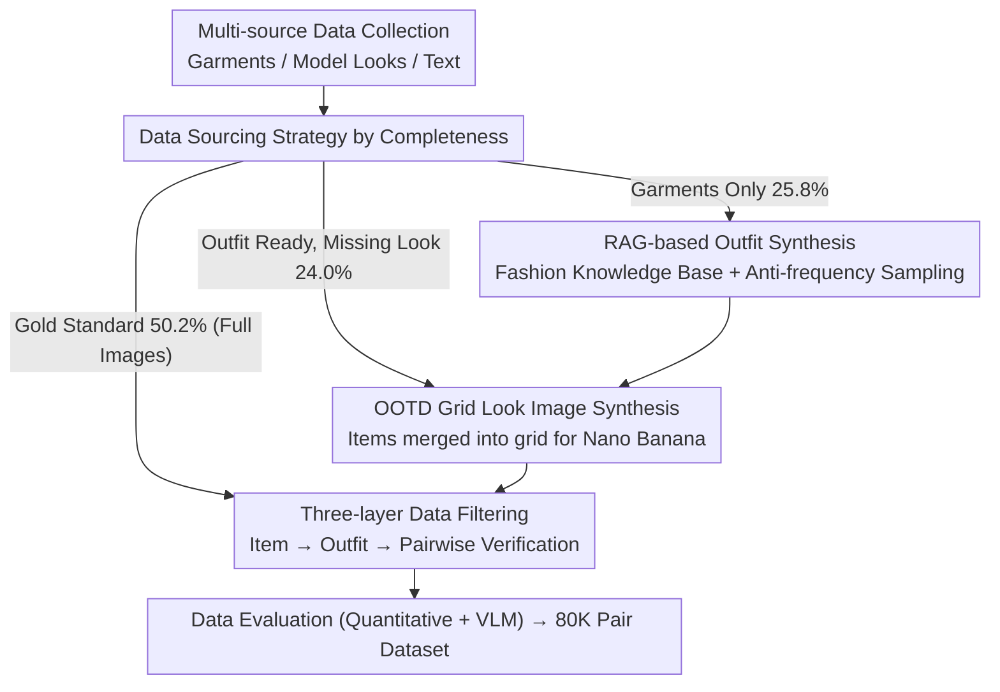

# Garments2Look: A Multi-Reference Dataset for High-Fidelity Outfit-Level Virtual Try-On with Clothing and Accessories

**Conference**: CVPR 2026  
**arXiv**: [2603.14153](https://arxiv.org/abs/2603.14153)  
**Code**: [GitHub](https://github.com/ArtmeScienceLab/Garments2Look)  
**Area**: Virtual Try-On / Dataset  
**Keywords**: Virtual Try-On, Multi-reference Images, Outfit, Dataset Construction, Image Generation

## TL;DR

Ours proposes Garments2Look, the first large-scale multimodal outfit-level virtual try-on dataset (80K pairs, 40 categories, 300+ subcategories). Each group contains 3-12 reference garment images, a model outfit image, and detailed text annotations, revealing significant deficiencies of existing methods in multi-layer styling and accessory consistency.

## Background & Motivation

Virtual Try-On (VTON) has made significant progress in single garment visualization, but real-world fashion scenarios go far beyond this—users need previews of a complete **outfit**, involving multiple garments, accessories, fine-grained categories, layering sequences, and diverse styling.

**Limitations of Prior Work in dataset structure**:
- VITON-HD and DressCode only support single-item try-on with limited categories (1-3 types).
- M&M VTO and BootComp support multi-reference inputs but lack category diversity.
- No existing dataset provides annotations for layering order, styling techniques, and multi-piece accessories simultaneously.

**Key Challenges for outfit-level VTON**:
- Complex layering and occlusion relationships between garments (e.g., a cardigan can be worn as an outer layer or an inner layer).
- Diverse styling techniques (normal wear, draped over shoulders, tied at the waist, rolled sleeves, etc.).
- The number of reference items varies from 3 to 12, putting extreme demands on the model's multi-reference consistency.

## Method

### Overall Architecture

The goal of this paper is to address the lack of training data for "outfit-level" virtual try-on—prior datasets only cover single garments, and none provide annotations for layering order, styling techniques, and multiple accessories. The authors build the data using a four-stage pipeline: first, collecting garment images and model outfit images from multiple sources (Data Collection); then, for samples lacking outfit images, completing them with outfit synthesis and look image synthesis (Data Synthesis); followed by three-layer rule-based and manual filtering (Data Filtering); and finally, conducting quantitative and VLM evaluations (Data Evaluation). The core idea is to combine real paired data (Gold Standard) with synthetic data, ensuring quality through strict filtering and manual review.

### Key Designs

**1. Data Sourcing Strategy by Completeness: Balancing Real Pairs and Synthetic Data**

Collected data varies in completeness—full re-synthesis would lose high-fidelity information from real pairs, while relying solely on real data lacks scale. The authors divide data into three tiers: Gold Standard (50.2%) consisting of complete "garment + model look" pairs; cases with outfit plans but no look images (24.0%) requiring look image synthesis; and garment-only data (25.8%) requiring both outfit plan and look image synthesis. Sources cover outfit compatibility datasets (PolyVore), open-source fashion datasets, compliant web images, and synthetic data, maintaining a high ratio of real samples while scaling to 80K pairs.

**2. RAG-based Outfit Synthesis: Using Fashion Knowledge Bases for Constrained Generation and Anti-frequency Sampling**

Pure LLM-based random generation of outfit lists often produces illogical results and over-recommends popular items, leading to data skew. The outfit synthesis pipeline acts as a heuristic RAG: first, a knowledge base of 65 fashion styles (35 female / 30 male) is constructed, generated by LLMs and reviewed by fashion experts. During runtime, a style is selected, and the LLM generates a persona and scenario (including occasion, color palette, theme, category). Under style constraints, it produces 3–9 item outfit lists ordered from "top-to-bottom, inner-to-outer, garments-to-accessories." Finally, it retrieves top-128 candidates per item and uses anti-frequency weighted sampling to ensure niche items are represented.

**3. OOTD Grid Look Image Synthesis: Merging Dispersed Items into a Single Input for Generative Models**

If each item in an outfit is treated as a separate dispersed input for a generative model, the styling relationships between items are lost, and mutual consistency suffers. The authors arrange all items in the outfit list into a single OOTD grid image as a unified input for Nano Banana (Gemini-2.5-Flash-Image), allowing the reference image to implicitly carry the styling context. Simultaneously, prompt engineering is used to inject layering order and styling techniques (e.g., "tuck top into pants," "roll up sleeves," covering 5 categories), ensuring the synthesized look image represents more than just simple layering.

**4. Three-layer Data Filtering: Step-by-step Quality Control from Items to Pairs**

Synthetic data quality is uneven, and single-layer validation cannot simultaneously cover category correctness, outfit rationality, and image quality. Filtering is thus three-layered: the Item Layer uses a standard classification system of 40 main categories and 300 subcategories; the Outfit Layer uses rule-based rationality verification based on professional fashion knowledge (e.g., avoiding wearing two dresses simultaneously); the Pair Layer is auto-screened by Gemini-2.5-Flash and pose-classified by DWPose, followed by manual audit by 10 fashion students and 3 experts. The strictness is reflected in the fact that only ~40% of synthesized look images passed the audit.

### Loss & Training

This paper is a dataset contribution and does not involve specific model training. The evaluation protocol includes two categories of metrics: classical VTON metrics (FID, KID, SSIM, LPIPS) and VLM evaluation metrics (Gemini-3-Flash, evaluating garment consistency, layering accuracy, and styling accuracy).

## Key Experimental Results

### Main Results

**Comparison of methods on the Garments2Look test set**:

| Method Type | Model | FID↓ | SSIM↑ | Garment↑ | Layering↑ | Styling↑ |
|---------|------|------|-------|----------|-----------|----------|
| VTON | FastFit | 3.59 | 0.855 | 0.624 | 0.131 | 0.340 |
| VTON | OmniTry | 6.56 | 0.724 | 0.461 | 0.167 | 0.261 |
| Editing | GPT-4o (2 Ref) | 2.15 | 0.758 | 0.892 | 0.849 | 0.694 |
| Editing | NB (2 Ref) | **1.04** | **0.858** | 0.925 | 0.885 | 0.739 |
| Editing | NBP (N Ref) | 1.32 | 0.817 | **0.984** | **0.936** | **0.736** |

### Ablation Study

| Configuration | Key Metric | Description |
|------|---------|------|
| N Ref (Multiple Items) vs. 2 Ref (OOTD grid) | 2 Ref usually better | Grid images maintain better outfit context |
| Reference count ≤4 vs. >4 | Consistency drops when >4 | VTON models are particularly affected |
| VTON models vs. General Editing models | Editing models outperform VTON | VTON lacks flexible multi-item processing |
| Synthetic vs. Real data quality | Expert rating 4.35-4.74/5 | Synthetic data quality is controlled via strict filtering |

### Key Findings

- **VTON models fail comprehensively on outfit-level tasks**: Layering accuracy is only 13-17%, and styling accuracy is 26-34%.
- General editing models (GPT-4o, Nano Banana) far outperform specialized VTON models on outfit-level VTON tasks.
- As the number of reference items increases, consistency drops significantly for all methods—shape distortion, texture alteration, color shifts, and item merging are primary failure modes.
- OOTD grid inputs (2 Ref strategy) are generally superior to multiple dispersed inputs (N Ref) because the holistic reference carries implicit outfit relationships.
- Even state-of-the-art editing models cannot precisely control non-standard styling techniques (e.g., half-buttoned jackets, untucked middle layers).

## Highlights & Insights

- **The first true outfit-level VTON dataset**: Supporting 40 main categories, 300+ subcategories, with layering and styling annotations, filling a critical gap.
- The synthesis pipeline's design—**Fashion Knowledge Base + RAG-style Retrieval + Anti-frequency Sampling**—is ingenious, ensuring diversity while avoiding popularity bias.
- Experiments are deep and targeted: Four progressive questions (item limits, consistency, overall effect, value of structured annotations) systematically reveal bottlenecks.
- In-depth analysis of commercial editing models (Nano Banana vs. GPT-4o vs. Seedream) provides valuable industrial perspectives.

## Limitations & Future Work

- Synthesis of look images relies on Nano Banana, whose pose control and inpainting capabilities are limited, leading to unavoidable synthesis bias.
- Only about 40% of synthesized images passed the audit, indicating relatively low data construction efficiency.
- Layering and styling annotations depend on VLM auto-generation, which has restricted precision.
- Missing video try-on dimensions (dynamic outfit effects are more aligned with actual needs).
- Evaluation metrics still rely on VLM review; specialized automated metrics for outfit-level VTON are yet to be developed.

## Related Work & Insights

- **VITON-HD/DressCode** laid the foundation for high-resolution VTON datasets but are limited to single items.
- **BootComp** first proposed a try-on synthesis pipeline and data filtering strategy; ours significantly extends this.
- The anti-frequency sampling mechanism can be generalized to other retrieval-augmented generation scenarios where data bias must be prevented.
- The finding that commercial editing models outperform specialized VTON models suggests that the VTON field may need to shift from "specialized pipelines" to a new paradigm of "general editing + domain constraints."

## Rating

- **Novelty**: ⭐⭐⭐⭐ First large-scale outfit-level VTON dataset; task definitions and annotation systems are entirely new.
- **Experimental Thoroughness**: ⭐⭐⭐⭐ 7 model baselines (VTON + General Editing), 4 progressive analytical questions, quantitative + qualitative + manual evaluation.
- **Writing Quality**: ⭐⭐⭐⭐ Detailed description of data construction; logical, problem-driven experimental analysis.
- **Value**: ⭐⭐⭐⭐⭐ Open-sourcing data and code, filling an important gap with a lasting impact on the VTON direction.

<!-- RELATED:START -->

## Related Papers

- [\[CVPR 2026\] PROMO: Promptable Outfitting for Efficient High-Fidelity Virtual Try-On](promo_promptable_virtual_tryon_efficient.md)
- [\[CVPR 2026\] High-Fidelity Virtual Try-On beyond Paired Data Scarcity via Diffusion-based Cycle-Consistent Learning](high-fidelity_virtual_try-on_beyond_paired_data_scarcity_via_diffusion-based_cyc.md)
- [\[CVPR 2026\] PG-VTON: Single-Pass Training-Free Virtual Try-On via Patch-Guided Reference Alignment](pg-vton_single-pass_training-free_virtual_try-on_via_patch-guided_reference_alig.md)
- [\[CVPR 2025\] Shining Yourself: High-Fidelity Ornaments Virtual Try-on with Diffusion Model](../../CVPR2025/image_generation/shining_yourself_high-fidelity_ornaments_virtual_try-on_with_diffusion_model.md)
- [\[CVPR 2026\] HiFi-Inpaint: Towards High-Fidelity Reference-Based Inpainting for Generating Detail-Preserving Human-Product Images](hifi-inpaint_towards_high-fidelity_reference-based_inpainting_for_generating_det.md)

<!-- RELATED:END -->
