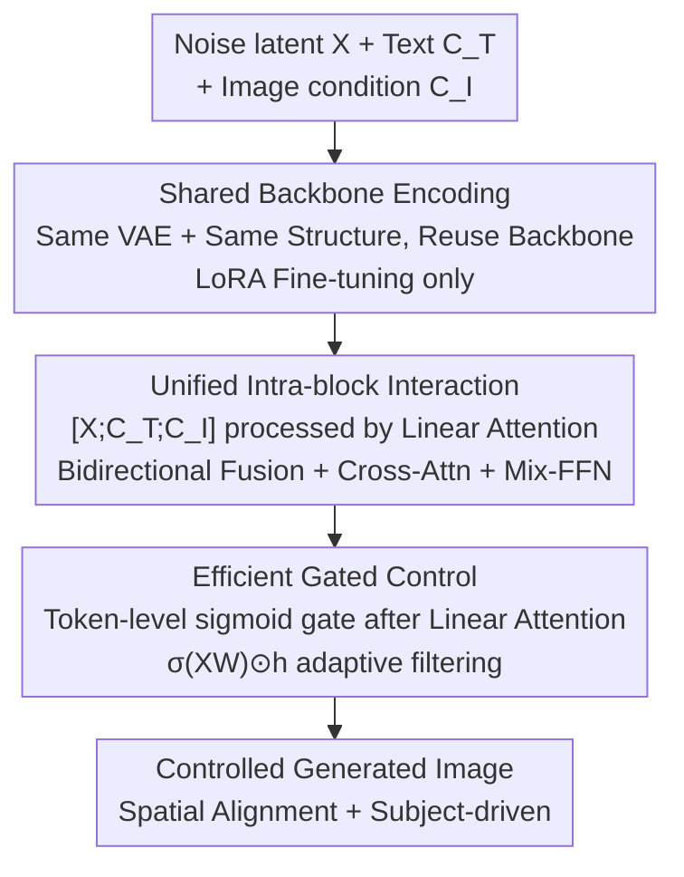

# Gated Condition Injection without Multimodal Attention: Towards Controllable Linear-Attention Transformers

**Conference**: CVPR 2026  
**Paper**: [CVF Open Access](https://openaccess.thecvf.com/content/CVPR2026/html/Liu_Gated_Condition_Injection_without_Multimodal_Attention_Towards_Controllable_Linear_Attention_Transformers_CVPR_2026_paper.html)  
**Code**: None  
**Area**: Diffusion Models / Controllable Image Generation  
**Keywords**: Controllable Generation, Linear Attention, Gating Mechanism, On-device Deployment, SANA  

## TL;DR
Aiming at the issues where ControlNet fails to adapt to non-aligned conditions and OminiControl converges extremely slowly on spatially aligned tasks when applied to linear-attention diffusion models (e.g., SANA), this paper proposes GateControl. By utilizing a "shared backbone + unified intra-block interaction + a 0.09M parameter token-level gate," the method speeds up the convergence of spatial tasks by over 10× while adding only approximately 1.18% trainable parameters. It provides unified support for both spatially aligned (Canny/Depth/Colorization) and non-aligned (Subject-driven) conditions.

## Background & Motivation

**Background**: Controllable diffusion generation (injecting priors like edges, depth, poses, and subjects) established its paradigm in the UNet era with ControlNet using "trainable copies + feature addition." In the DiT era, methods like OminiControl encode conditions into token sequences, concatenate them with noise latents, and perform full interaction via Multimodal Attention (MM-Attn), offering stronger flexibility and fine-grained control.

**Limitations of Prior Work**: However, these powerful models are deployed in the cloud due to high computational demands, requiring users to upload private data such as sketches or photos. For on-device private generation, it is natural to switch to a linear-attention backbone (SANA), which reduces the quadratic complexity of softmax to linear, making it memory and compute-friendly. However, the authors found that directly porting ControlNet and OminiControl to linear attention failed: ControlNet's feature addition $h_x \leftarrow h_x + h_c$ implicitly assumes spatial alignment between conditions and latents, which works for depth/edges but fails completely for non-aligned tasks like subject-driven generation where geometry changes significantly. While flexible, OminiControl performs poorly under linear attention and suffers from **extremely slow convergence in spatial alignment tasks** (the original text reports 50k steps for spatial tasks vs. 15k for subject-driven ones).

**Key Challenge**: Linear attention uses kernel decomposition $\phi(Q)(\phi(K)^T V)$ to compress interaction information between tokens. This compression happens to eliminate the signals required for "precise spatial correspondence." Consequently, injecting conditions purely through attention interaction on a linear backbone is either inflexible (ControlNet) or converges too slowly (OminiControl), failing to achieve both simultaneously.

**Key Insight / Core Idea**: Drawing inspiration from attention sinks and gating mechanisms, the authors argue that condition token information "suppressed" by linear attention can be explicitly compensated for using a lightweight gate. The **Core Idea**: Add a learnable token-level gate after the linear attention layer, allowing each token to decide how much condition information to retain or suppress. This compensates for the information compression of linear attention without relying on full attention, thereby accelerating training and enhancing controllability.

## Method

### Overall Architecture
The goal of GateControl is to design a **universal, minimalist, and efficient** controllable generation framework. The input consists of noise latent $X$, text condition $C_T$, and image condition $C_I$ (edges/depth/colorization/subject images, etc.), and the output is a controlled generated image. The method does not introduce additional trainable model copies but follows a three-step approach: first, use a **Shared backbone** to encode image conditions and noise latents into the same parameter space; then, let each block treat $[X; C_T; C_I]$ as a whole for **Unified intra-block interaction**; finally, insert **Efficient gated control** after the linear attention layer to adaptively fuse compressed condition information based on token importance. These three steps correspond to the evolution in Figure 3 from (b) Shared-module → (c) Interaction → (d) Efficient gated control.

### Key Designs

**1. Shared Backbone Encoding: Reusing the same VAE and model structure for conditions to avoid ControlNet's trainable copies**

ControlNet processes conditions using a trainable copy of the model and injects them via addition, leading to parameter explosion (an extra 590M parameters on SANA) and poor adaptation to non-spatially aligned inputs. Ours uses a **shared module** strategy: image conditions $C_I$ and noise latents $X$ enter a shared parameter space through the **same VAE encoder** and are processed by the **exact same model structure**. Unlike IP-Adapter, it does not use a separate CLIP encoder, avoiding additional alignment steps. **LoRA fine-tuning** (default rank=16) is used to adapt to new conditions, avoiding full fine-tuning costs. Consequently, trainable parameters are reduced to 18.9M (~1.18%), an order of magnitude reduction compared to ControlNet's 590M (see Table 1). This step reuses the original model's information flow while reducing the cost of adding conditions to nearly negligible levels.

**2. Unified Intra-block Interaction: Treating latent/text/image conditions as a single sequence for bidirectional fusion via linear attention**

To achieve flexible and universal condition control within linear attention, the authors concatenate the three types of tokens into $[X; C_T; C_I]$, allowing **each block to process them as a single unified input**. Within the linear attention module, $X$ and $C_I$ undergo **bidirectional interaction** for information fusion. Both $X$ and $C_I$ interact with text $C_T$ through Cross-Attention and are fused within the Mix-FFN. This design preserves the information flow of the original model to the maximum extent, requiring minimal changes to adapt to new conditions. Experiments demonstrate that this bidirectional linear attention is **sufficient** to support both spatial tasks (depth, Canny, colorization, deblurring) and non-spatially aligned tasks (subject-driven). However, its drawback is the lack of explicit spatial information injection, causing slow convergence in spatial alignment tasks—mirroring the issue in OminiControl. ⚠️ This step is equivalent to replicating an OminiControl-style baseline on SANA (corresponding to "w/o gate" in Figure 3(c)), using the same backbone, data, and training schedule.

**3. Efficient Gated Control: Adding a token-level sigmoid gate after linear attention to recover compressed condition information**

This is the core contribution. The kernel decomposition in linear attention compresses token interactions, resulting in lost spatial correspondence signals and slow convergence. The authors insert a data-dependent token-level filtering gate **after** the linear attention layer to perform per-token gating modulation on the hidden state $h_X$:

$$h_X' = g(h_X, X, W_{g1}, \sigma) = \sigma(X W_{g1}) \odot h_X,$$

where $\sigma$ is the sigmoid function, squashing the linear mapping to $[0,1]$ as a soft filtering score, and $W_{g1}$ represents learnable gating parameters. The same applies to the image condition: $h_{C_I}' = \sigma(C_I W_{g2}) \odot h_{C_I}$. Crucially, **gating scores are computed independently for each token**—each token decides whether to retain or aggregate information without relying on interactions with other tokens. After modulation, the two paths are fused:

$$h_X \leftarrow h_X' + h_{C_I}'.$$

The authors systematically ablated four dimensions of the gate: (1) whether to use gating; (2) insertion position (after Self-Attn / after Cross-Attn / after Mix-FFN); (3) token-wise vs. element-wise vs. direct addition; (4) whether the score is derived from features before or after Self-Attn. The conclusion: **"using features before Self-Attn to calculate scores + token-wise gating" is the most robust and effective**. This design adds minimal parameters: only 0.09M (0.006% of SANA's original parameters), yet speeds up spatial task convergence (e.g., Canny) by over 10× (reaching performance at 1k steps that the baseline achieves at 10k steps) while maintaining stable convergence for subject-driven tasks.

### Loss & Training
The base model SANA uses rectified flow, with the flow matching objective defined as $L_{FM} := \mathbb{E}_{t, p_t(x)}\big[\|v_t(x) - u_t(x)\|_2^2\big]$ ($t \sim U[0,1]$). LoRA (default rank=16) is applied to the entire model during training. The Prodigy optimizer is used (with safeguard warmup and bias correction), weight decay=0.01, and an initial learning rate of 1. Training is conducted on 4×H200 with a per-card batch size of 16. Subject-driven tasks are trained for 20K steps on a 1024² subset of Subject200K; spatial alignment tasks are fine-tuned for 10K steps on 10K images from Text-to-Image-2M.

## Key Experimental Results

### Main Results
Quantitative comparison with baselines across five spatial alignment tasks (Selected metrics; Control: F1↑ for Canny, MSE↓ for others; Quality: FID↓/SSIM↑/MUSIQ↑; Alignment: CLIP-Image↑):

| Task | Method | Backbone | Control (F1↑/MSE↓) | FID↓ | CLIP-Image↑ |
|------|------|------|------|------|------|
| Canny | OminiControl | SANA | 0.23 | 22.91 | 0.750 |
| Canny | **Ours** | SANA | **0.26** | **21.97** | **0.762** |
| Deblurring | OminiControl | SANA | 120 | 10.65 | 0.896 |
| Deblurring | **Ours** | SANA | **14** | **7.45** | **0.934** |
| Colorization | ControlNet | SANA | 171 | 24.95 | 0.842 |
| Colorization | **Ours** | SANA | **163** | **10.28** | **0.897** |
| HED | ControlNet | SANA | 2320 | 20.36 | 0.733 |
| HED | **Ours** | SANA | **1168** | **16.81** | **0.798** |

Highlights: FID for Colorization dropped from 24.95 to 10.28, and MSE for HED tasks dropped from 2320 to 1168 (>50% improvement), demonstrating an overwhelming advantage over ControlNet/OminiControl based on SANA across FID, MUSIQ, and CLIP-Image.

Parameter Overhead Comparison (Table 1, partial):

| Method | Backbone | Extra Params | Ratio |
|------|------|------|------|
| ControlNet | SANA/1.6B | 590M | ~36.9% |
| IP-Adapter | SANA/1.6B | 33.7M | ~2.11% |
| LoRA interaction | SANA/1.6B | 18.9M | ~1.18% |
| **+ Gating (Ours)** | SANA/1.6B | **+0.09M** | **+0.006%** |

### Ablation Study
Ablation of gating mechanism dimensions (Table 3, Canny-to-image):

| Configuration | FID↓ | SSIM↑ | CLIP↑ | Description |
|------|------|------|------|------|
| Ours (token-wise, pre-activation) | 19.0 | 0.42 | 0.77 | Default configuration |
| w/o gating | 22.6 | 0.36 | 0.74 | No gating, FID significantly deteriorates |
| w/o interaction | 20.0 | 0.40 | 0.76 | No attention interaction, performance drops |
| After-FFN | 18.2 | 0.41 | 0.77 | Gating after Mix-FFN, minor fluctuations only |
| Elementwise | 18.8 | 0.42 | 0.77 | Comparable performance but params jump to 200M |
| Input features (post-attention) | 20.3 | 0.39 | 0.76 | Worse scores using post-attention features |

### Key Findings
- **Gating is the primary driver for convergence speed**: Removing gating leads to across-the-board deterioration in FID/SSIM/CLIP, and training loss decreases significantly slower. Figure 2 shows steeper loss curves with gating, with CLIP-Image scores leading from the earliest stages.
- **Token-wise significantly outperforms element-wise**: While element-wise gating offers similar performance, it requires 200M parameters. Token-wise achieves the same effect with only 0.09M. Simple addition leads to unstable loss, suggesting that "dynamic token selection" is key.
- **Gating after Cross-Attention causes high loss instability**, whereas placing it after Self-Attention or Mix-FFN is stable—the authors speculate that Cross-Attention requires higher stability in mapped features.
- **Scoring features should be pre-activation**: This allows each token to predict its own score independently, preventing gating layer gradients from interfering with normal attention interaction.

## Highlights & Insights
- **The "Gating Compensates for Information Compression" perspective is clever**: It frames slow convergence in linear attention as a result of kernel decomposition "pressing out" token information, which is then recovered via a sigmoid soft gate to explicitly retain important tokens. Gaining a 10× convergence boost for only 0.09M parameters is highly cost-effective and is a trick directly transferable to other linear-attention backbones.
- **The minimalist philosophy of Shared Backbone + LoRA**: By avoiding separate encoders or backbone replication, the cost of controllable generation is squeezed to 1.18% of parameters, naturally aligning with on-device and privacy deployment needs.
- **Unified Handling of Heterogeneous Conditions**: Spatially aligned (depth/edge) and non-aligned (subject-driven) tasks usually require distinct designs. This paper handles both with the same token-level gate and even accelerates convergence for the original softmax-based OminiControl (Appendix), proving the universality of the gating approach.

## Limitations & Future Work
- The experiments are centered on SANA, a single linear-attention backbone; whether the method is equally effective on other linear or State Space Model (SSM) diffusion backbones has not been fully verified. ⚠️ While "on-device private deployment" is a motivation, no on-device latency or memory benchmarks are provided; evaluation is primarily on H200.
- Ablations are only reported for the Canny-to-image task in Table 3. Evidence for the robustness of gating position/type conclusions across other spatial tasks is lacking.
- Gating scores are computed independently per token without considering inter-token relationships. The authors acknowledge that removing attention interaction hurts performance—indicating that gating "compensates for" rather than "replaces" interaction. The optimal coupling ratio remains to be explored.
- The authors suggest that subject-driven and identity-preservation capabilities are well-suited for personalized character creation and video generation, which are left for future work.

## Related Work & Insights
- **vs. ControlNet**: ControlNet uses a trainable copy + feature addition, implicitly assuming spatial alignment, failing on subject-driven tasks, and requiring 590M parameters. Ours uses a shared backbone + gating, supporting non-spatial semantics while reducing parameters to 18.9M and achieving higher quality on alignment tasks.
- **vs. OminiControl (MM-Attn)**: OminiControl relies on full attention interaction via sequence concatenation, which is flexible but converges extremely slowly under linear attention (50k steps for spatial tasks). Ours retains the "unified sequence interaction" skeleton but replaces "pure attention" with token-level gating, achieving comparable or better controllability with 10× faster convergence.
- **vs. IP-Adapter**: IP-Adapter requires an independent CLIP encoder + cross-attention adaptation. Ours utilizes a shared VAE and structure, eliminating the need for extra encoders and alignment overhead.
- **Insight**: Gating (a classic idea from LSTM/GRU/GLU/MoE routing) is reactivated in the new context of "compensating for information loss in efficient attention." Any model that swaps efficiency for linear/sparse attention but sacrifices specific signals should consider a lightweight token-level gate to explicitly recover those signals.

## Rating
- Novelty: ⭐⭐⭐⭐ The first controllable generation framework for linear-attention backbones with a solid perspective on gating-based compensation, though gating itself is an application of a mature concept.
- Experimental Thoroughness: ⭐⭐⭐⭐ Five spatial tasks + subject-driven + complete four-dimensional gate ablation; however, on-device metrics and cross-backbone verification are missing.
- Writing Quality: ⭐⭐⭐⭐ Clear derivation starting from the failures of ControlNet/OminiControl; evolution from Figure 3 (a) to (d) is lucid. Some ablations are limited to single tasks.
- Value: ⭐⭐⭐⭐ 10× convergence speedup + on-device controllable generation at the cost of 0.09M parameters; highly practical with transferable tricks.

<!-- RELATED:START -->

## Related Papers

- [\[ICCV 2025\] EDiT: Efficient Diffusion Transformers with Linear Compressed Attention](../../ICCV2025/image_generation/edit_efficient_diffusion_transformers_with_linear_compressed_attention.md)
- [\[CVPR 2025\] DiG: Scalable and Efficient Diffusion Models with Gated Linear Attention](../../CVPR2025/image_generation/dig_scalable_and_efficient_diffusion_models_with_gated_linear_attention.md)
- [\[CVPR 2026\] The Devil is in Attention Sharing: Improving Complex Non-rigid Image Editing Faithfulness via Attention Synergy](the_devil_is_in_attention_sharing_improving_complex_non-rigid_image_editing_fait.md)
- [\[CVPR 2026\] Anchoring and Rescaling Attention for Semantically Coherent Inbetweening](anchoring_and_rescaling_attention_for_semantically_coherent_inbetweening.md)
- [\[CVPR 2026\] Correspondence-Attention Alignment for Multi-View Diffusion Models](correspondence-attention_alignment_for_multi-view_diffusion_models.md)

<!-- RELATED:END -->
