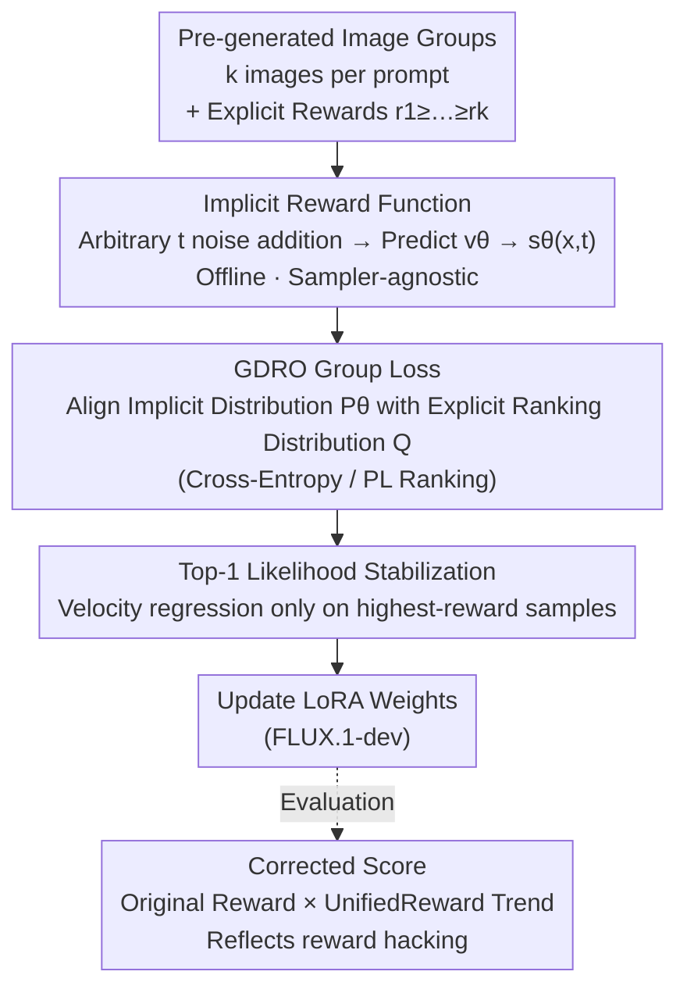

# GDRO: Group-level Reward Post-training Suitable for Diffusion Models

**Conference**: CVPR 2026  
**Paper**: [CVF Open Access](https://openaccess.thecvf.com/content/CVPR2026/html/Wang_GDRO_Group-level_Reward_Post-training_Suitable_for_Diffusion_Models_CVPR_2026_paper.html)  
**Code**: To be confirmed  
**Area**: Diffusion Models / Alignment RLHF  
**Keywords**: Diffusion Model Post-training, Group Reward, Offline Alignment, reward hacking, rectified flow  

## TL;DR
GDRO adapts the Group Relative Policy Optimization (GRPO) alignment strategy from LLMs to rectified flow diffusion models. By utilizing a DPO-style "implicit reward function" to calculate rewards directly at arbitrary noise timesteps, it achieves **fully offline training** (eliminating the need for iterative online sampling) and remains **sampler-agnostic** (avoiding ODE-to-SDE approximations). GDRO approaches or exceeds Flow-GRPO in OCR and GenEval text-to-image tasks with 2–3.7× higher efficiency while significantly mitigating reward hacking.

## Background & Motivation
**Background**: Reward alignment for text-to-image diffusion models using reinforcement learning has gained significant traction. A mainstream approach involves porting GRPO from LLMs: the model generates a group of images (rollout) for the same prompt, scores them using reward models (e.g., OCR accuracy or GenEval attribute correctness), and updates via PPO/GRPO-style policy gradients.

**Limitations of Prior Work**: Applying this online RL framework to rectified flow diffusion models (e.g., FLUX.1) presents three major issues. First, **extreme inefficiency**: diffusion models must run the entire denoising chain to sample an image; in online RL, rollout sampling dominates training time. Second, **reliance on stochastic samplers**: policy gradients require step-wise stochasticity, but rectified flow is a deterministic ODE once initial noise is fixed. Flow-GRPO/DanceGRPO must approximate ODEs as SDEs to introduce randomness, leading to out-of-domain issues and quality degradation. Third, **reward hacking**: while models improve reward scores, image quality, detail, and text-alignment often collapse—for instance, maximizing OCR scores by making text unnaturally large while losing all other details.

**Key Challenge**: Rectified flow models differ fundamentally from LLMs due to deterministic sampling and high sampling costs, making the online RL paradigm ill-suited. Conversely, standard Diffusion-DPO only handles pairwise preferences, failing to utilize the group-level information provided by explicit rewards.

**Key Insight**: Since DPO demonstrates that rewards can be reparameterized as an "implicit reward function"—which, in diffusion contexts, depends only on the noisy image and the model's predicted velocity (requiring no online sampling or stochasticity)—one can **bypass online rollouts. By using implicit rewards at arbitrary timesteps, the group ranking objective (Plackett-Luce / Cross-Entropy) from LLMs can be fully offlined.** This is the core of GDRO.

## Method

### Overall Architecture
The input for GDRO consists of **pre-generated offline image groups** $(x_1,\dots,x_k)$ per prompt with corresponding explicit rewards $(r_1,\dots,r_k)$ sorted as $r_1\ge\dots\ge r_k$. During training, no online sampling occurs: for each image in a group, noise is added at a random timestep $t$ to obtain $x_t$, which is fed to the diffusion model to predict velocity $v_\theta$. The **implicit reward** $s_\theta(x_i,t)$ is then calculated. The distribution of these implicit rewards is aligned with the target ranking distribution derived from explicit rewards using a group-level loss. Finally, a Top-1 likelihood stabilization term is added to prevent quality collapse. The entire pipeline involves no full denoising sampling or SDE approximations, making it both offline and sampler-agnostic.

### Key Designs

**1. Implicit Reward Function: Removing online sampling and stochasticity**

The root causes of inefficiency and reliance on stochastic samplers lie in the requirement to run the full diffusion chain to obtain samples and log-probabilities. GDRO bypasses this via DPO-style reparameterization: the optimal policy in RL fine-tuning satisfies $\pi^*_\theta(x_0|c)=\pi_{\text{ref}}(x_0|c)e^{r(x_0,c)/\beta_{\text{KL}}}/Z(c)$. Solving for the reward yields $s_\theta(x)=\beta_{\text{KL}}\log\frac{\pi^*_\theta(x_0|c)}{\pi_{\text{ref}}(x_0|c)}+\beta_{\text{KL}}\log Z(c)$, where the partition function cancels out during comparison. Diffusion-DPO further proves that in a diffusion context, this implicit reward can be approximated at a **given timestep $t$** using velocity residuals:

$$s_\theta(x,t)=-\beta\,\mathbb{E}_{t,v}\big[\|v-v_\theta(C)\|_2^2-\|v-v_{\text{ref}}(C)\|_2^2\big],\quad C=(x_t(c),t,c),\ \beta=T\beta_{\text{KL}}$$

Here $v$ is the injected perturbation noise and $x_t(c)$ is the noisy image at step $t$. Crucially, calculating $s_\theta$ only requires the noisy image and predicted velocity, **eliminating the need for full sampling from Gaussian noise (saving rollout time) and log-probabilities (removing the need for SDE approximations).**

**2. GDRO Group Loss: Aligning explicit rewards to implicit distributions via Plackett-Luce ranking**

GDRO ensures the model learns from "group ranking" rather than isolated pairwise comparisons. Two equivalent perspectives derive the same loss. **Cross-Entropy Perspective**: Convert explicit rewards into a target distribution $q(i,\tau)=\text{softmax}(r_i/\tau)$ and implicit rewards into $p_\theta(i)=\text{softmax}(s_\theta(x_i,t))$. Applying cross-entropy on the Top-1 sample and recursively defining the ranking as "selection over the remaining set" yields:

$$L_{\text{GDRO}}(\theta)=\sum_{i=1}^{k-1}\Big(\log\sum_{m=i}^{k}e^{s_\theta(x_m,t)}-\sum_{j=i}^{k}q_i(j,\tau)\,s_\theta(x_j,t)\Big)$$

**Ranking Perspective**: Directly maximizing the likelihood of the sequence $x_1\succ\dots\succ x_k$ under the Plackett-Luce model using $s_\theta$ as the scoring function produces $L_{\text{rank}}$. Replacing hard targets with soft targets weighted by explicit rewards returns $L_{\text{GDRO}}$. DPO is a special case of GDRO where $k=2$ and $\tau\to0$. The ranking perspective is more stable than pairwise losses as it maximizes the margin between the first rank and all remaining samples.

**3. Top-1 Likelihood Stabilization: Protecting image quality**

The authors observed a counter-intuitive phenomenon: while evaluation scores increased, the **absolute likelihood of the Top-1 reward sample often decreased**, leading to quality degradation. The PL objective only maximizes the relative margin between ranks, not the absolute likelihood. To counter this, a velocity regression regularizer is applied only to the highest-reward samples:

$$L_{\text{reg}}(\theta)=M\circ\|v-v_\theta(x_t(c),t,c)\|_2^2,\qquad L_{\text{final}}=L_{\text{GDRO}}+\gamma L_{\text{reg}}$$

where $M$ is a one-hot mask for Top-1 samples. This pulls the "best image" toward the reference distribution to prevent the collapse of details.

**4. Corrected Score: Quantifying reward hacking**

High evaluation rewards do not always imply better quality—Flow-GRPO can reach 0.95 OCR accuracy while the image quality collapses. To objectively evaluate this, the authors incorporate a "hacking trend" using the UnifiedReward model (covering alignment, coherence, and style). Since these scores correlate negatively with reward hacking, they serve as a proxy. The corrected score for OCR tasks is defined as: $r_{\text{corrected}}=r(\hat u-3)+0.2$ (where $\hat u$ is the average quality score). When hacking occurs, $\hat u$ drops, penalizing the final corrected score.

### Loss & Training
The final objective is $L_{\text{final}}=L_{\text{GDRO}}+\gamma L_{\text{reg}}$. The base model is FLUX.1-dev with LoRA (rank 32) and EMA. 16 images per prompt are pre-generated offline. Hyperparameters include: OCR ($\tau=0.05, \gamma=0.5, \beta=12, k=6$); GenEval ($\tau=0.05, \gamma=1.0, \beta=6, k=6$). Training was performed on 8×A100 GPUs at 512×512 resolution.

## Key Experimental Results

### Main Results
Comparison with Flow-GRPO, DanceGRPO, and DPO on OCR and GenEval tasks:

| Method | OCR / Corrected Score | GenEval / Corrected Score | GPU Hours | Remarks |
|------|------|------|------|------|
| FLUX.1 (Baseline) | 0.5843 / 0.4486 | 0.6178 / 0.4646 | — | Unaligned |
| Flow-GRPO | 0.8714 / 0.5482 | 0.8520 / 0.4757 | 59.7 / 250.3 | Online RL |
| Flow-GRPO (Overfitted) | 0.9540 / 0.4810 | 0.8934 / 0.4642 | 149.1 / 340.0 | Hacking detected |
| DanceGRPO | 0.8719 / 0.5406 | 0.8549 / 0.4831 | 74.7 / 294.5 | Slower Flow-GRPO |
| DPO (Near Collapse) | 0.8158 / 0.5341 | 0.6488 / 0.4162 | N/A | High Instability |
| **GDRO (Ours)** | **0.8721 / 0.5701** | **0.8517 / 0.5148** | **29.6 / 68.4** | Highest Corrected Score |

Key Gain: While matching Flow-GRPO in raw rewards, GDRO achieves the **highest corrected scores** with significantly higher efficiency (OCR ~2× faster, GenEval ~3.7× faster).

### Human Evaluation (Evidence of Reward Hacking)

| Method | Text Acc. Win ↑ | Text-Align Win ↑ | Quality Win ↑ |
|------|------|------|------|
| FLUX.1 Baseline | 1.90% | 26.67% | 33.10% |
| GDRO (0.87) | 5.48% | **33.10%** | **33.81%** |
| Flow-GRPO (0.87) | 3.81% | 16.90% | 17.86% |
| Flow-GRPO (0.95) | 6.19% | 9.52% | 8.09% |

Humans often vote for ties in text accuracy (actual readability is similar), but GDRO significantly outperforms Flow-GRPO in alignment and quality, proving Flow-GRPO is heavily affected by hacking.

### Ablation Study

| Configuration | Key Observation | Explanation |
|------|---------|------|
| Group size $k=2$ | Instability, collapse | Equivalent to DPO, lacks group stability |
| $k=4/6/8$ | Steady improvement | $k>2$ provides sufficient stability; $k=6$ is optimal |
| OCR $\beta=6$ | Faster reward rise, lower corrected score | Weak constraint → hacking |
| OCR $\beta=12$ | More stable, higher corrected score | Stronger constraint is better for OCR |
| GenEval $\beta=6$ | Superior to $\beta=12$, no collapse | Opposite of OCR |

### Key Findings
- **Group size is the key to stability**: $k=2$ (pairwise) is unstable like DPO. Stability is achieved for $k>2$, with $k=6$ being the optimal balance.
- **$\beta$ (KL constraint) requirements are task-specific**: OCR favors tighter constraints ($\beta=12$), whereas GenEval favors looser ones ($\beta=6$). GenEval requires larger structural shifts (attributes, count, position) than character correction, necessitating more flexibility.
- **Corrected score reveals the "high reward trap"**: Flow-GRPO's raw reward rises monotonically, but the corrected score declines after ~100 GPU hours, signaling content degradation.

## Highlights & Insights
- **Transformation of online RL into offline supervised learning**: The insight that implicit rewards can be calculated at any timestep using only predicted velocity removes the need for rollout sampling and SDE approximations. This is the root of the 2–3.7× efficiency gain.
- **DPO as a special case**: The unification of pairwise preference, pure ranking, and explicit group reward alignment into one framework ($k=2,\tau\to0$ yields DPO) provides strong theoretical completeness.
- **Top-1 Likelihood mitigation**: Identifying the drop in Top-1 likelihood and fixing it with a one-hot velocity regression is a valuable engineering contribution.
- **Portability of Corrected Score**: Using a third-party quality model to penalize hacking is a broadly applicable strategy for any RLHF scenario where reward models are exploitable.

## Limitations & Future Work
- The method is **purely offline**, lacking the active exploration characteristic of online RL, which may limit performance in tasks requiring trajectory discovery.
- The Corrected Score relies on UnifiedReward; it **only reflects trends rather than providing absolute hacking metrics**.
- Pre-generated groups are static. As the model evolves, it may drift from the distribution of the offline data. Furthermore, $\beta$ requires manual tuning per task.

## Related Work & Insights
- **vs Flow-GRPO / DanceGRPO**: These use online RL and SDE approximations for stochasticity; GDRO remains offline and sampler-agnostic, improving efficiency and robustness.
- **vs Diffusion-DPO**: Diffusion-DPO only supports pairwise preferences. GDRO generalizes this to group-level Plackett-Luce ranking while utilizing explicit numerical rewards.
- **vs DDPO / DPOK**: These treat diffusion as an MDP for online RL but are limited to DDPM-style models. GDRO is specifically designed for the deterministic nature of rectified flow.
- **vs AlignProp / DiffDoctor**: These require differentiable reward functions; GDRO works with non-differentiable rewards like OCR accuracy.

## Rating
- Novelty: ⭐⭐⭐⭐⭐ Successfully reformulates group reward alignment into an offline, sampler-agnostic paradigm.
- Experimental Thoroughness: ⭐⭐⭐⭐ Strong coverage of multiple tasks and metrics; however, task variety could be broader.
- Writing Quality: ⭐⭐⭐⭐ Clear motivation-to-derivation chain; the unified loss perspective is well-presented.
- Value: ⭐⭐⭐⭐⭐ Addresses the compute bottleneck of diffusion RLHF through an efficient offline approach.

<!-- RELATED:START -->

...

## Related Papers

- [\[CVPR 2026\] HP-Edit: A Human-Preference Post-Training Framework for Image Editing](hp-edit_a_human-preference_post-training_framework_for_image_editing.md)
- [\[CVPR 2026\] LeapAlign: Post-Training Flow Matching Models at Any Generation Step by Building Two-Step Trajectories](leapalign_post_training_flow_matching_models_at_any_generation_step.md)
- [\[CVPR 2026\] Reward Sharpness-Aware Fine-Tuning for Diffusion Models](reward_sharpness-aware_fine-tuning_for_diffusion_models.md)
- [\[ICML 2026\] GUDA: Counterfactual Group-wise Training Data Attribution for Diffusion Models via Unlearning](../../ICML2026/image_generation/guda_counterfactual_group-wise_training_data_attribution_for_diffusion_models_vi.md)
- [\[ICCV 2025\] DMQ: Dissecting Outliers of Diffusion Models for Post-Training Quantization](../../ICCV2025/image_generation/dmq_dissecting_outliers_of_diffusion_models_for_post-training_quantization.md)

<!-- RELATED:END -->
