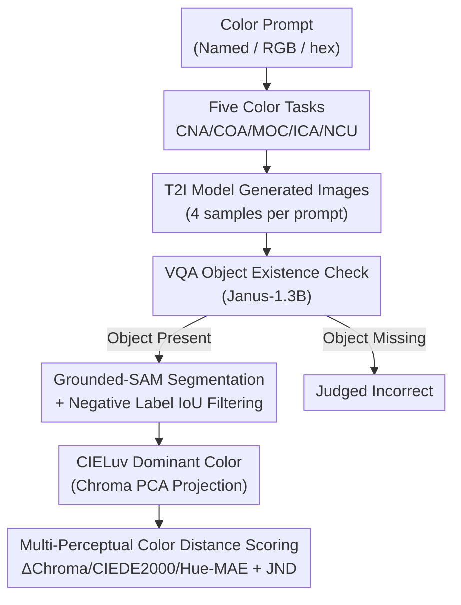

# GenColorBench: A Color Evaluation Benchmark for Text-to-Image Generation

**Conference**: CVPR 2026  
**Paper**: [CVF Open Access](https://openaccess.thecvf.com/content/CVPR2026/html/Butt_GenColorBench_A_Color_Evaluation_Benchmark_for_Text-to-Image_Generation_CVPR_2026_paper.html)  
**Code**: https://moatifbutt.github.io/gencolorbench/ (Project Page)  
**Area**: Diffusion Models / T2I Image Evaluation  
**Keywords**: Color Generation Evaluation, T2I Benchmark, ISCC-NBS, Dominant Color, Color Science  

## TL;DR
GenColorBench is the first benchmark to systematically evaluate the "color accuracy" of text-to-image (T2I) models. It constructs 44,000 prompts across five color tasks using ISCC-NBS / CSS3-X11 color systems and RGB/hex values. By employing an evaluation pipeline based on "Color Science dominant colors + $\Delta E$" that does not rely on VLMs, the study reveals that current SOTA models are generally weak in precise color control (failing to exceed 50% accuracy in most tasks).

## Background & Motivation
**Background**: T2I models like Stable Diffusion and FLUX can generate high-quality images from text and are being integrated into design and media production pipelines. Professional tools (Photoshop, Blender) allow for the precise specification of thousands of colors using RGB, hex, and named palettes; therefore, T2I models should ideally achieve the same granularity of color control.

**Limitations of Prior Work**: Existing benchmarks (GenEval, T2I-CompBench, DPG-Bench, TIFA, etc.) focus on compositional reasoning, instruction following, and fidelity, but **none systematically evaluate the ability to generate specific colors accurately as prompted**. They either ignore color or perform coarse-grained "red/blue/green" category judgments, and **completely fail to cover numerical colors like RGB/hex**.

**Key Challenge**: Most existing color evaluations follow a VQA approach, asking Vision-Language Models (VLMs) to judge if "this object is pink." However, through a diagnostic experiment using 2,464 Blender-synthesized images, the authors found that VLMs **lack pixel-level color grounding**. Their open-ended recognition accuracy is extremely low (most <30%), and in MCQ or binary classifications, they rely on linguistic shortcuts like option position and confirmation bias rather than true perception—even the strongest BLIP3o showed a significant drop in accuracy after reordering options. In short, **the evaluation tools themselves are unreliable and fail to expose the true color control capabilities of models**.

**Goal**: Build a color generation benchmark that (i) is anchored to standard color systems, (ii) covers both named and numerical colors, and (iii) does not rely on VLM scoring, to identify which color conventions existing models understand and where they fail.

**Key Insight**: Move evaluation from "linguistic judgment" back to "Color Science"—directly segmenting the generated image, extracting pixels, calculating color distances in a perceptually uniform color space, and comparing them against ground truth standards.

**Core Idea**: Replace VQA with an objective pipeline involving "Grounded-SAM for object cropping → CIELuv dominant color extraction → Multi-perceptual color distance + JND threshold" to perform large-scale evaluation on 44K prompts across five tasks.

## Method

### Overall Architecture
GenColorBench consists of two parts: **(A) Dataset Construction**, which combines 108 objects with standard color systems (ISCC-NBS Level 3, CSS3/X11 147 colors, and RGB/hex values) into 44,000 prompts categorized into five color tasks; and **(B) Evaluation Pipeline**, which first uses a VQA to confirm object existence in the generated image, then uses Grounded-SAM to segment object masks and filter negative label regions. It extracts pixels to calculate the "dominant color," which is finally compared against the ground truth color using multiple perceptual color distances and a JND threshold to produce a binary score. The input is a prompt with color constraints, and the output is the model's pass rate for that task/color system.

### Key Designs

**1. Color Taxonomy Anchored to Standards + Numerical Values: Making "Color" Quantifiable and Tiered**
To objectively evaluate color control, one must first possess a color vocabulary with ground truths and difficulty gradients. The authors anchored their work to two standard systems: **ISCC-NBS** (derived from the perceptually uniform Munsell system, discretizing continuous color space into three naming levels—Level 1 with 13 basic colors, Level 2 adding modifiers like light/deep to reach 29 colors, and Level 3 providing fine-grained names like "light bluish green") and **CSS3/X11** (147 web standard colors accurately mapped to RGB/hex). A key differentiator is the **inclusion of numerical colors like RGB triplets and hex codes**, a dimension missing from all existing benchmarks yet most common in professional design workflows.

**2. Five Color Tasks + Four Difficulty Templates: Decomposing "Color Control" into Diagnostic Dimensions**
To locate specifically where models fail, color control is split into five dimensions: **CNA** (Color Name Accuracy), **COA** (Color-Object Association, ensuring color doesn't leak into the background), **MOC** (Multi-Object Color Composition), **ICA** (Implicit Color Association, where semantically related objects share colors), and **NCU** (Numerical Color Understanding, using RGB/hex). Prompts were generated using 108 objects across 7 semantic domains and paired with color sets via GPT-4o templates across four levels of complexity. The final distribution includes ~18K named color prompts, ~11.5K numerical, ~8.7K contextual, ~2.2K multi-object, and ~4.5K implicit association prompts (~44K total).

**3. Dominant Color Extraction: Compressing Polychromatic Objects into a "Perceivable" Representative Color**
Objects have chromatic distributions due to geometry and lighting; pixel-wise distance calculation would be penalized by highlights/shadows. Borrowing from vision science, the authors use **dominant hue**: pixels in the mask are converted to the perceptually uniform CIELuv space $(L^*_i, u^*_i, v^*_i)$. PCA is performed on the chrominance components $(u^*, v^*)$, and the first principal component $v_1 = (v_{1u}, v_{1v})$ is taken as the "dominant hue direction." Pixels are projected onto $v_1$ to find the mean $(u^*_{proj}, v^*_{proj})$, which is paired with the mean lightness $\bar{L^*}$ to form the "dominant color."

**4. Candidate Sets + Multi-Perceptual Distance + JND: Scoring with Color Science instead of VLMs**
To avoid penalizing reasonable matches (e.g., a "pink" that is perceptually identical to another shade), the authors construct a **candidate set** for each ground truth color, consisting of the nominal color and its $k$ nearest neighbors in the same system. Three complementary metrics are calculated: **$\Delta$Chroma** (Euclidean distance in CIELab $(a^*, b^*)$ plane), **CIEDE2000** (perceptual distance), and **Hue-MAE** (hue angle difference). A sample is "Correct" only if the minimum distance to the candidate set is below the **JND (Just Noticeable Difference) threshold** (e.g., $\Delta$Chroma $\le$ 5 units) across **all three metrics**.

## Key Experimental Results

### Main Results: 12 T2I/Unified Models × 5 Tasks × 3 Color Granularities
Evaluated on 44,464 prompts across diffusion (DM), autoregressive (AR), and multimodal (MM) architectures. Top performers for ISCC-L1 (Basic Colors) are as follows (Accuracy %):

| Task | Best Model (ISCC-L1) | Accuracy | Runner-up | Note |
|------|------|------|------|------|
| Color Name Accuracy | PixArt-α | 68.78 | SD3.5 64.37 / Sana 62.89 | Simplest task peak is only ~70% |
| Color-Object Association | OmniGen2 | 34.23 | SD3.5 32.95 / Bagel 31.57 | Color bleeding is common; <35% |
| Multi-Object Composition | OmniGen2 | 23.78 | SD3.5 21.54 | Generally very low (10-24%) |
| Implicit Color Association | BLIP3o | 28.22 | Bagel 25.37 / OmniGen2 25.09 | Implicit semantics; <30% accuracy |
| Numerical Color (RGB/hex) | BLIP3o | 43.20 | OmniGen2 26.38 | Hardest task; most models <15% |

### Key Findings
- **The simplest single-object task has an upper bound of ~70%**, with performance collapsing in multi-object or numerical tasks, indicating that precise color control is a systemic weakness in current T2I models.
- **No universal winner**: OmniGen2 leads in association and multi-object tasks, BLIP3o leads in numerical colors, and PixArt-α leads in basic color naming—capabilities are highly fragmented.
- **Unified models (OmniGen2/BLIP3o/Bagel) are stronger in numerical and association tasks**, suggesting unified architectures might encode RGB/hex values more effectively.
- **Model color biases mirror training corpora**: A banana is yellow because the model remembers the frequency of co-occurrence, not because it understands biological color norms.

## Highlights & Insights
- **Returning evaluation to Color Science**: Using CIELuv dominant colors and CIEDE2000/JND instead of VQA avoids VLM color hallucinations. This provides a robust, reusable protocol for the community.
- **Conservative Scoring**: The use of "Candidate Sets + Nearest Neighbors + Multi-metric pass" ensures the evaluation is tolerant of perceptually indistinguishable shades while remaining strict enough to be meaningful.
- **Filling the Numerical Gap**: Including RGB/hex values addresses a real-world need in design workflows that all prior benchmarks missed.
- **The "-ish" modifier challenge**: The discovery that modifiers like "reddish" are the hardest (often <35%) suggests that models struggle with continuous color gradients and prefer discrete categories.

## Limitations & Future Work
- **Pipeline Dependencies**: The system still partially relies on VLMs for existence checking (Janus-1.3B) and segmentation (SAM). Errors in detection or segmentation could propagate to color scores ⚠️.
- **Single Dominant Color Assumption**: For objects with multi-colored patterns or strong textures, a single "dominant color" may not fully capture the complexity ⚠️.
- **Hyperparameter Sensitivity**: The JND thresholds and candidate set size $k$ are critical; while the paper provides values like $\Delta$Chroma=5, further sensitivity analysis is primarily relegated to the appendix.

## Related Work & Insights
- **vs GenEval / T2I-CompBench**: These evaluate composition and instruction following with coarse VQA color checks. GenColorBench specializes in color, covers 44K prompts, and uses color science metrics.
- **vs VQA Color Benchmarks**: Prior works evaluated how VLMs "understand" color; this work evaluates how T2I models "generate" it using objective protocols.

## Rating
- Novelty: ⭐⭐⭐⭐ First systematic T2I color benchmark with numerical dimensions and VLM-free scoring.
- Experimental Thoroughness: ⭐⭐⭐⭐⭐ Comprehensive coverage of 12+ models, 5 tasks, and multiple semantic/linguistic angles.
- Writing Quality: ⭐⭐⭐⭐ Clear logic from diagnostic to methodology, though some error propagation analysis is in the appendix.
- Value: ⭐⭐⭐⭐⭐ Clearly identifies a systemic blind spot in T2I models and provides the tools to measure and improve it.

<!-- RELATED:START -->

## Related Papers

- [\[CVPR 2026\] Self-Evaluation Unlocks Any-Step Text-to-Image Generation](self-evaluation_unlocks_any-step_text-to-image_generation.md)
- [\[CVPR 2026\] MultiBanana: A Challenging Benchmark for Multi-Reference Text-to-Image Generation](multibanana_a_challenging_benchmark_for_multi_reference_text_to_image_generation.md)
- [\[CVPR 2026\] I2I-Bench: A Comprehensive Benchmark Suite for Image-to-Image Editing Models](i2i-bench_a_comprehensive_benchmark_suite_for_image-to-image_editing_models.md)
- [\[NeurIPS 2025\] OVERT: A Benchmark for Over-Refusal Evaluation on Text-to-Image Models](../../NeurIPS2025/image_generation/overt_a_benchmark_for_over-refusal_evaluation_on_text-to-image_models.md)
- [\[AAAI 2026\] T2I-RiskyPrompt: A Benchmark for Safety Evaluation, Attack, and Defense on Text-to-Image Model](../../AAAI2026/image_generation/t2i-riskyprompt_a_benchmark_for_safety_evaluation_attack_and_defense_on_text-to-.md)

<!-- RELATED:END -->
