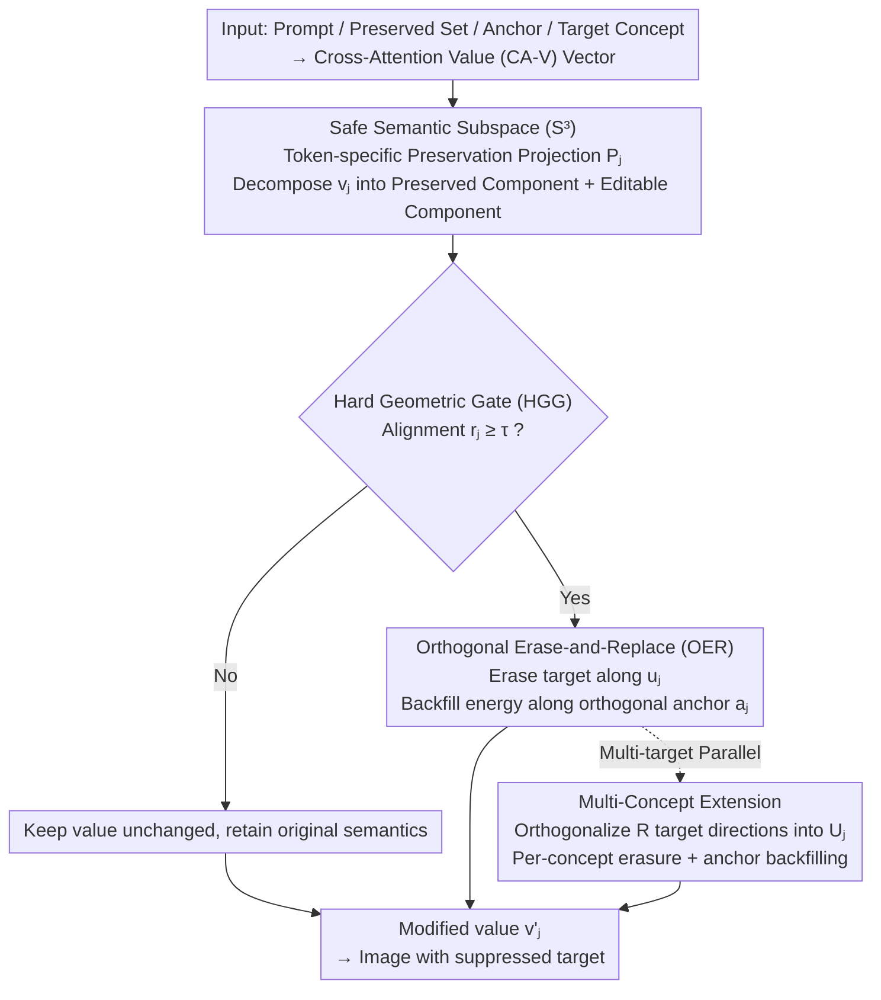

# GenErase: Generalizable and Semantically-Aware Concept Erasure in Diffusion Models

**Conference**: CVPR 2026  
**Paper**: [CVF Open Access](https://openaccess.thecvf.com/content/CVPR2026/html/Vardhana_GenErase_Generalizable_and_Semantically-Aware_Concept_Erasure_in_Diffusion_Models_CVPR_2026_paper.html)  
**Code**: To be confirmed  
**Area**: Diffusion Models / Concept Erasure / Generative Safety  
**Keywords**: Concept erasure, training-free, cross-attention value space, geometric gating, paraphrase generalization

## TL;DR
GenErase is a **training-free, inference-time only** concept erasure framework for diffusion models. Operating in the cross-attention value (CA-V) space, it leverages a trio of "token-specific preservation projection + hard geometric gating + orthogonal erase-and-replace" to precisely erase target concepts (celebrities, copyrighted characters, NSFW content, etc.) from generation results without harming unrelated content, remaining robust against paraphrases, aliases, and contextual changes in prompts.

## Background & Motivation

**Background**: Text-to-image (T2I) diffusion models (such as Stable Diffusion), trained on web-scale data like LAION-5B, inevitably internalize unsafe, copyrighted, or private content. To make these models "safe to deploy," the research community has developed two lines of concept erasure: first, **weight editing** (such as UCE, MACE, CURE, ESD), which directly modifies model parameters to create a "purified" checkpoint; second, **inference-time guard-railing** (such as NP, SLD, AdaVD, SAFREE), which leaves the weights untouched and adjusts intermediate representations during sampling.

**Limitations of Prior Work**: While weight editing is suitable for centralized moderation, **it alters shared weights**—failing to support user/deployment-specific customization, temporary toggling, reversibility, or fine-tuning, and requiring re-training/fine-tuning for every added concept. Inference-time methods are more flexible, but existing approaches fall into a core trade-off: they are either **too rigid** (NP/SLD utilize negative prompting, offering coarse control that often introduces artifacts and damages unrelated content) or **too fragile** (AdaVD/SAFREE improve selectivity via projection/soft gating, but only remain robust under paraphrase attacks when all paraphrases of the target are explicitly listed).

**Key Challenge**: In real-world deployment, it is impossible to enumerate all aliases of a concept—for example, "Donald Trump" can be phrased as "President of the United States," and "Batman" as "Dark Knight / Gotham superhero." Real-time expansion of paraphrases using LLMs introduces significant generation latency. Consequently, existing inference-time methods are highly fragile to **unseen paraphrases**, and their suppression intensity is inconsistent across different diffusion layers, fluctuating between "over-erasure" and "under-suppression."

**Goal**: Create an inference-time guardrail that simultaneously satisfies three criteria: (1) precise erasure of the target; (2) explicit protection of key semantics adjacent to the target; and (3) stability across layers, paraphrases, and multiple concepts.

**Key Insight**: The authors reformulate erasure as a **geometric operation** in the CA-V space. The cross-attention value space is where textual concepts map onto image features. Targets, preserved concepts, and anchors can all be represented as directional vectors in this space, transforming the task of "erasing the target while preserving neighbors" into "orthogonal decomposition in vector subspaces."

**Core Idea**: Enforce semantic orthogonality in the CA-V space using "explicit preservation subspace + hard geometric gating + orthogonal erase-and-replace." Editing is triggered only when a token strongly aligns with the target direction. After erasing the energy along the target direction, the energy is backfilled along a neutral anchor direction orthogonal to both the preserved set and the erased target, thereby achieving clean erasure without feature collapse.

## Method

### Overall Architecture

GenErase operates entirely in the cross-attention value (CA-V) space, intervening **at each prompt token and each CA layer** without modifying any model parameters or tuning sampling hyperparameters. Given a target concept $t$, a preserved set $P=\{p_1,\dots,p_K\}$, and a neutral anchor $a$, the preprocessing stage passes the prompt, preserved concepts, anchor, and target through the value projection matrix $W_V$ to obtain token-aligned value vectors. During inference, for each token value $v_j$ in the active prompt, three steps are sequentially performed: ① **Safe Semantic Subspace (S³)** constructs a token-specific preservation projection $P_j$ using the preserved set to decompose $v_j$ into a "protected component" and an "editable component"; ② **Hard Geometric Gate (HGG)** quantifies the alignment $r_j$ between the editable component and the target direction, triggering editing only if it exceeds a threshold $\tau$; ③ **Orthogonal Erase-and-Replace (OER)** erases the energy along the target direction and backfills it along a neutral anchor orthogonal to both the preserved set and the erasure direction. These three steps produce the updated value $v'_j$, which is fed back into the diffusion sampling, yielding images where the target is erased while unrelated content remains intact. Finally, a **Multi-Concept Extension** generalizes these three steps to simultaneously erase $R$ targets.

### Key Designs

**1. Safe Semantic Subspace (S³): Isolating "absolutely untouchable" semantics before performing surgery**

The most common side effect of erasure is "guilt by association"—erasing "Donald Trump" might distort the appearance of closely related political figures. The core idea of S³ is that instead of relying passively on gating to avoid neighboring semantics, it **explicitly projects out the subspace where neighbors reside**. For each token $j$, the CA-V vectors of the $K$ preserved concepts $\tilde v_{p_k,j}$ are retrieved and orthogonalized into a basis $B_j=\mathrm{orth}([\tilde v_{p_1,j},\dots,\tilde v_{p_K,j}])$, yielding the projection matrix $P_j=B_jB_j^\top$. Thus, each prompt token value can be decomposed as $v_j = P_j v_j + (I-P_j)v_j$, where $P_j v_j$ represents the protected semantics and $(I-P_j)v_j$ lies in the editable complementary subspace $S^{\perp}_j$. GenErase **only modifies the latter**, which mechanistically guarantees that editing never affects the protected concepts. Because $P_j$ is calculated per-token and per-layer, it adaptively tracks spatial and semantic variations in diffusion features. The ablation study (Fig. 3 in the paper) shows that removing this projection leads to visible artifacts and semantic leakage in non-target generations. This marks a fundamental difference from "gating-only" methods like AdaVD and SAFREE—transforming preservation from a passive outcome to an explicit constraint.

**2. Hard Geometric Gate (HGG): Utilizing normalized directional geometry to determine if a token matches the target**

Isolating the preserved subspace is not enough; one must also ensure that editing **occurs only when a token is strongly aligned with the target**, avoiding false positives. HGG is a purely geometric thresholding rule. It first calculates the normalized erasure direction of the target in the editable complementary subspace: $\tilde u_j=(I-P_j)\tilde v_{t,j}$ and $u_j=\tilde u_j/\lVert\tilde u_j\rVert_2$ (the target vector is projected to remove preserved semantics, yielding a "pure target direction"). It then measures the alignment between the editable component of the active token, $v_{\text{free},j}=(I-P_j)v_j$, and this direction: $t_j=u_j^\top v_{\text{free},j}$. This is normalized as $r_j=\dfrac{\lvert t_j\rvert}{\lVert v_{\text{free},j}\rVert_2+\varepsilon}$, where $r_j$ measures the proportion of semantic energy directed toward the target, **independent of amplitude**. Editing is triggered if and only if $r_j\ge\tau$; tokens below this threshold are preserved intact, yielding sparse and interpretable edits. In contrast to the soft weighting/adaptive scaling of AdaVD, HGG relies on a **discrete, interpretable binary decision** based purely on directional geometry. Consequently, it is naturally invariant to amplitude variations across layers and highly robust to paraphrased prompts. The paper characterizes this as a "semantic switch." It is precisely this directional rather than amplitude/literal token-based decision that allows the model to identify target-related tokens like `trump` or `america` while bypassing unrelated tokens like `lemon` or `crow` (Fig. 4).

**3. Orthogonal Erase-and-Replace (OER): Backfilling energy along a neutral anchor rather than zeroing it out after erasing the target direction**

Simply zeroing out the target component collapses the features and disrupts the diffusion trajectory, degrading image quality. The key to OER is to **replace after erasing**: it removes the component along the target direction and redistributes the corresponding energy along a neutral anchor direction, thereby maintaining the overall amplitude and preserving the continuity of the diffusion trajectory. The anchor $a_j$ is constructed to be **simultaneously orthogonal to both the preserved subspace and the erasure direction**: $\tilde a_j=(I-P_j)\tilde v_{a,j}$, $a_j=\dfrac{\tilde a_j-(u_j^\top\tilde a_j)u_j}{\lVert a_{\perp,j}\rVert_2}$, which satisfies $P_j u_j=P_j a_j=0$ and $u_j^\top a_j=0$. For each gated token, with $\text{erase}_j=t_j u_j$ and $\text{rep}_j=\beta\,t_j a_j$ ($\beta\in[0,1]$), the value is updated to $v'_j=P_j v_j+\big(v_{\text{free},j}-\text{erase}_j+\text{rep}_j\big)$, setting the first token's value to $v'_1=v_1$. Here, $\beta=0$ represents complete removal, and $\beta\approx0.5$ balances erasure thoroughness and fidelity. The strict mutual orthogonality among the preserved, erased, and backfilled subspaces ensures that the target **cannot re-emerge via residual coupling or diffusion noise**. Geometrically, OER "rotates" the selected token in the complementary subspace from the target axis to the neutral anchor axis. Consequently, even strong erasure produces smooth, high-fidelity reconstructions—the core source of GenErase's stability and generalizability.

**4. Multi-Concept Extension: Generalizing to parallel orthogonal updates for erasing R targets simultaneously**

Real-world safety scenarios often require erasing multiple concepts simultaneously. GenErase naturally scales to multiple targets: while the S³ preservation projection remains unchanged, HGG orthogonalizes the $R$ target directions $(I-P_j)\tilde v_{t^{(r)},j}$ into a matrix $U_j=\mathrm{orth}([\dots])\in\mathbb{R}^{D\times R_j}$. The token alignment is updated to $t_j=U_j^\top v_{\text{free},j}$ and $r_j=\dfrac{\lVert t_j\rVert_\infty}{\lVert v_{\text{free},j}\rVert_2+\varepsilon}$, triggering editing whenever **any target direction dominates**. The anchor in OER is also generalized to a matrix $A_j=(I-U_jU_j^\top)(I-P_j)[\tilde v_{a^{(1)},j},\dots]$ (normalized column-wise), leading to the joint update $v'_j=v_{\text{pres},j}+\big(v_{\text{free},j}-U_jt_j+A_j(\beta\odot t_j)\big)$, which preserves the three-way orthogonality $P_jU_j=0$, $P_jA_j=0$, and $U_j^\top A_j=0$. Thanks to this "parallel, mutually orthogonal" update scheme, GenErase scales stably to 50 concurrent target identities, whereas baselines like AdaVD and SAFREE often experience out-of-memory (OOM) failures on a 24GB GPU when exceeding 5 targets.

### Loss & Training
GenErase is **entirely training-free**, involving no loss functions or gradient updates. All projections, gating, and backfilling are closed-form geometric operations inserted directly into the CA-V space during sampling. Only two hyperparameters are used and kept fixed across all tasks: gating threshold $\tau=0.1$ and backfilling coefficient $\beta=0.5$ (the threshold is lowered to $\tau=0.05$ in nudity suppression experiments to cover broader cues). The implementation is based on Stable Diffusion v1.4, running on a single RTX A5000 with a batch size of 10, 30 sampling steps, and a classifier-free guidance scale of 7.5.

## Key Experimental Results

### Main Results

Evaluation follows standard protocols in concept erasure, assessing performance from two perspectives: erasure success rate (**ESR↑**) for prompts containing the target, and preservation success rate (**PSR↑**) for non-target prompts. These are synthesized using the harmonic mean (**HM↑**), while the **FID↓** of non-target images measures distribution stability. CLIP similarity is the primary signal. The table below shows the **average** results for single-concept erasure across three celebrities (Trump / Zuckerberg / Johnson):

| Method | ESR↑ | PSR↑ | HM↑ | Non-target FID↓ |
|------|------|------|-----|------|
| NP | 80.56 | 26.27 | 39.61 | 67.92 |
| SLD | 77.62 | 26.54 | 39.55 | 41.80 |
| AdaVD | 78.33 | 26.67 | 39.79 | **8.09** |
| SAFREE | 79.81 | 26.62 | 39.92 | 68.13 |
| **GenErase** | **81.83** | **26.67** | **40.22** | 11.85 |

GenErase leads comprehensively in HM, with ESR improving by approximately +2 over AdaVD while maintaining a comparable PSR (indicating stronger suppression without damaging unrelated content). While its FID is slightly higher than AdaVD's, it remains far lower than those of NP, SLD, and SAFREE. The authors attribute this minor difference to low-level perturbations (e.g., lighting, texture) rather than semantic drift within the low-FID regime.

Multi-concept and cross-benchmark results also demonstrate superior performance:

| Setup / Benchmark | Metric | NP | SLD | AdaVD | SAFREE | GenErase |
|------|------|------|------|------|------|------|
| 5-Celebrity Simultaneous Erasure | HM↑ | 40.46 | 40.84 | 40.88 | 40.78 | **41.04** |
| 5-Celebrity Simultaneous Erasure | Non-target FID↓ | 89.96 | 47.98 | **10.32** | 63.35 | 12.36 |
| Object Erasure (Avg. of Dog/Eggplant/Glasses) | HM↑ | 36.07 | 35.86 | 36.31 | 36.37 | **36.49** |
| GenBench-40 Failure Rate↓ | Faces | 33.10 | 32.90 | 36.50 | 32.85 | **27.80** |
| GenBench-40 Failure Rate↓ | IP Characters | 21.25 | 24.00 | 23.25 | 22.25 | **17.60** |
| GenBench-40 Failure Rate↓ | Average | 27.17 | 28.45 | 29.88 | 27.55 | **22.70** |

GenBench-40 is a new paraphrase generalization benchmark introduced by the authors, consisting of 40 target entities (celebrities + IP characters), each mapped to 2–3 variants (direct name, paraphrases, contextual descriptions) embedded across 30 templates, totaling approximately 3,000 deterministic generation cases. It employs a **concept-normalized** failure metric (each entity has a threshold based on its baseline CLIP mean to avoid simple averaging being skewed by individual scale variations). GenErase achieves the lowest failure rates in both the face and IP categories, yielding an average failure rate of 22.70%, which is nearly 5 percentage points lower than the runner-up NP (27.17%). This validates its robust generalization to paraphrased and context-shifted prompts.

### Ablation Study

| Configuration / Analysis | Key Metrics | Description |
|------|---------|------|
| Removing S³ Preservation Projection | Qualitative (Fig. 3) | Artifacts and semantic leakage appear in non-target generations; neighboring identities are affected |
| HGG Threshold $\tau=0.1$ | Qualitative (Fig. 4) | Target-related tokens like `trump`/`america` have high weights; unrelated tokens like `lemon`/`crow` are bypassed |
| Number of Concepts 1$\rightarrow$50 | ESR 77.95$\rightarrow$77.71 | ESR drops only slightly when scaling to 50 targets |
| Number of Concepts 1$\rightarrow$50 | PSR 29.02$\rightarrow$28.43 | Preservation success rate also drops only minimally, indicating stable scalability |
| Number of Concepts 1$\rightarrow$50 | HM 42.29$\rightarrow$41.63 | Harmonic mean barely drops; baselines often crash due to OOM when exceeding 5 concepts |
| Nudity Suppression ($\tau=0.05$) | Success rate of 87.35% | Evaluated using NudeNet (threshold 0.3), exceeding the previous SOTA of approximately 83% |
| Inference Overhead | +~1.8 s/batch | Increases by only ~1.8 seconds per batch compared to vanilla sampling in 30 steps; peak VRAM is smaller |

### Key Findings
- **S³ is the key to fidelity, and HGG is the key to precision**: Removing the preservation projection directly harms unrelated content (guilt by association), while the hard geometric gate ensures that editing occurs only on true target tokens. Together, one ensures "do not touch neighbors" and the other ensures "do not touch bystanders."
- **"Erase-and-replace" is more stable than "zeroing out"**: OER backfills energy along orthogonal anchors to prevent feature collapse, which explains why it maintains a low FID and smooth diffusion trajectories under strong erasure—marking a substantial improvement over AdaVD's "projection erasure."
- **Scalability is a major highlight**: Scaling from 1 to 50 parallel targets leads to almost no decrease in ESR, PSR, or HM, whereas most baselines fail when exceeding 5 targets on a 24GB GPU. This is highly practical for platform-level multi-concept moderation.
- **Paraphrase generalization is the strongest selling point**: It achieves the largest performance gap on GenBench-40 (which specifically benchmarks paraphrasing) without explicitly treating paraphrases as erasure targets (simulating realistic scenarios with unseen paraphrases). This proves that its generalization stems from geometric direction estimation rather than exhaustive alias enumeration.

## Highlights & Insights
- **Reformulating "erasure" as orthogonal geometry in the CA-V space**: The three subspaces of preservation, erasure, and backfilling are strictly orthogonal. This unified perspective maps "erasing targets, preserving neighbors, and avoiding collapse" onto distinct geometric constraints, making the framework elegant and highly interpretable. Compared to parameter-tuning methods that adjust guidance scale or soft gate weights, this is a principled framework.
- **The elegant directional invariance of the hard gate**: $r_j$ uses normalized alignment rather than absolute amplitude, naturally canceling out amplitude differences across different diffusion layers. This is the root cause of its across-layer stability and robustness to paraphrases. It can be easily ported to other intervention tasks that require decisions based on semantic direction rather than literal tokens.
- **The reusable concept of energy backfilling**: The technique of "erasing a direction and backfilling energy along an orthogonal neutral axis to preserve manifold consistency" is a valuable trick for other editing tasks (such as style transfer or attribute editing) where one wishes to precisely erase a semantic element without collapsing the overall image geometry.
- **Training-free + hot-swappable + adjustable ($\tau, \beta$)**: This naturally aligns with real-world deployment needs for customized, reversible, and real-time moderation—something the weight-editing line cannot provide.

## Limitations & Future Work
- **The authors acknowledge runtime overhead**: Requiring token-specific value projections at every layer introduces a small but non-zero runtime overhead (approx. +1.8 s/batch over vanilla sampling). Future work plans to extend the method to video diffusion models.
- **Anchor selection relies on supplementary materials**: In the main text, $\beta=0.5$ is fixed, but the strategy for selecting anchor concepts is provided only in the appendix (causing two "??" cross-references in the main text). Selection of anchors may affect performance during replication; ⚠️ refer to the original paper (including supplementary materials).
- **Evaluation is limited to paraphrase robustness, not adversarial robustness**: The authors explicitly state that GenBench-40 evaluates paraphrase robustness rather than adversarial robustness; whether the method holds against intentionally crafted adversarial/obfuscated prompts remains unknown.
- **The preservation set must be pre-specified**: The protective effect of S³ dependency relies on whether $P$ effectively covers neighboring concepts that are prone to collateral damage; unlisted neighbors might still be affected.
- **Evaluation is limited to SD v1.4 and CLIP signals**: Both ESR and PSR rely on CLIP similarity, and the backbone is only validated on SD v1.4. Performance on newer or larger diffusion backbones remains to be verified.

## Related Work & Insights
- **vs Weight Editing (UCE / MACE / CURE / ESD)**: These methods modify parameters to produce a purified checkpoint. While precise, they are **non-temporary, irreversible, and require fine-tuning per concept**, making them unsuitable for dynamic or real-time moderation. GenErase leaves weights untouched, represents hot-swappable intervention, and is adjustable.
- **vs AdaVD**: Also projects and erases in the CA-V space, but AdaVD relies on adaptive soft scaling, which is fragile to paraphrases and prone to feature collapse due to "zeroing out" target concepts. GenErase uses **hard geometric gating + orthogonal anchor backfilling**, making it more stable, generalizable, and scalable to 50 targets (AdaVD frequently runs out of memory for $>5$ targets).
- **vs SAFREE**: SAFREE performs orthogonalization in the text embedding space, which is computationally lighter but lacks semantic precision and offers weaker protection for non-target content. GenErase operates in the value space, achieving better performance in both fidelity and erasure.
- **vs NP / SLD**: Earlier methods relied on negative prompts or modifying classifier-free guidance, which offers coarse control and often introduces artifacts that degrade unrelated content (yielding high FIDs of 40–90). GenErase's non-target FID is lower by an order of magnitude.

## Rating
- Novelty: ⭐⭐⭐⭐ The geometric framework of "preservation-gating-backfilling" three-way orthogonal subspaces is unified and interpretable. Hard geometric gating combined with orthogonal backfilling represents a substantial improvement over existing value-space methods.
- Experimental Thoroughness: ⭐⭐⭐⭐ Covers multiple tasks including identities, objects, styles, and nudity; introduces GenBench-40 to test paraphrase generalization; and scales to 50 concepts. However, evaluation is restricted to SD v1.4 and CLIP signals.
- Writing Quality: ⭐⭐⭐⭐ Logic flow from motivation to contradiction and methodology is clear, and equations are comprehensive. A few cross-references in the text show up as "??" and require referring to the supplementary materials.
- Value: ⭐⭐⭐⭐ Being training-free, temporary/reversible/adjustable, and scaling efficiently to multiple concepts makes it highly practical for deploying real-world generative safety guardrails.

<!-- RELATED:START -->

## Related Papers

- [\[CVPR 2026\] Neighbor-Aware Localized Concept Erasure in Text-to-Image Diffusion Models](neighbor-aware_localized_concept_erasure_in_text-to-image_diffusion_models.md)
- [\[CVPR 2026\] Prototype-Guided Concept Erasure in Diffusion Models](prototype-guided_concept_erasure_in_diffusion_models.md)
- [\[CVPR 2026\] GrOCE: Graph-Guided Online Concept Erasure for Text-to-Image Diffusion Models](groce_graph-guided_online_concept_erasure_for_text-to-image_diffusion_models.md)
- [\[CVPR 2026\] Closed-Form Concept Erasure via Double Projections](closed-form_concept_erasure_via_double_projections.md)
- [\[CVPR 2026\] Erasing Thousands of Concepts: Towards Scalable and Practical Concept Erasure for Text-to-Image Diffusion Models](erasing_thousands_of_concepts_towards_scalable_and_practical_concept_erasure_for.md)

<!-- RELATED:END -->
