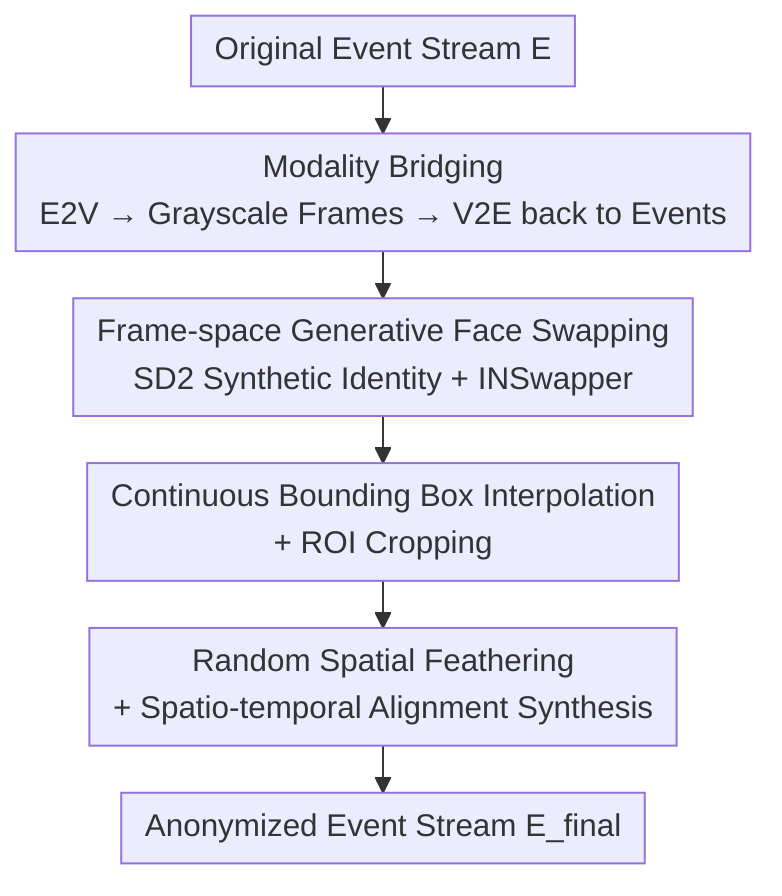

# Generative Anonymization in Event Streams

**Conference**: CVPR 2026  
**arXiv**: [2604.12803](https://arxiv.org/abs/2604.12803)  
**Code**: https://github.com/muelleradam/KinematicEvent-HumanUpperBody-2026 (Available, with accompanying dataset)  
**Area**: Image Generation / Privacy Protection / Neuromorphic Vision  
**Keywords**: Event cameras, generative anonymization, face swapping, Event-to-Video, utility-privacy trade-off

## TL;DR
Addressing the privacy vulnerability where facial identities can be reconstructed from event streams via E2V models, this paper proposes the first **generative anonymization** pipeline for event streams. It projects asynchronous events into grayscale frames, replaces faces with synthetic identities using off-the-shelf RGB face-swapping models, and projects them back to the event domain via V2E. This approach eliminates original identity while preserving the spatio-temporal structure required for downstream perception.

## Background & Motivation
**Background**: Event cameras (neuromorphic vision sensors) are known for microsecond latency, high dynamic range, and low power consumption, making them ideal for human-centric scenarios like autonomous driving, robotics, and smart surveillance. For a long time, a "passive assumption" existed—that event streams only encode sparse point clouds of brightness changes without absolute intensity, thus precluding biometric leakage.

**Limitations of Prior Work**: This assumption has been shattered by deep learning. SOTA Event-to-Video (E2V, e.g., E2VID/FireNet/ET-Net) models can reconstruct high-fidelity intensity images from raw event streams, effectively inverting "harmless" events into clear faces and creating a serious privacy loophole. Existing event privacy methods (spatial shuffling, adversarial noise, event pulse encryption, e.g., EventAnon, AnonyNoise) rely on **destructive obfuscation**: deliberately perturbing or shifting event coordinates to prevent re-identification. The cost is the destruction of the original local spatio-temporal structure, leading to significant performance drops in fine-grained tasks like facial expression recognition and dense tracking.

**Key Challenge**: Destructive obfuscation pits "privacy" against "utility"—protecting reconstruction at the cost of data utility. This is a problem the RGB image domain has already solved using **generative anonymization** (DeepPrivacy, CIAGAN, LDFA, etc.), which replaces real faces with synthesized identities that retain semantics, pose, and gaze. However, these strong generative priors require dense synchronous spatial tensors and cannot natively process asynchronous sparse event streams.

**Goal**: To introduce generative anonymization to the event domain for the first time, achieving "face-swap level" identity replacement without destroying spatio-temporal structures.

**Key Insight**: Rather than training a generative model that directly consumes asynchronous events, it is better to **leverage intermediate intensity representations**. Since E2V can convert events into frames and V2E can convert frames back into events, one can reuse mature RGB face-swapping models in the frame space by performing modality conversions at both ends.

**Core Idea**: A bridge pipeline of "Event → Intensity Frame → Face Swap → Intensity Frame → Event" to transfer mature RGB generative anonymization capabilities to the neuromorphic domain.

## Method

### Overall Architecture
The pipeline resolves the modality gap between "asynchronous sparse events" and "standard spatial generative models." First, E2V (FireNet) within the EVREAL framework is used to convert the raw event stream into $K$ synchronous grayscale frames. Faces are detected and replaced in the frame space, and the anonymized frames are then projected back to the event domain using v2e. The difficulty lies in post-processing—the synthetic face events must be precisely "pasted" back into the corresponding spatio-temporal positions of the original background event stream. This requires a compensation mechanism involving continuous bounding box interpolation, ROI cropping, feathering, and spatio-temporal alignment.

### Key Designs

**1. Modality Bridging: Connecting Events ↔ Generative Models via Intermediate Intensity**

The pain point is that asynchronous events $E=\{e_i\}_{i=1}^N$ (where each event $e_i=(x_i,y_i,t_i,p_i)$ includes microsecond timestamps and polarity $p_i\in\{-1,+1\}$) cannot be directly fed into face generation models that expect dense spatial tensors. This paper avoids retraining a native event generator by using E2V (via EVREAL) to convert sparse event streams into $K$ synchronous intensity frames. All generative operations are performed in the frame domain, and the results are projected back to events via v2e. This bridges "mature RGB swapping priors" with "neuromorphic data." While the pipeline is not native to the event domain (as the authors acknowledge), it allows for the direct reuse of stable industrial face-swapping and super-resolution components.

**2. Frame-space Generative Face Swapping: Replacing with a Non-existent Identity**

Destructive obfuscation ruins data by "disrupting the real face" to prevent reconstruction; generative anonymization does the opposite—it **replaces the entire real face with a synthetic identity that does not exist in the real world**, while preserving semantics, pose, and expression. Specifically, the face bounding box $B_k=(x_{1,k},y_{1,k},x_{2,k},y_{2,k})$ is detected in the $k$-th frame. Stable Diffusion 2 (SD2) is used to generate a synthetic target identity, and the open-source INSwapper-128 model replaces the original face. Since the swapping prior has limited resolution, the output is further refined using FSRCNN (4x super-resolution), CLAHE (contrast equalization), and unsharp masking to ensure sufficient detail when projected back to the event domain. Consequently, when an attacker performs E2V reconstruction on the final stream, they obtain a realistic but entirely new identity, fully protecting the original subject.

**3. Continuous Bounding Box Interpolation and ROI Cropping: Precision Alignment on the Microsecond Timeline**

Frames are discrete (at time $T_k$), but events are microsecond-continuous; using discrete bounding boxes to crop events would lead to misalignment. This work uses 1D piecewise linear interpolation to derive a continuous bounding box function $B(t)$. For any event $e_i$ falling within $T_k\le t_i<T_{k+1}$, the top-left x-coordinate is interpolated as $x_1(t_i)=x_{1,k}+\frac{x_{1,k+1}-x_{1,k}}{T_{k+1}-T_k}(t_i-T_k)$, with similar logic for $y_1, x_2, y_2$. This produces a continuously moving bounding box in the 3D spatio-temporal volume. Events are then branched: those inside the box $E_{ROI}=\{e_i\in E\,|\,x_1(t_i)\le x_i\le x_2(t_i)\wedge y_1(t_i)\le y_i\le y_2(t_i)\}$ are replaced with synthetic face events, while those outside $E\setminus E_{ROI}$ serve as the background. This step ensures "face-swapping" aligns at microsecond resolution, a key compensation differentiating event-domain from frame-domain anonymization.

**4. Random Spatial Feathering and Spatio-temporal Alignment Synthesis: Eliminating Hard Edges**

Directly cutting the background with a binary threshold leaves harsh artificial boundaries. The paper introduces **random spatial feathering** inspired by Gaussian mixtures. Events within the box are not fully retained; instead, they are kept based on a semi-Gaussian probability decay relative to the distance $d$ from the boundary $\partial B(t_i)$: $P(e_i\in E_{bg})=\exp\!\big(-d(e_i,\partial B(t_i))^2/2\sigma^2\big)$ (outside events have a probability of 1). $\sigma$ controls the transition width, creating a smooth event density gradient between the background and replaced region. Subsequently, **spatio-temporal alignment synthesis** is performed: using the bounding box center as a reference, dynamic affine transforms map the synthetic face event $E_{anon}$ coordinates to the target ROI via $x_i'=c_{tgt,x}(t_i)+\big(\frac{x_i-c_{anon,x}(t_i)}{w_{anon}(t_i)}\big)w_{tgt}(t_i)$ (similarly for $y$). Finally, mapped fill events are merged with the background and sorted by time to produce $E_{final}=E_{bg}\cup E'_{anon}$.

### Loss & Training
This is a **zero-training modular inference pipeline**. No new networks are trained: E2V (FireNet), face swapping (INSwapper), identity generation (SD2), super-resolution (FSRCNN), and V2E (v2e) all utilize pre-trained models. There is no end-to-end loss function. This engineering-centric approach—relying on the combination of mature components rather than retraining—distinguishes it from EventAnon/AnonyNoise.

## Key Experimental Results

### Main Results
Evaluated on a self-collected synchronized RGB-event dataset, using FireNet for E2V and INSwapper-128 + SD2 for face swapping. Anonymization performance and feature retention (image space):

| Metric | Anonymization (Source→Synthetic) | Reference (Same subject, two collections) | Interpretation |
|------|------|------|------|
| Identity Similarity ↓ | **0.118** | 0.713 | Identity similarity plunged from 0.713 to 0.118; original identity effectively erased. |
| Temporal Stability ↑ | 0.770 | 0.760 | Synthetic identity shows almost no jitter across frames, matching natural variation. |
| Pose Error ↓ / ° | 3.304 | 2.613 | Head pose is highly preserved (difference is comparable to natural capture variance). |
| Mimicry Error ↓ | **0.181** | 0.239 | Expression transfer error is lower than natural variation between two captures. |

Event-domain structural anonymization (Tab. 3): STCD increased from 0.0099 (Reference) to 0.3143 (>31x), and EMD rose from 0.0085 to 0.1276. This indicates that the synthetic face creates a distinct 3D structural topology in the event space, showing a significant global distribution shift.

### Downstream Tasks (Utility Preservation)

| Metric | Ours | Baseline/Ref | Explanation |
|------|------|------|------|
| YOLO Confidence ↑ | 0.894 | 0.937 | Frame-domain face detection confidence remains stable. |
| YOLO IoU ↑ | 0.960 | — | Detection boxes are highly aligned with the baseline. |
| YOLO Det. Rate Err ↓ | 0.000 | — | **Zero degradation** in overall detection recall. |
| Event IoU ↑ | 0.702 | — | Event-domain detection boxes remain well-aligned; spatio-temporal structure preserved. |

### Key Findings
- **Simultaneous Privacy and Utility**: The 6x drop in Identity Similarity and 31x increase in STCD show thorough identity replacement. Meanwhile, zero YOLO detection rate error, 0.960 IoU, and 0.181 expression error suggest almost no loss in utility—breaking the traditional utility-privacy trade-off.
- **Expression Error Smaller than Natural Variation** (0.181 < 0.239): The generative pipeline faithfully transfers source expressions without introducing additional synthesis bias, a core advantage over "perturbation-based" methods.
- **V2E Back-projection Density is Critical**: Insufficient event density during back-projection leads to severe smearing and structural degradation in E2V reconstruction. Qualitative results show black smearing artifacts around synthetic faces due to imperfect spatio-temporal merging.

## Highlights & Insights
- **Leveraging Frame-space Mature Priors**: Rather than forcing the training of a generator for asynchronous events, using E2V/V2E as a bridge to port the entire RGB ecosystem (SD2+INSwapper+FSRCNN) is a pragmatic engineering move.
- **Continuous Interpolation + Semi-Gaussian Feathering**: These are specialized "fine-tuning" steps for the event domain. Since events are continuous microsecond point clouds, discrete frame boxes must be interpolated, and boundaries must be feathered probabilistically to avoid hard edges and misalignments.
- **Proposed STCD/EMD Metrics**: Treating event streams as 3D point clouds, the authors use Spatio-temporal Chamfer Distance (KD-Tree) and Event Mover's Distance (via sliced Wasserstein approximation) to quantify structural shifts, filling a gap in event-space anonymization evaluation.
- **Clever Dataset Design**: Sensors were mounted on a collaborative robot (cobot) following pre-programmed trajectories while subjects read short texts to induce micro-expressions/lip movements without large body motions. This cleanly decoupled camera motion from human motion to evaluate spatio-temporal integrity.

## Limitations & Future Work
- **Dependency on Intermediate Frames**: The pipeline is not native to events; it relies on discrete grayscale frames. Developing a spatio-temporal generative model that performs face swapping directly on raw asynchronous pulses remains an open challenge.
- **V2E Simulator Constraints**: Back-projection quality is limited by the v2e simulator; density gaps cause discretization/smearing artifacts in the replaced face area (as shown in Fig. 3).
- **Small Scale and Weak Comparison**: Validation focused on a self-collected dataset. The "reference" for Pose/Mimicry was natural variance between captures. Direct quantitative comparisons against destructive methods like EventAnon/AnonyNoise on the same downstream tasks are limited.
- **Futures**: Density-aware event completion during the V2E phase could eliminate smearing. Alternatively, face-swapping constraints could be embedded into differentiable E2V/V2E pipelines for end-to-end native event-domain anonymization.

## Related Work & Insights
- **vs EventAnon / AnonyNoise (Destructive)**: These methods inject learnable noise or shuffle coordinates. Ours replaces the face with a synthetic identity. While the former destroys spatio-temporal structure (affecting fine-grained tasks), ours preserves it (zero YOLO degradation).
- **vs E2PRIV**: E2PRIV embeds anonymization into the E2V reconstruction process without altering the raw events, leaving them vulnerable to direct event-space attacks. Ours rewrites the stream itself for native protection.
- **vs LDFA / DeepPrivacy / CIAGAN (RGB Generative)**: This work ports these mature frame-domain paradigms to the event domain. The core contribution is the modality bridging and microsecond-level spatio-temporal alignment required for asynchronous sparse data.

## Rating
- Novelty: ⭐⭐⭐⭐⭐ First generative anonymization framework for event streams; proposes STCD/EMD metrics and a cobot dataset.
- Experimental Thoroughness: ⭐⭐⭐⭐ Solid evaluation across privacy, utility, and structural metrics, though lacks direct large-scale comparisons with destructive SOTA.
- Writing Quality: ⭐⭐⭐⭐ Clear motivation, complete formulas, and well-explained pipeline/metrics.
- Value: ⭐⭐⭐⭐⭐ Directly addresses privacy compliance for neuromorphic sensors; the engineering paradigm is highly reusable.

<!-- RELATED:START -->

- **EventAnon**: Obfuscating events via learned perturbations.
- **AnonyNoise**: Adversarial noise injection for event privacy.
- **E2VID/FireNet**: SOTA Event-to-Video reconstruction foundations.

<!-- RELATED:END -->

## Related Papers

- [\[CVPR 2026\] Texvent: Asynchronous Event Data Simulation via Text Prompt](texvent_asynchronous_event_data_simulation_via_text_prompt.md)
- [\[CVPR 2026\] Exploring Spatial Intelligence from a Generative Perspective](exploring_spatial_intelligence_from_a_generative_perspective.md)
- [\[CVPR 2026\] gQIR: Generative Quanta Image Reconstruction](gqir_generative_quanta_image_reconstruc_tion.md)
- [\[CVPR 2026\] Efficient Weighted Sampling via Score-based Generative Models](efficient_weighted_sampling_via_score-based_generative_models.md)
- [\[CVPR 2026\] Transition Models: Rethinking the Generative Learning Objective](transition_models_rethinking_the_generative_learning_objective.md)

<!-- RELATED:END -->
