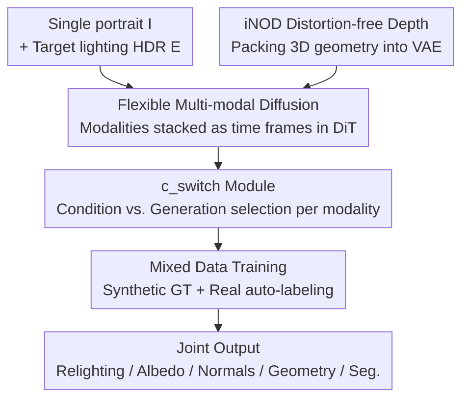

# GeoRelight: Learning Joint Geometrical Relighting and Reconstruction with Flexible Multi-Modal Diffusion Transformers

**Conference**: CVPR2026  
**arXiv**: [2604.20715](https://arxiv.org/abs/2604.20715)  
**Code**: Project Page https://yuxuan-xue.com/georelight  
**Area**: Image Generation / Relighting / Multi-modal Diffusion / Single-image 3D Reconstruction  
**Keywords**: Portrait Relighting, Multi-modal DiT, Joint Geometric Reconstruction, iNOD depth representation, Mixed data training

## TL;DR
GeoRelight integrates "portrait relighting" and "3D geometric reconstruction" into a single multi-modal Diffusion Transformer for **joint denoising**. By utilizing iNOD—a VAE-friendly, distortion-free depth representation that enables 3D geometry to enter the latent space—and a mixed training strategy combining synthetic and auto-labeled real data to bridge the sim-to-real gap, the model produces photorealistic relighting, intrinsic albedo, surface normals, and high-fidelity 3D shapes from a single image. It outperforms specialized SOTA methods across relighting, geometry, and intrinsic estimation tasks.

## Background & Motivation
**Background**: Changing the illumination of a single portrait image (relighting) is a core task in graphics and vision, with applications ranging from creative editing and computational photography to VR and film post-production. However, it is a highly ill-posed problem, as a 2D image entangles 3D geometry, intrinsic appearance (e.g., albedo), and scene lighting. Authentic relighting necessitates the explicit or implicit decoupling of these factors.

**Limitations of Prior Work**: Existing learning-based methods fall into two categories, each with significant drawbacks. One category consists of end-to-end "translator" models (e.g., NeuralGaffer, IC-Light) that map pixels to pixels without **geometric modeling**. Consequently, they fail to produce realistic shadows and highlights consistent with the human 3D shape, leading to low physical plausibility. The other category uses **serial pipelines** (Total Relighting, DiffusionRenderer, etc.), which first estimate intermediate buffers like albedo and normals before passing them to a separate neural rendering module. Their fatal flaw is **error accumulation**: any bias in the geometry estimation phase is baked into the buffers, and the downstream renderer cannot correct these errors.

**Key Challenge**: Relighting requires accurate geometry to generate local shading and correct cast shadows; conversely, shading in images provides strong shape-from-shading cues that can refine geometric estimation. Thus, **relighting and geometric reconstruction are mutually beneficial, yet prior methods decouple them into serial steps**. Even recent joint denoising frameworks like UniRelight only extend joint estimation to albedo, lacking explicit 3D geometric modeling.

**Goal**: To develop a unified generative framework that simultaneously solves for the relighted image, intrinsic albedo, surface normals, and 3D geometry, enabling bi-directional information flow between tasks.

**Key Insight**: Leveraging the dense self-attention of a Diffusion Transformer allows multiple modalities to exchange information in parallel. However, to fit 3D geometry into a latent diffusion model based on a pre-trained 2D VAE, standard representations (point maps, normalized depth) suffer from VAE compression artifacts or anisotropic distortion. Thus, a VAE-friendly geometric representation is required.

**Core Idea**: Treat "modalities as video frames" stacked into a multi-modal DiT for joint denoising, coupled with a distortion-free iNOD depth representation and a mixed training strategy using a `c_switch` to flexibly toggle between "condition" and "generation" modes.

## Method

### Overall Architecture
GeoRelight is built upon a pre-trained Video Latent DiT. Given a single portrait $\mathbf{I}$ under unknown lighting, the model jointly denoises the latent variables of **five target modalities**: intrinsic albedo $\mathbf{z}^{\mathbf{a}}$, segmentation mask $\mathbf{z}^{\mathbf{s}}$, surface normals $\mathbf{z}^{\mathbf{n}}$, geometric shape $\mathbf{z}^{\mathbf{g}}$, and the final relighted image $\mathbf{z}^{\mathbf{I}_\mathbf{E}}$. The system is guided by two types of conditions: a global image condition $\mathbf{z}^{\mathbf{I}}$ (concatenated to all five modalities to ensure identity, shape, and texture consistency) and a lighting condition $\mathbf{z}^{\mathbf{E}}$ (concatenated only to the relighted image modality). Three technical problems are addressed: making the architecture multi-modal (Flexible Multi-Modal Diffusion), fitting 3D geometry into the VAE latent space (iNOD), and learning photorealism without geometric ground truth for real images (Mixed Data Training).

### Key Designs

**1. Flexible Multi-Modal Diffusion: Masking Modalities as Video "Frames"**

The challenge is enabling a single DiT to process heterogeneous modalities like images, albedo, normals, geometry, and segmentation. Inspired by UniRelight, the authors reinterpret the time dimension $T$ of a video DiT latent $\mathbf{z}\in\mathbb{R}^{T\times H\times W\times C}$ as a **modality dimension $M$**. Thus, five modalities are stacked like video frames, and dense self-attention naturally allows cross-modal information exchange. To identify each "frame," a learnable modality type embedding $\mathbf{c}_{\text{modal}}\in\mathbb{R}^{M\times C_{\text{type}}}$ is broadcast and concatenated. Furthermore, because pixels $(x,y)$ must align across modalities, the original 3D RoPE is replaced with a **2D spatial RoPE** shared across all modalities, making modality "positions" indistinguishable while preserving spatial locations.

**2. c_switch Modality Switch: A Unified Mask for Condition and Generation**

To avoid training separate models for different input-output combinations, a modality switch mask $\mathbf{c}_{\text{switch}}\in\mathbb{R}^{H\times W\times 1}$ is concatenated to each modality. A value of 1 identifies a "clean" input condition (which the model conditions on), while 0 indicates a "noisy" target to be generated. This binary switch allows the same weights to be configured arbitrarily—during inference, the model can generate all modalities from noise or use any subset of modalities as clean conditions to guide the rest. This is also the core enabler for mixed data training.

**3. iNOD: Isotropic Orthographic Depth for VAE-Friendly 3D Geometry**

Addressing the hurdle of 3D geometry in latent diffusion: standard 3-DoF point maps become extremely noisy after lossy VAE compression. Traditional depth maps require normalization to $[-1,1]$, but per-image normalization along the z-axis (as in Marigold) **distorts 3D shapes anisotropically** and prevents 3D reconstruction without camera intrinsics. iNOD back-projects synthetic metric depth into a metric point cloud and applies **isotropic 3D normalization**. Instead of scaling only the z-axis, the entire 3D geometry is scaled into a $[-1,1]$ bounding box based on its longest side, preserving relative geometry and aspect ratios. The normalized shape is then **orthographically projected** along the XY plane to obtain a 2D depth map of z-values. This results in a 1-DoF VAE-friendly image that preserves 3D structure; because the normalization is isotropic, **a simple orthographic back-projection recovers the 3D shape without requiring camera intrinsics**.

**4. Strategic Mixed Post-training: Leveraging c_switch for Diverse Data Sources**

To overcome the "sim-to-real gap," where synthetic data has perfect GT but lacks realism and real images lack geometric labels, the authors first train on synthetic data for 30K steps. Observing that the synthetic model estimates intrinsics and geometry well, they use it to **auto-label** two types of real data: high-quality light stage data (Dome) and large-scale in-the-wild (ITW) data. Using the flexibility of $\mathbf{c}_{\text{switch}}$, the ITW data is trained in "Intrinsic→Relit" mode: the auto-labeled intrinsics are set as clean conditions ($\mathbf{c}_{\text{switch}}=1$), forcing the model to denoise the real photo itself. This allows the model to learn photorealistic appearances **without requiring paired relighting GT**.

### Loss & Training
The model is optimized using the standard denoising score matching objective. The DiT is initialized from the DiffusionRenderer-Cosmos-7B inverse rendering model, reusing and freezing its pre-trained Cosmos causal VAE. Training consists of two stages: 30K steps on synthetic data followed by 10K steps on mixed data. The batch size is 128 at $832\times1280$ resolution. Training takes approx. 5 days on 64 A100s. Inference for all five modalities takes ~35 seconds on a single A100.

## Key Experimental Results

### Main Results
In relighting evaluations (across Synthetic, Light Stage, and HumanOLAT datasets using foreground metrics), GeoRelight significantly outperforms open-source baselines:

| Dataset | Metric | GeoRelight | DiffusionRenderer | NeuralGaffer | IC-Light |
|------|------|------|------|------|------|
| Synthetic | PSNR↑ | **27.22** | 19.28 | 18.84 | 18.49 |
| Synthetic | LPIPS↓ | **0.057** | 0.119 | 0.105 | 0.113 |
| LightStage | PSNR↑ | **25.87** | 21.09 | 18.88 | 20.90 |
| HumanOLAT | PSNR↑ | **21.17** | 17.58 | 20.77 | 19.79 |

For geometric reconstruction (Synthetic data, after normalization and ICP alignment) compared to specialized SOTA:

| Method | Acc.↓ | Comp.↓ | CD↓ | F-Score↑ |
|------|------|------|------|------|
| VGGT | 4.06 | 2.68 | 3.37 | 21.05 |
| MoGe2 | 4.07 | 3.02 | 3.54 | 23.96 |
| **Ours** | **0.71** | **0.82** | **0.766** | **81.56** |

### Ablation Study
Verification of the "joint modeling synergy" (Synthetic data):

| Note | Relight PSNR↑ | Relight LPIPS↓ | Normal Ang.↓ | Point CD↓ |
|------|------|------|------|------|
| w/o Geometry | 21.19 | 0.0286 | - | - |
| w/ GT Geometry | 26.96 | 0.0138 | - | - |
| Joint Modeling | **27.49** | **0.0149** | - | - |
| w/o Appearance | - | - | 12.24 | 1.00 |
| Joint Modeling | - | - | **9.10** | **0.58** |

### Key Findings
- **Geometry is necessary for relighting**: Removing joint geometry generation (w/o Geometry) drops relighting PSNR from 27.49 to 21.19. Notably, "Joint Modeling" slightly outperforms using "GT Geometry" (27.49 vs 26.96), suggesting joint denoising is more harmonious than hard-coding GT.
- **Relighting provides shape-from-shading**: Using the relighted image as a condition reduces normal angular error from 12.24 to 9.10, proving shading cues aid geometric refinement.
- **ITW data corrects "dark bias"**: Training only on synthetic/dome data causes a bias toward dark outputs due to sparse light stage lighting; ITW data balances the illumination.
- **iNOD generalizes beyond humans**: It faithfully encodes 3D geometry as long as the Depth-to-Height ratio is reasonable (0.1 to 3.0).

## Highlights & Insights
- **"Modality as time frame"** is a brilliant bit of engineering reuse, enabling a multi-task architecture with zero structural changes to a video DiT.
- **iNOD** solves the geometric representation dilemma by maintaining isotropic scales, allowing distortion-free 3D reconstruction without camera intrinsics.
- **c_switch** unifies "condition vs. generation" into a binary flag, allowing the same weights to adapt to varying data availability during training.
- **The Synergy Effect**: The fact that joint modeling outperforms GT-conditioned pipelines validates that end-to-end collaborative denoising is superior to the serial "estimate-then-render" paradigm.

## Limitations & Future Work
- **Dependency on synthetic labels**: The initial iNOD labels rely on synthetic metric depth; errors in these pseudo-labels may propagate.
- **Degradation in extreme scenes**: iNOD may struggle with extremely elongated scenes (e.g., tunnels with D:H > 10) due to depth range compression.
- **Efficiency**: The 7B parameter DiT requires ~35s for inference, hindering real-time applications.

## Related Work & Insights
- **vs. Translators (NeuralGaffer/IC-Light)**: These lack geometric modeling and fail on physical shadow consistency. Ours leads in photorealism through explicit 3D joint modeling.
- **vs. Serial Pipelines (Total Relighting/DiffusionRenderer)**: They suffer from error accumulation. Ours enables mutual correction between geometry and lighting.
- **vs. Specialized Estimators (VGGT/MoGe2/Sapiens)**: While these estimators often produce over-smoothed results, GeoRelight’s generative joint modeling achieves higher geometric precision (CD 0.766 vs 3.37).

## Rating
- Novelty: ⭐⭐⭐⭐⭐
- Experimental Thoroughness: ⭐⭐⭐⭐⭐
- Writing Quality: ⭐⭐⭐⭐
- Value: ⭐⭐⭐⭐⭐

<!-- RELATED:START -->

## Related Papers

- [\[CVPR 2025\] SyncVP: Joint Diffusion for Synchronous Multi-Modal Video Prediction](../../CVPR2025/image_generation/syncvp_joint_diffusion_for_synchronous_multi-modal_video_prediction.md)
- [\[CVPR 2026\] Learning Latent Proxies for Controllable Single-Image Relighting](learning_latent_proxies_for_controllable_single-image_relighting.md)
- [\[CVPR 2026\] PhotoFramer: Multi-modal Image Composition Instruction](photoframer_multi-modal_image_composition_instruction.md)
- [\[ICLR 2026\] LazyDrag: Enabling Stable Drag-Based Editing on Multi-Modal Diffusion Transformers via Explicit Correspondence](../../ICLR2026/image_generation/lazydrag_enabling_stable_drag-based_editing_on_multi-modal_diffusion_transformer.md)
- [\[ICCV 2025\] Joint Diffusion Models in Continual Learning](../../ICCV2025/image_generation/joint_diffusion_models_in_continual_learning.md)

<!-- RELATED:END -->
