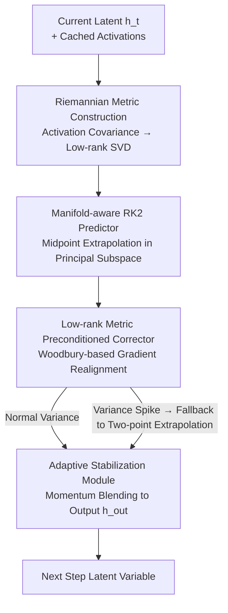

# GeoRK2: Geometry-Guided Runge-Kutta Integration for Diffusion Transformer Acceleration

**Conference**: CVPR 2026  
**Paper**: [CVF Open Access](https://openaccess.thecvf.com/content/CVPR2026/html/Sun_GeoRK2_Geometry-Guided_Runge-Kutta_Integration_for_Diffusion_Transformer_Acceleration_CVPR_2026_paper.html)  
**Code**: None  
**Area**: Diffusion Models  
**Keywords**: Diffusion Acceleration, Diffusion Transformer, Riemannian Manifold, Runge-Kutta Integration, Training-free Sampling  

## TL;DR
GeoRK2 reformulates the few-step sampling of Diffusion Transformers as "second-order Runge-Kutta integration on a Riemannian manifold induced by feature covariance." It replaces the default numerical updates of existing samplers with a training-free, plug-and-play "Predictor-Corrector" module, achieving 4–5× acceleration on ImageNet/FLUX/HunyuanVideo with almost no quality loss ($\Delta$FID≈0.81).

## Background & Motivation
**Background**: Diffusion Transformers (DiT, FLUX, HunyuanVideo) achieve state-of-the-art synthesis quality but require dozens to hundreds of sequential neural function evaluations (NFE) for image denoising, leading to high inference latency. Training-free acceleration typically follows two paths: numerical ODE solvers (e.g., DDIM, DPM-Solver++) that perform high-order discretization of the probability flow ODE in data space, and predictor-corrector frameworks (e.g., TaylorSeer, ToCa) that estimate future states via Taylor expansion/extrapolation in feature space.

**Limitations of Prior Work**: Both approaches suffer from distorted intermediate features and degraded fidelity when steps are aggressively reduced (e.g., 10–25 steps). The authors identify the root cause as the **implicit assumption of an isotropic, flat Riemannian metric**, which leads to the use of Euclidean vector operations (linear interpolation, L2 correction) in both data and feature spaces.

**Key Challenge**: Intermediate features learned by deep networks actually lie on a low-dimensional Riemannian manifold (measurements on DiT-XL/2 and FLUX show that the top-64 principal directions explain 99%+ of the variance, and denoising trajectories deviate from Euclidean linear predictions by up to 12%). Numerical integration in flat space **cuts across the manifold curvature** instead of following geodesics, causing the denoising state to progressively deviate from the feature manifold implicitly defined by the pre-trained model—a phenomenon the authors call **manifold drift**. As step size increases, this drift accumulates faster, manifesting as dynamic instability and fidelity loss, which limits the achievable acceleration ratio.

**Goal**: Push the acceleration ratio to 4–5× while maintaining quality by making large-step integration "manifold-aware" to suppress drift, without retraining or modifying the architecture.

**Core Idea**: Treat sampling as "solving a probability flow ODE on the Riemannian feature manifold induced by the pre-trained network." Estimate the metric directly via activation covariance and use a metric-respecting second-order RK2 predictor combined with a low-rank metric preconditioned corrector to ensure the integration path adheres to the manifold.

## Method

### Overall Architecture
GeoRK2 is a lightweight PyTorch wrapper. During the forward pass, it intercepts intermediate activations from several bottleneck layers ($\ell\in\{6,12,18,24\}$), online estimates a **low-rank Riemannian metric**, and replaces the default numerical updates of the original sampler (e.g., DDIM/DPM-Solver) with a "Predictor-Corrector" module at each step. The pipeline conceptually consists of three stages: **Metric Construction** from activation covariance (capturing feature anisotropy to decide which directions allow aggressive steps); a **Manifold-aware RK2 Predictor** that extrapolates latent variables over large intervals while restricting extrapolation to the principal subspace; and a **Metric Preconditioned Corrector** that pulls the prediction back toward the true Riemannian gradient direction, backed by an **Adaptive Stabilization Module** (variance-triggered fallback + momentum blending) to handle anomalies under aggressive step sizes.

The metric is founded on defining the local covariance of mean-removed activations $H_t^{(\ell)}\in\mathbb{R}^{d_\ell\times B}$ (for $B$ spatial tokens) at layer $\ell$ and timestep $t$:

$$G_t^{(\ell)} = \tfrac{1}{B}H_t^{(\ell)}\bigl(H_t^{(\ell)}\bigr)^\top + \varepsilon I_{d_\ell},\quad \varepsilon=10^{-6}.$$

This serves as a pull-back metric, translating feature space anisotropy into latent space step sizes: aggressive updates in directions with large eigenvalues risk overshooting, while acceleration in directions with small eigenvalues is safe. The denoising objective is to minimize the prediction error energy $U(h_t)=\tfrac{1}{2}\lVert h_t-F(h_t,t)\rVert^2$, whose Riemannian gradient flow is $\dot{h}_t=-\Pi_{T_{h_t}\mathcal{M}}\bigl[G_{\text{eff}}(h_t)^{-1}\nabla U(h_t)\bigr]$, where $G_{\text{eff}}=\sum_{\ell\in L}\alpha_\ell G_t^{(\ell)}$ fuses four bottleneck layers and $\Pi$ projects onto the principal feature subspace. Direct integration is infeasible due to $O(d_\ell^3)$ complexity (with $d_\ell=1152$ in DiT), so a low-rank approximation $G_t^{(\ell)}\approx U_{r,t}\Sigma_{r,t}U_{r,t}^\top+\varepsilon I$ is used by retaining top-$r$ ($r\approx48$–$72$) directions, reducing complexity to $O(d_\ell r^2)$ with <0.5% FID degradation.

### Key Designs

**1. Manifold-aware RK2 Predictor (Projection-as-Retraction): Preventing Drift during Large-step Extrapolation**

Standard RK2 achieves second-order accuracy by evaluating a midpoint, but in high dimensions, most directions are noise; blind extrapolation can push the state into low-confidence regions where the metric is ill-defined. GeoRK2 **restricts extrapolation to the top-$r$ feature subspace**: given the feature velocity $v_t$ estimated from recent latents, the projected midpoint $h_{\text{mid}}=U_{r,t}U_{r,t}^\top\bigl(h_t+\tfrac{\Delta t}{2}v_t\bigr)$ acts as a geometric filter—suppressing components orthogonal to the manifold to prevent drift. The midpoint velocity $v_{\text{mid}}=(F(h_{\text{mid}})-h_{\text{mid}})/\Delta t$ is then calculated to obtain the prediction $h_{\text{pred}}=U_{r,t}U_{r,t}^\top\bigl(h_t+\Delta t\,v_{\text{mid}}\bigr)$. This design elegantly avoids expensive exponential maps (geodesics) in Riemannian optimization by using "orthogonal projection onto the principal subspace" as a first-order retraction. Retaining 99% of the variance makes the projection error second-order negligible ($\lim_{\lVert\Delta h\rVert\to0}\lVert\exp_{h_t}(\Delta h)-P_{S_t}(h_t+\Delta h)\rVert/\lVert\Delta h\rVert=O(\lVert\Delta h\rVert)$), achieving second-order accuracy at $O(d_\ell r^2)$ cost.

**2. Low-rank Metric Preconditioned Corrector: Realignment via True Curvature**

RK2 assumes constant local curvature, which is violated during noise-level transitions. The correction step uses metric scaling to pull the prediction toward the true Riemannian gradient: $\Delta h_{\text{geo}}=-\lambda\,\bar{G}_{r,t}^{-1}\bigl(h_{\text{pred}}-F(h_{\text{pred}})\bigr)$, where $\bar{G}_{r,t}$ is the exponential moving average of the metric ($\beta=0.9$) to stabilize matrix inversion while remaining responsive to curvature changes. Crucially, inversion utilizes the **Woodbury identity**: $\bar{G}_{r,t}^{-1}=\varepsilon^{-1}I-\varepsilon^{-1}U_{r,t}(\varepsilon I_r+\Sigma_{r,t})^{-1}U_{r,t}^\top$, reducing complexity from $O(d_\ell^3)$ to $O(d_\ell r^2+r^3)$. This step essentially "minimizes the potential function along the most influential directions of the manifold," maintaining feature consistency without high computational cost—providing the curvature compensation missing in Euclidean L2 correction.

**3. Adaptive Stabilization Module: Anomaly Detection for Aggressive Steps**

The "slowly varying metric" assumption can fail catastrophically during phase shifts (e.g., transition from high-noise to low-noise), where acceleration variance spikes. GeoRK2 detects this via a simple statistic: defining acceleration as $a_t=(v_t-v_{t-1})/\Delta t$, if $\mathrm{Var}(a_t)$ exceeds 1.5× (+50%) of the recent median, the system falls back to conservative two-point extrapolation $h_{\text{pred}}=h_t+\Delta t\,v_t$. The final output is stabilized via momentum blending: $h_{\text{out}}=\rho\bigl(h_{\text{pred}}+\Delta h_{\text{geo}}\bigr)+(1-\rho)h_t$ with $\rho=0.85$ to suppress oscillations without sacrificing responsiveness. The fallback triggers in 6–10% of high-speed steps (mainly between steps 200–400 when the model shifts from layout to detail refinement), adding <1% overhead while preventing divergence across 0.3% of random seeds. Combined with metric updates every 5 steps and a 4-step DDIM warmup, this mechanism ensures reliability across various step schedules.

### Loss & Training
GeoRK2 is **entirely training-free** and requires no learnable parameters. A single global hyperparameter configuration ($\lambda=0.1, \rho=0.85, \beta=0.9$, truncation rank $r=64$, window size $n=4$, threshold $\alpha=1.5$) is used across DiT-S/B/XL. Metric updates are amortized via truncated SVD on an activation bank of 1024 tokens every 5 steps. The measured overhead is only 5.1% FLOPs and 3.8% wall-clock time, with <15% VRAM increment, which does not scale with batch size.

## Key Experimental Results

### Main Results (ImageNet-256, DiT-XL/2)
Speed↑ is relative to DDIM-50. GeoRK2 achieves the best FID across all acceleration tiers.

| Method | Steps/Config | Latency(s)↓ | Speed↑ | FID↓ | SSIM↑ |
|:---|:---|:---|:---|:---|:---|
| DDIM-50 | 50 | 8.38 | 1.00× | 2.51 | 0.74 |
| **GeoRK2 (N=2)** | 50 | 4.42 | 1.95× | **2.41** | **0.96** |
| TaylorSeer (N=3) | 50 | 4.82 | 2.54× | 2.73 | 0.92 |
| **GeoRK2 (N=3)** | 50 | 4.84 | 2.70× | **2.67** | 0.94 |
| TaylorSeer (N=5) | 50 | 3.68 | 4.51× | 4.31 | 0.83 |
| FORA (N=5) | 50 | 2.86 | 4.51× | 9.87 | 0.72 |
| **GeoRK2 (N=8)** | 50 | 2.78 | **4.92×** | **3.32** | 0.88 |

At the high-speed tier (4.92×), GeoRK2 lowers FID to 3.32, whereas competitors with similar latency generally score >4.3. On FLUX.1-dev, GeoRK2 (N=5) at 3.52× acceleration achieves the highest scores (ImageReward 0.989, CLIP 34.96), while TeaCache/DBCache drop to 0.878/0.616. On HunyuanVideo, GeoRK2 (N=8) achieves 4.66× acceleration with a VBench score of 80.73, outperforming TaylorSeer's 79.99.

### Ablation Study (DiT-XL/2, N=3, NFE=25)
%FID Degradation is relative to the full model.

| Configuration | FID↓ | SSIM↑ | Latency(s) | Degradation |
|:---|:---|:---|:---|:---|
| GeoRK2 (Full) | **2.31** | 0.94 | 4.84 | – |
| w/o GC (Metric Correction, $\bar{G}_r=I$) | 3.02 | 0.89 | 4.12 | +30.7% |
| w/o RK2 (Degeneracy to Euler) | 2.87 | 0.91 | 4.05 | +24.2% |
| w/o Euclidean (Pure Euclidean RK2 baseline) | 3.41 | 0.86 | 4.82 | +47.6% |

Additionally, using an **instantaneous metric without temporal averaging** increases FID to 3.45, validating that curvature estimation must be temporally smoothed for stability.

### Key Findings
- **Geometric correction is the primary contributor**: Removing metric correction (w/o GC) causes a +30.7% degradation, the largest single drop, proving that Euclidean L2 correction indeed cuts across curvature.
- **Second-order updates are essential**: Replacing RK2 with Euler results in a +24.2% degradation, showing that acceleration requires both geometric correction and second-order accuracy.
- **Truncation rank exhibits a plateau**: Increasing $r$ from 32 to 64 improves FID from 2.89 to 2.31, but moving to 128 only yields 2.28 (diminishing returns), confirming 64 directions capture the dominant 99% spectral energy.
- **Geometry becomes notably smoother**: After projection onto principal eigenvectors, the average curvature of the denoising trajectory $\kappa$ drops from $0.31$ to $0.18$ (−42%). High-curvature trajectories consistently correspond to samples with semantic artifacts. The mean principal angle between adjacent subspaces is only 4.7°, supporting the "retraction projection" assumption.

## Highlights & Insights
- **"Not just shorter, but straighter—on the manifold"**: The authors reframe the acceleration problem from "reducing steps" to "aligning the integration path with geodesics," providing a clean perspective that bridges numerical analysis and information geometry.
- **Clever Projection-as-Retraction**: Using orthogonal projection as a substitute for expensive exponential maps, backed by a proof that projection error is second-order negligible given 99% variance preservation, effectively lowers both theoretical and engineering costs.
- **The synergy of Woodbury + Low-rank + Amortized SVD** turns "online metric estimation + inversion" from an impossibility into a 5.1% overhead process. This engineering logic is transferable to any scenario requiring online second-order information (e.g., natural gradients, Fisher preconditioning).
- **Variance-triggered fallback** identifies phase shifts using a single acceleration variance statistic—a simple yet effective mechanism for ensuring plug-and-play stability.

## Limitations & Future Work
- The authors acknowledge that overhead is small but non-zero (5.1% FLOPs / 3.8% time / <15% VRAM), and metric construction relies on activation buffers. Future work aims to use hypernetworks to generate metrics directly to eliminate online SVD.
- ⚠️ The metric is estimated from a fixed set of bottleneck layers $\{6,12,18,24\}$; the optimal fusion weights $\alpha_\ell$ and cross-architecture generalization were not fully detailed (refer to the original paper).
- The "slowly varying metric" assumption fails during phase shifts. While fallback handles this, the fallback is a return to Euclidean two-point updates, which sacrifices geometric gains. The achievable acceleration ratio under extreme compression is still constrained by this.
- Evaluations are focused on the DiT family (DiT-XL, FLUX, HunyuanVideo); effectiveness on UNet-based diffusion or backbones with significantly different latent space structures has not been verified.

## Related Work & Insights
- **vs. Numerical ODE Solvers (DDIM / DPM-Solver++)**: These treat denoising as solving an ODE in flat Euclidean space; GeoRK2 acknowledges Riemannian curvature in feature space and integrates accordingly. The difference lies in "Flat Assumption vs. Riemannian Metric."
- **vs. Predictor-Corrector Frameworks (TaylorSeer / ToCa)**: These also use prediction+correction in feature space, but their operations remain Euclidean (Taylor extrapolation, causal correction). GeoRK2 constrains both steps with a manifold metric to avoid manifold drift.
- **vs. Caching Strategies (FORA / TeaCache / DBCache)**: Caching often leads to quality collapse in complex text-to-image or video scenarios (e.g., DBCache's ImageReward drops to 0.62, and videos flicker). GeoRK2’s layer-wise metric naturally respects cross-attention and spatiotemporal manifolds, leading to better semantic and temporal consistency.
- **vs. Riemannian Optimization/Integration**: Previous works use natural gradients or Riemannian RK for training-time optimization; GeoRK2 brings these principles to the **inference phase of pre-trained networks**.

## Rating
- Novelty: ⭐⭐⭐⭐⭐ Formalizing manifold drift as an acceleration bottleneck and solving it with Riemannian RK2 is a novel approach.
- Experimental Thoroughness: ⭐⭐⭐⭐ Three tasks, three backbones, multiple acceleration levels, and systematic ablation; however, UNet backbones are missing.
- Writing Quality: ⭐⭐⭐⭐ Clear logic, complete formulas, and a strong conclusion; some hyperparameter settings ($\alpha_\ell$) are briefly mentioned.
- Value: ⭐⭐⭐⭐⭐ Training-free, plug-and-play, 4–5× acceleration with almost no quality loss—high practical value.

<!-- RELATED:START -->

## Related Papers

- [\[ICLR 2026\] Error as Signal: Stiffness-Aware Diffusion Sampling via Embedded Runge-Kutta Guidance](../../ICLR2026/image_generation/error_as_signal_stiffness-aware_diffusion_sampling_via_embedded_runge-kutta_guid.md)
- [\[CVPR 2026\] DDT: Decoupled Diffusion Transformer](ddt_decoupled_diffusion_transformer.md)
- [\[CVPR 2026\] ResCa: Residual Caching for Diffusion Transformers Acceleration](resca_residual_caching_for_diffusion_transformers_acceleration.md)
- [\[CVPR 2026\] Guiding a Diffusion Transformer with the Internal Dynamics of Itself](guiding_a_diffusion_transformer_with_the_internal_dynamics_of_itself.md)
- [\[CVPR 2026\] From Sketch to Fresco: Efficient Diffusion Transformer with Progressive Resolution](from_sketch_to_fresco_efficient_diffusion_transformer_with_progressive_resolutio.md)

<!-- RELATED:END -->
