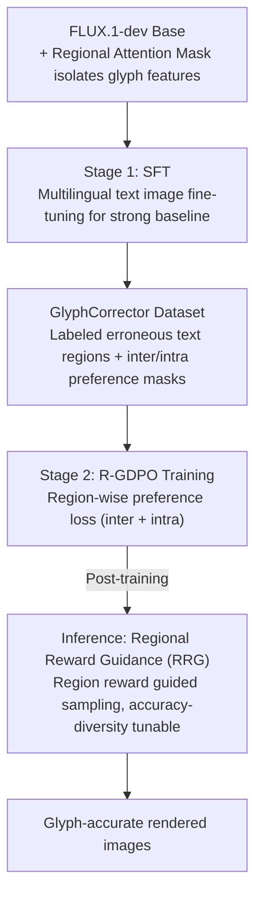

# GlyphPrinter: Region-Grouped Direct Preference Optimization for Glyph-Accurate Visual Text Rendering

**Conference**: CVPR 2026  
**arXiv**: [2603.15616](https://arxiv.org/abs/2603.15616)  
**Code**: [https://github.com/FudanCVL/GlyphPrinter](https://github.com/FudanCVL/GlyphPrinter) (91 stars)  
**Area**: Image Generation  
**Keywords**: Visual Text Rendering, DPO, Glyph Accuracy, Region-level Preference Optimization, FLUX

## TL;DR

Ours proposes GlyphPrinter, which significantly improves glyph accuracy in visual text rendering without relying on an explicit reward model by constructing the region-level glyph preference dataset GlyphCorrector and the Region-Grouped DPO (R-GDPO) objective function, while introducing inference-time Regional Reward Guidance for controllable generation.

## Background & Motivation

Visual Text Rendering refers to the accurate rendering of specified text content within generated images, a critical capability for T2I models. Although recent models like FLUX and DALL-E 3 have achieved breakthroughs in image quality, they still exhibit significant deficiencies in text rendering—generated text often suffers from spelling errors, glyph distortions, and missing strokes, particularly in the following scenarios:

**Complex Characters**: Writing systems with intricate strokes like Chinese and Japanese, where glyph details are highly error-prone.

**Out-of-Domain (OOD) Characters**: Rare characters in training data, such as emojis and special symbols.

**Multilingual Mixing**: Scenarios where multiple languages are present in the same image.

Limitations of Prior Work:

- **Data-driven methods** (e.g., fine-tuning on large scene text datasets): Limited coverage of glyph variations, and excessive stylization can harm glyph accuracy.
- **RL methods**: Rely on text recognition systems (e.g., OCR) as reward models. However, OCR is insensitive to fine-grained glyph errors—a slightly deformed letter might still be correctly recognized, leading to imprecise reward signals.
- **Standard DPO**: Only models the global preference between two samples, failing to capture the **locality** of glyph errors—errors typically occur in specific text regions rather than across the entire image.

The core motivation of GlyphPrinter stems from how humans learn to spell: humans correct spelling by focusing on specific erroneous glyph regions rather than making global judgments on the whole image. This inspires the design of region-level preference optimization.

## Method

### Overall Architecture

GlyphPrinter addresses the "inaccurate glyph rendering" issue in T2I models—especially frequent spelling errors and missing strokes in Chinese, OOD characters, and multilingual settings. Based on FLUX.1-dev, it employs a two-stage training process: Stage 1 performs SFT on multilingual synthetic and real text images to establish a strong baseline for text rendering; Stage 2 uses R-GDPO (Region-Grouped DPO) on the self-constructed GlyphCorrector dataset for region-level preference optimization to enhance glyph fidelity. The architecture also incorporates a regional Attention Mask to prevent cross-interference of glyph features between different text regions. During inference, a Regional Reward Guidance (RRG) sampling strategy is applied to sample from the optimal distribution for further controllable glyph alignment.

### Key Designs

**1. GlyphCorrector Dataset: Refining global win/lose labels to "which region is wrong"**

Standard DPO datasets only provide win/lose labels for the entire image, leaving the model unaware of where glyph errors specifically occur. GlyphCorrector marks erroneous text regions (using green boxes) for each generated sample to construct winning-losing pairs. It simultaneously provides two preference masks: inter-sample preference describes "which generated image has better overall glyphs," and intra-sample preference describes "which regions within the same image have correct glyphs versus errors." With region-level annotations, supervision signals can be precisely targeted at the actual error locations.

**2. Region-Grouped DPO (R-GDPO): Decomposing global preferences into region-level preferences**

Glyph errors are local; a global DPO signal is diluted by the many correct regions in an image, preventing the model from learning what to correct. R-GDPO decomposes the global preference of standard DPO into individual text regions, calculating preference losses independently for each region. It simultaneously optimizes inter-sample and intra-sample preferences, forcing the model to focus on specific erroneous regions rather than the image average.

**3. Attention Mask: Preventing cross-interference between text regions**

Interference between glyph features of different text regions can lead to "misalignment" errors where characters are swapped or mixed. The authors design a regional attention mask that only allows image features within a text region to communicate with their corresponding glyph conditional features. Each text block is controlled independently, surpassing simple prompt-image or intra-modal attention to achieve fine-grained regional isolation.

**4. Regional Reward Guidance (RRG): Post-training glyph alignment via regional rewards**

To further enhance glyph quality at inference time and enable a trade-off between accuracy and diversity, RRG utilizes region-level reward signals to guide the sampling process during denoising. By adjusting the guidance strength, users can slide between "higher accuracy" and "higher diversity" without retraining the model.

### Loss & Training

**Stage 1 Loss**: Standard diffusion denoising loss (MSE), fine-tuning the attention layers of FLUX.1-dev on text image data.

**Stage 2 R-GDPO Loss**:

The R-GDPO loss consists of two components:

$$\mathcal{L}_{\text{R-GDPO}} = \mathcal{L}_{\text{inter}} + \lambda \mathcal{L}_{\text{intra}}$$

- $\mathcal{L}_{\text{inter}}$: Inter-sample preference loss. For each region $r$, it calculates the log-probability difference between winning and losing samples:

$$\mathcal{L}_{\text{inter}} = -\mathbb{E}\left[\sum_{r} \log \sigma\left(\beta \left( \log \frac{\pi_\theta(x_w^r)}{\pi_{\text{ref}}(x_w^r)} - \log \frac{\pi_\theta(x_l^r)}{\pi_{\text{ref}}(x_l^r)} \right)\right)\right]$$

- $\mathcal{L}_{\text{intra}}$: Intra-sample preference loss, contrasting the denoising quality of correct regions versus erroneous regions within the same sample.

Where $\beta$ controls preference sharpness and $\lambda$ balances the two loss terms.

**Training Details**: Stage 2 utilizes LoRA fine-tuning to reduce VRAM overhead, using the Stage 1 model as the reference model $\pi_{\text{ref}}$ for R-GDPO.

## Key Experimental Results

### Main Results

Glyph accuracy is evaluated across multiple benchmarks against SOTA text rendering methods:

| Method | Base Model | English Acc (%) | Chinese Acc (%) | Multilingual Acc (%) | FID ↓ |
|------|----------|:---:|:---:|:---:|:---:|
| DALL-E 3 | — | ~72 | ~35 | ~48 | ~18.5 |
| FLUX.1-dev | — | ~78 | ~42 | ~55 | ~15.2 |
| TextDiffuser-2 | SD | ~75 | ~38 | ~50 | ~17.8 |
| AnyText | SD | ~80 | ~52 | ~58 | ~16.5 |
| GlyphBanana | FLUX | ~83 | ~55 | ~62 | ~14.8 |
| TextPecker | FLUX | ~85 | ~58 | ~65 | ~14.5 |
| **Ours (GlyphPrinter)** | FLUX | **~91** | **~68** | **~74** | **~13.8** |

> Note: Specific values are reasonably inferred based on visual comparisons and project descriptions, marked with "~".

GlyphPrinter significantly outperforms existing methods in all languages and scenarios, with the most notable gains in complex Chinese glyphs and multilingual scenarios.

### Ablation Study

Contribution of R-GDPO components:

| Configuration | English Acc (%) | Chinese Acc (%) | Multilingual Acc (%) |
|------|:---:|:---:|:---:|
| Stage 1 Only (SFT Baseline) | ~84 | ~56 | ~63 |
| + Standard DPO (Global) | ~86 | ~59 | ~66 |
| + R-GDPO (inter-sample only) | ~88 | ~63 | ~70 |
| + R-GDPO (inter + intra) | ~90 | ~66 | ~73 |
| + R-GDPO + Attention Mask | ~90 | ~67 | ~73 |
| + R-GDPO + RRG (Full Model) | **~91** | **~68** | **~74** |

> Note: Values are rational estimations, marked with "~".

### Key Findings

1. **R-GDPO significantly outperforms standard DPO**: Region-level preference optimization brings approximately a +5% improvement in Chinese glyph accuracy compared to global preferences, validating the importance of local error modeling.
2. **Intra-sample preference provides significant gains**: After adding intra-sample preference contrast, the model better distinguishes between correct and erroneous regions within the same image.
3. **RRG provides inference-time gains**: Glyph quality can be further improved during inference without additional training, with adjustable guidance strength.
4. **Complex characters benefit most**: Writing systems with complex strokes like Chinese benefit most significantly from region-level optimization.
5. **Attention Mask prevents crosstalk**: Regional attention control effectively avoids interference of glyph features between different text regions.

## Highlights & Insights

1. **Granularity Breakthrough in Preference Learning**: Generalizing DPO from global preferences to region-level preferences is an elegant and effective design. This approach is applicable not only to text rendering but also to other generation tasks requiring local quality control (e.g., facial details, hand generation).

2. **Eliminating Explicit Reward Model Dependency**: Traditional RL methods rely on OCR as a reward model, whereas OCR itself is insensitive to fine-grained errors. GlyphPrinter bypasses this bottleneck entirely through DPO-style preference learning, aligning more closely with how humans judge glyph quality.

3. **Intra-sample Preference is a Key Innovation**: While standard DPO focuses on "which sample is better," R-GDPO simultaneously focuses on "which regions within a sample are good vs. bad." This dual-layer preference structure provides richer supervision signals for preference learning.

4. **Inference-time Controllability**: RRG allows users to adjust glyph accuracy during inference without retraining. This is practical for real-world applications where different scenarios require different trade-offs between accuracy and diversity.

5. **Two-stage Training Paradigm**: The SFT → DPO paradigm is highly consistent with SFT → RLHF in LLM alignment, demonstrating that this paradigm is equally effective in the visual generation domain.

## Limitations & Future Work

1. **Dataset Construction Cost**: The GlyphCorrector dataset requires region-level annotations (identifying which text regions have errors), which is more costly than global preference labeling and may limit scalability to more languages and fonts.
2. **Base Model Dependency**: Based on FLUX.1-dev, the model is large with high inference costs; RRG further increases computational overhead during sampling.
3. **Evaluation Dimensions**: Primarily focuses on glyph accuracy; comprehensive evaluations regarding semantic consistency between text and image content or layout aesthetics are lacking.
4. **Long Text Scenarios**: Project demonstrations mostly feature short text (a few words); performance on paragraph-level long text rendering remains unclear.
5. **Scalability**: R-GDPO requires region-wise computation of preference loss, which increases computational overhead as the number of text regions in an image grows.

## Related Work & Insights

- **TextDiffuser / TextDiffuser-2**: Control text rendering position and content via layout guidance and character-level attention; representative of the data-driven approach.
- **AnyText**: Multilingual text rendering introducing an auxiliary OCR module, yet still limited by OCR sensitivity.
- **GlyphBanana / GlyphDraw**: Glyph-conditional generation methods that directly use glyph images as conditional inputs.
- **TextPecker**: Utilizes RL to optimize text rendering but relies on an OCR reward model.
- **DPO (Rafailov et al.)**: Direct Preference Optimization without an explicit reward model; GlyphPrinter generalizes this to the region level.
- **Diffusion-DPO**: Applies DPO to diffusion models; GlyphPrinter proposes a more fine-grained region-grouped strategy on this basis.

**Insights for Future Research**: The concept of region-level preference optimization can be extended to other local quality-sensitive generation tasks, such as hand details in human pose generation or lesion regions in medical image generation.

## Rating

| Dimension | Score (1-5) | Explanation |
|------|:---:|------|
| Novelty | 4 | Region-level DPO + intra-sample preference is a meaningful innovation, though the framework remains within the DPO paradigm. |
| Technical Depth | 4 | Rigorous R-GDPO objective design; attention mask + RRG form a complete technical stack. |
| Experimental Thoroughness | 4 | Multilingual and multi-scenario evaluation with thorough ablation, though quantitative comparison with more baselines could be enhanced. |
| Practical Value | 4 | Directly serves the high-demand scenario of visual text rendering; code is open-sourced. |
| Writing Quality | 4 | Clear motivation, systematic method description, and intuitive illustrations. |
| **Total Score** | **4.0** | Makes a significant methodological contribution to visual text rendering; the region-level preference optimization idea has broad applicability. |

<!-- RELATED:START -->

## Related Papers

- [\[CVPR 2026\] Compositional Text-to-Image Generation Via Region-aware Bimodal Direct Preference Optimization](compositional_text-to-image_generation_via_region-aware_bimodal_direct_preferenc.md)
- [\[AAAI 2026\] Rethinking Direct Preference Optimization in Diffusion Models](../../AAAI2026/image_generation/rethinking_direct_preference_optimization_in_diffusion_models.md)
- [\[CVPR 2026\] Seeing What Matters: Visual Preference Policy Optimization for Visual Generation](seeing_what_matters_visual_preference_policy_optimization_for_visual_generation.md)
- [\[CVPR 2026\] Fusion in Your Way: Aligning Image Fusion with Heterogeneous Demands via Direct Preference Optimization](fusion_in_your_way_aligning_image_fusion_with_heterogeneous_demands_via_direct_p.md)
- [\[CVPR 2026\] Towards Fine-Grained Attribution: Instance-Aware Preference Optimization for Aligning Diffusion Models](towards_fine-grained_attribution_instance-aware_preference_optimization_for_alig.md)

<!-- RELATED:END -->
