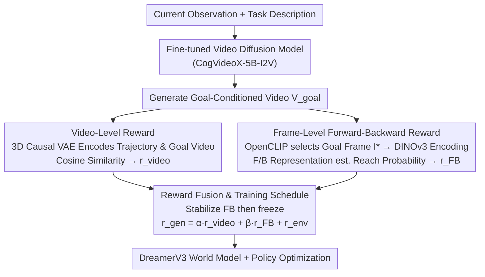

# Goal-Driven Reward by Video Diffusion Models for Reinforcement Learning

**Conference**: CVPR 2026  
**arXiv**: [2512.00961](https://arxiv.org/abs/2512.00961)  
**Code**: [https://qiwang067.github.io/genreward](https://qiwang067.github.io/genreward)  
**Area**: Diffusion Models / Reinforcement Learning  
**Keywords**: Video Diffusion Models, Goal-Driven Reward, Reinforcement Learning, Forward-Backward Representation, World Knowledge Transfer

## TL;DR
The GenReward framework is proposed to utilize pre-trained video diffusion models for generating goal-conditioned videos. It guides reinforcement learning agents through two-tier goal-driven reward signals at the video and frame levels, significantly outperforming baselines on Meta-World robotic manipulation tasks without manual reward function design.

## Background & Motivation

**Background**: Reinforcement learning relies on meticulously designed reward functions to guide policy learning, but designing appropriate rewards requires domain expertise and lacks generalization across tasks. Existing methods like RoboCLIP use VLMs to calculate similarity between text/video and observations, Diffusion Reward uses the entropy of conditional diffusion models as a reward, and TADPoLe computes zero-shot rewards using frozen text-conditioned diffusion models.

**Limitations of Prior Work**: Existing methods fail to fully utilize generated videos as goal-driven rewards to transfer the rich world knowledge embedded in generative models. (1) Methods like RoboCLIP rely on expert demonstration videos; (2) Diffusion Reward utilizes only the entropy of the diffusion model rather than the generated content; (3) TADPoLe disregards action information, failing to provide fine-grained guidance for goal achievement. These methods offer limited reward signals in complex tasks.

**Key Challenge**: Video diffusion models contain rich world knowledge (e.g., how objects are manipulated), but existing work has not found an effective way to translate this knowledge into fine-grained, actionable reward signals.

**Goal**: (1) How to utilize videos generated by diffusion models to provide rewards at the trajectory level (video-level)? (2) How to guide agents at the frame level to reach specific goal states? (3) How to integrate action information for more precise goal achievement?

**Key Insight**: The key idea is to fine-tune a pre-trained video diffusion model to generate goal-conditioned videos and then utilize the generated videos from two levels: (1) measuring trajectory-level alignment using the latent space representation of a video encoder; (2) selecting the most relevant frame via CLIP as the goal state and learning forward-backward representations to measure the probability of reaching that goal.

**Core Idea**: Generate goal videos using a fine-tuned video diffusion model. Compute video-level rewards via its encoder and frame-level rewards through learned forward-backward representations, enabling goal-driven reinforcement learning without manual reward design.

## Method

### Overall Architecture
GenReward aims to enable RL agents to learn robotic manipulation without manual reward design or reliance on expert demonstrations. The approach treats a pre-trained video diffusion model as a "virtual expert capable of imagining the success process": given the current frame and task description, the model generates a goal video showing how the task should be completed. This video is then translated into two reward streams to guide the policy.

The pipeline consists of three steps. First, a general-purpose video diffusion model (CogVideoX-5B-I2V) is fine-tuned on domain data to stably generate goal-conditioned videos. During runtime, for every trajectory segment an agent executes, its observation sequence is compared against the generated goal video to produce a **video-level reward** (overall trajectory similarity). Simultaneously, the most critical frame from the goal video is selected as the specific goal state. A representation that estimates "whether the current state-action can reach the goal" is used to calculate a **frame-level reward** (correctness of the current step). These rewards are weighted and combined with the environment's intrinsic reward:

$$r^{\text{gen}} = \alpha \cdot r^{\text{video}} + \beta \cdot r^{\text{FB}} + r^{\text{env}}$$

The result is fed into policy optimization built upon the DreamerV3 world model.

### Key Designs

**1. Video-level Reward: Measuring trajectory alignment via diffusion encoder**

Relying solely on image similarity (e.g., CLIP) for rewards fails because it ignores single-frame dynamics and temporal evolution. GenReward utilizes the 3D Causal VAE inherent in the video diffusion model. It encodes the agent's historical observation sequence $\mathbf{o}_{0:T}$ and the generated goal video $\mathbf{V}^{\text{goal}}$ into latent vectors $\mathbf{z}^v$ and $\mathbf{z}^{\text{goal}}$. If lengths differ, both are uniformly sampled to 16 frames for alignment, and the cosine similarity is used as the reward:

$$r^{\text{video}} = \cos(\mathbf{z}^v, \mathbf{z}^{\text{goal}})$$

As this encoder is pre-trained on large-scale video data, its latent space captures semantic understanding of action sequences, making it superior to image models for measuring time-series alignment. To save computation, this reward is recomputed every 128 online interaction steps.

**2. Frame-level Forward-Backward Reward: Quantizing goal reachability as action-aware signals**

Video-level rewards only ensure overall trajectory similarity but lack fine-grained guidance for individual steps. Thus, OpenCLIP is used to compare each frame of the generated video against the task description, selecting the highest-scoring frame $I^*$ as the explicit goal state. A pair of forward/backward representations is learned—Forward $F: S \times A \times Z \to Z$ and Backward $B: S \to Z$—such that the inner product $F(s,a,z)^\top B(s')$ approximates the long-term occupancy probability of reaching $s'$ from $(s,a)$. The frame-level reward is this probability for the current state-action pair to reach the goal frame:

$$r^{\text{FB}}(s,a,I^*) = F(s,a,\psi(I^*))^\top B(\psi(I^*))$$

where $\psi$ is the DINOv3 encoder mapping $I^*$ to the representation space. $F$ and $B$ are trained by minimizing Bellman residuals with a slow-updating target network. Compared to static visual distance metrics, FB incorporates actions, rewarding "actions that truly lead to the goal" rather than "frames that look close to the goal."

**3. Reward Fusion and Training Schedule: Stabilizing FB before freezing**

Both generated rewards depend on the quality of FB representations. Since FB changes drastically in early training, using it immediately for rewards could cause distribution shifts. GenReward first trains the FB network for the initial 100K steps and then freezes it. During online interaction, the generated reward $r^{\text{gen}}$ replaces the environment reward every $\Delta_t$ steps, while other steps retain the original reward. All world model learning and policy optimization occur within the DreamerV3 framework.

### A Complete Example: Shelf Place Task

In the "Shelf Place" task, the agent observes the current tabletop. The fine-tuned diffusion model generates a goal video showing "the robotic arm picking up the block, lifting it, and pushing it into the shelf slot." The agent then executes a trajectory: its 16 frames are encoded via VAE into $\mathbf{z}^v$, while the goal video becomes $\mathbf{z}^{\text{goal}}$. Cosine similarity indicates if the general action is correct. Simultaneously, OpenCLIP picks the frame where the "block is just entering the slot" as $I^*$. The FB representation evaluates if the current state-action can eventually reach this frame. Consequently, actions "moving toward the shelf" receive high $r^{\text{FB}}$, while "holding still" receives low $r^{\text{FB}}$. Combined with environment rewards, these signals guide DreamerV3 to adjust the policy, increasing the return from 154 (dense reward baseline) to 814.

### Loss & Training
Video diffusion models are fine-tuned using the standard denoising objective $\|\hat{\epsilon}_\theta(\mathbf{x}_t, t, c_{\text{text}}, c_{\text{image}}) - \epsilon\|_2^2$. FB representations are trained by minimizing Bellman residuals with a slow moving average target network. Policy and value functions are optimized within the DreamerV3 framework.

## Key Experimental Results

### Main Results (Meta-World Dense Reward)

| Task | Dense Reward | RoboCLIP | Diffusion Reward | TADPoLe | **GenReward (Ours)** |
|------|-------------|----------|-----------------|---------|---------------|
| Pick Out of Hole | 193 | ~250 | ~300 | ~100 | **582** |
| Bin Picking | 398 | ~500 | ~450 | ~200 | **822** |
| Shelf Place | 154 | ~300 | ~350 | ~100 | **814** |

### Ablation Study

| Configuration | Performance (Pick Place) | Description |
|------|-------------------|------|
| Full GenReward | Best | Full model |
| w/o video-level reward | Significant drop | Agent fails to imitate generated video behavior |
| w/o FB reward | Moderate drop | Fine-grained goal reaching capability decreases |

### Key Findings
- GenReward significantly outperforms original dense rewards in Pick Out of Hole, Bin Picking, and Shelf Place tasks (e.g., 154 to 814).
- TADPoLe performs poorly in most tasks, indicating the limited effectiveness of using frozen text diffusion models directly for rewards.
- The video-level reward weight $\alpha$ is sensitive: too small prevents imitation, while too large hinders exploration.
- Consistent improvements are achieved using videos generated from different datasets (RT-1, RLBench, Bridge), validating the robustness of world knowledge transfer.
- Goal frame selection depends on the alignment quality of CLIP between task descriptions and video frames.

## Highlights & Insights
- This work is the first to use generated results from video diffusion models (rather than just internal representations) as a goal-driven reward for RL, bridging the gap between "using diffusion to understand the world" and "using diffusion to guide action."
- Introduction of Forward-Backward representations provides action-aware rewards, addressing the limitation where visual similarity ignores dynamics. This "probability of reaching a goal" is a more instructive reward than simple distance metrics.
- Can operate without expert demonstrations (by using the diffusion model as a "virtual expert"), significantly reducing data requirements.

## Limitations & Future Work
- Computational overhead: Extra costs are incurred for calculating video-level and frame-level rewards (video encoding + FB inference).
- Target frame selection relies on CLIP's generalization in specific domains, which may be inaccurate for unseen scenes.
- Evaluations are limited to Meta-World and DCS; transferability to real-world robotic scenarios remains unknown.
- Video diffusion models require domain-relevant fine-tuning data, potentially necessitating additional collection for entirely new domains.

## Related Work & Insights
- **vs Diffusion Reward**: Diffusion Reward uses entropy; Ours uses latent features and FB representations, providing richer and more directional signals.
- **vs RoboCLIP**: RoboCLIP relies on expert videos/text CLIP embeddings for sparse rewards; Ours provides dense goal-driven rewards without requiring expert demonstrations.
- **vs TADPoLe**: TADPoLe uses frozen models for zero-shot rewards with poor results; this suggests denoising gradients alone are insufficient for effective reward signals.
- **vs UniPi**: UniPi generates videos to train inverse dynamics for action prediction; Ours uses generated videos to directly provide reward signals.

## Rating
- Novelty: ⭐⭐⭐⭐ The dual-level video and frame reward design is novel, though individual components (FB representations, VAE similarity) build on existing work.
- Experimental Thoroughness: ⭐⭐⭐⭐ Includes complete ablation and sensitivity analyses, but test environments are relatively simple with no real-world robot experiments.
- Writing Quality: ⭐⭐⭐⭐ Method descriptions are clear with complete algorithmic pseudocode.
- Value: ⭐⭐⭐⭐ Provides a new paradigm for utilizing generative model priors in RL, though practical value depends on scaling to complex environments.

<!-- RELATED:START -->

## Related Papers

- [\[CVPR 2026\] The Image as Its Own Reward: Reinforcement Learning with Adversarial Reward for Image Generation](the_image_as_its_own_reward_reinforcement_learning_with_adversarial_reward_for_i.md)
- [\[CVPR 2026\] Leveraging Verifier-Based Reinforcement Learning in Image Editing](leveraging_verifier-based_reinforcement_learning_in_image_editing.md)
- [\[CVPR 2026\] Identity-Preserving Image-to-Video Generation via Reward-Guided Optimization](identity-preserving_image-to-video_generation_via_reward-guided_optimization.md)
- [\[CVPR 2026\] PaCo-RL: Advancing Reinforcement Learning for Consistent Image Generation with Pairwise Reward Modeling](paco-rl_advancing_reinforcement_learning_for_consistent_image_generation_with_pa.md)
- [\[CVPR 2026\] ParaUni: Enhance Generation in Unified Multimodal Model with Reinforcement-driven Hierarchical Parallel Information Interaction](parauni_enhance_generation_in_unified_multimodal_model_with_reinforcement-driven.md)

<!-- RELATED:END -->
