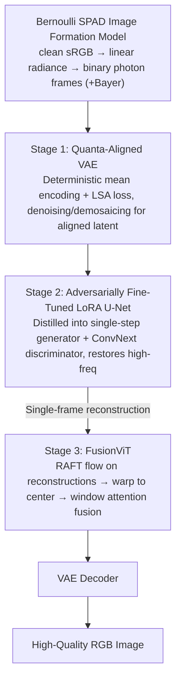

# gQIR: Generative Quanta Image Reconstruction

**Conference**: CVPR 2026  
**arXiv**: [2602.20417](https://arxiv.org/abs/2602.20417)  
**Code**: [GitHub](https://github.com/Aryan-Garg/gQIR)  
**Area**: Image Generation / Image Reconstruction / Computational Imaging  
**Keywords**: Single-photon sensors, Diffusion models, Image reconstruction, burst imaging, VAE alignment

## TL;DR

Adapt large-scale text-to-image latent diffusion models to extreme photon-starved imaging scenarios of Single-Photon Avalanche Diodes (SPADs). Through a three-stage framework (Quanta-aligned VAE → Adversarially fine-tuned LoRA U-Net → FusionViT spatio-temporal fusion), the method achieves high-quality RGB reconstruction from sparse binary photon detections, significantly surpassing all existing methods under extreme 10K-100K fps conditions.

## Background & Motivation

**Background**: SPAD single-photon sensors enable imaging in ultra-low light and high-speed scenarios where conventional cameras fail. However, each pixel only records binary photon detections (photon arrival or not), resulting in extremely sparse and noise-dominated single-frame data. Existing methods mainly fall into two categories: (1) Classical vision methods like QBP, which use block matching, frame alignment, and Wiener filtering; (2) Learning-based methods like QUIVER and QuDI, using optical flow estimation with recurrent fusion or temporal conditional U-Nets.

**Limitations of Prior Work**:
- Classical methods suffer from unreliable motion estimation when photons are extremely scarce, and lack semantic priors, leading to loss of high-frequency details.
- While learning methods introduce learned modules, they are task-specific and trained from scratch, failing to utilize the structural and semantic knowledge of large-scale pre-trained generative models.
- All existing methods degrade severely under extreme deformation or ultra-high-speed motion (>10K fps).
- The Bayer mosaic of color SPADs further exacerbates sparsity, with even fewer photon events per color channel.

**Key Challenge**: Large-scale T2I diffusion models possess powerful natural image priors, but they assume continuous Gaussian noise. SPAD data follows a discrete Bernoulli distribution with noise far exceeding regular photography—naive fine-tuning leads to encoder collapse (catastrophic forgetting) and shortcut learning.

**Key Insight**: Instead of training from scratch, bridge the domain gap through a carefully designed phased adaptation strategy to transfer stable diffusion structural priors to the quanta domain. A key observation is that direct fine-tuning of the VAE encoder results in constant outputs due to extreme SPAD noise; latent space alignment constraints must be introduced to prevent collapse.

**Core Idea**: A three-stage modular framework—first align the latent space to handle Bernoulli statistics, then distill the diffusion prior into a single-step generator for enhanced perceptual quality, and finally perform burst-level spatio-temporal fusion in the latent space.

## Method

### Overall Architecture

The input consists of binary photon frames from a SPAD sensor (or aggregated 3-bit nano-bursts), and the output is a high-quality RGB image. Training data is synthesized from clean images using a physically consistent Bernoulli SPAD image formation model. The pipeline consists of three sequentially trained stages: Stage 1 trains a Quanta-aligned VAE encoder for denoising and demosaicing; Stage 2 adversarially fine-tunes a LoRA U-Net to enhance perceptual fidelity; Stage 3 trains FusionViT for burst-level spatio-temporal fusion in the latent space. Parameters of previous modules are frozen at each subsequent stage.

### Key Designs

**1. Bernoulli SPAD Image Formation Model: Physically consistent "fragmentation" of clean images into single-photon observations**

To train on synthetic data, a physically consistent forward simulation chain is required because SPAD statistical properties differ significantly from conventional photography. Clean sRGB images $x_{gt}$ are first gamma-corrected to linear radiance space $x_{lin}=x_{gt}^{2.2}$. Photon detection at each pixel then follows a Bernoulli distribution:

$$x_{spad} = \mathrm{Bern}\!\left(1 - e^{-\alpha \cdot x_{lin}}\right)$$

where $\alpha$ controls the expected photons per pixel (PPP). Training uses $\alpha=1.0$ (PPP≈3.5). For color SPAD, a random Bayer pattern is applied to generate mosaiced binary frames; averaging $N$ frames yields $\log_2(N+1)$ bit observations. This Bernoulli (non-Gaussian) chain is the source of subsequent technical choices—because noise is discrete, intensity-dependent, and extreme, standard diffusion restoration methods fail.

**2. Stage 1 — Quanta-Aligned VAE: Ensuring the encoder outputs "clean-aligned" latents under noisy input**

Directly fine-tuning an SD VAE encoder for SPAD input results in a collapse to a constant mapping. This occurs because existing restoration methods (like SUPIR/DiffBIR) use the same trainable encoder for both supervision and prediction, allowing a shortcut to be learned under extreme noise. Ours freezes the decoder $\mathcal{D}$ and fine-tunes only the encoder $\mathcal{E}_{\phi^*}$ with two key modifications. First, **deterministic mean encoding**: skip posterior sampling and use the mean $\mu_\phi(x_{lq})$ to avoid amplifying Bernoulli noise. Second, the **Latent Space Alignment (LSA) loss**, using a frozen pre-trained encoder to encode the GT as an alignment target:

$$\mathcal{L}_{lsa} = \big\|\mu_{\phi^*}(x_{lq}) - \mu_\phi(x_{gt})\big\|_2^2$$

Since the $\mu_\phi$ in the second term is a frozen copy, the supervision target does not drift during training, preventing the encoder from "cheating" through mutual degradation. The total loss is $\mathcal{L}=\lambda_{lsa}\mathcal{L}_{lsa}+\lambda_{MSE}\mathcal{L}_{MSE}+\lambda_{perc}\mathcal{L}_{perc}$. This stage handles both denoising and demosaicing.

**3. Stage 2 — Adversarially Fine-tuned LoRA U-Net: Distilling multi-step diffusion into a single-step generator**

Stage 1 reconstructions are often flat and lack detail. Given SPAD's 10K–100K fps throughput, multi-step diffusion sampling is impractical. Thus, the diffusion U-Net is distilled into a single-step generator. A LoRA adapter initializes the generator $\mathcal{G}_{lora}$ (inheriting diffusion weights to maintain small initial gradients and preserve priors), paired with a multi-layer ConvNext-Large discriminator $\mathcal{V}_\theta$ for standard min-max GAN adversarial training:

$$\min_\phi \max_\theta\ \mathbb{E}[\log \mathcal{V}_\theta(x)] + \mathbb{E}\big[\log(1-\mathcal{V}_\theta(\mathcal{G}(x)))\big]$$

The total loss includes perceptual and pixel terms: $\mathcal{L}=\mathcal{L}_{adv}+\mathcal{L}_{perc}+\|\mathcal{D}(\mathcal{G}_{lora}(\mu_{\phi^*}(x_{lq})))-x_{gt}\|_2^2$. This preserves pre-trained generative knowledge while enabling single-step real-time inference.

**4. Stage 3 — FusionViT: Dynamic burst fusion in latent space for fidelity and temporal stability**

Single-frame reconstruction ignores temporal redundancy in burst sequences, and naive flow-warping + averaging leads to motion blur. FusionViT performs both alignment and fusion in the latent space, avoiding the pitfall of estimating flow on noisy frames. Specifically, Stage 1+2 first reconstructs individual frames $Y=\mathcal{D}(\mathcal{G}_{lora}(\mathcal{E}_{\phi^*}(X_{lq})))$. Pre-trained RAFT estimates optical flow on these **reconstructed frames**. All burst latents are warped to the center frame. A pseudo-3D miniViT $\mathcal{F}$ uses window attention across space and time for adaptive weighted fusion, determining contributions based on motion magnitude and temporal distance. Outputs are added back to the center latent $z_{T/2}$ via a learnable scalar $\delta$ (initial 0.05).

### Loss & Training

Phased progressive training, freezing previous modules at each stage:
- **Stage 1**: 8×A100, 600K steps, $\lambda_{lsa}=0.1, \lambda_{MSE}=10^3, \lambda_{perc}=2$
- **Stage 2**: Single RTX 4090, 100K iterations, 256×256, $\lambda_{adv}=0.5, \lambda_{MSE}=500, \lambda_{perc}=5$
- **Stage 3**: FusionViT for 20K steps, using RAFT flow (pre-trained on FlyingThings3D).

Training data: 2.81M images + 44,575 videos from various sources (SR, faces, deblurring). 3-bit nano-bursts are averaged from 7 binary frames; burst mode uses 11 nano-bursts (77 binary frames total).

## Key Experimental Results

### Main Results

**Single-frame 3-bit Reconstruction (334 test images, 384×384)**:

| Method | PSNR↑ | SSIM↑ | LPIPS↓ | ManIQA↑ | ClipIQA↑ | MUSIQ↑ |
|--------|-------|-------|--------|---------|----------|--------|
| InstantIR | 10.79 | 0.178 | 0.651 | 0.187 | 0.346 | 36.65 |
| ft-Restormer | 28.73 | 0.816 | 0.294 | 0.262 | 0.435 | 40.44 |
| ft-NAFNet | 28.28 | 0.830 | 0.261 | 0.300 | 0.473 | 39.13 |
| qVAE (Stage 1) | 28.18 | **0.863** | 0.327 | 0.299 | 0.487 | 44.90 |
| **gQIR (S1+S2)** | 27.28 | 0.839 | **0.318** | **0.331** | **0.547** | **45.61** |

**Burst Reconstruction (Extreme Motion)**:

| Dataset (fps) | QBP PSNR/SSIM | QUIVER PSNR/SSIM | **Burst-gQIR PSNR/SSIM** |
|---------------|---------------|-------------------|--------------------------|
| XVFI (1000) | 12.01 / 0.370 | 23.00 / 0.751 | **25.82 / 0.712** |
| I2-2000fps (2000) | 16.04 / 0.549 | 25.06 / 0.874 | **31.21 / 0.878** |
| XD (2K-100K) | 12.78 / 0.409 | 20.10 / 0.790 | **30.33 / 0.895** |
| **Aggregate** | 13.38 / 0.448 | 22.43 / 0.814 | **29.83 / 0.856** |

**I2-2000fps Full Test Set**: Burst-gQIR achieves 30.81 dB PSNR / 0.868 SSIM, exceeding Prev. SOTA QuDI (28.64 dB) by **+2.17 dB Gain**.

### Ablation Study

**Stage 1 Design Choices**:

| Configuration | PSNR↑ | SSIM↑ | LPIPS↓ |
|---------------|-------|-------|--------|
| w/o Deterministic Encoding (A) | 20.56 | 0.435 | 0.167 |
| w/o LSA loss (B) | 10.39 | 0.222 | 0.139 |
| w/o (A) + (B) | 10.30 | 0.218 | 0.136 |
| **Full Stage 1** | **24.78** | **0.665** | **0.194** |

**Three-stage Progress - Fidelity vs Temporal Stability**:

| Stage | PSNR↑ | SSIM↑ | $E^*_{warp}$↓ |
|-------|-------|-------|-------------|
| Alignment (S1) | 20.04 | 0.759 | 9.088 |
| Perceptual (S2) | 24.11 | 0.846 | 8.508 |
| **Fidelity (S3)** | **27.63** | **0.869** | **8.005** |

### Key Findings

- **LSA loss is critical for Stage 1 success**: Removing LSA drops PSNR from 24.78 to 10.39, as the encoder collapses to a constant mapping.
- Deterministic encoding is significant, providing a ~4 dB PSNR gain, though less critical than LSA.
- Stage 2 adversarial training improves perceptual quality but introduces slight content drift, which Stage 3 spatio-temporal fusion effectively mitigates.
- On the extreme motion dataset XD, gQIR provides a **+17.5 dB Gain** over QBP, demonstrating the advantage of generative priors in out-of-distribution scenarios.
- Realistic color SPAD data can be reconstructed with photo-like quality without dark count or hot pixel correction, requiring only Gray World white balance.

## Highlights & Insights

- **First successful transfer of large-scale T2I diffusion priors to quanta imaging**: Addressed the challenge of drastically different noise statistics (Bernoulli vs. Gaussian) by solving encoder collapse.
- **Novel LSA Design**: Using a frozen pre-trained encoder as the alignment target cut the shortcut path that causes degradation in existing methods like SUPIR/DiffBIR.
- **Decoupled Three-Stage Design**: S1 handles domain adaptation, S2 enhances perception, and S3 leverages temporal information, with clear responsibilities for each stage.
- **Pre-denoising strategy for flow estimation**: Estimating flow in the reconstruction domain rather than the noise domain circumvents the failure of optical flow on raw SPAD data.

## Limitations & Future Work

- Training at fixed PPP=3.5 limits robustness in ultra-low light (PPP≤1); using PPP as an explicit conditioning signal may improve generalization.
- Pre-trained VAE decoder's 8-bit output limits native SPAD HDR capabilities; HDR-capable decoders are a future direction.
- Video-level diffusion priors could further enhance temporal consistency beyond what Stage 3 currently achieves.
- Stage 3 depends on RAFT flow; implicit alignment in latent space could be explored for extreme motion.

## Related Work & Insights

- **vs QBP**: QBP uses a classic align-and-merge pipeline. gQIR generalizes this to latent space and replaces simple averaging with FusionViT, showing a +17.5 dB gain in extreme motion.
- **vs QUIVER/QuDI**: These task-specific models do not utilize pre-trained generative priors. gQIR outperforms QuDI by +2.17 dB on I2-2000fps.
- **vs SUPIR/DiffBIR**: These fail under Bernoulli noise. gQIR’s LSA loss + frozen encoder target is a critical modification for extreme quanta noise.
- The decoupled training approach is transferable to other non-standard sensor restoration tasks (e.g., event cameras, quantum sensors).

## Rating

- **Novelty**: ⭐⭐⭐⭐ First to adapt T2I diffusion to quanta imaging, solving the key encoder collapse problem.
- **Experimental Thoroughness**: ⭐⭐⭐⭐ Comprehensive evaluation across synthetic/real data, single/burst modes, and various fps levels.
- **Writing Quality**: ⭐⭐⭐⭐ Clear motivation and physical modeling; intuitive visualization of encoder collapse.
- **Value**: ⭐⭐⭐⭐ Opens a new direction for generative priors in computational imaging; code and datasets are open-sourced.

<!-- RELATED:START -->

## Related Papers

- [\[CVPR 2026\] RecTok: Reconstruction Distillation along Rectified Flow](rectok_reconstruction_distillation_along_rectified_flow.md)
- [\[CVPR 2026\] VOSR: A Vision-Only Generative Model for Image Super-Resolution](vosr_a_vision_only_generative_model_for_image_super_resolution.md)
- [\[CVPR 2026\] FaithFusion: Harmonizing Reconstruction and Generation via Pixel-wise Information Gain](faithfusion_harmonizing_reconstruction_and_generation_via_pixel-wise_information.md)
- [\[CVPR 2026\] From Inpainting to Layer Decomposition: Repurposing Generative Inpainting Models for Image Layer Decomposition](from_inpainting_to_layer_decomposition_repurposing_generative_inpainting_models_.md)
- [\[ECCV 2024\] NeuSDFusion: A Spatial-Aware Generative Model for 3D Shape Completion, Reconstruction, and Generation](../../ECCV2024/image_generation/neusdfusion_a_spatial-aware_generative_model_for_3d_shape_completion_reconstruct.md)

<!-- RELATED:END -->
