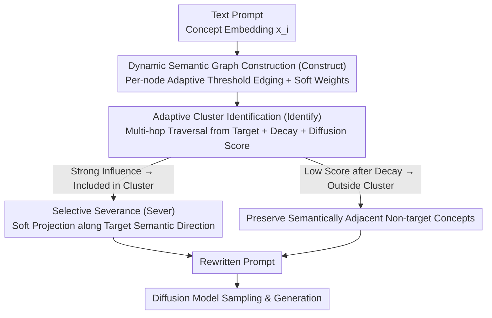

# GrOCE: Graph-Guided Online Concept Erasure for Text-to-Image Diffusion Models

**Conference**: CVPR 2026 Highlight  
**arXiv**: [2511.12968](https://arxiv.org/abs/2511.12968)  
**Code**: Available  
**Area**: Image Generation  
**Keywords**: Concept Erasure, Diffusion Models, Semantic Graph, Training-free, Online Inference

## TL;DR
GrOCE introduces a training-free concept erasure framework based on dynamic semantic graphs. By integrating three synergistic components—semantic graph construction, adaptive cluster identification, and selective severance—it achieves precise, context-aware online removal of target concepts within text-to-image diffusion models.

## Background & Motivation
1. **Background**: Text-to-image diffusion models frequently generate harmful, biased, or infringing content. Concept erasure aims to remove target content while preserving non-target semantics.
2. **Limitations of Prior Work**: (i) Fine-tuning-based methods are computationally expensive, suffer from catastrophic forgetting, and struggle to adapt to emerging risks; (ii) Inference-time intervention methods rely on heuristic mappings and fail to capture deep semantic entanglement. Both categories treat concepts as isolated entities, ignoring the rich relational structures in the latent space.
3. **Key Challenge**: Concepts in diffusion models are encoded as entangled manifolds with fuzzy boundaries and high-order dependencies. Erasing one concept (e.g., "violence") may impair semantically adjacent concepts (e.g., "conflict," "action").
4. **Goal**: Design a training-free online concept erasure method that understands and leverages semantic relationships between concepts to achieve precise target erasure without damaging neighboring semantics.
5. **Key Insight**: Reformulate concept erasure as a graph-cut problem—identifying and removing the minimal subset of vertices connected to the target concept.
6. **Core Idea**: Construct a dynamic semantic graph between concepts, identify target concept clusters through multi-hop traversal and diffusion scores, and then selectively sever the semantic components of that cluster from the prompt embeddings.

## Method

### Overall Architecture
GrOCE aims to cleanly erase a target concept (e.g., "violence") from a text prompt without damaging its semantic neighbors (e.g., "conflict," "action") without fine-tuning the diffusion model or relying on hard-coded "sensitive word → replacement word" mapping tables. The key observation is that concepts in latent space are not isolated points but a web of interconnected entities; thus, erasure should not be processed word-by-word but treated as "cutting a small set of vertices connected to the target on a graph."

The entire pipeline is executed once during inference in three steps: first, **Construct** a temporary semantic graph from the contextualized embeddings of the current prompt; second, **Identify** the cluster entangled with the target concept starting from the target; finally, **Sever** the corresponding semantic directions from the prompt embeddings and feed the rewritten prompt into the diffusion model. This process involves no gradients or retraining; a new graph is built for each prompt, making it "online."

### Key Designs

**1. Dynamic Semantic Graph Construction (Construct): Building a temporary semantic network reflecting concept density for the current prompt**

To "see relationships," a graph reflecting them must first exist. GrOCE treats each concept embedding $x_i$ in the prompt as a node $v_i$. Edges are connected only if the cosine similarity between two nodes exceeds a threshold, with edge weights softened by similarity:

$$w_{ij} = \exp\!\big(-(\tau_i - \langle x_i, x_j\rangle)/\sigma\big)$$

A clever design choice is that the threshold is not globally fixed but adaptive per node—$\tau_i = \tau_0 + \lambda \cdot \text{std}$, where std is the standard deviation of similarity in the node's local neighborhood. This is because density in embedding space is non-uniform: in dense regions where concepts cluster, the variance is small and the threshold is raised, leading to conservative edging that avoids merging unrelated concepts. In sparse regions, the threshold is lowered for more active edging. The graph is rebuilt for every prompt, ensuring it fits the current context rather than a static dictionary.

**2. Adaptive Cluster Identification (Identify): Tracing implicitly entangled concepts along the graph**

Keyword matching only hits literal matches and fails to capture implicit associations like "bear → grizzly → polar bear." GrOCE performs **multi-hop traversal** starting from the target concept node. A similarity decay factor is applied at each hop—the further the neighbor, the weaker the influence—defining the target's semantic radiation range. Simultaneously, a **diffusion score** quantifies the semantic influence of each touched neighbor on the target; only those with sufficient influence are included. This combination converges on a compact set of concepts truly entangled with the target.

> ⚠️ Refer to the original paper for the specific formulas of the multi-hop decay coefficient and diffusion score.

**3. Selective Severance (Sever): Projecting out target cluster semantic directions while preserving orthogonal ones**

Simply deleting these words from the prompt after identifying the target cluster breaks the global sentence structure and collapses generation quality. GrOCE uses **graph-guided soft projection**: it estimates the semantic directions spanned by the target cluster in the prompt embedding and projects out the components along these directions while approximately preserving orthogonal semantic directions. Intuitively, it only performs subtraction on the "target semantic" axes, leaving other axes intact, thus maintaining non-target semantics and sentence coherence. The rewritten prompt is injected into the model before diffusion inference for normal sampling.

### A Complete Example

Consider the prompt "a violent fight scene" with the target concept "violence":

1. **Construct**: Embeddings for "violent," "fight," and "scene" are connected into a graph. "fight" and "violent" have high similarity and fall into a dense area; even with a raised threshold, they remain connected with a strong edge. "scene" has a weak relationship with "violent" and a very small soft edge weight.
2. **Identify**: Multi-hop traversal starts from "violence." The first hop hits "violent" (high influence, included). A further hop might touch implicit neighbors like "conflict" or "action"—but after decay, their diffusion scores are low and they are judged as "semantically adjacent but non-target," **remaining outside the cluster**. The final cluster converges to {violence, violent, fight}.
3. **Sever**: The prompt embedding is projected along the directions spanned by {violence, violent, fight}. The orthogonal direction containing "scene" is preserved. This results in a prompt that is semantically "de-violated but still a fight action scene structure," which is then passed to the diffusion model.

This example illustrates why the graph perspective is important: neighbors like "conflict/action" are the most likely to be incorrectly deleted by word-filtering, but GrOCE excludes them via decay and scoring.

### Loss & Training
Completely training-free. It operates exclusively during inference, requiring no gradient access, retraining, or modifications to model weights.

## Key Experimental Results

### Main Results

| Dataset/Task | Metric | GrOCE | ConAbl | AdaVD | Description |
|--------------|--------|-------|--------|-------|-------------|
| Concept Erasure | CS↓ | SOTA | Runner-up | - | More thorough erasure |
| Non-target Fidelity | FID↓ | SOTA | - | Runner-up | Minimal non-target damage |
| Runtime | Seconds | ~0.1 | ~Tens of sec | ~Sec | Orders of magnitude faster |

### Ablation Study

| Configuration | Key Metric | Description |
|---------------|------------|-------------|
| Full GrOCE | Optimal | All three components intact |
| w/o Graph Guidance | Decrease | Degenerates into simple keyword filtering |
| w/o Multi-hop | Decrease | Fails to capture high-order associations |
| w/o Adaptive Threshold | Decrease | Global threshold is insufficiently precise |

### Key Findings
- GrOCE achieves SOTA in both erasure accuracy and non-target fidelity, proving graph-guided methods are superior to isolated processing.
- Runtime is orders of magnitude faster than training-based methods, supporting genuine online concept removal.
- The semantic graph reveals hierarchical relationships and co-occurrence patterns between concepts, providing interpretability.

## Highlights & Insights
- **Introduction of the graph perspective** elevates concept erasure from "point-wise processing" to "structural reasoning," a methodological advancement.
- **Training-free and online** characteristics allow rapid adaptation to emerging harmful concepts, offering high practical deployment value.
- The semantic graph itself provides interpretability—disclosing not just what was erased, but why.

## Limitations & Future Work
- Only handles concepts accessible via text; unable to process purely visual concepts (e.g., specific pose-lighting combinations).
- Assumes concepts are linearly separable in embedding space; may fail for non-convex concept regions.
- Threshold and decay parameters for cluster identification require fine-tuning.

## Related Work & Insights
- **vs ESD/CA**: Requires fine-tuning model weights, which is computationally expensive and prone to forgetting. GrOCE is entirely training-free.
- **vs AdaVD**: Assumes linear separability and fails on non-convex regions. GrOCE captures more complex relationships via graph structures.
- **vs UCE**: Inference-time intervention that assumes stable activation patterns; may fail when prompts are rephrased. GrOCE's graph structure is more robust.

## Rating
- Novelty: ⭐⭐⭐⭐⭐ Graph-guided concept erasure is a new paradigm.
- Experimental Thoroughness: ⭐⭐⭐⭐ Validated across multiple tasks (cartoon concepts/art styles) with extensive efficiency comparisons.
- Writing Quality: ⭐⭐⭐⭐⭐ Clear mathematical formalization and rigorous problem definition.
- Value: ⭐⭐⭐⭐⭐ Significant contribution to AI safety with high deployment potential.

<!-- RELATED:START -->

## Related Papers

- [\[CVPR 2026\] Neighbor-Aware Localized Concept Erasure in Text-to-Image Diffusion Models](neighbor-aware_localized_concept_erasure_in_text-to-image_diffusion_models.md)
- [\[CVPR 2026\] Prototype-Guided Concept Erasure in Diffusion Models](prototype-guided_concept_erasure_in_diffusion_models.md)
- [\[CVPR 2026\] Beyond Text Prompts: Precise Concept Erasure through Text–Image Collaboration](beyond_text_prompts_precise_concept_erasure_through_text-image_collaboration.md)
- [\[AAAI 2026\] Mass Concept Erasure in Diffusion Models with Concept Hierarchy](../../AAAI2026/image_generation/mass_concept_erasure_in_diffusion_models_with_concept_hierarchy.md)
- [\[CVPR 2026\] GenErase: Generalizable and Semantically-Aware Concept Erasure in Diffusion Models](generase_generalizable_and_semantically-aware_concept_erasure_in_diffusion_model.md)

<!-- RELATED:END -->
