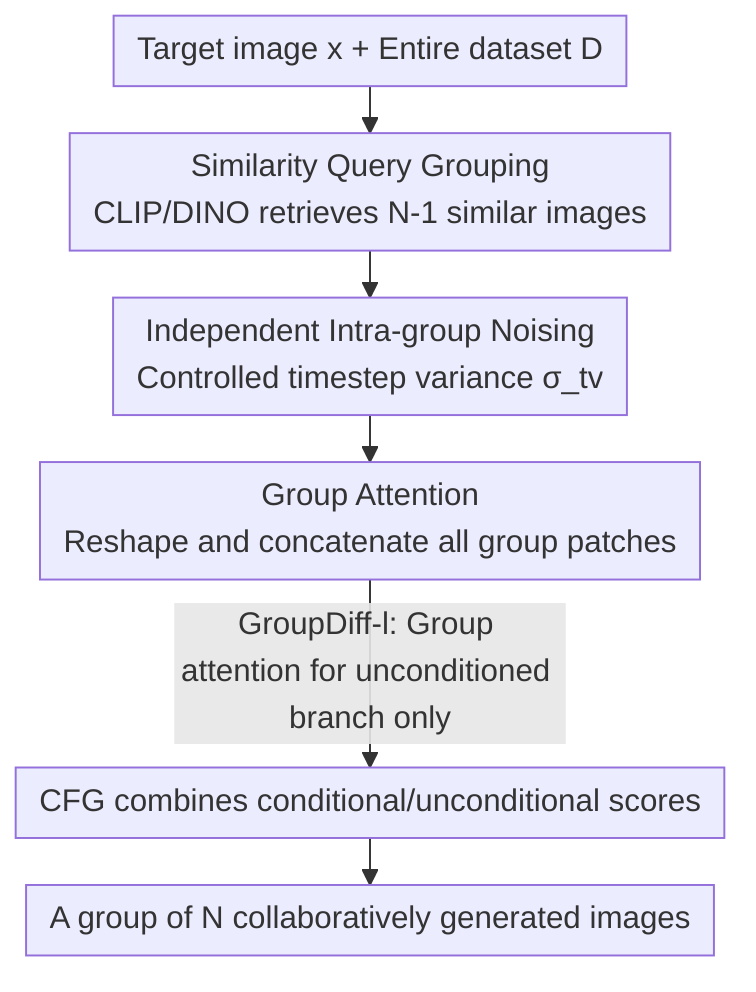

# Group Diffusion: Enhancing Image Generation by Unlocking Cross-Sample Collaboration

**Conference**: CVPR 2026  
**Paper**: [CVF Open Access](https://openaccess.thecvf.com/content/CVPR2026/html/Mo_Group_Diffusion_Enhancing_Image_Generation_by_Unlocking_Cross-Sample_Collaboration_CVPR_2026_paper.html)  
**Code**: [Project Page](https://sichengmo.github.io/GroupDiff/)  
**Area**: Diffusion Models / Image Generation  
**Keywords**: Cross-sample Attention, Group Diffusion, Diffusion Transformer, Representation Learning, FID  

## TL;DR
Diffusion models have traditionally generated images independently during inference. This paper enables a group of semantically similar images to "reference" each other's patches via **cross-sample attention** during denoising. With only a token reshaping modification, it improves the FID of SiT-XL/2 on ImageNet-256 by 32.2%.

## Background & Motivation
**Background**: Diffusion Transformers (DiT / SiT) are the mainstream for high-fidelity image generation. Attention mechanisms allow patches within a single image to interact and produce coherent outputs. While networks learn distributions using batches during training, **images are always generated independently during inference**—patches from different images in a batch are computed separately without interaction.

**Limitations of Prior Work**: Recent works pushing generation quality mostly follow the "representation alignment" route (e.g., REPA uses SSL models to distill features; Dispersive Loss adds self-supervised objectives to generative representations). These aim to strengthen the internal representation of a single image but still treat each image as an island, ignoring the inherent semantic correlations between samples within a batch.

**Key Challenge**: Models see "what a batch of related images should look like" during training, but this cross-referencing capability is discarded during inference. Independent sampling means each image relies solely on its own patches for correspondences, lacking the "free" supervisory signals from its "neighbors."

**Goal**: To allow a group of samples to collaboratively denoise during inference, enabling each image to selectively borrow patch-level correspondences from others in the group, thereby enhancing overall generation quality.

**Key Insight**: The authors observe that large-scale T2I diffusion models already encode robust cross-image semantic correspondences (e.g., a "dog ear" can match an "ear" in another dog image). If internal patches can help each other, expanding the attention field from "intra-image patches" to "patches across all images in a group" should allow the model to learn both intra- and inter-image correspondences.

**Core Idea**: Change "per-image denoising" to "per-group denoising" by using bidirectional attention to connect patches of all images in a group, enabling cross-sample collaboration during a single generation pass.

## Method

### Overall Architecture
The entirety of GroupDiff's modifications can be summarized in one sentence: **expand attention from the patches of one image to all patches of a group of related images**. During training, for each target image $x$, a query function retrieves several semantically/visually similar images from the dataset to form a group $X\in\mathbb{R}^{N\times H\times W\times3}$ of size $N$. These images are individually noised (with controlled intra-group timestep variance) and fed into the DiT/SiT. In the attention layers, tokens from the entire group are concatenated to compute attention, allowing every patch to "see" other images in the group. During inference, the user generates $N$ interdependent images for the same condition $c$, with samples assisting each other during denoising.

Crucially, this "group attention" is extremely lightweight—it requires no changes to the network architecture or additional parameters, involving only a reshape of tokens before and after the standard multi-head self-attention: flattening hidden states from $\mathbb{R}^{N\times L\times C}$ to $\mathbb{R}^{1\times(NL)\times C}$ before computing attention, then reshaping back (where $L$ is the patch sequence length and $C$ is the channel dimension).

### Key Designs

**1. Group Attention: Expanding Attention Field from Intra-image to Intra-group Patches**

This is the heart of the method, addressing the limitation that images act independently during inference. Standard DiT attention is computed only among $L$ patches of a single image. GroupDiff reshapes the hidden states $h$ of $N$ images from $\mathbb{R}^{N\times L\times C}$ to $\mathbb{R}^{1\times(NL)\times C}$, allowing $Attention(\cdot)$ to perform **bidirectional** attention across $NL$ patches. Consequently, a "dog ear" patch can attend to ears within its own image and ears in other dog images in the group. To distinguish which patch belongs to which image, a learnable sample embedding is added to all patches of each image. This approach avoids structural changes, using only reshaping to integrate "collaboration" into existing attention operators.

**2. Similarity Query Grouping: Ensuring Group Relevance for Effective Attention**

For cross-sample attention to be effective, images in a group must be semantically related; otherwise, attention is wasted on irrelevant data. A query function selects images from dataset $D$ that exceed a similarity threshold with $x$:

$$q(x; D; \tau_{img}) = \{x_i \in D \mid \text{sim}(x, x_i) \geq \tau_{img}\}$$

Here $\text{sim}(\cdot)$ uses cosine similarity of image embeddings from pretrained models (e.g., CLIP/DINO), with $\tau_{img}=0.7$. Training involves randomly sampling $N-1$ candidates to form a group. Experiments show this step is vital: random grouping results in an FID (with CFG) of ~3.57 (near baseline), while similarity grouping drops it to ~2.4. Results are consistent across different encoders (CLIP-L, DINOv2, SigLIP, I-JEPA), suggesting the benefit comes from "semantic consistency" rather than a specific encoder's style.

**3. GroupDiff-l: Low-cost Group Attention via the Unconditional Branch**

Applying group attention to both conditional and unconditional branches (denoted as GroupDiff-f) is effective but increases cost. The authors leverage the fact that CFG traditionally trains the unconditional model on 10% of the data. GroupDiff-l **applies the large group size only to the unconditional branch**, while the conditional branch maintains a group size of 1. Consequently, 90% of the training remains identical to standard diffusion. During inference, GroupDiff-l only computes the unconditional score via group attention:

$$\tilde{e}_\theta(X_t; t, c) = \{e_\theta(X_t^i; t, c)\}_{i=1}^n + s\cdot\big(\{e_\theta(X_t^i; t, c)\}_{i=1}^n - e_\theta(X_t; t, \emptyset)\big)$$

Interestingly, training group attention only for the unconditional branch also improves the conditional branch's generation capabilities—likely because the shared weights allow the stronger representations from the unconditional model to implicitly enhance the conditional model. GroupDiff-l balances quality and cost effectively.

**4. Intra-group Noise Variance: Incentivizing Collaboration via Denoising Asymmetry**

If all images in a group have the same noise intensity, the incentive for cross-sample attention is weaker. The authors allow the noise levels of other group samples to float within a range (e.g., 50 or 200 timesteps) relative to the first image, controlling intra-group timestep variance within a threshold $\sigma_{tv}$. The intuition is that heavily noised samples will "borrow" information from cleaner samples. Experiments confirm that noise variance in the 50–200 range improves both FID and linear probe accuracy.

### Loss & Training
The training objective modifies the per-image denoising loss to a summation over the whole group:

$$\mathcal{L}_{Group} = \mathbb{E}_{X, E\sim\mathcal{N}(0,I), t}\Big[\sum_{i=1}^{N}\|\epsilon_i - e_\theta(X, t, c)_i\|_2^2\Big]$$

Implementation details strictly follow DiT/SiT. They use AdamW, a constant learning rate of $1\times10^{-4}$, and weight decay of 0.01. The global batch size is fixed at 256. Images ($256\times256$) are encoded to $z\in\mathbb{R}^{32\times32\times4}$ using the Stable Diffusion VAE.

## Key Experimental Results

### Main Results
Comparison with mainstream systems on ImageNet 256×256 (Table 4, lower FID is better). `*` indicates 100 extra epochs of training on pretrained weights:

| Method | Epoch | FID ↓ | IS ↑ | Remarks |
|------|-------|-------|------|------|
| DiT-XL/2 | 1400 | 2.27 | 278.2 | Baseline |
| + GroupDiff-4 | 800 | 1.66 | 279.4 | ~29% FID reduction with 57% iterations |
| + GroupDiff-4* | 1400+100 | 1.55 | 285.4 | Only 100 extra epochs |
| SiT-XL/2 | 1400 | 2.06 | 270.3 | Baseline |
| + GroupDiff-4 | 800 | 1.63 | 283.2 | ~30% FID reduction |
| + GroupDiff-4* | 1400+100 | **1.40** | 290.7 | SOTA without distillation |
| SiT-XL/2 + REPA-E | 800 | 1.26 | 314.9 | With semantic distillation |
| + GroupDiff-4* | 800+100 | **1.14** | 315.3 | Further gain on top of distillation |

GroupDiff reduces DiT/SiT FID by ~29–30% with fewer iterations. When applied to strong baselines using semantic distillation (REPA-E), it further reduces FID from 1.26 to 1.14, showing that group attention gains are **complementary** to representation distillation.

### Ablation Study
Table 1 (DiT-XL/2 trained for 800K steps, FID with CFG):

| Config | Grouping | Noise Var | FID ↓ | Cross-sample Attn Score ↑ |
|------|---------|---------|-------|------------------|
| C=1, UC=1 (baseline) | — | 0 | 3.50 | — |
| C=1, UC=2 | CLIP-L | 0 | 2.92 | 0.00% |
| C=1, UC=4 | CLIP-L | 0 | 2.42 | 19.95% |
| C=1, UC=8 | CLIP-L | 0 | 2.14 | 51.13% |
| C=1, UC=16 | CLIP-L | 0 | **1.86** | 56.47% |
| C=1, UC=4 | Random | 0 | 3.57 | 23.17% |
| C=1, UC=4 | Class | 0 | 2.81 | 22.51% |
| C=1, UC=4 | CLIP-L | 100 | 2.32 | 23.33% |

### Key Findings
- **Scaling Effect**: Increasing group size from 2→4→8→16 reduces FID from 2.92 to 1.86 and boosts cross-sample attention scores. Larger groups provide more patch-level matching options.
- **Grouping Quality is Decisive**: Random grouping (FID 3.57) performs like the baseline, while similarity grouping leads to breakthroughs (~2.4). Importantly, random grouping **does not degrade the baseline**, indicating group attention is a safe additive.
- **Attention Strength ≈ Generation Quality**: The cross-sample attention score $S_{cross}$ measures focus on the most similar neighbor. It correlates strongly with FID (**r=0.94**)—greater focus on the most similar neighbor leads to higher quality.
- **Early Timesteps & Shallow Layers are Critical**: Cross-sample attention is most active during early denoising (global structure formation) and in shallow layers. Disabling it in middle-to-late stages does not hurt (Table 2: 0.0–0.4 stage group attention actually lowered FID-10K from 4.21 to 3.92), but removing it from layers 1–9 causes catastrophic failure.

## Highlights & Insights
- **Minimal Modification, Abnormal Gain**: The core implementation is just token reshaping before/after attention. It adds no parameters but reduces FID by 20–32%. This "near-zero cost" change is highly transferable.
- **Clever Optimization in GroupDiff-l**: By applying expensive group attention only to the unconditional branch (10% of training data), the cost is neutralized while the benefits are distributed to the conditional branch via weight sharing.
- **Quantifiable "Collaboration"**: $S_{cross}$ explains why GroupDiff works and provides a reliable signal for design rather than a post-hoc narrative.
- **New Perspective on Representation Learning**: Cross-sample interaction acts as **implicit supervision**, complementary to explicit distillation (REPA). It offers a path to stronger diffusion representations without relying solely on external SSL teachers.

## Limitations & Future Work
- While promising for **cross-condition/diverse input** collaborative generation, current experiments focus primarily on intra-condition and intra-class groups.
- ⚠️ Generating a whole group at once increases computational complexity ($NL$ patches). Although using it only in early stages/shallow layers helps, the memory/FLOPs overhead for large groups requires careful assessment for deployment.
- Evaluations are focused on ImageNet class-conditioned generation; effectiveness in more complex text-to-image or open-domain scenarios remains to be validated.
- Benefits depend on the assumption that users want multiple outputs under the same condition; if only one image is needed, the trade-off of running group collaboration must be considered.

## Related Work & Insights
- **vs REPA / Dispersive Loss**: These rely on aligning generative representations to external SSL models. GroupDiff learns inter+intra correspondences **implicitly** through group attention and is complementary to REPA.
- **vs Multi-view / Video Mutual Attention**: Those works use cross-image attention to model relationships (consistency/style). GroupDiff uses these relationships to **enhance the quality of each individual image**.
- **vs Standard DiT/SiT**: GroupDiff strictly follows their architecture and hyperparameters, serving as a plug-and-play enhancement for existing Diffusion Transformers.

## Rating
- Novelty: ⭐⭐⭐⭐⭐ Leveraging "sample collaboration during inference" is a fresh and self-consistent perspective.
- Experimental Thoroughness: ⭐⭐⭐⭐ Solid ablations on size, grouping, and noise, though clear FLOPs/latency quantification for large groups is missing.
- Writing Quality: ⭐⭐⭐⭐⭐ Motivation to mechanism to metrics is seamless; the $r=0.94$ correlation is particularly convincing.
- Value: ⭐⭐⭐⭐⭐ High potential for engineering adoption due to zero structural changes and complementarity with distillation.

<!-- RELATED:START -->

## Related Papers

- [\[CVPR 2026\] Enhancing Spatial Understanding in Image Generation via Reward Modeling](enhancing_spatial_understanding_in_image_generation_via_reward_modeling.md)
- [\[CVPR 2026\] Curriculum Group Policy Optimization: Adaptive Sampling for Unleashing the Potential of Text-to-Image Generation](curriculum_group_policy_optimization_adaptive_sampling_for_unleashing_the_potent.md)
- [\[CVPR 2026\] Beyond Text Prompts: Precise Concept Erasure through Text–Image Collaboration](beyond_text_prompts_precise_concept_erasure_through_text-image_collaboration.md)
- [\[CVPR 2026\] CTCal: Rethinking Text-to-Image Diffusion Models via Cross-Timestep Self-Calibration](ctcal_rethinking_text-to-image_diffusion_models_via_cross-timestep_self-calibrat.md)
- [\[CVPR 2026\] A Style is Worth One Code: Unlocking Code-to-Style Image Generation with Discrete Style Space](a_style_is_worth_one_code_unlocking_code-to-style_image_generation_with_discrete.md)

<!-- RELATED:END -->
