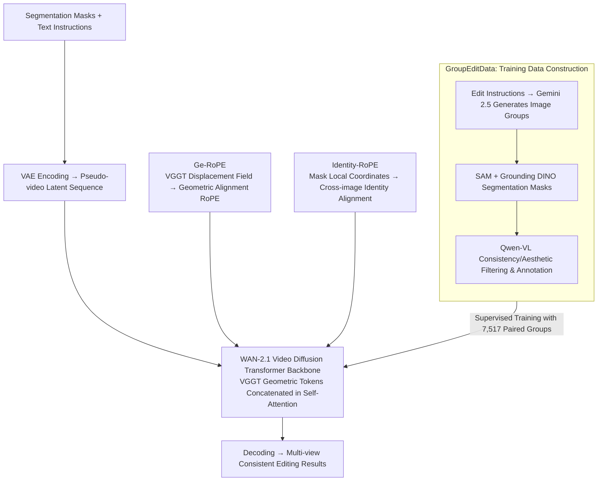

# Group Editing: Edit Multiple Images in One Go

**Conference**: CVPR 2026  
**arXiv**: [2603.22883](https://arxiv.org/abs/2603.22883)  
**Code**: [https://group-editing.github.io/](https://group-editing.github.io/)  
**Area**: Diffusion Models / Image Editing  
**Keywords**: Multi-image consistent editing, video diffusion prior, geometric correspondence, RoPE, pseudo-video  

## TL;DR
Ours proposes GroupEditing, which reconstructs a set of related images as pseudo-video frames. By combining explicit geometric correspondences provided by VGGT with implicit temporal priors from video models through enhanced positional encodings (Ge-RoPE and Identity-RoPE), it achieves cross-view consistent group image editing, significantly outperforming existing methods in visual quality, editing consistency, and semantic alignment.

## Background & Motivation

1. **Background**: Existing image editing methods (e.g., InstructPix2Pix, ControlNet) primarily focus on single-image editing. In scenarios such as virtual content creation and digital commerce, users often need to consistently modify multi-view images of the same subject—for example, changing the color of a digital character's clothes or stylizing product images across various angles.
2. **Limitations of Prior Work**: Per-image editing leads to appearance and structural inconsistencies. Optimization-based propagation methods (editing one and propagating to others) suffer from poor generalization and artifacts. Training-free methods (e.g., Edicho) rely on semantic correspondence and tracking tools, which can only handle a small number of images.
3. **Key Challenge**: In geometrically complex scenes (e.g., object rotation, occlusion, deformation), semantic matching based solely on attention features is imprecise. "Identifying the left eye under different perspectives" or "tracking a logo rotated by 30° on a t-shirt" remains extremely difficult for existing methods.
4. **Goal**: How to establish reliable cross-image correspondences in a group of geometrically diverse related images to achieve one-instruction, multi-image consistent editing?
5. **Key Insight**: Two key observations are made: (1) Implicit correspondence: Video models inherently possess temporal consistency priors; treating image groups as "pseudo-videos" allows the inheritance of these priors. (2) Explicit correspondence: Implicit correspondence from video models alone is insufficient for complex geometry; dense geometric matching from VGGT is required as a supplement.
6. **Core Idea**: Transform the multi-image editing problem into a pseudo-video generation task. Fuse explicit geometric correspondence (VGGT) with implicit temporal priors (video diffusion models) by injecting correspondence information through specially designed positional encodings.

## Method

### Overall Architecture
The problem to be solved is: given a group of images of the same subject from different perspectives and an editing instruction (e.g., "change the t-shirt to red"), ensure all images are edited consistently rather than independently. The core transformation of GroupEditing is treating the image group as a "pseudo-video"—since video models are naturally designed to maintain consistency across adjacent frames, arranging multiple images as a sequence in the temporal dimension allows the model to leverage these temporal consistency priors. The pipeline involves: feeding segmentation masks and text instructions, encoding each image into latent space via a VAE, and arranging them as a pseudo-video sequence for a Transformer based on the WAN-2.1 video diffusion model. Two sets of enhanced positional encodings are injected into the backbone: Ge-RoPE for cross-view geometric alignment and Identity-RoPE for subject identity preservation. Meanwhile, explicit geometric feature tokens extracted by VGGT are concatenated into the latent sequence for self-attention. Finally, the model decodes the multi-view consistent editing results. The key premise is that explicit matches from VGGT provide stability where implicit video priors struggle with rotations, occlusions, or deformations.

### Key Designs

**1. GroupEditData: Constructing Multi-image Editing Training Data from Scratch**

Large-scale paired data for multi-image consistent editing did not previously exist, which is why the field has relied on zero-shot/propagation methods. Ours first builds this infrastructure. The pipeline is an automated four-step process: using Gemini 2.5 to generate image groups based on manual edit instructions (18,248 groups), using SAM + Grounding DINO for target segmentation masks, and using Qwen-VL-Max for simultaneous consistency and aesthetic evaluation to filter low-quality samples, resulting in 7,517 groups. Each group includes images, masks, global descriptions, and regional descriptions, sufficient for supervised training. This "text → generation → filtering → annotation" pipeline can be ported to other tasks lacking paired data.

**2. Ge-RoPE: Injecting Explicit Geometric Correspondence into Positional Encodings**

Implicit correspondences in video models are imprecise for complex geometry—they recognize frame similarity but cannot specify which pixel in Image A corresponds to which in Image B. Ge-RoPE extracts a pixel-level displacement field $\Delta(h,w) = (\Delta_h, \Delta_w)$ from VGGT. After scaling to latent resolution and smoothing with a Gaussian kernel ($\mu=21, \sigma=11$) to prioritize high-confidence matches, the smoothed displacement is added back to original spatial grid indices to obtain a warped grid:

$$\tilde{h} = h + \Delta_h^{\text{smooth}}$$

Nearest neighbor interpolation then indexes a pre-computed frequency bank to generate geometry-aware RoPE. Consequently, the positional encoding itself carries the information of "position $(h,w)$ in image A corresponds to location X in image B." For instance, a logo on a t-shirt rotated by 30° will be aligned to the same phases across different views. This design is clever as it injects geometry via positional encodings without modifying attention weights, offering a lightweight yet direct injection.

**3. Identity-RoPE: Sharing Positional Signals Across Images for the Same Object**

The same object often appears at different locations across perspectives. Standard positional encodings use absolute coordinates, treating a "cat face in the top-left" and a "cat face in the bottom-right" as unrelated, which breaks identity. Identity-RoPE uses segmentation masks to find the minimum bounding box $\mathcal{R}_t$ for the target in each image and shifts the pixel coordinates to local coordinates relative to the box origin:

$$(\tilde{h}, \tilde{w}) = (h - y_1^{(t)},\ w - x_1^{(t)})$$

Thus, no matter where the target moves in the frame, the "cat face" in all images receives the same set of positional encodings. The model naturally recognizes them as the same identity, maintaining appearance consistency after editing.

### Loss & Training
Ours is trained on WAN-2.1 (a Transformer-based video diffusion model) using a standard flow matching loss. The optimizer is AdamW (weight decay 0.01, learning rate $1 \times 10^{-4}$), at a resolution of $528 \times 528$, with a batch size of 8, using 8 A800 GPUs.

## Key Experimental Results

### Main Results

| Method | CLIP-Score↑ | Aesthetic↑ | DINO-Score↑ | Edit Consistency↑ | PSNR↑ |
| :--- | :--- | :--- | :--- | :--- | :--- |
| Anydoor | 0.2728 | 4.72 | 0.7208 | 0.8697 | 0.6182 |
| OminiControl | 0.2902 | 5.10 | 0.7326 | 0.8676 | 0.6457 |
| Edicho | 0.3059 | 4.89 | 0.8080 | 0.8988 | 0.6935 |
| **Ours** | **0.3122** | **5.39** | **0.8168** | **0.9239** | **0.7624** |

User Study (Rank 1=Best, 4=Worst): GroupEditing ranks first across Identity Consistency (1.67), Aesthetic (1.46), Appearance Fidelity (1.50), and Overall (1.47).

### Ablation Study

| Configuration | CLIP-Score↑ | Aesthetic↑ | DINO-Score↑ | Edit Consistency↑ |
| :--- | :--- | :--- | :--- | :--- |
| w/o VGGT | 0.2728 | 4.72 | 0.7208 | 0.8616 |
| w/o Ge-RoPE | 0.2902 | 4.89 | 0.7326 | 0.8697 |
| w/o Identity-RoPE | 0.2902 | 4.89 | 0.7326 | 0.9108 |
| Full model | **0.3122** | **5.39** | **0.8168** | **0.9239** |

### Key Findings
- VGGT explicit geometric features provide the largest contribution: removing them drops DINO-Score from 0.8168 to 0.7208 and Edit Consistency from 0.9239 to 0.8616.
- Identity-RoPE primarily improves editing consistency (0.9108→0.9239) with smaller gains in visual quality.
- Edited results can be directly used for DreamBooth/LoRA personalization and Must3R 3D reconstruction, verifying cross-view consistency.

## Highlights & Insights
- **The pseudo-video reconstruction is highly ingenious**: Converting multi-image editing into a video editing problem "inherits" temporal consistency priors for free. This is an elegant problem transformation.
- **Fusion mechanism of explicit and implicit correspondence**: Ge-RoPE injects geometric information through positional encodings rather than modifying attention weights, representing a lightweight and effective fusion strategy.
- **Engineering value of the data construction pipeline**: The automated "text → generation → filtering → annotation" pipeline is transferable to other tasks requiring paired data.

## Limitations & Future Work
- Training data originates from Gemini generation rather than real multi-view images, which may limit generalization in real-world scenes.
- Dependence on VGGT's geometric correspondence quality; editing quality may degrade if VGGT estimations are inaccurate.
- Resolution is fixed at 528×528, and scalability to high-resolution scenes has not been verified.
- Currently requires segmentation masks as input, increasing the barrier to entry.

## Related Work & Insights
- **vs Edicho**: Edicho uses semantic correspondence + tracking for zero-shot consistent editing but is limited to fewer images; GroupEditing is the first training paradigm using both data and model scaling.
- **vs Frame2Frame/ChronoEdit**: These utilize video models for temporal consistency enhancement in single-image editing; GroupEditing further treats multiple images as a unified pseudo-video.
- **vs ControlNet/T2I-Adapter**: These are general single-image conditional control methods; GroupEditing focuses on consistency constraints across multiple images.

## Rating
- Novelty: ⭐⭐⭐⭐ The combination of pseudo-video reconstruction and dual RoPE injection is creative, though components are not entirely new.
- Experimental Thoroughness: ⭐⭐⭐⭐ Comprehensive quantitative and qualitative evaluations, user studies, ablations, and downstream application verifications.
- Writing Quality: ⭐⭐⭐⭐ Clear logic and rich illustrations.
- Value: ⭐⭐⭐⭐ Multi-image consistent editing is a practical requirement; the first training framework holds pioneering significance.

<!-- RELATED:START -->

## Related Papers

- [\[CVPR 2026\] Inter-Edit: First Benchmark for Interactive Instruction-Based Image Editing](inter-edit_first_benchmark_for_interactive_instruction-based_image_editing.md)
- [\[CVPR 2026\] HP-Edit: A Human-Preference Post-Training Framework for Image Editing](hp-edit_a_human-preference_post-training_framework_for_image_editing.md)
- [\[CVPR 2026\] Language-Free Generative Editing from One Visual Example](language-free_generative_editing_from_one_visual_example.md)
- [\[CVPR 2026\] ChordEdit: One-Step Low-Energy Transport for Image Editing](chordedit_one-step_low-energy_transport_for_image_editing.md)
- [\[CVPR 2026\] OrionEdit: Bridging Reference and Source Images for Generalized Cross-Image Editing](orionedit_bridging_reference_and_source_images_for_generalized_cross-image_editi.md)

<!-- RELATED:END -->
