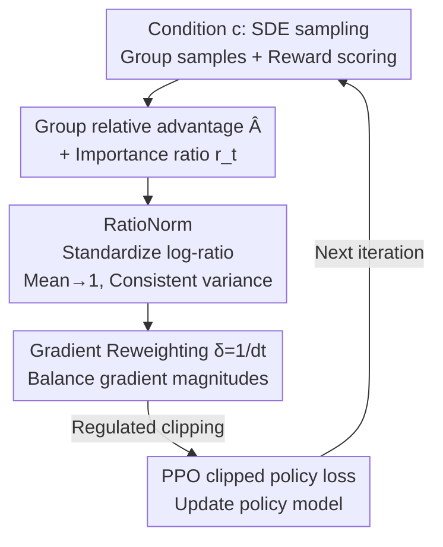

# GRPO-Guard: Mitigating Implicit Over-Optimization in Flow Matching via Regulated Clipping

**Conference**: CVPR 2026  
**Paper**: [CVF Open Access](https://openaccess.thecvf.com/content/CVPR2026/html/Wang_GRPO-Guard_Mitigating_Implicit_Over-Optimization_in_Flow_Matching_via_Regulated_Clipping_CVPR_2026_paper.html)  
**Code**: Not released (Paper mentions a Project Page, no GitHub link)  
**Area**: Diffusion Models / Alignment RLHF  
**Keywords**: GRPO, Flow Matching, Reward Over-optimization, Importance Ratio Clipping, RLHF  

## TL;DR
This paper discovers that FlowGRPO exhibits a systematic left-shift in importance ratio distributions and inconsistent variance across denoising steps when fine-tuning flow matching models. This causes PPO clipping to fail completely for "overconfident positive samples," leading the model into implicit reward hacking. GRPO-Guard introduces RatioNorm to standardize the ratio back to a mean of 1 and uses $1/dt$ gradient reweighting to balance step-wise gradients. Without relying on heavy KL regularization, it significantly mitigates over-optimization and preserves generation quality.

## Background & Motivation

**Background**: Aligning diffusion/flow matching models using GRPO-style reinforcement learning (e.g., FlowGRPO, DanceGRPO) has become a mainstream approach for enhancing aesthetic quality, instruction following, and text rendering. These methods transform deterministic ODE sampling into stochastic SDE sampling to introduce exploration noise, sample a group of outputs for the same condition $c$, use intra-group relative advantage $\hat A_t^i$ for policy updates, and rely on PPO's "importance ratio clipping" to suppress excessive policy drift.

**Limitations of Prior Work**: The clipping mechanism is intended to center the ratio at 1, providing symmetric constraints for positive and negative updates—truncating gradients for overconfident positive samples when the ratio exceeds $1+\epsilon$. However, empirical observations reveal that the ratio distribution in diffusion models is ill-behaved: the mean is consistently **less than 1**, and variance fluctuates drastically across timesteps. This left-shift prevents positive advantage samples from entering the upper clipping region, allowing overconfident positive gradients to remain unconstrained while negative gradients are penalized more severely. Consequently, the proxy reward increases while image quality and text-alignment collapse—a classic case of implicit reward hacking.

**Key Challenge**: The root cause is a design mismatch. Diffusion models calculate Gaussian transition probabilities, whereas the GRPO formula was originally designed for discrete token probabilities in LLMs. FlowGRPO/DanceGRPO directly adopted the formula without adaptation. The quadratic term in the Gaussian log-probability introduces a **timestep-dependent negative bias** into the log-ratio, inherently making the ratio smaller than 1. Furthermore, the variance is driven by scheduling parameters like $\sigma_t$ and $dt$, causing clipping to trigger rarely at high-noise steps and excessively at low-noise steps, concentrating over-optimization on specific noise levels.

**Goal**: To restore the effectiveness of clipping across all denoising steps to constrain harmful updates at the source, without relying on "heavy KL regularization" (which slow down both proxy and gold scores).

**Core Idea**: Log-ratio standardization + Gradient reweighting—"straightening" the distribution back to a mean of 1 and consistent variance across steps, then leveling the gradient magnitudes to ensure PPO clipping properly regulates updates.

## Method

### Overall Architecture
GRPO-Guard does not modify sampling, rewards, or network architectures. It acts as a "ratio and gradient regulator" embedded within the existing GRPO training loop. During an iteration: SDE sampling is performed for condition $c$ to generate a group of samples, rewards are assigned to calculate group relative advantages $\hat A_t^i$, and importance ratios $r_t^i(\theta)$ are computed for each denoising step. GRPO-Guard intervenes here: **RatioNorm** standardizes the log-ratios to correct the mean shift and variance inconsistency, re-enabling clipping for positive samples; **Gradient Reweight** uses a factor $\delta=1/dt$ to level the gradient magnitudes across steps, preventing specific noise levels from dominating optimization. Together, these form "regulated clipping" for the PPO policy loss.

### Key Designs

**1. RatioNorm: Standardizing the log-ratio to restore clipping for positive samples**

This is the core contribution. In flow matching, the policy log-probability is defined by the Gaussian formula $\log p_\theta(x_{t-1}|x_t,c)=-\frac{\|x_{t-1}-\mu_\theta(x_t,t)\|^2}{2\sigma_t^2 dt}-C_t$, which yields the log-ratio:

$$\log r_t(\theta)=-\frac{\|\Delta\mu_\theta\|^2}{2\sigma_t^2 dt}-\frac{\Delta\mu_\theta\cdot\epsilon}{\sigma_t\sqrt{dt}},\qquad \Delta\mu_\theta=\mu_{\theta_{old}}-\mu_\theta$$

Taking the expectation over $\epsilon\sim\mathcal N(0,I)$ gives $\mathbb E[\log r_t(\theta)]=-\frac{\|\Delta\mu_\theta\|^2}{2\sigma_t^2 dt}<0$. This **permanently negative quadratic term** is the source of the mean shift, distinguishing it from LLM discrete probabilities. RatioNorm standardizes the log-ratio by multiplying by $\sigma_t\sqrt{dt}$ and compensating for the negative bias:

$$\log \hat r_t(\theta)=\sigma_t\sqrt{dt}\Big(\log r_t(\theta)+\frac{\|\Delta\mu_\theta\|^2}{2\sigma_t^2 dt}\Big)=-\Delta\mu_\theta\cdot\epsilon$$

After standardization, the mean approaches 0 (ratio approaches 1), scheduled variance interference is removed, and the sign and relative size of $\Delta\mu_\theta$ are preserved. This allows clipping boundaries to function correctly. Ablations show that even simple mean correction (Mean-revised) significantly stops the gold score decline, while full RatioNorm suppresses over-optimization more thoroughly.

**2. Gradient Reweighting ($\delta=1/dt$): Balancing gradients across denoising steps**

Even with corrected ratios, gradient magnitudes vary significantly across steps. The policy gradient scale for FlowGRPO (independent of advantage) is $\beta\frac{\Delta\mu_\theta+\sigma_t\sqrt{dt}\,\epsilon}{\sigma_t^2}$. Empirical measurements show that gradient magnitudes increase monotonically as noise decreases, with a variance of up to **20×** across steps. Large gradients at low-noise steps cause the model to over-optimize specific noise conditions while ignoring exploration in early steps. By applying a reweighting factor $\delta=1/dt$ to the policy loss, the gradient scale is leveled to approximately $\beta\epsilon$, reducing the variance to **2.5×**.

The final policy loss is:

$$J_{policy}(\theta)=\frac1G\sum_{i=1}^{G}\frac1T\sum_{t=0}^{T-1}\delta\,\min\!\Big(\hat r_t^i(\theta)\hat A_t^i,\ \mathrm{clip}\big(\hat r_t^i(\theta),1-\epsilon,1+\epsilon\big)\hat A_t^i\Big)$$

### Loss & Training
The method introduces no additional learnable parameters. It replaces the ratio ($r_t\to\hat r_t$) and adds the weight factor $\delta$, making it compatible with FlowGRPO/DanceGRPO. "Regulated clipping" mitigates over-optimization without heavy KL penalties, maintaining convergence speeds comparable to KL-free baselines.

## Key Experimental Results

Experiments were conducted on two baselines (FlowGRPO, DanceGRPO) and two backbones (SD3.5-M, Flux.1-dev) across GenEval, TextRender, and PickScore tasks. To measure reward hacking, a composite **gold score** (HPSv2, ImageReward, UnifiedReward) was used to represent image quality, while the proxy score represents task performance.

### Main Results

The table below shows composite gold scores (Proxy score in `[·]`). Average(gold) is the normalized mean of three quality metrics:

| Backbone / Setting | Step | Proxy Task | HPSv2 | ImageReward | UnifiedReward | Average(gold) |
|------|------|------|------|------|------|------|
| SD3.5-M (base) | - | - | 0.293 | 1.06 | 3.31 | 1.00 |
| +FlowGRPO | 1860 | GenEval [0.94] | 0.236 | 0.85 | 3.05 | 0.84 |
| **+Ours (FG)** | 1860 | GenEval [0.95] | **0.254** | **0.87** | **3.22** | **0.89** |
| +FlowGRPO | 480 | Text [0.94] | 0.274 | 0.82 | 3.07 | 0.88 |
| **+Ours (FG)** | 480 | Text [0.93] | **0.286** | **1.06** | **3.29** | **0.99** |
| Flux.1-dev (base) | - | - | 0.302 | 1.01 | 3.31 | 1.00 |
| +DanceGRPO | 1260 | PickScore [0.80] | 0.269 | 0.79 | 3.18 | 0.88 |
| **+Ours (DG)** | 1260 | PickScore [0.81] | **0.300** | **1.08** | **3.35** | **1.02** |

**Key Finding**: Baselines often achieve high proxy scores while their gold scores drop (0.84~0.88). GRPO-Guard maintains or improves proxy scores while recovering gold scores to 0.89~1.02.

### Ablation Study

| Configuration | log Ratio Form | Reweight δ | Gradient Scale | Effect |
|------|------|------|------|------|
| Baseline | $\log r_t$ | 1 | $\beta\frac{\Delta\mu_\theta+\sigma_t\sqrt{dt}\epsilon}{\sigma_t^2}$ | Shifted ratio, inconsistent variance, severe over-optimization |
| Temp-Reweight | $\log r_t$ | $\sigma_t\sqrt{dt}$ | $\beta\frac{\sqrt{dt}\Delta\mu_\theta+\sigma_t dt\,\epsilon}{\sigma_t}$ | Accelerated optimization, but earlier gold score collapse |
| Mean-revised | $\log r_t+\frac{\|\Delta\mu_\theta\|^2}{2\sigma_t^2 dt}$ | 1 | $\beta\frac{\sqrt{dt}\epsilon}{\sigma_t}$ | Correcting mean alone significantly stops quality drop |
| RatioNorm | $\sigma_t\sqrt{dt}(\log r_t+\frac{\|\Delta\mu_\theta\|^2}{2\sigma_t^2 dt})$ | 1 | $\beta\,dt\,\epsilon$ | Full variance alignment suppresses over-optimization better |
| **GRPO-Guard** | Same as RatioNorm | $1/dt$ | $\beta\epsilon$ | Most stable; reduces gradient variance from 20× to 2.5× |

### Key Findings
- **Mean correction is critical**: Mean-revised alone mitigates the gold score decline, proving that "ratio shift preventing positive sample clipping" is the primary cause of reward hacking.
- **Precision vs. Speed Trade-off**: RatioNorm suppresses over-optimization more effectively, but because more high-advantage positive ratios are clipped, the proxy score increases slightly slower.
- **Balancing vs. Accelerating**: TempFlowGRPO accelerates optimization but triggers earlier over-optimization. Ours prioritizes "balancing" gradients, which is safer.

## Highlights & Insights
- **Root Cause Analysis**: Attributing reward hacking to the mismatch between Gaussian and discrete probabilities is highly insightful.
- **Lightweight Solution**: The method requires no extra parameters and is "plug-and-play" with one line code change.
- **Evaluation Paradigm**: The dual-track proxy/gold scoring is a solid framework for measuring RLHF over-optimization.

## Limitations & Future Work
- **Residual Hacking**: GRPO-Guard mitigates but does not eliminate reward hacking, as the ultimate bottleneck is the proxy reward model's quality.
- **Trade-offs**: Variance alignment may slow down proxy convergence; the optimal balance point wasn't fully quantified.
- **Generalization**: Most experiments are image-based; the effectiveness in long-trajectory scenarios like video generation remains to be verified.

## Related Work & Insights
- **vs FlowGRPO/DanceGRPO**: These rely on heavy KL regularization to suppress hacking, which penalizes all scores. Ours repairs the clipping mechanism directly.
- **vs TempFlowGRPO**: While both reweight gradients, TempFlowGRPO aims for speed, whereas we aim for equilibrium to prevent denoising steps from dominating optimization.

## Rating
- Novelty: ⭐⭐⭐⭐⭐ 
- Experimental Thoroughness: ⭐⭐⭐⭐ 
- Writing Quality: ⭐⭐⭐⭐⭐ 
- Value: ⭐⭐⭐⭐⭐ 

<!-- RELATED:START -->

## Related Papers

- [\[CVPR 2026\] Neighbor GRPO: Contrastive ODE Policy Optimization Aligns Flow Models](neighbor_grpo_contrastive_ode_policy_optimization_aligns_flow_models.md)
- [\[CVPR 2026\] DiverseGRPO: Mitigating Mode Collapse in Image Generation via Diversity-Aware GRPO](diversegrpo_mitigating_mode_collapse_in_image_generation_via_diversity-aware_grp.md)
- [\[CVPR 2026\] Stepwise-Flow-GRPO：给流匹配模型的去噪步逐步分配信用](stepwise_credit_assignment_for_grpo_on_flow-matching_models.md)
- [\[CVPR 2026\] Fine-Grained GRPO for Precise Preference Alignment in Flow Models](fine-grained_grpo_for_precise_preference_alignment_in_flow_models.md)
- [\[ICML 2026\] LithoGRPO: Fast Inverse Lithography via GRPO Reinforced Flow Matching](../../ICML2026/image_generation/lithogrpo_fast_inverse_lithography_via_grpo_reinforced_flow_matching.md)

<!-- RELATED:END -->
