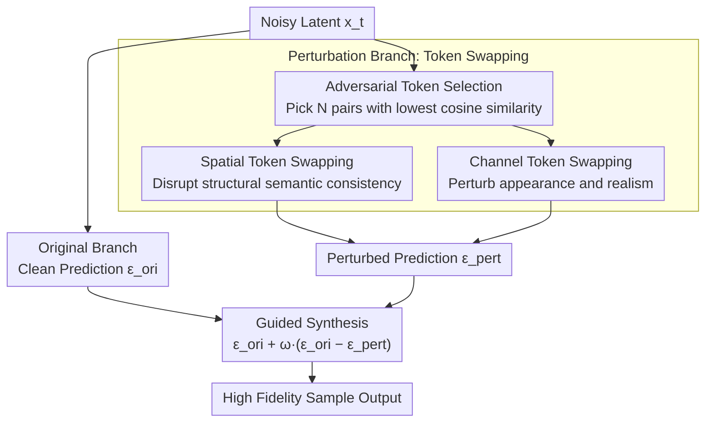

# Guiding a Diffusion Model by Swapping Its Tokens

**Conference**: CVPR 2026 Oral  
**arXiv**: [2604.08048](https://arxiv.org/abs/2604.08048)  
**Code**: [https://github.com/VISION-SJTU/SSG](https://github.com/VISION-SJTU/SSG)  
**Area**: Diffusion Models / Image Generation  
**Keywords**: Sampling Guidance, Unconditional Guidance, Token Swapping, Self-perturbation, Image Fidelity

## TL;DR
This paper introduces Self-Swap Guidance (SSG), a condition-independent sampling guidance method for diffusion models. By selectively swapping the most semantically dissimilar token pairs within the model's intermediate representation space to construct a perturbed version, SSG generates high-fidelity images stably across a wider range of guidance scales than methods like SAG/PAG/SEG, achieving state-of-the-art FID in both conditional and unconditional generation.

## Background & Motivation

1. **Background**: Classifier-Free Guidance (CFG) is a critical technology for generating high-quality images with diffusion models by contrasting conditional and unconditional or null-conditioned predictions. However, CFG depends on text conditions, cannot be used for unconditional generation (e.g., solving inverse problems), and is prone to over-saturation and reduced diversity under high guidance scales.
2. **Limitations of Prior Work**: Recent unconditional guidance methods (SAG, PAG, SEG, TSG) construct a "weakened version" by perturbing the forward process. However, they typically employ global, undifferentiated perturbations—SAG adds noise to inputs, and PAG disrupts attention maps. Such coarse-grained perturbations are either too weak (insufficient detail) or too strong (over-saturation/over-simplification) and are highly sensitive to the guidance scale, resulting in a narrow effective range.
3. **Key Challenge**: There is a need for perturbations strong enough for effective guidance but not so strong that they cause unrecoverable distortion. Existing methods lack fine-grained control over the perturbation granularity.
4. **Goal**: Design a fine-grained, controllable perturbation mechanism that does not introduce external noise, ensuring stable guidance across a wider parameter range.
5. **Key Insight**: Operate at the token level rather than the global level. Perturbing through swapping (instead of injection) is a conservative operation: swapping rearranges existing information without introducing new signals, naturally maintaining global consistency while disrupting local structures.
6. **Core Idea**: Selectively swap the least semantically similar token pairs to create fine-grained local perturbations, replacing traditional global noise injection-based guidance.

## Method

### Overall Architecture
SSG addresses the issue where unconditional guidance methods rely on "perturbing a weakened self-version" to define a direction, but existing perturbations are either too coarse or too aggressive. During inference, it runs two parallel branches: the original branch provides the clean prediction $\epsilon_{\text{ori}}$, while the perturbation branch provides a perturbed prediction $\epsilon_{\text{pert}}$ after performing token swapping in the intermediate representations. The sampling step then follows the difference between them toward "higher quality":

$$\tilde{\epsilon}(x_t) = \epsilon_{\text{ori}}(x_t) + \omega\big(\epsilon_{\text{ori}}(x_t) - \epsilon_{\text{pert}}(x_t)\big)$$

The key lies in the construction of the perturbed branch. SSG does not inject noise into features but instead "swaps positions" of existing tokens. This conservative operation rearranges existing information without introducing external randomness, ensuring global energy conservation and preventing the image from shifting toward irrecoverable distortion. Both branches forward together with low overhead and no retraining required.

### Key Designs

**1. Spatial Token Swapping: Disrupting Semantic Consistency at the Structural Level**

This addresses the bluntness of global perturbations like SAG/PAG. Spatial swapping takes token embeddings $\mathbf{X} \in \mathbb{R}^{B \times T \times D}$, normalizes them, and calculates a pairwise cosine similarity matrix. It then selects the $N$ pairs with the **lowest** similarity (where $N$ is controlled by a swap ratio $r$) and applies a permutation mapping to swap them. This is executed at the start of each Transformer block before the residual addition. Selecting the most dissimilar pairs (e.g., swapping "sky" and "ground") creates much more structural damage than swapping similar tokens for the same number of operations.

**2. Channel Token Swapping: Perturbing Appearance Attributes**

While spatial swapping affects structure and geometry, it does not directly manage global appearance like color, texture, or material. Channel swapping is implemented symmetrically to spatial swapping—applying similarity calculations and swapping to the channel dimension. Swapping the most dissimilar channel embeddings perturbs cross-channel feature correlations, affecting the overall realism layer of the image. Combined, they provide comprehensive guidance covering both "what is drawn" and "how realistic it looks."

**3. Adversarial Token Selection: Maximum Destruction with Minimum Swapping**

The selection strategy relies on the intuition that swapping semantically distant token pairs maximizes structural disruption while keeping the total information volume constant. Experiments compared three strategies: Dissimilar pairs > Random pairs > Similar pairs. Notably, even **random swapping significantly outperforms SAG/SEG**, indicating that "swapping" itself is an efficient perturbation form, while adversarial selection further optimizes performance.

### Loss & Training
SSG is a pure inference-time method requiring no training. It is implemented via PyTorch + diffusers, using an Euler Discrete Scheduler with 50 steps. It is verified on SD1.5 and SDXL, is compatible with CFG, and is fully plug-and-play.

## Key Experimental Results

### Main Results — SDXL Unconditional Generation (MS-COCO 2014)

| Method | FID↓ | IS↑ | Precision↑ | Recall↑ | AES↑ |
|------|------|-----|-----------|---------|------|
| No Guidance | 119.04 | 9.08 | 0.277 | 0.085 | 5.646 |
| SAG | 113.33 | 8.77 | 0.377 | 0.184 | 5.851 |
| SEG | 89.29 | 12.53 | 0.276 | 0.257 | 5.939 |
| PAG | 103.72 | 13.59 | 0.265 | 0.218 | 5.734 |
| **Ours (SSG)** | **70.91** | **16.44** | **0.380** | **0.227** | **6.034** |

### SDXL Conditional Generation (MS-COCO 2014)

| Method | FID↓ | CLIP↑ | IS↑ | AES↑ | PickScore↑ | IR↑ |
|------|------|-------|-----|------|-----------|-----|
| No Guidance | 45.09 | 0.281 | 21.31 | 5.671 | 20.20 | -0.847 |
| SAG | 34.14 | 0.295 | 22.95 | 5.745 | 20.64 | -0.487 |
| PAG | 26.55 | 0.306 | 29.70 | 5.820 | 21.56 | -0.003 |
| **Ours (SSG)** | **21.73** | **0.313** | **34.63** | **5.902** | **22.17** | **0.276** |

### Ablation Study — Token Swapping Strategy

| Strategy | FID↓ | CLIP↑ | IR↑ |
|------|------|-------|-----|
| SAG | 43.97 | 0.295 | -0.483 |
| PAG | 36.79 | 0.306 | 0.002 |
| Random Swap | 32.28 | 0.312 | 0.283 |
| Similar Swap | 28.74 | 0.309 | 0.110 |
| **Dissimilar Swap** | 31.41 | **0.313** | **0.297** |

| Spatial | Channel | FID↓ | IR↑ |
|------|------|------|-----|
| ✓ | ✗ | 31.96 | 0.272 |
| ✗ | ✓ | 31.30 | 0.286 |
| **✓** | **✓** | **31.41** | **0.297** |

### Key Findings
- **SSG excels in unconditional generation**: FID dropped from 119.04 to 70.91 (a 40% reduction), significantly outperforming similar methods.
- **Guidance Scale Robustness**: SSG maintains quality across a wider $\omega$ range, whereas SAG/PAG/SEG degrade rapidly under high guidance scales.
- **Strength of Random Swapping**: Even random token swapping outperforms SAG/SEG significantly, highlighting the unique advantage of the swapping operation.
- **Complementarity with CFG**: Since SSG and CFG operate in orthogonal spaces (token space vs. conditional space), using them together further improves quality.

## Highlights & Insights
- **"Swap not inject" Philosophy**: By rearranging existing information rather than injecting external noise, SSG naturally maintains global energy conservation. This is a gentler and more controllable form of degradation.
- **Information-Theoretic Explanation**: Swapping dissimilar tokens maximizes structural damage without changing the total information volume, creating a highly effective guidance signal with minimal modification.
- **Plug-and-play Engineering Value**: No training, no architectural changes, and full compatibility with CFG. This low deployment barrier is key for practical adoption.

## Limitations & Future Work
- The dual-branch inference results in approximately 2x computational overhead, requiring additional similarity calculations and swaps per step.
- The swap ratio $r$ and guidance scale $\omega$ require joint tuning; although more robust than predecessors, hyperparameters remain.
- Validated only on SD1.5 and SDXL; not yet tested on newer architectures like DiT or Flux.
- Applicability to temporal generation (e.g., video diffusion models) has not been explored.

## Related Work & Insights
- **vs CFG**: CFG requires text conditions and dropout during training; SSG is condition-independent and complementary to CFG.
- **vs PAG**: PAG replaces attention maps with identity matrices (global perturbation); SSG uses selective token swapping (fine-grained and controllable).
- **vs SEG**: SEG adds Gaussian noise to self-attention; SSG replaces noise with swapping, avoiding external randomness.
- **vs SAG**: SAG adds noise to the input image, risk introducing real noise at high scales; SSG's swapping happens purely within the feature space.

## Rating
- Novelty: ⭐⭐⭐⭐ Simple yet original swapping idea with insightful selection strategies.
- Experimental Thoroughness: ⭐⭐⭐⭐⭐ Comprehensive tests across multiple models, datasets, and conditions.
- Writing Quality: ⭐⭐⭐⭐ Clear logic with informative visualizations of guidance patterns.
- Value: ⭐⭐⭐⭐ High practical utility as a plug-and-play enhancement, despite being incremental.

<!-- RELATED:START -->

## Related Papers

- [\[CVPR 2026\] Guiding a Diffusion Transformer with the Internal Dynamics of Itself](guiding_a_diffusion_transformer_with_the_internal_dynamics_of_itself.md)
- [\[CVPR 2026\] Guiding Token-Sparse Diffusion Models](guiding_token-sparse_diffusion_models.md)
- [\[CVPR 2026\] Guiding Diffusion Models with Semantically Degraded Conditions](guiding_diffusion_models_with_semantically_degraded_conditions.md)
- [\[CVPR 2026\] Attribute-Preserving Pseudo-Labeling for Diffusion-Based Face Swapping](attribute-preserving_pseudo-labeling_for_diffusion-based_face_swapping.md)
- [\[CVPR 2026\] APPLE: Attribute-Preserving Pseudo-Labeling for Diffusion-Based Face Swapping](apple_attribute-preserving_pseudo-labeling_for_diffusion-based_face_swapping.md)

<!-- RELATED:END -->
