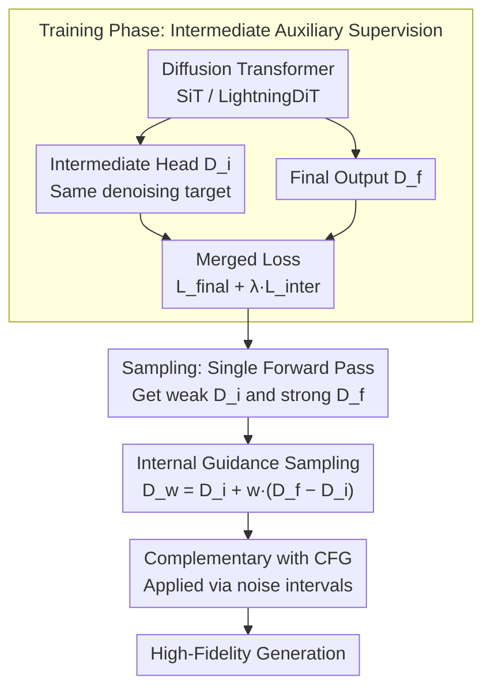

# Guiding a Diffusion Transformer with the Internal Dynamics of Itself

**Conference**: CVPR 2026  
**arXiv**: [2512.24176](https://arxiv.org/abs/2512.24176)  
**Code**: [https://github.com/xy-chou/Internal-Guidance](https://github.com/xy-chou/Internal-Guidance) (Project Page)  
**Area**: Diffusion Models / Image Generation  
**Keywords**: Internal Guidance, intermediate layer supervision, Diffusion Transformer, sampling guidance, training acceleration

## TL;DR
This paper proposes Internal Guidance (IG), which adds auxiliary supervision losses to the intermediate layers of a Diffusion Transformer to produce weaker generative outputs. During sampling, it extrapolates the difference between intermediate and deep layer outputs to achieve guidance effects similar to Autoguidance without extra sampling steps or external model training. On ImageNet 256×256, it pushes the FID of LightningDiT-XL/1 to 1.34 (w/o CFG) and 1.19 (+CFG), reaching the current SOTA.

## Background & Motivation

1. **Background**: Classifier-Free Guidance (CFG) is the standard method for improving the generation quality of diffusion models by guiding samples toward high-probability regions of the conditional distribution. However, excessively high CFG scales lead to over-simplification or distortion and reduce diversity. Methods like Autoguidance maintain diversity by using a "degraded version of the model" for guidance, but they require training extra models or additional sampling steps.
2. **Limitations of Prior Work**: (1) CFG overemphasizes class conditions at high guidance scales, pushing toward "template images" and reducing diversity; (2) Autoguidance requires specifically training a weaker model, which is costly and inflexible; (3) Methods like PAG/SEG require manually designed degradation strategies and incur extra sampling overhead.
3. **Key Challenge**: Achieving the "quality improvement while maintaining diversity" effect of Autoguidance without training extra models or increasing sampling steps.
4. **Goal**: Obtain Autoguidance-level generation quality and diversity improvements with near-zero additional overhead.
5. **Key Insight**: The output of an intermediate layer in a deep network is inherently a "weaker version" as it has only been processed by a subset of Transformer blocks. If the intermediate layer is taught to denoise during training, it naturally provides a "weak version" signal to contrast with the "strong version" (final layer) during sampling.
6. **Core Idea**: Add auxiliary supervision to intermediate layers of a Diffusion Transformer to train a "built-in weak model," and use the difference between intermediate and final layer outputs for guidance during sampling.

## Method

### Overall Architecture
This paper addresses the awkward trade-off of Autoguidance: using a "weak model" for guidance improves quality and preserves diversity but requires training an extra degraded model. The core observation of IG is that deep networks already contain a built-in weak version: the intermediate layer output, having passed through only half the Transformer blocks, is naturally weaker than the final output.

During the training phase, an additional output head is attached after a specific intermediate layer of a standard Diffusion Transformer (e.g., SiT, LightningDiT). This intermediate layer learns denoising to produce output $D_i$, while the network end produces $D_f$ as usual. During the sampling phase, each step yields both $D_i$ and $D_f$. Guidance is performed by extrapolating in the "weak-to-strong" direction: $D_w = D_i + w(D_f - D_i)$. When $w>1$, the sample is pushed away from the weak version toward the strong version. Since $D_i$ is a byproduct of the same forward pass, the guidance requires no extra forward computation.

### Key Designs

**1. Intermediate Auxiliary Supervision: Training a Built-in "Weak Model"**

To replicate Autoguidance without extra models, the strategy makes the network develop its own weak version. Specifically, an output layer $D_i$ is defined after the $l$-th Transformer block, applying the same denoising target as the final layer and merging it with the primary loss:

$$\mathcal{L}_{\text{inter}} = \|D_i(\mathbf{x}_t, t) - \mathbf{x}_0\|^2, \qquad \mathcal{L} = \mathcal{L}_{\text{final}} + \lambda \mathcal{L}_{\text{inter}}$$

The weight $\lambda$ controls the auxiliary loss intensity; $\lambda \le 0.5$ is effective in experiments. Since the intermediate layer only observes a subset of blocks, its denoising capability is naturally weaker, serving as the "degraded version." This step also provides extra gradients to deep layers, mitigating vanishing gradients and accelerating convergence, rivaling complex self-supervised representation alignment methods like REPA.

**2. Internal Guidance Sampling: Extrapolating the Gap**

With weak version $D_i$ and strong version $D_f$, sampling performs direct extrapolation:

$$D_w(\mathbf{x}; \mathbf{c}) = D_i(\mathbf{x}; \mathbf{c}) + w\,\big(D_f(\mathbf{x}; \mathbf{c}) - D_i(\mathbf{x}; \mathbf{c})\big)$$

When $w>1$, this formula pushes samples away from the low-quality distribution of the intermediate layer toward the high-quality distribution of the final layer. Unlike Autoguidance, this "weak model" is a byproduct of the same forward pass, incurring zero extra inference cost.

**3. Complementary with CFG and Noise Intervals**

IG and CFG guide different dimensions and can thus be stacked. CFG is class-dependent, pushing samples toward a target class, while IG is class-independent, pushing samples toward the data manifold and away from outliers. A 2D toy experiment illustrates this: IG eliminates outliers at branch ends (class-independent), while CFG suppresses inter-class confusion (class-dependent). Furthermore, their optimal noise intervals differ: IG is effective at high/medium noise ($\sigma \in (0.3, 1)$), whereas CFG excels at medium/low noise. Applying them in their respective optimal intervals maximizes their combined power.

### Loss & Training
- Training is based on SiT and LightningDiT. SiT uses standard settings; LightningDiT uses the Muon optimizer (replacing AdamW to solve early instability), and EMA weight is adjusted from 0.9999 to 0.9995.
- Auxiliary supervision works best in early layers (block 4 for SiT-B/2, block 8 for larger models); placing it in the latter half interferes with deep outputs.
- ImageNet-1K 256×256 training after VAE encoding.
- SDE Euler-Maruyama 250 steps (SiT/DiT) or ODE Heun 125 steps (LightningDiT).

## Key Experimental Results

### Main Results — ImageNet 256×256 (w/o CFG)

| Method | Epochs | FID↓ | IS↑ |
|------|---------|------|-----|
| SiT-XL/2 | 1400 | 8.61 | 131.7 |
| REPA | 800 | 5.90 | 157.8 |
| **Ours (SiT-XL/2 + IG)** | **80** | **5.31** | **147.7** |
| **Ours (SiT-XL/2 + IG)** | **800** | **1.75** | **228.6** |
| LightningDiT-XL/1 | 800 | 2.17 | 205.6 |
| **Ours (LightningDiT-XL/1 + IG)** | **60** | **2.42** | **173.7** |
| **Ours (LightningDiT-XL/1 + IG)** | **680** | **1.34** | **229.3** |

### SOTA Comparison (+CFG)

| Method | FID↓ | sFID↓ |
|------|------|-------|
| REPA + CFG (800ep) | 1.42 | 4.70 |
| REPA-E + CFG (800ep) | 1.26 | 4.11 |
| SiT-XL/2 + IG + CFG (800ep) | 1.46 | 4.79 |
| **LightningDiT-XL/1 + IG + CFG (680ep)** | **1.19** | **4.11** |

### Ablation Study

| Ablation | FID↓ | IS↑ | Note |
|--------|------|-----|------|
| SiT-B/2 Baseline | 33.02 | 43.71 | No auxiliary supervision |
| Auxiliary (Layer 2) | 30.45 | 47.97 | Early layers effective |
| Auxiliary (Layer 4) | 30.60 | 47.70 | Optimal or near-optimal |
| Auxiliary (Layer 8) | 38.05 | 37.97 | Late layers harmful |
| +IG (Layer 4, w=1.5) | **19.02** | **65.06** | Significant gain with guidance |
| +IG (w=1.9) | 17.38 | 69.12 | Optimal scale w/o interval |
| +IG (w=2.3) + Interval [0.3, 1) | **16.19** | **72.95** | Best configuration |

### Key Findings
- **Stunning Training Efficiency**: SiT-XL/2 + IG reaches FID=5.31 in just 80 epochs, surpassing vanilla SiT at 1400 epochs (8.61) and REPA at 800 epochs (5.90).
- **Critical Supervision Placement**: Auxiliary headers must be in early layers (first 1/3); placement in the latter half (layers 8/10) is detrimental.
- **Intrinsic Convergence Acceleration**: Even without IG sampling, the auxiliary loss alone accelerates convergence similarly to complex self-supervised representation alignment methods.
- **Complementary Guidance Intervals**: IG works at high/medium noise, while CFG works at medium/low noise.
- **Scalability**: Relative improvements increase as model size grows from B to L to XL.

## Highlights & Insights
- **The "Built-in Weak Model" insight is elegant**: Observing that intermediate layers serve as a natural "degraded version" simplifies Autoguidance from "training extra models" to "adding one loss line."
- **Two-birds-one-stone Design**: Auxiliary supervision provides signals for guidance while simultaneously acting as a deep supervision mechanism to accelerate training.
- **Guidance Interval Discovery**: The discovery that IG and CFG perform optimally at non-overlapping noise stages provides valuable guidance for combining multiple strategies.
- **Extension to Training Acceleration**: Section 6 shows that the IG principle can be integrated into the training loss $\mathbf{x}_0 + \omega \cdot \text{sg}(D_f - D_i)$ to directly speed up convergence.

## Limitations & Future Work
- The position of the auxiliary supervision layer requires tuning for different model scales (e.g., Layer 4 for SiT-B vs. Layer 8 for larger models).
- Hyperparameters such as the scale $w$, guidance interval $[\sigma_{\text{low}}, \sigma_{\text{high}}]$, and loss weight $\lambda$ require joint tuning.
- Validation is limited to class-conditional ImageNet; text-to-image generation (e.g., SDXL) has not been tested.
- The intermediate output head adds a minimal number of parameters, which is negligible but worth noting for massive distributed training.

## Related Work & Insights
- **vs. Autoguidance**: Autoguidance requires training separate degraded models; IG uses intermediate layers as natural "degraded versions" with zero extra cost.
- **vs. CFG**: CFG provides class-conditional directional guidance, while IG provides class-agnostic manifold guidance. They are complementary.
- **vs. PAG/SEG/SAG**: These perturb attention or inputs during inference; IG builds the weak version during training, making inference cleaner and more efficient.
- **vs. REPA/SRA**: These use external pre-trained models for normalization; IG's auxiliary supervision is simpler yet achieves similar convergence acceleration.

## Rating
- Novelty: ⭐⭐⭐⭐⭐ Insightful and elegant.
- Experimental Thoroughness: ⭐⭐⭐⭐⭐ Comprehensive cross-scale, ablation, and SOTA results.
- Writing Quality: ⭐⭐⭐⭐ Clear structure and excellent visualization.
- Value: ⭐⭐⭐⭐⭐ SOTA results with zero inference overhead and training acceleration.

<!-- RELATED:START -->

## Related Papers

- [\[CVPR 2026\] Guiding Token-Sparse Diffusion Models](guiding_token-sparse_diffusion_models.md)
- [\[CVPR 2026\] DDT: Decoupled Diffusion Transformer](ddt_decoupled_diffusion_transformer.md)
- [\[CVPR 2026\] Guiding a Diffusion Model by Swapping Its Tokens](guiding_a_diffusion_model_by_swapping_its_tokens.md)
- [\[CVPR 2026\] Guiding Diffusion Models with Semantically Degraded Conditions](guiding_diffusion_models_with_semantically_degraded_conditions.md)
- [\[CVPR 2026\] GeoRK2: Geometry-Guided Runge-Kutta Integration for Diffusion Transformer Acceleration](geork2_geometry-guided_runge-kutta_integration_for_diffusion_transformer_acceler.md)

<!-- RELATED:END -->
