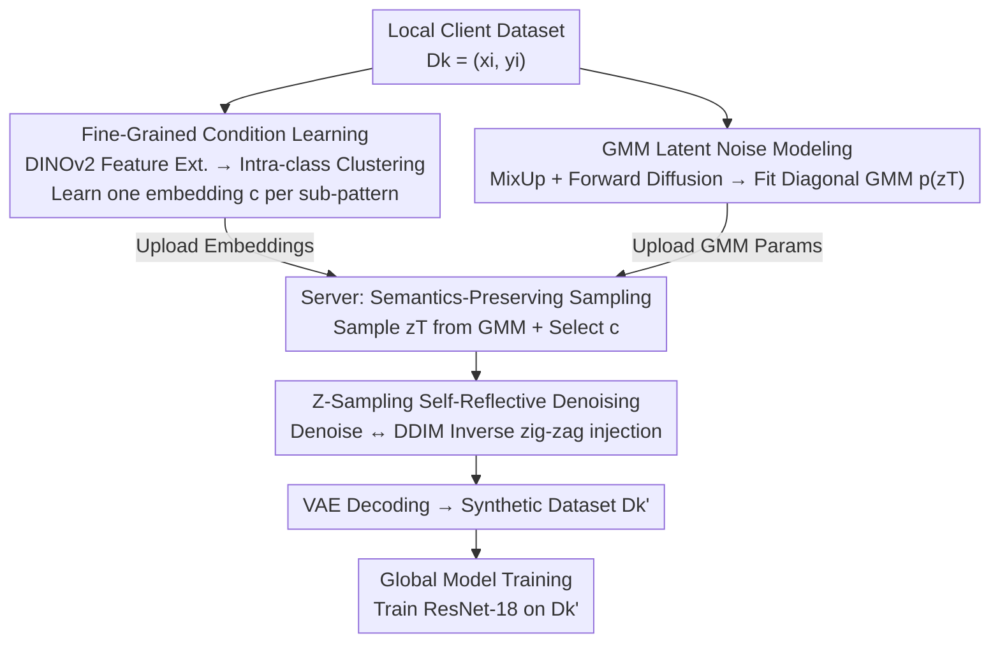

# Guiding Diffusion Models with Fine-Grained Conditions and Semantics-Preserving Sampling for One-Shot Federated Learning

**Conference**: CVPR 2026  
**Paper**: [CVF Open Access](https://openaccess.thecvf.com/content/CVPR2026/html/Deng_Guiding_Diffusion_Models_with_Fine-Grained_Conditions_and_Semantics-Preserving_Sampling_for_CVPR_2026_paper.html)  
**Code**: Not disclosed  
**Area**: Diffusion Models / Conditional Image Generation / Federated Learning  
**Keywords**: One-Shot Federated Learning, Diffusion Model Guidance, Fine-Grained Conditions, Latent Space Noise Modeling, Synthetic Data  

## TL;DR
To address the issues of coarse conditioning and insufficient fidelity/diversity in synthetic data generated by pre-trained diffusion models under **One-Shot Federated Learning (OSFL)**, this paper proposes **Espresso**. The method performs intra-class clustering on the client side to learn fine-grained conditional embeddings for each sub-pattern. It further utilizes GMMs to model the latent space initial noise distribution and introduces **Z-Sampling**, a self-reflective sampling strategy, to fully inject conditional semantics into the generation process. This approach achieves SOTA global model accuracy on three heterogeneous datasets: DomainNet, PACS, and NICO++.

## Background & Motivation
**Background**: Federated Learning (FL) enables collaborative training among multiple parties without sharing raw data. However, classic FedAvg requires multiple rounds of model exchange, leading to high communication overhead. **One-Shot Federated Learning (OSFL)** compresses communication into a single round. One approach involves clients uploading local models for ensemble/distillation; a more recent approach involves clients uploading "guidance information," which the server then uses with a pre-trained diffusion model (e.g., Stable Diffusion) to generate a synthetic dataset approximating the client's distribution for training a global model. This leverage of large-scale diffusion priors allows for reconstructing client distributions with minimal information loss.

**Limitations of Prior Work**: Data heterogeneity (non-IID) is the primary obstacle for OSFL, encompassing both label skew and feature skew (e.g., the same class appearing as "clipart" vs. "sketch" across clients). Current diffusion-based OSFL methods (e.g., FedDEO, FedBiP) upload "guidance information" that is **overly simplistic**. Typically, only one condition is learned per class, failing to capture **intra-class** visual patterns (e.g., "bears" include both polar bears and brown bears). This results in synthetic data with **low semantic fidelity and poor diversity**, hindering the global model's learning.

**Key Challenge**: Classes naturally contain multiple sub-distributions. "One condition per class" guidance collapses these into a single mode, losing intra-class variance. Furthermore, standard diffusion starts from random noise $z^T \sim \mathcal{N}(0,I)$ and performs monotonic denoising, failing to fully utilize the uploaded conditional information.

**Goal**: To improve both the **fidelity** and **diversity** of synthetic data without increasing communication rounds, thereby enhancing the generalization of the global model in heterogeneous scenarios.

**Key Insight**: The authors decompose the problem into two tasks: (1) **Refining guidance information**: Perform intra-class clustering on the client side to learn individual conditional embeddings for each sub-pattern. (2) **Improving condition realization during sampling**: Modify the "starting point" (using GMMs to model meaningful initial noise distributions) and the "path" (using Z-Sampling for self-reflective semantic injection).

**Core Idea**: Compress client data into lightweight yet representative parameters via "Fine-Grained Condition Learning + Semantics-Preserving Sampling." This guides a frozen diffusion model to reconstruct client distributions with high fidelity—akin to "brewing a full cup of coffee from concentrated espresso powder."

## Method

### Overall Architecture
Espresso is a three-stage pipeline that takes local client datasets $\mathcal{D}_k = \{(x_i, y_i)\}$ as input and produces a trained global model $\omega$, requiring only **one round** of client-to-server communication.

**Phase 1: Local Client-side Fine-Grained Condition Learning**. A pre-trained visual encoder (DINOv2) extracts features to perform intra-class clustering. For each cluster, a conditional embedding $c^j_{k,y}$ is directly optimized (bypassing the text encoder and feeding directly into the U-Net cross-attention). Simultaneously, **GMM modeling of latent noise** is performed: local latent vectors are augmented via MixUp and diffused forward to $z^T$ multiple times to fit a Gaussian Mixture Model with diagonal covariance. Clients upload only the "conditional embeddings + GMM parameters."

**Phase 2: Server-side Semantics-Preserving Sampling**. To generate data for client $k$ and class $y$, a **meaningful initial noise** $z^T$ is sampled from the corresponding GMM, and a conditional embedding $c^j_{k,y}$ is randomly selected. The denoising process uses **Z-Sampling** for "zig-zag" self-reflective iterations to fully inject semantics. Finally, the VAE decodes the results into a synthetic dataset $\mathcal{D}'_k$.

**Phase 3: Global Model Training**. A ResNet-18 global model is trained on the synthetic data $\{\mathcal{D}'_k\}$ from all clients, approximating the federated objective without accessing raw data.

### Key Designs

**1. Fine-Grained Condition Learning: Decomposing "One Condition per Class" into "One Condition per Sub-pattern"**

This directly addresses the pain point of coarse guidance erasing intra-class variance. For each class $y$ of client $k$, features $f_i = \Phi(x_i)$ are extracted using a frozen pre-trained visual encoder $\Phi$ (DINOv2 or CLIP). Hierarchical clustering is applied to divide the data into $J$ visually similar sub-clusters $\{\mathcal{D}^j_{k,y}\}_{j=1}^J$. **A conditional embedding $c^j_{k,y}$ is then learned for each sub-cluster** by freezing the diffusion model $\theta$ and optimizing the embedding itself:

$$\min_{c^j_{k,y}}\ \mathbb{E}_{t,x\sim\mathcal{D}^j_{k,y},\epsilon}\left[\big\|\epsilon-\epsilon_\theta\big(\sqrt{\bar\alpha_t}\,\mathcal{E}(x)+\sqrt{1-\bar\alpha_t}\,\epsilon,\,t,\,c^j_{k,y}\big)\big\|^2\right]$$

The critical difference is that it **bypasses Textual Inversion's approach** of learning token embeddings for natural language templates. Instead, it learns the **entire conditional embedding** fed into cross-attention, which has higher expressivity for capturing abstract styles (e.g., "quickdraw"). While this increases parameters per class, the communication cost remains acceptable relative to the gains in fidelity and diversity.

**2. GMM Modeling of Latent Noise: Providing a "Meaningful and Variable" Starting Point**

Standard diffusion starts from $z^T \sim \mathcal{N}(0,I)$, but the initial noise can bias generation toward specific visual concepts. The authors model the distribution of client latent initial noise $p(z^T_{k,y})$ to sample starting points. Direct modeling of $p(z^0)$ is computationally prohibitive due to high dimensionality.

The **Mechanism** here is to **model $p(z^T)$ directly**. Since $z^T$ is designed to be close to $\mathcal{N}(0,I)$, it is more concentrated, allowing a **diagonal covariance GMM** to fit it effectively. Local latent vectors are augmented via MixUp to get $z^0_{k,y,\text{mix}}$, then forward-diffused multiple times to collect $z^T_{k,y,\text{mix}}$ samples for fitting the GMM $\{w^{T,m}_{k,y}, \mu^{T,m}_{k,y}, \Sigma^{T,m}_{k,y}\}$. Sampling from this distribution ensures the starting point is "meaningful" (aligned with client distribution) and "variable."

**3. Z-Sampling: Using "Zig-zag" Denoising for Full Semantic Injection**

To ensure the denoising path fully utilizes the conditional embeddings, Z-Sampling introduces a "zig-zag" operation. When $t >$ threshold $T_z$, a **strong guidance** $\gamma_1$ denoises $z^t$ to $\tilde{z}^{t-1}$. Immediately, a **weak guidance** $\gamma_2 < \gamma_1$ performs a deterministic DDIM-inverse to map $\tilde{z}^{t-1}$ back to a new $\tilde{z}^t$, followed by a final denoising to $z^{t-1}$ using $\gamma_1$. Standard Classifier-Free Guidance (CFG) is used:

$$\hat\epsilon_\theta(z^t,t,c^j_{k,y})=\epsilon_\theta(z^t,t,\varnothing)+\gamma\cdot\big(\epsilon_\theta(z^t,t,c^j_{k,y})-\epsilon_\theta(z^t,t,\varnothing)\big)$$

This "denoise $\rightarrow$ inverse $\rightarrow$ re-denoise" loop exploits the guidance difference $\delta_\gamma = \gamma_1 - \gamma_2$ to inject more semantic information into $\tilde{z}^t$ before the true denoising step, enhancing semantic fidelity.

### Loss & Training
- **Condition Learning**: Optimized via Eq.(8) while freezing $\theta$.
- **Global Training**: Minimizes $\min_\omega\ \mathcal{L}(\omega)=\sum_{k=1}^K p_k\,\mathbb{E}_{\mathcal{D}'_k}[\mathcal{L}_k(\mathcal{D}'_k)]$, using synthetic data $\mathcal{D}'_k$ as a proxy for local data.
- **Hyperparameters**: $J=4$ clusters, $M=4$ GMM components, $T_z=800$. Stable Diffusion v1.5 is used as the generator, and ResNet-18 (ImageNet pre-trained) as the global model.

## Key Experimental Results

### Main Results
Feature-skew setting, 16-shot, one domain per client. Metrics show Accuracy (%).

| Dataset | Metric | Espresso | Prev. SOTA (FedBiP) | Ceiling |
|--------|------|----------|------------------|---------------|
| DomainNet | Avg Acc | **75.32** | 72.81 | 80.16 |
| Common NICO++ | Avg Acc | **82.16** | 80.54 | 86.81 |
| PACS | Avg Acc | **80.36** | 79.11 | 85.96 |

**Key Insight**: In DomainNet's "quickdraw" domain, Espresso reached 80.18%, significantly outperforming baselines and indicating that learning full conditional embeddings is highly effective for abstract styles.

### Ablation Study
C = Fine-Grained Condition Learning, G = GMM Noise Modeling, Z = Z-Sampling.

| Configuration | DomainNet | PACS | NICO++ | Description |
|------|-----------|------|--------|------|
| Prompts-only | 64.00 | 70.90 | 67.58 | Text prompts only (Baseline) |
| C only | 73.46 | 75.30 | 80.88 | Large Gain from C |
| C + G | 73.72 | 79.86 | 81.13 | Added GMM starting point |
| C + Z | 74.26 | 80.13 | 81.89 | Added Z-Sampling |
| Espresso (C+G+Z) | **75.32** | **80.36** | **82.16** | Optimal synergy |

### Key Findings
- **C is the primary driver**: Adding C yielded the largest single-component improvement, proving that capturing intra-class sub-patterns is fundamental for fidelity.
- **G and Z rely on synergy**: While their individual gains were smaller, they provided stable improvements when combined with C.
- **t-SNE Analysis**: Unlike baselines that produce tight, repetitive clusters, Espresso's synthetic data covers more diverse sub-clusters, more closely resembling the real data distribution.

## Highlights & Insights
- **Modeling $p(z^T)$ instead of $p(z^0)$**: This is a clever engineering choice that avoids the high dimensionality of $z^0$ while maintaining sufficient descriptive power via diagonal GMMs.
- **Bypassing the Text Encoder**: Directly learning cross-attention embeddings allows for the representation of styles (like "quickdraw") that are difficult to articulate in natural language.
- **Decoupling "Start" and "Path"**: GMM defines the initial distribution while Z-Sampling optimizes the denoising trajectory; these orthogonal improvements can be migrated to other tasks like data distillation or private synthesis.

## Limitations & Future Work
- **Diminishing Returns on Common Styles**: In domains where diffusion priors are already strong (e.g., photo), the advantages of fine-grained guidance are less pronounced.
- **Communication Overhead**: While the authors claim it is manageable, the switch from "one condition per class" to "$J$ conditions per class" plus GMM parameters increases the data footprint. A quantitative trade-off analysis is missing.
- **External Dependencies**: Performance relies heavily on the quality of the DINOv2 encoder and the Stable Diffusion v1.5 prior, which may not generalize to specialized domains like medical imaging.

## Related Work & Insights
- **vs. FedDEO**: FedDEO uses per-class "descriptors" and text guidance, but fails to capture intra-class details. Espresso's sub-pattern clustering solves this.
- **vs. FedBiP**: FedBiP uploads learned concepts but often degrades object structure. Espresso maintains better structure and diversity through Z-Sampling and GMM-based initialization.

## Rating
- **Novelty**: ⭐⭐⭐⭐ Combining intra-class clustering, $p(z^T)$ modeling, and self-reflective sampling specifically for the OSFL bottleneck is a well-motivated assembly of techniques.
- **Experimental Thoroughness**: ⭐⭐⭐⭐ Comprehensive evaluation across datasets and baselines, though the 10-class/16-shot scale is relatively small.
- **Writing Quality**: ⭐⭐⭐⭐ Clear motivation-to-method chain; the "espresso" analogy is effective.
- **Value**: ⭐⭐⭐⭐ Provides a reusable framework for synthesizing proxy data via pre-trained diffusion models in privacy-sensitive or communication-constrained settings.

<!-- RELATED:START -->

## Related Papers

- [\[CVPR 2026\] Guiding Diffusion Models with Semantically Degraded Conditions](guiding_diffusion_models_with_semantically_degraded_conditions.md)
- [\[CVPR 2026\] Guiding Token-Sparse Diffusion Models](guiding_token-sparse_diffusion_models.md)
- [\[CVPR 2026\] Fine-Grained GRPO for Precise Preference Alignment in Flow Models](fine-grained_grpo_for_precise_preference_alignment_in_flow_models.md)
- [\[CVPR 2026\] Towards Fine-Grained Attribution: Instance-Aware Preference Optimization for Aligning Diffusion Models](towards_fine-grained_attribution_instance-aware_preference_optimization_for_alig.md)
- [\[CVPR 2026\] Exploring Conditions for Diffusion Models in Robotic Control](exploring_conditions_for_diffusion_models_in_robotic_control.md)

<!-- RELATED:END -->
