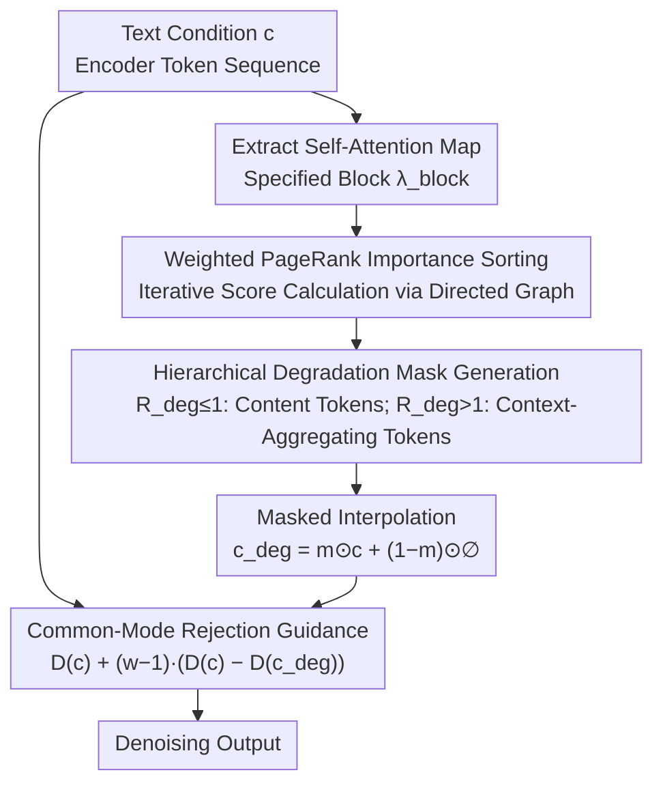

# Guiding Diffusion Models with Semantically Degraded Conditions

**Conference**: CVPR2026  
**arXiv**: [2603.10780](https://arxiv.org/abs/2603.10780)  
**Code**: [Ming-321/Classifier-Degradation-Guidance](https://github.com/Ming-321/Classifier-Degradation-Guidance)  
**Area**: Image Generation  
**Keywords**: Classifier-Free Guidance, Semantically Degraded Guidance, Text-to-Image, Diffusion Models, Compositional Generation

## TL;DR

Condition-Degradation Guidance (CDG) is proposed to replace the null prompt $\emptyset$ in CFG with a semantically degraded condition $\boldsymbol{c}_{\text{deg}}$. This shifts the guidance from a coarse "good vs. empty" contrast to a fine-grained "good vs. slightly worse" comparison. By employing a hierarchical degradation strategy (degrading content tokens followed by context-aggregating tokens) to construct adaptive negative samples, the method achieves plug-and-play improvements in compositional generation accuracy across models such as SD3, FLUX, and Qwen-Image with near-zero additional overhead.

## Background & Motivation

**Core Role and Limitations of CFG**: Classifier-Free Guidance (CFG) is the cornerstone of modern text-to-image models. However, it relies on a semantically void null prompt $\emptyset$, which performs poorly in complex compositional tasks such as text rendering, attribute binding, and spatial relations.

**Geometric Entanglement of Guidance Signals**: The massive semantic gap between $\boldsymbol{c}$ and $\emptyset$ causes the guidance signal to generate interference components along the primary denoising direction, mixing content generation with style/structural information.

**Limitations of Prior Work**: Process-correction methods (APG, TCFG) retain the $\boldsymbol{c}$ vs. $\emptyset$ paradigm and apply post-hoc corrections, which do not address the root cause. Negative sample modification methods (weak models, random perturbations, VLM-generated negative samples) are either semantically blind or require additional models.

**Key Insight**: A contrast between semantically close conditions ($\boldsymbol{c}$ vs. $\boldsymbol{c}_{\text{deg}}$) enables "common-mode rejection"—eliminating shared denoising components and leaving behind pure semantic correction signals.

**Functional Dichotomy of Tokens**: Tokens in Transformer text encoders are naturally divided into **content tokens** (encoding object semantics) and **context-aggregating tokens** (padding/special tokens that absorb global context through attention). This structure guides the design of the degradation strategy.

**Goal**: There is a need for a lightweight, plug-and-play guidance enhancement that requires no training, no external models, and negligible computational overhead.

## Method

### Overall Architecture

CDG replaces the null prompt $\emptyset$ in the CFG formula with a semantically degraded condition $\boldsymbol{c}_{\text{deg}}$:

$$D_\theta^{\text{CDG}}(\boldsymbol{x}_\sigma;\sigma,\boldsymbol{c}) = D_\theta(\boldsymbol{x}_\sigma;\sigma,\boldsymbol{c}) + (w-1)\big(D_\theta(\boldsymbol{x}_\sigma;\sigma,\boldsymbol{c}) - D_\theta(\boldsymbol{x}_\sigma;\sigma,\boldsymbol{c}_{\text{deg}})\big)$$

The workflow for constructing $\boldsymbol{c}_{\text{deg}}$ involves: ① Extracting self-attention maps from a specified Transformer block $\lambda_{\text{block}}$; ② Constructing a graph and calculating token importance using Weighted PageRank (WPR); ③ Generating a binary mask according to a hierarchical degradation strategy; ④ Applying masked interpolation between the original and empty conditions to obtain $\boldsymbol{c}_{\text{deg}}$, which is then used for guidance.

### Key Designs

**1. Hierarchical Degradation: Content Tokens First, Then Context-Aggregating Tokens**

Creating a "slightly worse" rather than "completely blank" negative sample requires knowing which tokens to degrade and by how much. The authors observe a natural dichotomy in Transformer text encoders: content tokens (e.g., "minecraft", "cooking") encode object semantics, while context-aggregating tokens (padding, special tokens) absorb global context via attention—WPR analysis confirms the former has significantly higher importance scores. Consequently, CDG uses a unified degradation ratio $R_{\text{deg}} \in [0,2]$: $r_{\text{content}} = \min(R_{\text{deg}}, 1.0)$ and $r_{\text{CtxAgg}} = \max(R_{\text{deg}}-1.0, 0)$. When $R_{\text{deg}} \le 1$, only content tokens (fine-grained semantics) are degraded; when $R_{\text{deg}} > 1$, context-aggregating tokens (coarse-grained semantics) are also degraded. Degradation is achieved via masked interpolation $\boldsymbol{c}_{\text{deg}} = \boldsymbol{m} \odot \boldsymbol{c} + (1-\boldsymbol{m}) \odot \emptyset$. The mask is computed only at the first denoising step and reused thereafter, making overhead negligible.

**2. Weighted PageRank Importance Sorting: Deterministic Basis for Token Degradation**

To select tokens for degradation based on importance, a reproducible ranking is required. CDG treats the self-attention map as a directed graph (tokens as nodes, attention weights as edge weights) and uses WPR iteration $\boldsymbol{s}^{(k+1)} = \frac{A^T\boldsymbol{s}^{(k)}}{\|A^T\boldsymbol{s}^{(k)}\|_1}$ until convergence to rank token importance. Notably, under the default configuration $R_{\text{deg}}=1.0$, all content tokens are degraded, rendering the WPR execution unnecessary and resulting in near-zero overhead. WPR primarily provides determinism for non-default ratios and theoretical grounding for the $R_{\text{deg}}=1.0$ boundary.

**3. Geometric Interpretation of Common-Mode Rejection: Minimizing Interference**

The authors provide a quantifiable basis for CDG's superiority. Based on the manifold hypothesis, SVD is used to approximate the primary denoising subspace $\mathcal{S}_{\boldsymbol{c}}(t)$ from MS-COCO prompts. Two metrics are defined: Geometric Decoupling $\text{Decoupling}(\mathcal{S}_g, \mathcal{S}_c) = \frac{1}{k}\sum_{i=1}^k \sin^2(\theta_i)$, measuring the orthogonality between the guidance signal and the denoising subspace (approaching 1 indicates near-orthogonality), and Interference Energy Ratio $\text{Interference}(\Delta\boldsymbol{\varepsilon}) = \frac{\|P_{\mathcal{S}_c(t)}\Delta\boldsymbol{\varepsilon}\|_F^2}{\|\Delta\boldsymbol{\varepsilon}\|_F^2}$, measuring the energy of the guidance signal within the denoising subspace (lower indicates less interference). Results show CDG maintains near-perfect orthogonality and extremely low interference energy throughout, whereas CFG exhibits severe entanglement in early stages. The root cause is that $\boldsymbol{c}$ and $\boldsymbol{c}_{\text{deg}}$ are semantic neighbors sharing similar normal components; the difference $\Delta\boldsymbol{\varepsilon}_{\text{CDG}} \propto \nabla_{z_t}\log\frac{p_t(z_t|\boldsymbol{c})}{p_t(z_t|\boldsymbol{c}_{\text{deg}})}$ naturally cancels shared components, leaving only the pure semantic correction—the essence of "common-mode rejection."

## Main Results

### Performance on MS-COCO 2017 Validation Set

| Model | Method | FID ↓ | CLIP Score ↑ | Aesthetic ↑ | VQA Score ↑ |
|------|------|-------|-------------|------------|------------|
| SD3 | CFG | 35.69 | 31.73 | 5.66 | 91.44 |
| SD3 | **Ours (CDG)** | **34.05** | **32.00** | **5.70** | **92.40** |
| SD3 | CADS | 36.16 | 31.72 | 5.65 | 91.44 |
| SD3 | PAG | 50.60 | 30.15 | 5.52 | 81.27 |
| SD3.5 | CFG | 34.56 | 31.85 | 6.21 | 91.94 |
| SD3.5 | **Ours (CDG)** | **33.07** | **31.96** | **6.26** | **92.61** |
| FLUX.1 | CFG | 38.55 | 31.20 | 6.06 | 90.31 |
| FLUX.1 | **Ours (CDG)** | **37.11** | **31.21** | **6.15** | **90.62** |
| Qwen | CFG | 42.45 | 32.11 | 2.57 | 93.66 |
| Qwen | **Ours (CDG)** | **39.02** | **32.31** | 2.54 | **93.93** |

### GenAI-Bench Compositional Reasoning

| Model | Method | Spatial ↑ | Comp ↑ | Differ ↑ | Univ ↑ |
|------|------|----------|--------|---------|--------|
| SD3.5 | CFG | 79.66 | 73.70 | 75.10 | 72.21 |
| SD3.5 | **Ours (CDG)** | **80.69** | **76.06** | **78.74** | **73.13** |

CDG shows the most significant gains in Differentiation (+3.64) and Comparison (+2.36), indicating that the "good vs. slightly worse" paradigm is most advantageous for tasks requiring precise semantic distinctions. The improvement on FLUX.1 is more modest, consistent with its use of Guidance Distillation.

### Ablation Study

- **Hierarchical Degradation as the Core Driver**: The hierarchical variant outperforms non-hierarchical versions by 5.9–12.2 points in VQA and shows 0.9–16.8 points lower FID.
- **WPR is Helpful but not Mandatory**: Within the hierarchical framework, WPR ranking performs similarly to random ranking (FID 33.89 vs. 34.17). WPR primarily provides determinism and interpretation for the $R_{\text{deg}}=1.0$ boundary.
- **Asymmetric Response of $R_{\text{deg}}$**: Metrics change sharply in the [0,1] interval (content token degradation) and level off in the [1,2] interval (context-aggregating token degradation), validating the functional dichotomy hypothesis.
- **Experimental Design**: Systemic comparisons between WPR, random, and reverse ranking, alongside hierarchical vs. non-hierarchical strategies, illustrate the contributions of each component.
- **Computational Efficiency**: Step-wise WPR adds +47.2% overhead, whereas one-time calculation adds +3.6%. Under the default $R_{\text{deg}}=1.0$, overhead is near-zero as WPR is bypassed.

### Key Findings

- Improvements on FLUX.1 are smaller because its Guidance Distillation reduces reliance on inference-time guidance, suggesting CDG's gain correlates with the model's dependence on guidance signals.
- Qwen-Image uses `<|im_end|>` instead of padding as a context aggregator; CDG remains effective, verifying the generalization of the hierarchical strategy across different token architectures.
- CDG achieves the highest gains in tasks like Differentiation and Comparison, aligning with the intent of the "good vs. slightly worse" contrast.
- CDG can be combined with orthogonal methods like PAG and is compatible with downstream applications like image-to-image and ControlNet.

## Highlights & Insights

- Reveals the functional dichotomy between content tokens and context-aggregating tokens in Transformer text encoders, providing a theoretical foundation for guidance design.
- Provides an intuitive and quantifiable explanation for CDG's superiority over CFG through geometric analysis (Decoupling, Interference Energy).
- Plug-and-play, training-free, and requires no external models; default configurations yield near-zero overhead, making it deployment-friendly.
- Demonstrates consistent improvements across four distinct architectures (SD3, SD3.5, FLUX.1, Qwen-Image), proving the method's universality.
- $R_{\text{deg}}$ provides an interpretable continuous control space: [0,1] for fine-grained semantics and [1,2] for coarse-grained context.
- The CFG* experimental design visualizes the semantic residue of degraded conditions, enhancing interpretability.

## Limitations & Future Work

- Limited improvement on models using Guidance Distillation (e.g., FLUX.1), where reliance on inference-time guidance is already reduced.
- The optimal value of $R_{\text{deg}}$ may require fine-tuning for different models, though 1.0 serves as a robust default.
- The method assumes a clear content/context-aggregating dichotomy in the text encoder; applicability to specialized encoder architectures remains to be verified.
- Lack of systematic evaluation on ultra-long or extremely complex prompts.
- CFG* validation is primarily qualitative; more rigorous theoretical proof is needed to elucidate the sufficient conditions for common-mode rejection.
- Validation is limited to Transformer-based diffusion models; applicability to UNet architectures is not discussed.

## Related Work & Insights

- **CFG Framework Improvements**: APG (geometric correction by projecting signals onto subspaces orthogonal to denoising directions) and TCFG (SVD decomposition) retain the null prompt and apply post-hoc fixes, avoiding the root cause of semantic poverty.
- **Model-level Negative Samples**: Autoguidance (weak models) and Weak-to-Strong Diffusion (reflection mechanisms) require maintaining extra models, increasing deployment costs.
- **Internal Mechanism Level**: PAG (perturbing self-attention) and SEG (smoothing curvature) operate on the calculation flow rather than the input; these are orthogonal to and can be combined with CDG.
- **Input-level Degradation**: ICG (random prompt replacement), CADS (unstructured Gaussian noise), SFG (spatially varying negative samples), and DNP (VLM-generated negative samples) are either semantically blind or rely on expensive external models. They fail to exploit the intrinsic semantic structure of the prompt's own token embeddings.
- **CDG's Position**: This is the first work to utilize the functional dichotomy of content/context-aggregating tokens for adaptive semantic degradation at the input level, balancing theoretical depth with practical efficiency.

## Rating

- Novelty: ⭐⭐⭐⭐ — Designing degradation based on token functional dichotomy is a novel perspective; the shift to "good vs. slightly worse" guidance is inspiring.
- Experimental Thoroughness: ⭐⭐⭐⭐⭐ — Covers four models, multiple metrics, GenAI-Bench reasoning, detailed ablations, and geometric analysis.
- Writing Quality: ⭐⭐⭐⭐ — Clear structure with strong geometric intuition and well-aligned formulas and experiments.
- Value: ⭐⭐⭐⭐ — A practical, plug-and-play solution that improves the fundamentals of CFG with direct utility for the community.

<!-- RELATED:START -->

## Related Papers

- [\[CVPR 2026\] Guiding Token-Sparse Diffusion Models](guiding_token-sparse_diffusion_models.md)
- [\[CVPR 2026\] Guiding Diffusion Models with Fine-Grained Conditions and Semantics-Preserving Sampling for One-Shot Federated Learning](guiding_diffusion_models_with_fine-grained_conditions_and_semantics-preserving_s.md)
- [\[CVPR 2026\] Exploring Conditions for Diffusion Models in Robotic Control](exploring_conditions_for_diffusion_models_in_robotic_control.md)
- [\[CVPR 2026\] GenErase: Generalizable and Semantically-Aware Concept Erasure in Diffusion Models](generase_generalizable_and_semantically-aware_concept_erasure_in_diffusion_model.md)
- [\[CVPR 2026\] Guiding a Diffusion Transformer with the Internal Dynamics of Itself](guiding_a_diffusion_transformer_with_the_internal_dynamics_of_itself.md)

<!-- RELATED:END -->
