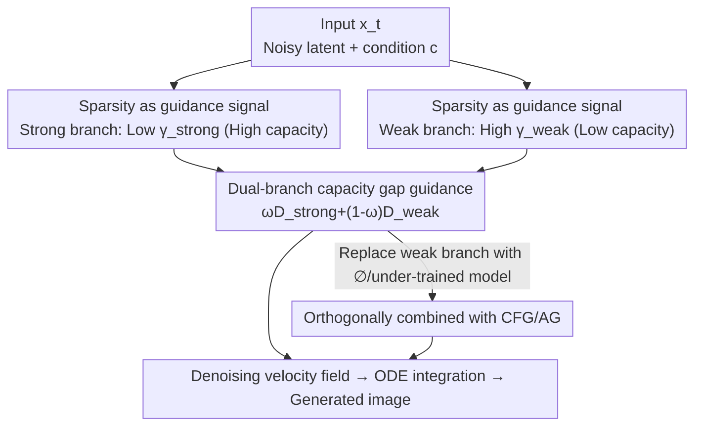

# Guiding Token-Sparse Diffusion Models

**Conference**: CVPR 2026  
**Paper**: [CVF Open Access](https://openaccess.thecvf.com/content/CVPR2026/html/Krause_Guiding_Token_Sparse_Diffusion_Models_CVPR_2026_paper.html)  
**Code**: https://compvis.github.io/sparse-guidance (Project Page)  
**Area**: Diffusion Models  
**Keywords**: token sparsity, diffusion guidance, efficient inference, capacity gap, text-to-image  

## TL;DR
Addressing the issue that "diffusion models trained with token sparsity barely respond to CFG," this paper proposes Sparse Guidance (SG). During inference, two conditional predictions are computed using different token sparsity rates—one strong and one weak. The "capacity gap" between them replaces the unconditional branch in CFG to guide the generation. Without any dense fine-tuning, it achieves a 1.58 FID on ImageNet-256 while saving 25% FLOPs, proving equally effective on 2.5B text-to-image models.

## Background & Motivation
**Background**: Diffusion and Flow Matching models offer high quality in image synthesis but are expensive to train and deploy. A primary direction for cost reduction is **train-time token sparsity**—leveraging visual redundancy to process only a subset of tokens per layer: either through **masking** (discarding tokens and replacing them with learnable embeddings, e.g., MaskDiT) or **routing** (temporarily bypassing layers and re-inserting tokens later, e.g., TREAD). These methods significantly increase training throughput and can even lead to faster convergence.

**Limitations of Prior Work**: Sparsely trained models **collapse during inference**—they show almost no response to Classifier-free Guidance (CFG). CFG relies on the difference between "conditional prediction − unconditional prediction" to enhance quality, but in sparsely trained models, this delta is weak, leading to mediocre generation quality (see Fig. 2 in the paper). Consequently, the community often adds an expensive **dense fine-tuning** stage to "fix" CFG, which offsets the savings from sparse training and hinders the wide adoption of these methods.

**Key Challenge**: The guidance signal in CFG comes from the "strong predictor pushing the weak predictor towards lower variance." Sparse training disrupts the model's behavior on the unconditional branch, causing the CFG "strong-weak" delta to fail. However, the authors discovered that **sparsity itself** is a natural "capacity knob"—higher sparsity leads to lower effective capacity and a "softer" conditional distribution. Given this, why try to fix an unconditional branch broken by sparse training?

**Core Idea**: Instead of avoiding the train-test gap caused by sparse training, **embrace it**. During inference, perform two **conditional** predictions using two different token sparsity rates $\gamma_\text{strong} < \gamma_\text{weak}$. Use the "capacity gap" between them as the guidance signal to replace the failed unconditional branch in CFG. This recovers the benefits of strong guidance and **simultaneously saves computation** because the branches are sparse.

## Method

### Overall Architecture
SG is a **finetune-free, plug-and-play inference scheduling mechanism**. Given a diffusion model already trained with token sparsity, inference no longer involves "conditional vs. unconditional" predictions. Instead, for the **same condition** $c$, the network is run twice at **two different sparsity levels**: a low sparsity rate yielding a "strong (high capacity)" prediction and a high sparsity rate yielding a "weak (low capacity)" prediction. The weak branch is then amplified towards the strong branch according to the guidance formula to obtain the final denoising velocity field for ODE integration. Since the weak branch processes fewer tokens, the total FLOPs are lower than dense CFG.

Preliminaries: Under Flow Matching, the model $v_\theta$ predicts the velocity field from noise to data. The oracle velocity along the linear interpolation path $x_t=(1-t)z+tx$ is $v^\star=x-z$. CFG is defined as $v_\theta^\text{CFG}(c,\omega)=\omega\,v_\theta(c)+(1-\omega)\,v_\theta(\varnothing)$, which doubles computation per step for dense models. SG replaces the unconditional term $v_\theta(\varnothing)$ with a "highly sparse conditional prediction."

### Key Designs

**1. Using Token Sparsity as a Guidance Signal: Replacing the broken unconditional branch with the "capacity gap"**

This design targets the root cause of why sparse models fail to respond to CFG. The authors redefine the sparsity rate $\gamma\in[0,1)$ as an **inference-time capacity knob**: as $\gamma$ increases, fewer tokens are processed per layer, the effective capacity drops, and the resulting conditional distribution $D_\theta(x_t,t,c;\gamma)$ becomes "softer" (higher variance, lower sharpness). The key observation is that guidance is most effective when "a high-variance predictor pushes a low-variance predictor to be sharper." Thus, SG instantiates guidance via $\gamma$: using a **weak branch** with high $\gamma$ to push a **strong branch** with low $\gamma$.

Note the pitfall: simply adding $\gamma>0$ to inference at $\omega=1$ (sparsity without guidance) results in progressively worse output and visual artifacts as $\gamma$ rises (Fig. 4)—sparsity itself is degrading. The essence of SG is to use this knob only **within a guidance setting**, allowing the "direction of degradation" caused by sparsity to become an amplifiable guidance direction pointing toward high quality. Specifically, a binary mask $m\in\{0,1\}^T$ with $m_k\sim\text{Bernoulli}(1-\gamma)$ is sampled to select the token subset.

**2. Dual-branch Guidance Formula: Both predictions are conditional, driven by the sparsity delta**

Defines the prediction branches under two sparsity levels (under the constraint $0\le\gamma_\text{strong}<\gamma_\text{weak}<1$):

$$D_\theta^\text{strong}(c):=D_\theta(x_t,t,c;\gamma_\text{strong}),\quad D_\theta^\text{weak}(c):=D_\theta(x_t,t,c;\gamma_\text{weak})$$

The fundamental difference from CFG is that **both are conditional predictions**; there is no unconditional branch. The guidance signal stems entirely from the capacity gap induced by the different sparsity rates. The formula is:

$$D_\theta^\text{SG}(c,\gamma_\text{strong},\gamma_\text{weak},\omega)=\omega\,D_\theta^\text{strong}(c)+(1-\omega)\,D_\theta^\text{weak}(c)$$

This uses the low-capacity weak prediction $D_\theta^\text{weak}(c)$ to amplify the high-capacity strong prediction in the direction of $D_\theta^\text{strong}(c)-D_\theta^\text{weak}(c)$ with magnitude $\omega$. This bypasses the disrupted unconditional behavior and saves computation due to fewer tokens in the weak branch. The authors also observe synergy: a larger $\omega$ allows for higher total sparsity ($\gamma_\text{strong},\gamma_\text{weak}$), further enhancing efficiency while maintaining quality.

**3. Orthogonal Combined with CFG / AutoGuidance: Finetune-free and synergistic**

SG makes no assumptions about how condition $c$ is derived, allowing it to combine naturally with existing techniques. By nulling the condition ($\varnothing$) in the weak branch, one obtains **CFG + SG**:

$$D_\theta^\text{CFG+SG}(c,\gamma_\text{strong},\gamma_\text{weak},\omega)=\omega\,D_\theta^\text{strong}(c)+(1-\omega)\,D_\theta^\text{weak}(\varnothing)$$

Similarly, substituting the weak branch with a smaller or under-trained checkpoint integrates with **AutoGuidance (AG)**. SG resolves a common issue with AG: AG typically requires a specific additional dense checkpoint and a narrow training window (Karras et al. suggest using 1/16 of training for the auxiliary model). SG can "rescue" suboptimal checkpoints over a **broad range of training steps** (tested from 50k to 800k steps, or 2.5% to 40%) by adjusting $\gamma_\text{strong}$ and $\gamma_\text{weak}$. The entire mechanism **requires no extra fine-tuning**, introducing only $\gamma$ as a hyperparameter.

## Key Experimental Results

### Main Results
The primary evaluation is on class-conditional ImageNet-256 using SiT-XL/2 (in SD VAE latent space) with 40-step Euler sampling and FID based on 50k samples. SG is effective for both masking (MaskDiT) and routing (TREAD):

| Sparse Training | Guidance | #Epoch | FID↓ | sFID↓ | IS↑ | Recall↑ |
|----------|------|--------|------|-------|-----|-------|
| Masking | CFG | 160 | 5.82 | 13.00 | 227.8 | 0.45 |
| Masking | **SG** | 160 | **5.73** | **11.99** | 249.0 | 0.42 |
| Routing | CFG | 160 | 2.95 | 4.84 | 233.3 | 0.56 |
| Routing | **SG** | 160 | **2.07** | **3.98** | 223.4 | **0.58** |

In horizontal comparisons with various guidance methods (SiT-XL/2 + routing, 400 epochs), SG outperforms in both FID and computation—`SG_FLOPS` saves more computation than the unguided baseline while providing higher quality, and `SG_FID` reduces FID to 1.58:

| Method | FID↓ | GFLOPS↓ | ΔGFLOPS |
|------|------|---------|---------|
| SiT-XL/2 + routing (baseline) | 4.89 | 114.42 | 0 |
| +CFG | 2.57 | 228.84 | +114.42 |
| +AG | 2.95 | 228.84 | +114.42 |
| +APG | 2.51 | 228.84 | +114.42 |
| +ICG | 2.81 | 228.84 | +114.42 |
| **+SG_FLOPS (Ours)** | 2.14 | **97.67** | **−16.75** |
| **+SG_FID (Ours)** | **1.58** | 173.16 | +58.74 |

`SG_FID` (combining AG) reduces FID by another 0.99 compared to the next-best CFG. `SG_FLOPS` saves **58% GFLOPs** relative to CFG at matching quality. Compared to SOTA diffusion models, `SG_FID`'s 1.58 FID surpasses baselines while being 24.6% more efficient than dense guided SiT (173.16 vs. 228.84 GFLOPS), with higher Recall (0.63) indicating better sample variance without collapse.

### Ablation Study

| Config / Phenomenon | Key Result | Explanation |
|------|---------|------|
| Sparsity without guidance ($\omega=1,\gamma>0$) | FID worsens as $\gamma$ increases | Sparsity is inherently degrading; it must be used in a guidance setup (Fig. 4). |
| CFG even with dense fine-tuning | Still inferior to SG | Proves SG is necessary to unlock the potential of sparse models (Fig. 5). |
| Routing vs. Masking feasibility | Routing is wider and more stable; Masking has a narrower corridor | Routing preserves token info, making it more robust to hyperparameters. |
| $\omega\in\{1.3,1.5,1.7,1.9\}$ | Optimal FID remains stable, but large $\omega$ tolerates higher sparsity | $\omega$ and sparsity synergistically improve efficiency (Fig. 6/8). |
| AG auxiliary checkpoint (2.5%~40% steps) | Optimal results across a wide range | SG relaxes the strict requirements AG has for checkpoint selection (Fig. 7). |

### Key Findings
- **Routing is a better foundation for SG than masking**: Routing temporarily stores and restores tokens, preserving instance information and making the capacity gap smoother and more controllable across a larger hyperparameter range. Masking irreversibly deletes tokens, leading to a narrower but still functional range.
- **Sparsity rate and guidance scale are synergistic**: Higher sparsity pushes samples off the manifold, while larger $\omega$ pulls them back. Increasing both simultaneously can speed up inference while maintaining quality.
- **SG inhibits CFG variance collapse**: LPIPS analysis shows SG outputs are closer to conditional predictions (Fig. 7 left), and Recall is higher. This mitigates the over-saturation and diversity loss common in CFG.
- **Scaling verification**: A 2.5B text-to-image DiT was trained (34 layers, L2→L30 routing, 50% selection, InternVL3-2B text encoder, 100M data). SG improved human preference (HPSv3) and composition (GenEval) while increasing throughput—the 2.5B model's HPSv3 score surpassed several larger models (e.g., CogView4, PixArt-Σ), ranking 5th.

## Highlights & Insights
- **"Transforming training augmentation into an inference-time guidance primitive" is the most elegant move**: While others see sparsity as a byproduct of training speedup and try to "fix" it for inference, this paper treats sparsity as a continuous "distribution sharpness knob," turning a train-test gap from a bug into a feature.
- **Computational savings are a natural byproduct of the guidance mechanism**: Because the weak branch processes fewer tokens, guidance naturally reduces computation—a stark contrast to the "cost-doubling" of CFG. This aligns the traditionally opposing goals of "quality" and "efficiency" under a single knob.
- **Transferable logic**: Any setting where "network capacity is perturbed during training" (not just token sparsity, but perhaps depth/width dropout or top-k selection in MoD) could potentially use the capacity gap between two perturbation intensities to construct a finetune-free guidance signal. This paradigm is worth generalized exploration.

## Limitations & Future Work
- The authors admit the feasible hyperparameter range for masking is narrower than for routing because irreversible token deletion loses instance info. For masking-heavy sparse schemes, SG's stability and gains might be reduced.
- ⚠️ Two sparsity hyperparameters $\gamma_\text{strong}$ and $\gamma_\text{weak}$ are introduced. Although the authors claim the feasible range is wide and only $\gamma$ is "extra" (the rest mimics training), actual deployment still requires searching for the $(\gamma_\text{strong},\gamma_\text{weak},\omega)$ triplet. For T2I, metrics like HPSv3 rather than FID must be used to determine sparsity rates.
- The **method requires the model to be trained with token sparsity**. SG is not directly applicable to standard dense-trained diffusion models as they lack the "capacity gap channel."
- T2I evaluation relies primarily on preference/composition metrics like HPSv3 and GenEval. The lack of standardized FID comparisons on ImageNet-scale for T2I means scaling conclusions should be viewed with some caution.

## Related Work & Insights
- **vs. CFG**: CFG uses "conditional - unconditional" delta guidance, doubles computation per step, and fails on sparse models. SG uses "low sparse - high sparse" capacity delta with both branches conditional, bypassing broken unconditional behavior while saving computation.
- **vs. AutoGuidance (AG)**: AG uses a small/under-trained model as the weak branch but requires extra dense training and narrow checkpoint windows. SG can be layered onto AG, using $\gamma$ to rescue suboptimal checkpoints across a broad range.
- **vs. ICG (Independent Condition Guidance)**: ICG also attempts training-free intervention. However, SG achieves lower FID, arguing that "introducing inference-time sparsity to minimize train-test gap" is more effective than ICG's approach.
- **vs. Train-time Sparsity (MaskDiT / TREAD)**: These methods utilize sparsity only during training and revert to dense for inference, relying on dense fine-tuning to fix CFG. SG brings sparsity all the way to inference, using it as both a guidance signal and a speedup tool, closing the loop for sparse training.

## Rating
- Novelty: ⭐⭐⭐⭐⭐ Redefining training sparsity as an inference-time guidance knob is a counter-intuitive and cohesive new perspective.
- Experimental Thoroughness: ⭐⭐⭐⭐ Strong horizontal comparisons and ablations on ImageNet; 2.5B T2I scaling is impressive, though T2I lacks standardized FID comparisons.
- Writing Quality: ⭐⭐⭐⭐ The chain of motivation-formula-experiment is clear and symbols are consistent; some chart details require careful cross-referencing with the text.
- Value: ⭐⭐⭐⭐⭐ Directly bridges the "last mile" of sparse training (where training is cheap but inference collapses), achieving simultaneous gains in quality and efficiency. High practical utility.

<!-- RELATED:START -->

## Related Papers

- [\[CVPR 2026\] Guiding Diffusion Models with Semantically Degraded Conditions](guiding_diffusion_models_with_semantically_degraded_conditions.md)
- [\[CVPR 2026\] Guiding a Diffusion Transformer with the Internal Dynamics of Itself](guiding_a_diffusion_transformer_with_the_internal_dynamics_of_itself.md)
- [\[CVPR 2026\] Interpretable Prompts made Edit-Friendly: Token-to-Token Similarity Reduction in dLLMs for Edit-Friendly Hard Prompt Inversion](interpretable_prompts_made_edit-friendly_token-to-token_similarity_reduction_in_.md)
- [\[CVPR 2026\] Guiding Diffusion Models with Fine-Grained Conditions and Semantics-Preserving Sampling for One-Shot Federated Learning](guiding_diffusion_models_with_fine-grained_conditions_and_semantics-preserving_s.md)
- [\[CVPR 2026\] Guiding a Diffusion Model by Swapping Its Tokens](guiding_a_diffusion_model_by_swapping_its_tokens.md)

<!-- RELATED:END -->
