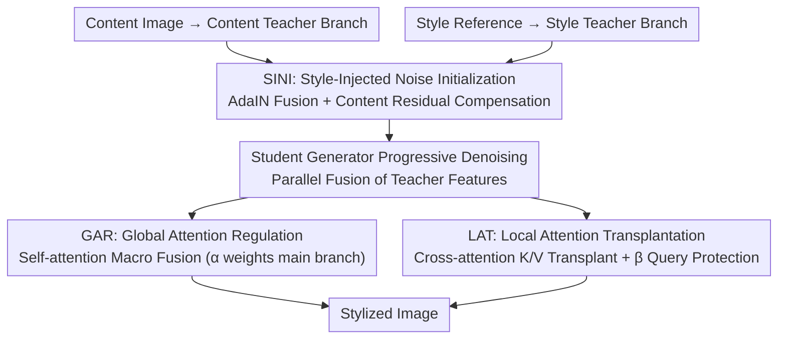

# HAM: A Training-Free Style Transfer Approach via Heterogeneous Attention Modulation for Diffusion Models

**Conference**: CVPR 2026 Findings  
**arXiv**: [2603.24043](https://arxiv.org/abs/2603.24043)  
**Code**: None  
**Area**: Diffusion Models / Image Generation  
**Keywords**: Style Transfer, Attention Modulation, Training-Free, Diffusion Models, Identity Preservation

## TL;DR
This paper proposes HAM, a training-free style transfer method that achieves high-quality results without sacrificing content identity. It implements heterogeneous modulation (GAR+LAT) on self-attention and cross-attention within diffusion models, combined with style-injected noise initialization, achieving state-of-the-art (SOTA) performance across multiple metrics.

## Background & Motivation

**Background**: Style transfer methods based on diffusion models are primarily divided into two categories: fine-tuning methods (training style control modules via LoRA/ControlNet) and training-free methods (manipulating attention features during inference). Fine-tuning methods are computationally expensive and lack robustness, while training-free methods like StyleID and DiffArtist achieve style transfer by injecting key/value pairs from style images into self-attention.

**Limitations of Prior Work**: Existing training-free methods rely solely on self-attention manipulation for both style injection and content preservation. However, since Q/K/V in self-attention simultaneously encode spatial relationships and semantic representations, single-channel manipulation struggles to balance style expression and content retention, often leading to insufficient styling or content distortion.

**Key Challenge**: Injecting style into self-attention inevitably damages content identity because Q/K/V naturally couple spatial structure with semantic content. Existing methods fall into a trade-off dilemma between style and content.

**Goal**: How to fully capture complex style references while maintaining the identity information (structure, texture, text, etc.) of the content image in a training-free setting.

**Key Insight**: Decouple style injection and content protection into different attention mechanisms—using self-attention for global style-content fusion and cross-attention for precise local style transplantation and content protection, thereby achieving heterogeneous modulation.

**Core Idea**: By applying different strategies of heterogeneous attention modulation to self-attention and cross-attention (GAR for global fusion and LAT for local transplantation), style injection and content protection in style transfer are decoupled into distinct attention channels.

## Method

### Overall Architecture
HAM consists of three core modules: Global Attention Regulation (GAR), Local Attention Transplantation (LAT), and Style-Injected Noise Initialization (SINI). The system utilizes three parallel diffusion model branches: a content teacher (processing the content image), a style teacher (processing the style reference), and a student generator (producing the stylized image). First, SINI generates an initial noise that blends style and content information. During the diffusion denoising process, GAR operates on self-attention layers for macro style-content fusion, while LAT operates on cross-attention layers for precise style/content control. This method is compatible with both SD2.1 (DDIM-based) and SD3.5 (DiT-based) architectures.

### Key Designs

**1. Global Attention Regulation (GAR): Macro Style-Content Fusion in Self-Attention instead of Brutal Replacement**

Existing training-free methods insert style K/V directly into self-attention, which risks destroying spatial structures. GAR buffers this impact in two steps: first, it aligns the content teacher's projections $(Q^c, K^c, V^c)$ with the style teacher's $(Q^s, K^s, V^s)$ using AdaIN to create composite projections $(Q^{cs}, K^{cs}, V^{cs})$. This involves normalizing content features and rescaling them with style statistics. Then, it blends these with the student's own projections using hyperparameter $\alpha$:

$$\hat{Q} = \alpha \cdot Q^m + (1-\alpha) \cdot Q^{cs}$$

The same applies to K and V. This allows style statistics to enter while the spatial-semantic structure of the main branch is preserved by the $\alpha$ term. Ablations show $\alpha=0.75$ is optimal, indicating that self-attention cannot withstand heavy style injection without damaging content.

**2. Local Attention Transplantation (LAT): Moving Style Injection to Cross-Attention with Query Protection**

While GAR handles macro fusion, it cannot provide sufficient style intensity. LAT shifts the channel: cross-attention, originally intended for text conditions, does not carry spatial structure. Thus, transplanting cross-attention K/V from the style teacher to the student effectively injects style without disrupting content structure. To prevent the content identity from drifting on the query side, LAT merges the content teacher's $Q^c_{cross}$ and the main branch $Q^m_{cross}$ using $\beta$:

$$\hat{Q}^m_{cross} = \beta \cdot Q^m_{cross} + (1-\beta) \cdot Q^c_{cross}$$

A value of $\beta=0.25$ provides the best balance, where the query maintains identity via the content teacher, while K/V are fully handled by the style teacher for colorization. LAT is the primary driver for identity preservation, increasing DINO from 0.609 to 0.712.

**3. Style-Injected Noise Initialization (SINI): Incorporating Style and Content at the Starting Line**

If the initial noise only contains content information, the generation lacks a stylistic foundation. SINI acts at the start of diffusion: it fuses content initial noise $z^c_T$ and style initial noise $z^s_T$ via AdaIN. To prevent identity loss from pure AdaIN, a content residual term (the difference between the original and fused noise) is added back, controlled by $\gamma$:

$$z^m_T = \gamma \cdot \text{ContentResidual} + \text{StylizedNoise}$$

The residual term recaptures lost structures. With $\gamma=0.5$, both style statistics and content structure are balanced, maximizing color diversity and comprehensive metrics like DC/CC.

### Loss & Training
The method is entirely training-free; all operations are performed during inference. SD2.1 uses 50-step DDIM denoising with an image size of 512×512. The three hyperparameters $\alpha=0.75, \beta=0.25, \gamma=0.5$ were determined through ablation experiments.

## Key Experimental Results

### Main Results

| Method | ArtFID↓ | LPIPS↓ | DINO↑ | CLIP-I↑ | CLIP-T↑ | DC↑ | CC↑ |
|------|---------|--------|-------|---------|---------|-----|-----|
| StyleID (CVPR'24) | 15.161 | 0.635 | 0.544 | 0.619 | 0.213 | 1.873 | 1.964 |
| DiffArtist (MM'25) | 16.174 | 0.520 | 0.629 | 0.626 | 0.220 | 1.987 | 1.984 |
| AttDistillation (CVPR'25) | 16.170 | 0.629 | 0.541 | 0.615 | 0.219 | 1.878 | 1.969 |
| **HAM (Ours)** | **15.151** | **0.479** | **0.728** | **0.682** | **0.223** | **2.113** | **2.057** |

### Ablation Study

| Configuration | DINO↑ | CLIP-I↑ | CLIP-T↑ | DC↑ | CC↑ |
|------|-------|---------|---------|-----|-----|
| Baseline (No modules) | 0.609 | 0.626 | 0.220 | 1.963 | 1.984 |
| +GAR | 0.618 | 0.626 | 0.231 | 1.993 | 2.002 |
| +LAT | 0.712 | 0.696 | 0.193 | 2.042 | 2.023 |
| +GAR+LAT | 0.746 | 0.696 | 0.202 | 2.099 | 2.040 |
| +GAR+LAT+SINI (Full) | 0.728 | 0.682 | 0.223 | 2.113 | 2.057 |

### Key Findings
- LAT contributes most to content preservation (DINO from 0.609 → 0.712) and is the core module for identity protection.
- GAR primarily improves style intensity (CLIP-T from 0.220 → 0.231) while slightly improving content metrics.
- SINI enhances color diversity and stylistic richness, achieving optimal combined DC/CC metrics when used with the other two modules.
- The hyperparameter $\alpha=0.75$ prioritizes the main branch information; values too low lead to rapid content degradation.

## Highlights & Insights
- Distributing injection and protection across different types of attention mechanisms (heterogeneous modulation) is an ingenious approach. It leverages cross-attention to handle style injection, avoiding the structural disruption inherent in self-attention manipulation.
- The AdaIN + residual noise initialization elegantly addresses the style-content balance in initial noise, proving more effective than simple noise replacement or fusion.
- Compatibility with both SD2.1 and SD3.5 (DDIM vs. DiT) demonstrates the generalizability of the proposed method.

## Limitations & Future Work
- Transfer effects for highly abstract or surrealist styles remain limited.
- Generating one image takes approximately 16 seconds on SD2.1 due to the computational overhead of running three parallel diffusion branches.
- The three hyperparameters require manual tuning, as different styles may require different settings.
- The margin of improvement for ArtFID over StyleID is relatively narrow (15.151 vs. 15.161).

## Related Work & Insights
- **vs StyleID**: StyleID only injects style K/V into self-attention, causing content distortion. HAM moves style injection to cross-attention, significantly reducing content damage.
- **vs DiffArtist**: DiffArtist performs well in content preservation (LPIPS) but lacks the style intensity of HAM. HAM's LAT module achieves a better balance through its query protection mechanism.
- The concept of heterogeneous attention modulation could be extended to other domains such as image editing and video stylization.

## Rating
- Novelty: ⭐⭐⭐⭐ The heterogeneous modulation concept is novel, though components like AdaIN fusion are standard.
- Experimental Thoroughness: ⭐⭐⭐⭐ Detailed ablation studies cover all modules and hyperparameters, though a user study is missing.
- Writing Quality: ⭐⭐⭐⭐ The structure is clear with complete derivations, though some descriptions are redundant.
- Value: ⭐⭐⭐⭐ A practical solution for training-free style transfer with excellent cross-architecture compatibility.

<!-- RELATED:START -->

<!-- RELATED:END -->

## Related Papers

- [\[CVPR 2026\] StyleGallery: Training-free and Semantic-aware Personalized Style Transfer from Arbitrary Image References](stylegallery_training-free_and_semantic-aware_personalized_style_transfer_from_a.md)
- [\[AAAI 2026\] Melodia: Training-Free Music Editing Guided by Attention Probing in Diffusion Models](../../AAAI2026/image_generation/melodia_training-free_music_editing_guided_by_attention_probing_in_diffusion_mod.md)
- [\[CVPR 2026\] OrthoFuse: Training-free Riemannian Fusion of Orthogonal Style-Concept Adapters for Diffusion Models](orthofuse_training-free_riemannian_fusion_of_orthogonal_style-concept_adapters_f.md)
- [\[CVPR 2026\] A Training-Free Style-Personalization via SVD-Based Feature Decomposition](a_training-free_style-personalization_via_svd-based_feature_decomposition.md)
- [\[CVPR 2026\] Style-GRPO: Semantic-Aware Preference Optimization for Image Style Transfer Guided by Reward Modeling](style-grpo_semantic-aware_preference_optimization_for_image_style_transfer_guide.md)

<!-- RELATED:END -->
