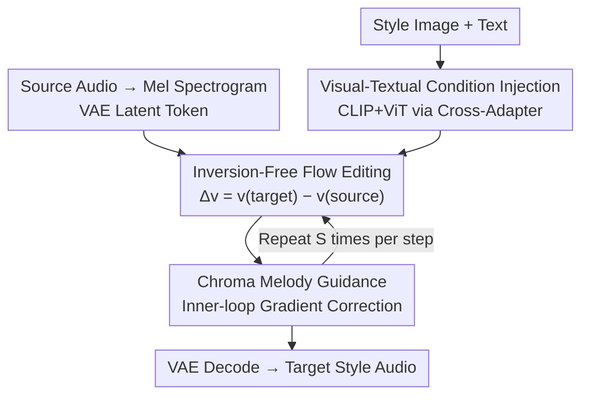

# Harmonic Canvas: Inversion-Free Editing for Visually-Guided Music Style Transfer

**Conference**: CVPR 2026  
**Paper**: [CVF Open Access](https://openaccess.thecvf.com/content/CVPR2026/html/Lei_Harmonic_Canvas_Inversion-Free_Editing_for_Visually-Guided_Music_Style_Transfer_CVPR_2026_paper.html)  
**Code**: Online demo only; repository not public  
**Area**: Cross-modal Generation / Music Style Transfer / Flow Editing  
**Keywords**: Music Style Transfer, Visual Guidance, Inversion-Free Flow Editing, Cross-modal Fusion, Chroma Melody Constraint

## TL;DR
This paper treats "image atmosphere" as a third conditioning modality for music style, proposing a multimodal music style transfer framework based on inversion-free flow editing. Visual and textual cues are injected into an audio DiT backbone via a CLIP+ViT dual encoder with cross-adapters. A differentiable normalized chroma constraint is used to "pull back" the pitch structure along the flow trajectory, effectively preserving the source melody while allowing large-scale style changes. Indicators such as FAD and IMSM comprehensively outperform existing text- or audio-conditioned methods.

## Background & Motivation

**Background**: Music Style Transfer (MST) aims to re-render an existing track into another style while preserving its melody and rhythm. Mainstream approaches use **text prompts** ("bright and cheerful jazz") or **reference audio** as style conditions. Recently, diffusion models combined with diffusion inversion have been widely used for zero-shot editing.

**Limitations of Prior Work**: The authors identify two specific issues. First, **text is a lossy style proxy**—"atmospheric" information such as color tone, lighting, and spatial composition is difficult to describe precisely with language. Text can only approximate emotions and fails to capture fine-grained aesthetic textures. Second, **diffusion inversion is slow and unstable**: inversion requires multi-step stochastic reconstruction to recover the noise trajectory, which is computationally expensive and accumulates errors, causing temporal drift in long audio.

**Key Challenge**: Music style is inherently **multimodal** (visual color/brightness naturally correspond to timbre/rhythm/harmony), but existing MST systems rarely utilize visual cues explicitly. Furthermore, in structure-preserving editing paradigms, there is a direct trade-off between **style freedom** and **melody fidelity**—the more the style is modified, the more likely the pitch is to deviate.

**Goal**: To address two sub-problems: (1) How to represent and utilize "beyond-language" visual semantics to guide style; (2) How to preserve pitch and rhythmic identity under significant style transformation within an inversion-free generation framework.

**Key Insight**: Inversion-free flow editing (such as FlowEdit) establishes a **deterministic** transport path between source and target distributions, naturally preserving global consistency while allowing local style changes, which fits the "preserve melody, change style" requirement. Visual conditioning is further justified via information theory.

**Core Idea**: Use **direct visual embedding injection + chroma melody gradient correction** to translate visual atmosphere into musical expression while "pinning" the flow trajectory to the pitch-class structure of the source track.

## Method

### Overall Architecture
The framework is built upon **Make-An-Audio 3 (MAA3)**, a DiT-based audio diffusion backbone. Audio is converted to Mel spectrograms via STFT and encoded into latent tokens by a lightweight audio VAE. A Flan-T5 text encoder injects semantics through AdaLN, while RoPE encodes temporal information. On top of this, the pipeline performs inversion-free flow editing in the latent space, coordinated by three components: **Visual-Textual Condition Injection** (injecting CLIP+ViT visual features alongside text into each DiT block via cross-adapters), **Inversion-Free Flow Editing** (constructing the source-to-target mapping using the velocity difference $\Delta v$ between the source and target to bypass noise inversion), and **Chroma Melody Guidance** (executing several gradient inner-loops within each flow step to pull the latent back to the source pitch distribution). The input consists of source audio, a style image, and optional text; the output is the style-transferred audio with the original melody preserved.

### Key Designs

**1. Cross-Adapter Visual-Textual Dual-Stream Injection: Using Visual Embeddings Instead of Image-to-Text to Avoid Information Loss**

The authors justify direct visual feature injection using information theory: given an image $I$, its caption $C=g(I)$, and the generated audio $Z$, the sequence $I\to C\to Z$ forms a Markov chain. The Data Processing Inequality states $I(I;Z)\le I(I;C)$, meaning the "image→text→audio" path only **loses** style information. Instead of converting images to text, visual features are injected directly using **two complementary visual encoders**: CLIP for high-level vision-language semantic alignment and ViT for global information. Their embeddings are pooled, linearly projected, and injected via cross-attention.

Injection is handled by a cross-adapter that preserves the pre-trained structure: the main stream (audio hidden state $H$) and the control stream (text $X_{ctl}$, visual $Y_{ctl}$) **share Query projections** but maintain independent Key/Value projections:
$$Q_m = W_q\,\mathrm{Norm}(H),\quad K_{ctl}=W_k^{(x)}\Phi_x(X_{ctl})+W_k^{(y)}\Phi_y(Y_{ctl}),\quad V_{ctl}=W_v^{(x)}\Phi_x(X_{ctl})+W_v^{(y)}\Phi_y(Y_{ctl})$$
The adapter output $O_{crs}=\mathrm{softmax}\!\big((Q_m\odot R_q)(K_{ctl}\odot R_k)^\top/\sqrt{d}\big)V_{ctl}W_o$ is added back to the main stream ($R_q, R_k$ are segmented RoPE factors using independent time grids). Shared $W_q, W_o$ keep the representation spaces aligned, while independent K/V allow the control path its own semantics. During training, FFN/Norm layers in the control stream that do not contribute to the main loss are frozen to ensure stability.

**2. Inversion-Free Flow Editing Backbone: Constructing Deterministic Paths via Velocity Differences**

Flow generative models define synthesis as a continuous transformation between distributions $\frac{dz_t}{dt}=v_\theta(z_t,t)$, with a flow matching objective: $\mathcal{L}_{flow}=\mathbb{E}_{t,z_t}\big[\lVert v_\theta(z_t,t)-v_t\rVert_2^2\big]$. This paper bypasses multi-step stochastic reconstruction by **directly using the velocity difference under source and target conditions** to construct the editing mapping:
$$z_t^{edit}=z_t^{src}+\Delta v_t,\qquad \Delta v_t = v_\theta(z_t^{tar},t)-v_\theta(z_t^{src},t)$$
This step expresses "semantic transformation" as the difference between two velocity fields. The directions are consistent and do not introduce stochastic noise accumulation, making it more stable and efficient than inversion schemes, especially for structure-preserving MST.

**3. Normalized Chroma Melody Guidance: Gradient Inner-Loops to "Pull Back" Pitch**

Multimodal conditions can cause **pitch drift or rhythmic distortion**. The authors use **normalized chroma** (relative energy distribution of twelve pitch classes within an octave) as a melody descriptor. Compared to raw F0 curves, it is magnitude-invariant, robust to timbre, and tolerates polyphony. After decoding the current edit latent into a waveform $\hat{x}_t=G(z_t^{edit})$, $C_t=\Phi_{chroma}(\hat{x}_t)$ is extracted and compared with the source reference $C_{ref}$ using an L1 metric:
$$\mathcal{L}_{chr}=\lVert C_t-C_{ref}\rVert_1$$
This penalizes deviations in pitch-class activations while tolerating small temporal shifts. The gradient $g=\nabla_{z_t^{edit}}\mathcal{L}_{chr}$ is taken for a proximal update $z_t^{edit}\leftarrow z_t^{edit}-\eta\lambda_{chr}\,g$, repeating the **inner loop $S$ times** per flow step. $\lambda_{chr}$ follows a cosine decay schedule—strong constraints "lock" the melody early on, while weakening later to release style freedom.

### Mechanism
Following Algorithm 1 (starting from source latent $x_{src}$): for each outer time step $t_i$ — ① Obtain the source trajectory point via $z_{t_i}^{src}=(1-(1-\sigma_{min})t_i)x_{src}+t_i x_0^{noise}$; ② Calculate the velocity difference $\Delta v=f_\theta(z_{t_i}^{tar},y_{tar})-f_\theta(z_{t_i}^{src},y_{src})$ and advance the edit latent by $dt$; ③ Enter **inner loop $s=1..S$**: decode the current latent to obtain chroma $C_{t_i}$, calculate the gradient $g$ of $\mathcal{L}_{chr}$, and update $z^{edit}\leftarrow z^{edit}-\eta\lambda_{chr}g$; ④ Proceed to $t_{i+1}$ after the inner loop ends.

### Loss & Training
The backbone is 1.5B (MAA3) with 46.2M additional adapter parameters. Training is conducted on L40S GPUs. The cross-adapter learning rate is $1\times10^{-5}$ with a batch size of 16. $\mathcal{L}_{flow}$ trains the velocity field; chroma guidance performs latent gradient correction **only at inference time** (no additional forward pass needed, making the overhead negligible).

## Key Experimental Results

Data: MeLBench and MusicCaps are merged into $\langle \text{Image } I, \text{Text } T, \text{Music } M \rangle$ triplets. Demucs is used to remove vocals, leaving only instrumentals. LLM-assisted labeling covers 16 genres with unified captions. Metrics: FAD/FD (alignment with target style), IMSM (image-music cross-modal consistency), F0-PCC / CCS (melody/harmony fidelity), and subjective OVL/REL/MOScon.

### Main Results
| Method | Modality (T/I) | FAD↓ | FD↓ | IMSM↑ | F0-PCC↑ | CCS↑ | MOScon↑ |
|------|------|------|------|------|------|------|------|
| MAA3 | T | 4.23 | 29.77 | - | - | - | 86.47 |
| MeLFusion | T+I | 3.24 | 25.73 | 0.783 | - | - | 86.93 |
| MusicTI (Inversion) | T | 3.78 | 26.09 | - | 0.367 | 0.820 | 86.13 |
| ZETA (Inversion) | T | 4.23 | 27.75 | - | 0.322 | 0.764 | 83.93 |
| **Ours** | **T+I** | **2.43** | **24.06** | **0.828**| **0.416** | **0.878** | **89.20** |

Ours ranks first across all metrics. Compared to generative methods (MusicGen/TANGO), which synthesize from scratch, this method performs **direct transformation**, leading to superior structural metrics (F0-PCC/CCS). Compared to inversion-based MST (MusicTI/ZETA), chroma constraints provide significantly higher pitch stability.

### Ablation Study
| Configuration | FAD↓ | FD↓ | IMSM↑ | Notes |
|------|------|------|------|------|
| Text only | 3.15 | 25.38 | - | Lacks fine-grained style cues |
| Image only | 4.06 | 34.13 | - | Worst; visual needs text grounding |
| Text+Image+Caption| 2.86 | 24.57 | 0.811 | Adding BLIP caption introduces noise |
| **Text+Image** | **2.43** | **24.06** | **0.828** | Best; visual complements text |

### Key Findings
- **Visual features must be injected directly and grounded in text**: The "Text+Image" setting is best, while "Image only" is worst. Converting images to BLIP captions before injection (Text+Image+Caption) degrades performance, confirming that image-to-text conversion is lossy.
- **Inversion-Free > Inversion**: Compared to RF Inversion/RF Edit, this method leads in F0-PCC/CCS; deterministic mapping is more stable for structure preservation.
- **Melody fidelity vs. Style freedom**: Adding chroma guidance significantly improves F0-PCC/CCS, but IMSM drops slightly. Excessive correction suppresses style flexibility, which the authors mitigate using a cosine-decayed $\lambda_{chr}$.

## Highlights & Insights
- **Theoretically justified modular injection**: Using the Data Processing Inequality $I(I;Z)\le I(I;C)$ to argue against image-to-text conversion provides a rigorous framing for modal design choices.
- **Chroma as an inner-loop correction**: A gradient-based "safety belt" during inference requires no architectural changes or retraining, yet significantly improves pitch fidelity with near-zero overhead.
- **Chroma over F0**: Choosing normalized chroma instead of raw F0 makes the melody consistency measure robust to timbre and polyphony.
- **Dynamic constraint scheduling**: The cosine decay ("lock melody early, release style late") intelligently encodes the trade-off along the generation time axis.

## Limitations & Future Work
- **Computational Weight**: The flow architecture is relatively heavy; future work aims for lighter models for interactive creation.
- **Code Availability**: No public repository exists, making detailed replication of aspects like the RoPE time grid or the labeling process difficult.
- **Unsolved Trade-off**: Melody preservation comes at a slight cost to style-image consistency (IMSM). The current manual cosine schedule could be replaced by an adaptive balance mechanism.

## Related Work & Insights
- **vs MeLFusion**: Both use visual guidance, but MeLFusion focuses on "from-scratch synthesis," leading to structural deformation in spectrograms. Ours uses **editing** with inversion-free flow + chroma to preserve source structure.
- **vs MusicTI / ZETA**: These rely on diffusion inversion, which is prone to temporal drift. Ours uses deterministic $\Delta v$ mapping + chroma constraints, resulting in higher F0-PCC.
- **vs FlowEdit**: The inversion-free backbone is derived from FlowEdit, with the core novelty being its extension to the music domain with multimodal visual conditions and chroma regularization.

## Rating
- Novelty: ⭐⭐⭐⭐⭐ 
- Experimental Thoroughness: ⭐⭐⭐⭐ 
- Writing Quality: ⭐⭐⭐⭐⭐ 
- Value: ⭐⭐⭐⭐ 

<!-- RELATED:START -->

## Related Papers

- [\[CVPR 2026\] Style-GRPO: Semantic-Aware Preference Optimization for Image Style Transfer Guided by Reward Modeling](style-grpo_semantic-aware_preference_optimization_for_image_style_transfer_guide.md)
- [\[CVPR 2026\] StyleGallery: Training-free and Semantic-aware Personalized Style Transfer from Arbitrary Image References](stylegallery_training-free_and_semantic-aware_personalized_style_transfer_from_a.md)
- [\[AAAI 2026\] Melodia: Training-Free Music Editing Guided by Attention Probing in Diffusion Models](../../AAAI2026/image_generation/melodia_training-free_music_editing_guided_by_attention_probing_in_diffusion_mod.md)
- [\[CVPR 2026\] HAM: A Training-Free Style Transfer Approach via Heterogeneous Attention Modulation for Diffusion Models](ham_a_training-free_style_transfer_approach_via_heterogeneous_attention_modulati.md)
- [\[CVPR 2026\] A Training-Free Style-Personalization via SVD-Based Feature Decomposition](a_training-free_style-personalization_via_svd-based_feature_decomposition.md)

<!-- RELATED:END -->
