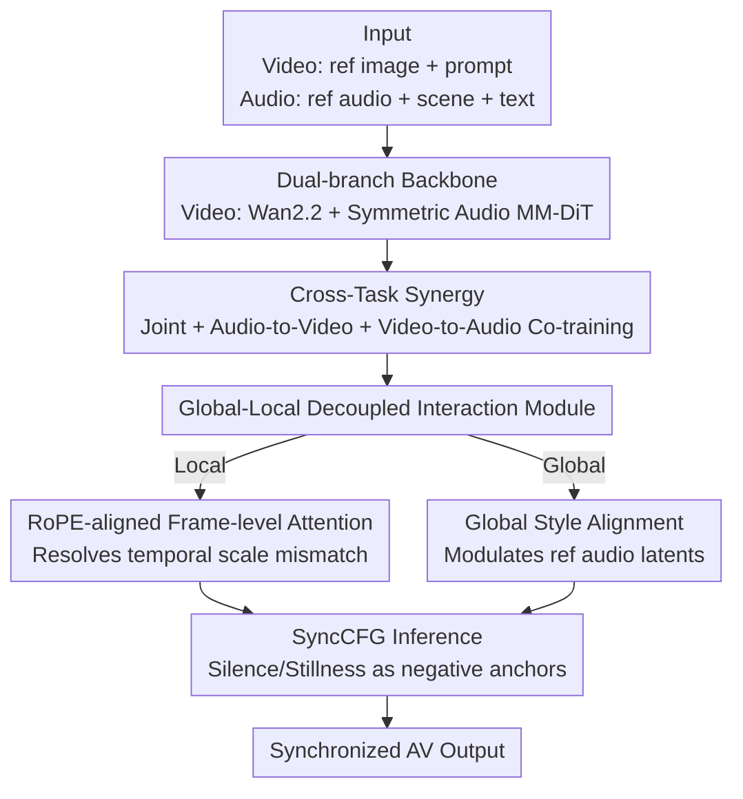

# Harmony: Harmonizing Audio and Video Generation through Cross-Task Synergy

**Conference**: CVPR 2026  
**Paper**: [CVF Open Access](https://openaccess.thecvf.com/content/CVPR2026/html/Hu_Harmony_Harmonizing_Audio_and_Video_Generation_through_Cross-Task_Synergy_CVPR_2026_paper.html)  
**Code**: [Project Page](https://sjtuplayer.github.io/projects/Harmony) (Code not yet open-sourced)  
**Area**: Diffusion Models / Video Generation / Joint Audio-Video Generation  
**Keywords**: Joint audio-video generation, cross-task synergy, audio-visual synchronization, decoupled attention, Classifier-Free Guidance  

## TL;DR
Harmony co-trains the joint generation task with two unidirectional auxiliary tasks using **clean signals** (audio-driven video and video-driven audio). By incorporating a decoupled interaction module that separates coarse style from fine-grained temporal alignment, alongside SyncCFG—which utilizes "silence/stillness" as negative anchors to amplify synchronization signals—Harmony achieves the first stable open-source breakthrough in precise lip-sync and motion-sound correspondence, outperforming Ovi and UniVerse-1.

## Background & Motivation
**Background**: The joint generation of audio and video represents the frontier of generative AI. While closed-source models like Veo 3 and Sora 2 produce high-fidelity, synchronized content, open-source efforts (e.g., MM-Diffusion, JavisDiT, Ovi, UniVerse-1) generally struggle with **robust audio-visual alignment**.

**Limitations of Prior Work**: Existing open-source methods either generate only ambient sounds without natural speech (MM-Diffusion, JavisDiT) or focus solely on speech without ambient capabilities (JAM-Flow). Even more general frameworks like Ovi and UniVerse-1 exhibit significant deficiencies in fine-grained synchronization (lip-sync, motion-to-sound correspondence). Crucially, **few prior works have methodologically investigated the root causes of misalignment**, focusing instead on scaling architectures.

**Key Challenge**: The authors identify three fundamental causes for misalignment rooted in the "joint diffusion process" itself rather than architectural capacity:
1. **Correspondence Drift**: In joint generation, both audio and video patterns are denoised from pure noise. During early stages, both latents are highly stochastic. Attempting to learn a correspondence between **two simultaneously evolving noisy signals** results in a shifting optimal mapping, leading to unstable learning targets and slow convergence.
2. **Architectural Tension between Local Timing and Global Style**: Fine-grained frame-level temporal alignment (e.g., lip movement) and overall stylistic consistency (mood, atmosphere) are distinct objectives. Current methods conflate them within a single global cross-attention layer, forcing a compromise that satisfies neither objective.
3. **Intra-modal Bias of CFG**: Standard Classifier-Free Guidance (CFG) amplifies "how well each modality follows the condition (text)" but **ignores the correspondence between modalities**, offering no help for cross-modal synchronization.

**Goal / Key Insight**: Rather than simply increasing model size, the authors propose targeted interventions for these three causes. Their key observation is that **audio-driven video tasks (where audio is a clean, noise-free signal) converge much faster and more accurately** than joint generation (Fig. 3). This suggests that "anchoring one modality with a deterministic clean signal" provides a stable gradient for cross-modal interaction modules.

**Core Idea**: Use audio-driven and video-driven tasks as "clean supervision" to instill alignment priors and counteract correspondence drift. Then, architecturally decouple temporal alignment from global style. Finally, during inference, use SyncCFG with "silence/stillness" negative anchors to explicitly amplify synchronization signals.

## Method

### Overall Architecture
Harmony is a dual-branch latent diffusion framework. The video branch is based on a pre-trained Wan2.2-5B model, while the audio branch utilizes a new symmetric structure developed by the authors. Inputs for the video stream include a reference image and a text prompt; the audio stream is conditioned on a reference audio $A_r$ (timbre), an acoustic scene description $T_a$, and a speech transcript $T_s$ (phonetic content). The output is a synchronized audio-video sequence. The two branches are coupled at each layer through a bidirectional "Global-Local Decoupled Interaction Module."

The methodology revolves around three innovations that address the identified challenges: **Cross-Task Synergy** for alignment priors, a **Global-Local Decoupled Interaction Module** for architectural decoupling, and **SyncCFG** for inference amplification.

### Key Designs

**1. Cross-Task Synergy: Instilling Alignment Priors via Clean Unidirectional Tasks**

This design directly addresses Correspondence Drift. Joint generation is difficult because both latents are noisy. By substituting one side with a **clean (noise-free) latent**, the interaction module gains a stable learning gradient. The authors implement a hybrid training strategy: alongside the standard joint task, they perform parallel training of two deterministic unidirectional tasks—**audio-driven video** (setting audio timestep $t_a$ to 0) and **video-driven audio** (setting video timestep $t_v$ to 0). The total loss is a weighted sum:

$$\mathcal{L} = \mathcal{L}_{\text{joint}} + \lambda_v \mathcal{L}_{\text{driven}}^{\text{audio}} + \lambda_a \mathcal{L}_{\text{driven}}^{\text{video}}$$

The joint term regresses both noise components $\|\epsilon_v - \hat\epsilon_v(z_{v,t}, z_{a,t}, c, t)\|^2 + \|\epsilon_a - \hat\epsilon_a(z_{a,t}, z_{v,t}, c, t)\|^2$; the audio-driven term $\|\epsilon_v - \hat\epsilon_v(z_{v,t}, z_{a,0}, c, t)\|^2$ uses clean audio $z_{a,0}$; and the video-driven term symmetrically uses clean video $z_{v,0}$. The alignment knowledge from these unidirectional tasks acts as a catalyst for joint generation. Engineering-wise, the audio branch uses separate encoders for transcripts $T_s$ (speech encoder) and scene descriptions $T_a$ (T5 encoder) to maintain phonetic precision.

**2. Global-Local Decoupled Interaction Module: Separating Temporal Alignment from Style Consistency**

This addresses the tension between local timing and global style. Interaction is split into two independent pathways:

*RoPE-aligned Frame-level Attention (Local Timing)*: Frame-level attention is more efficient and suited for fine-grained alignment than global attention. However, video and audio have different sampling rates ($T_v \neq T_a$). To resolve this, **RoPE position indices are dynamically scaled** to unify temporal coordinates: for A2V, the $j$-th audio frame is mapped to a virtual position $j' = j \cdot (T_v / T_a)$ for rotary positional encoding calculation. This enables symmetric bidirectional frame-level cross-attention where each video frame $i$ only attends to a local context window $C_{a,i}$ in the audio stream.

*Global Style Alignment (Global Style)*: Frame-level attention cannot capture overarching mood or atmosphere. Instead of modifying the target audio latent $z_a$ directly (which might disrupt denoising), the authors use the reference audio latent $z_r$ (which carries identity/timbre) as a carrier for global style. The entire video $z_v$ is used to modulate $z_r$ via residual cross-attention: $z_r^{\text{updated}} = z_r + \text{CrossAttn}(Q_r, K_v, V_v)$. This "visually-grounded" reference is then prepended to $z_{a,t}$, ensuring the audio generation is conditioned on a global visual context without interfering with frame-level timing.

**3. SyncCFG: Targeted Amplification of Synchronization via "Silence/Stillness" Anchors**

Standard CFG only amplifies text-following behavior. The authors propose a **meaningful negative anchor** representing a "visual baseline in the absence of sound" (e.g., a face with a closed mouth). Leveraging the "driven" paths trained via Cross-Task Synergy, they use a "silent" audio $z_{a,0}^{\text{null}}$ to predict a negative video noise anchor. The guidance formula becomes:

$$\tilde\epsilon_v = \hat\epsilon_\theta^{\text{driven}}(z_{v,t}, z_{a,0}^{\text{null}}) + s_v\left(\hat\epsilon_\theta^{\text{joint}}(z_{v,t}, z_{a,t}) - \hat\epsilon_\theta^{\text{driven}}(z_{v,t}, z_{a,0}^{\text{null}})\right)$$

The subtraction term **isolates visual changes specifically induced by audio** (e.g., mouth movements, impact motions), and amplifying it strengthens synchronization. Audio-side guidance works symmetrically using a "still video" $z_{v,0}^{\text{null}}$ as the negative anchor. This transforms CFG from a general amplifier into a targeted mechanism for cross-modal correspondence.

### Loss & Training
The authors employ a three-stage curriculum training: (1) fundamental audio pre-training, (2) timbre-decoupled fine-tuning using multi-phrase speech data, and (3) final cross-task joint audio-visual training. The video branch is initialized with Wan2.2. Training used over 4 million AV clips (OpenHumanVid, AudioCaps, WavCaps, etc.) annotated by Gemini.

## Key Experimental Results

### Main Results
Evaluated on the self-built Harmony-Bench (150 cases categorized into Ambient Sound-Video, Speech-Video, and Complex Scenes):

| Metric Category | Metric | Ours | Ovi | UniVerse-1 | JavisDiT |
|:---|:---|:---|:---|:---|:---|
| Video Quality | AQ ↑ | **0.59** | 0.57 | 0.52 | 0.34 |
| Video Quality | ID ↑ | **0.91** | 0.90 | 0.89 | 0.38 |
| Audio Fidelity | PQ ↑ | **6.39** | 6.19 | 5.52 | 5.46 |
| Audio Fidelity | WER ↓ | **0.15** | 0.49 | 0.24 | 1.00 |
| AV Sync | Sync-C ↑ | **5.61** | 4.04 | 0.07 | 0.89 |
| AV Sync | Sync-D ↓ | **7.53** | 9.62 | 10.71 | 11.62 |
| AV Sync | DeSync ↓ | **0.92** | 1.14 | 1.10 | 1.13 |

Synchronization is the standout result: Sync-C at 5.61 significantly outperforms Ovi’s 4.04, while Sync-D is the lowest (best) at 7.53, validating the effectiveness of cross-task synergy.

### Ablation Study
Incremental component testing on speech data:

| GLDI | RoPE | CTS | SyncCFG | Sync-C ↑ | Sync-D ↓ | IB ↑ |
|:---:|:---:|:---:|:---:|:---:|:---:|:---:|
| ✗ | ✗ | ✗ | ✗ | 4.20 | 10.93 | 0.13 |
| ✓ | ✗ | ✗ | ✗ | 4.29 | 10.67 | 0.14 |
| ✓ | ✓ | ✗ | ✗ | 4.80 | 10.30 | 0.14 |
| ✓ | ✓ | ✓ | ✗ | 5.09 | 10.16 | 0.15 |
| ✓ | ✓ | ✓ | ✓ | **6.51** | **8.63** | **0.18** |

### Key Findings
- **SyncCFG provides the largest gain**: This inference technique alone boosted Sync-C from 5.09 to 6.51 (+1.42), proving that amplifying synchronization directions is a highly cost-effective operation.
- **RoPE alignment matters**: Addressing temporal scale mismatch improved Sync-C from 4.29 to 4.80.
- **Methodology over scale**: The monotonic improvement across components demonstrates successes derived from methodological design rather than simple model scaling.
- Qualitative results show Harmony accurately matching mandolin strumming motions with melody, whereas competitors produced irrelevant noise or static temporal dynamics.

## Highlights & Insights
- **Anchoring with clean signals**: Addressing correspondence drift as a training dynamics problem rather than an architectural one is a key insight. Using unidirectional "driven" tasks as scaffolding for more difficult joint tasks is a transferable strategy for dual-latent diffusion.
- **Engineering CFG with semantic negative anchors**: Redefining the negative condition as "silence" or "stillness" allows CFG to perform cross-modal causal isolation, amplifying only the motion/sound resulting from modality interaction.
- **Ref audio as a style carrier**: Modulating the reference latent instead of the target noise protects the fine-grained denoising process while ensuring global stylistic alignment.

## Limitations & Future Work
- **Backbone and data dependency**: Initialization with Wan2.2-5B and 4 million clips sets a high bar for replication. The impact of smaller data scales remains unexplored.
- **Self-built benchmark**: Results are primarily on Harmony-Bench. While comprehensive, absolute Sync-C scores depend heavily on the detector (SyncNet-like), necessitating caution in cross-paper comparisons.
- **Hyperparameter sensitivity**: The trade-offs between $\lambda_v, \lambda_a$ and guidance scales $s_v, s_a$ are not fully detailed in the current analysis.
- **Open-source status**: The code has not yet been released.

## Related Work & Insights
- **Vs Ovi**: Ovi uses a single global cross-attention, resulting in weaker temporal sync (Sync-C 4.04 vs Harmony 5.61).
- **Vs UniVerse-1**: UniVerse-1 has strong synthesis but poor synchronization (Sync-C 0.07).
- **Vs JAM-Flow**: JAM-Flow is restricted to speech; Harmony covers speech, ambient sounds, and music synchronized with motion.

## Rating
- **Novelty**: ⭐⭐⭐⭐⭐ Clear causal analysis of misalignment translated into a cohesive tripartite solution (Prior, Architecture, Inference).
- **Experimental Thoroughness**: ⭐⭐⭐⭐ Strong main results and ablations, though lacks sensitivity analysis for hyperparameters.
- **Writing Quality**: ⭐⭐⭐⭐⭐ Logical flow from problem analysis to empirical motivation and design implementation.
- **Value**: ⭐⭐⭐⭐⭐ Sets a new open-source standard for audio-visual synchronization quality.

<!-- RELATED:START -->

## Related Papers

- [\[CVPR 2026\] UniAVGen: Unified Audio and Video Generation with Asymmetric Cross-Modal Interactions](uniavgen_unified_audio_and_video_generation_with_asymmetric_cross-modal_interact.md)
- [\[CVPR 2026\] VABench: A Comprehensive Benchmark for Audio-Video Generation](vabench_a_comprehensive_benchmark_for_audio-video_generation.md)
- [\[CVPR 2026\] UnityVideo: Unified Multi-Modal Multi-Task Learning for Enhancing World-Aware Video Generation](unityvideo_unified_multi-modal_multi-task_learning_for_enhancing_world-aware_vid.md)
- [\[CVPR 2026\] UniTalking: A Unified Audio-Video Framework for Talking Portrait Generation](unitalking_a_unified_audio-video_framework_for_talking_portrait_generation.md)
- [\[CVPR 2026\] InfinityHuman: Towards Long-Term Audio-Driven Human Animation](infinityhuman_towards_long-term_audio-driven_human_animation.md)

<!-- RELATED:END -->
