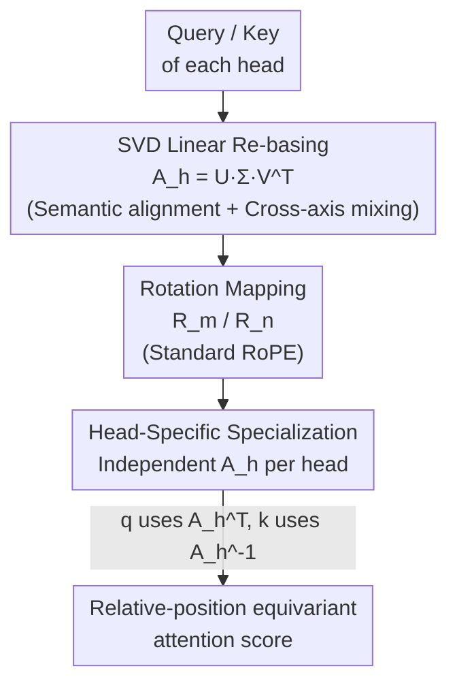

# Head-wise Adaptive Rotary Positional Encoding for Fine-Grained Image Generation

**Conference**: CVPR 2026  
**Paper**: [CVF Open Access](https://openaccess.thecvf.com/content/CVPR2026/html/Li_Head-wise_Adaptive_Rotary_Positional_Encoding_for_Fine-Grained_Image_Generation_CVPR_2026_paper.html)  
**Code**: https://github.com/Studentxll/HARoPE  
**Area**: Image Generation / Diffusion Models  
**Keywords**: Rotary Position Encoding, RoPE, SVD, Image Generation, Head-wise Specialization  

## TL;DR
HARoPE inserts a learnable linear transformation $A_h=U_h\Sigma_h V_h^\top$ parameterized by SVD for each attention head **before** the rotation mapping of Rotary Position Embedding (RoPE) in Transformers. While strictly preserving the RoPE property that "attention only depends on relative offsets", it aligns the rotation planes with semantic subspaces, allows cross-axis coupling, and endows each head with its own positional receptive field. Serving as a plug-and-play replacement, it significantly improves spatial relations, color, and counting capabilities in fine-grained image generation (ImageNet, Flux, SD3).

## Background & Motivation

**Background**: Transformers are inherently permutation-invariant, and structural information must be injected via coordinate embeddings. RoPE represents absolute positions as rotations in the complex plane, making attention scores depend only on the relative offset $n-m$ of query/key. Because of its strong extrapolation capabilities and effectiveness on 1D language tasks, it has been widely generalized to vision: RoPE-ViT extends it to 2D images, and MRoPE supports 2D/3D and multimodality.

**Limitations of Prior Work**: The authors point out that naively transferring RoPE to multi-dimensional data (such as images) exposes three structural deficiencies. First, **uniform partition across axes**—the standard practice uniformly divides feature dimensions among coordinate axes and reuses the same set of frequencies, implicitly assuming identical complexity, scale, and dynamics across all directions, whereas frequency characteristics of images actually differ along horizontal and vertical (and even spatiotemporal) directions. Second, **fixed rotation planes + axis independence**—rotations are fixed onto planes indexed by coordinates $(q_0,q_1),(q_2,q_3),\dots$, and axis independence is forced by block-diagonal structures; these predefined subspaces may misalign with the semantic subspaces learned by the model and suppress cross-axis coupling such as diagonal or rotational movements. Third, **treating all heads equally**—the same position mapping is injected into every attention head, ignoring that different heads should have physical receptive fields of varying ranges (local vs. long-range), which weakens multi-scale, anisotropic positional sensitivity.

**Key Challenge**: Collectively, these three points cause the positional prior of RoPE to be "rigid, isotropic, and semantic-agnostic," whereas fine-grained image generation precisely requires accurate spatial relations, color cues, and object counting (Figure 1 in the paper), which these rigid priors struggle to represent.

**Goal**: To enable positional encoding to (i) align with semantic directions and support cross-axis mixing, and (ii) specialize across different heads, **without violating** RoPE's relative position-dependent property and with minimal overhead.

**Key Insight**: Since the rotation planes and spectrum are "fixed," a learnable change of basis can be applied to queries/keys **before** rotation to rotate/stretch them into a coordinate system that is "easier to rotate." Crucially, as long as the query and key share the same transformation, the relative offset property is strictly preserved.

**Core Idea**: Insert a **head-wise** linear transformation parameterized by SVD $A_h=U_h\Sigma_h V_h^\top$ before the rotation mapping. $V_h$ selects and mixes directions, $\Sigma_h$ redistributes the capacity of each subspace, and $U_h$ maps back to the original basis, thereby simultaneously resolving "semantic alignment + cross-axis coupling + head-specific specialization" while preserving RoPE's relative encoding property.

## Method

### Overall Architecture

HARoPE is a drop-in enhancement of RoPE: where queries/keys in standard attention are directly operated on by the rotation matrix $R_m$, HARoPE inserts a learnable linear transformation $A_h\in\mathbb{R}^{d\times d}$ ($d$ is the dimension per head) for each head $h$ **before** rotation, parameterized as an SVD. For a query at position $m$ and a key at position $n$, the mapping becomes:

$$q'_h = R_m\,A_h^\top q_h,\qquad k'_h = R_n\,A_h^{-1} k_h$$

Note that the query uses $A_h^\top$ and the key uses $A_h^{-1}$, which allows the intermediate $A_h$ terms to cancel out during the inner product, strictly restricting the positional dependency to the rotation part. The entire modification merely adds a linear transformation layer after projection and before rotation, increasing the parameter size and computational cost by only about +2.7% to 4.1% (see the efficiency table).

### Key Designs

**1. Inserting SVD-parameterized linear re-basing before rotation: transforming query/key to a coordinate system that is "easier to rotate"**

To address the issue of "fixed rotation planes misaligned with semantics + axis independence," HARoPE does not modify the rotation matrix itself. Instead, it inserts a dense learnable matrix $A_h$ for each head before rotation, parameterized via SVD as $A_h=U_h\Sigma_h V_h^\top$ (where $U_h,V_h$ are orthogonal, and $\Sigma_h$ is diagonal with positive elements). This disentangles three aspects: $V_h$ is responsible for **selecting and mixing directions**—rotating the fixed coordinate plane to align with the semantic directions learned by the model and enabling cross-axis coupling (no longer locked to a single axis by block diagonals); $\Sigma_h$ is responsible for **redistributing effective capacity**—reweighting across subspaces, which is equivalent to adjusting the effective frequency budget across different semantic directions; and $U_h$ maps the "positionally enriched" signals back to the model's native basis. The authors interpret this as "learning a unique harmonic coordinate system for each head." The paper intuitively demonstrates this with the SVD geometry of a $3\times2$ matrix (Figure 2): $V_h$ first aligns the two principal components with the coordinate axes $\rightarrow$ $\Sigma_h$ stretches and scales along the axes $\rightarrow$ $U_h$ rotates back to the standard basis. Ablations (Table 6) show that the SVD parameterization is more stable and performs better than unconstrained normal matrices or purely orthogonal matrices (FID 8.93 vs. 9.28 / 9.31).

**2. Strictly preserving relative-position equivariance: query and key share the transformation to let $A_h$ cancel out in the inner product**

The most valuable property of RoPE is that the attention depends only on relative offsets. When introducing a learnable matrix, this property must be preserved, otherwise RoPE's extrapolation friendliness is lost. HARoPE achieves this by making the query and key share the same $A_h$ (one using the transpose, the other using the inverse), which expands the inner product as:

$$(q'_h)^\top k'_h = (R_m A_h^\top q_h)^\top (R_n A_h^{-1} k_h) = q_h^\top A_h\, R_{n-m}\, A_h^{-1} k_h$$

The positional dependency is entirely confined within $R_{n-m}$, depending only on the offset $n-m$. In the multi-dimensional case (positions $(x_1,\dots,x_p)$), applying the same head-specific $A_h$ to the block-diagonal rotation $R_{(x_1,\dots,x_p)}$ similarly yields $q_h^\top A_h R_{(\Delta x_1,\dots,\Delta x_p)} A_h^{-1} k_h$. Thus, it preserves relative encoding in multi-dimensional spaces while introducing cross-axis mixing via the dense $A_h$. This is the key distinction between HARoPE and methods that "directly modify frequencies/rotation planes"—the latter either break relativity or lack expressiveness.

**3. Head specialization and initialization stability: independent $A_h$ per head brings multi-scale specialization, enabling a seamless start from pre-training**

To address the pain point of "all heads sharing the same position mapping," HARoPE assigns an **independent** $A_h$ to each head, allowing different heads to learn distinct projection strategies and specialize in different positional receptive fields, thereby facilitating complementary multi-scale behaviors. This is supported by the attention distance distribution in the paper (Figure 5): standard RoPE exhibits highly concentrated attention distances across heads within the same layer (convergent behavior), while in HARoPE, the distribution across heads is noticeably more uniform (each performing distinct roles); weight heatmaps in Figure 6 also show that $A_h$ across different heads/blocks forms vastly different patterns. To ensure stable training when applied to pre-trained models, it is initialized as $A_h=I$ (i.e., $U_h=V_h=\Sigma_h=I$), degenerating to the baseline RoPE at step 0. Orthogonality is maintained by formulating $U_h,V_h$ as matrix exponentials of skew-symmetric matrices, and the diagonal elements of $\Sigma_h$ are kept positive using softplus and regularized to be close to 1 to avoid norm explosion/vanishing and preserve query/key variance. ⚠️ Please refer to the original paper for the exact matrix exponential parameterization and regularization details.

### Loss & Training
HARoPE does not introduce additional training objectives and follows standard training procedures for each task. Image understanding models are trained from scratch using DeiT-Base/Large (AdamW, pre-trained on 192×192 for 400 epochs + fine-tuned on 224×224 for 20 epochs); class-conditional generation is trained on DiT-B/2 (lr $1\times10^{-4}$, batch size 256, EMA 0.9999, evaluated at the 1M-step checkpoint); text-to-image is fine-tuned on pre-trained FLUX.1-dev using LoRA (rank 32) for 4000 steps. All training is conducted on 8×H100. The only new trainable parameters are the SVD-parameterized $A_h$ for each head, with regularization forcing $\Sigma_h$ close to 1.

## Key Experimental Results

### Main Results

**Class-conditional ImageNet Generation (DiT-B/2, 1M steps, Table 2)**: HARoPE achieves the lowest FID-50K and highest IS, with Precision matching the strongest baseline and the best Recall.

| Position Encoding | FID-50K↓ | IS↑ | Precision↑ | Recall↑ |
|---------|---------|-----|-----------|---------|
| APE | 11.47 | 110.04 | 0.72 | 0.54 |
| Vanilla RoPE | 9.81 | 121.75 | 0.73 | 0.53 |
| 2D-RoPE (Axial) | 9.49 | 124.78 | 0.74 | 0.54 |
| VideoRoPE | 10.86 | 118.84 | 0.71 | 0.54 |
| STRING/Rethinking RoPE | 9.31 | 125.09 | 0.74 | 0.54 |
| **HARoPE** | **8.90** | **127.01** | 0.74 | **0.55** |

**Text-to-Image (FLUX.1-dev, GenEval / DPGBench, Table 4 excerpt)**: At the standard 1024×1024 resolution, HARoPE improves the GenEval Overall score from 0.757 to 0.771, and DPGBench from 83.26 to 83.77. The advantage becomes more pronounced at higher resolutions: at 2048px, the Position score increases significantly from 0.370 to 0.455, and Attribute from 0.623 to 0.660.

| Resolution | Method | GenEval Overall↑ | DPGBench↑ |
|-------|------|-----------------|-----------|
| 512 | RoPE | 0.765 | 82.63 |
| 512 | HARoPE | 0.758 | 82.37 |
| 1024 | RoPE | 0.757 | 83.26 |
| 1024 | **HARoPE** | **0.771** | **83.77** |
| 2048 | RoPE | 0.735 | 84.12 |
| 2048 | **HARoPE** | **0.756** | **84.46** |

Supplement: Replacing APE/RoPE with HARoPE on SD3-medium reduces FID from 5.35 (RoPE) to 5.22 (Table 3); on DeiT-Base for image understanding, Top-1 accuracy reaches 83.76%, slightly outperforming the strongest RoPE variant (2D-RoPE Mixed at 83.73%) (Table 1). ⚠️ Note that HARoPE is slightly inferior to RoPE at 512px; the gains are primary reflected in 1024/2048 high resolutions and fine-grained compositional tasks, and different resolutions are not directly comparable.

### Ablation Study

**Matrix Parameterization Methods (ImageNet generation, Table 6)**: Comparing unconstrained normal matrices, orthogonal matrices, SVD parameterization, and head-specific vs. shared settings.

| Configuration | FID-50K↓ | IS↑ | Description |
|------|---------|-----|------|
| RoPE (baseline) | 9.49 | 124.78 | No adaptation matrix |
| RoPE + normal-matrix | 9.28 | 124.78 | No orthogonal constraints |
| RoPE + normal + multi-head | 9.03 | 126.89 | Head-specific normal |
| RoPE + orthogonal-matrix | 9.31 | 125.09 | Orthogonal constraints |
| RoPE + orthogonal + multi-head | 8.97 | 127.61 | Head-specific orthogonal |
| RoPE + SVD | 8.93 | 126.03 | Shared SVD |
| **RoPE + SVD + multi-head (HARoPE)** | **8.90** | **127.01** | Full model |

**Efficiency and "Is it just stacking parameters?" (Table 8)**: Parameter-aligned RoPE+SVD (which inserts SVD layers but without head specialization/semantic alignment) yields almost no gain, and even decreases GenEval at 2048px (0.735 $\rightarrow$ 0.731), proving that HARoPE's benefits stem from the semantic alignment of rotation planes rather than simply adding parameters. HARoPE only increases parameters and FLOPs by +2.7% to 4.1% compared to RoPE.

| Model (Resolution) | Method | Params(M) | FID↓ / GenEval↑ |
|------|------|----------|------|
| DiT-B/2(256) | RoPE | 2.36 | FID 9.49 |
| DiT-B/2(256) | RoPE+SVD | 2.46 | FID 9.46 |
| DiT-B/2(256) | **HARoPE** | 2.46 | **FID 8.90** |
| FLUX(1024) | RoPE | 28.32 | GenEval 0.757 |
| FLUX(1024) | RoPE+SVD | 29.11 | GenEval 0.756 |
| FLUX(1024) | **HARoPE** | 29.11 | **GenEval 0.771** |

### Key Findings
- **Clear contribution of head-specific specialization**: Adding the multi-head setting to each matrix parameterization consistently improves performance (normal 9.28 $\rightarrow$ 9.03, orthogonal 9.31 $\rightarrow$ 8.97, SVD 8.93 $\rightarrow$ 8.90). This matches the more uniform attention distance distribution (Figure 5), confirming that different heads indeed learn different location strategies.
- **Gains are not from parameter stacking**: The parameter-aligned RoPE+SVD shows almost no improvement or even degrades. This gap is magnified at high resolutions, indicating that the key lies in "semantic alignment + cross-axis mixing" rather than model capacity.
- **Not replaceable by simple frequency tuning**: Head-dependent frequency fine-tuning only scales the rotation angles of axes globally, whereas HARoPE identifies the optimal rotation planes via learnable transformations. Its FID of 19.01 is significantly better than the best frequency fine-tuning baseline's 20.45 (Table 9, DiT-B/2 at 100k steps).
- **More stable extrapolation at high resolutions**: HARoPE widens the performance gap on spatial, positional, and attribute metrics at 1024/2048px, alleviating the frequency mismatch issues commonly encountered during resolution extrapolation.

## Highlights & Insights
- **"Changing the basis before rotation" is an elegant entry point**: By avoiding direct modification of the rotation matrix and frequency spectrum (which easily degrades the relativity of RoPE), the method inserts a shared linear transformation before rotation for q/k. A simple algebraic identity preserves the relative offset property completely—retaining the benefits of RoPE while unlocking representational capacity.
- **Interpretability through SVD decomposition**: Decomposing $A_h$ into $U\Sigma V^\top$ maps $V$, $\Sigma$, and $U$ to "direction selection, capacity adaptation, and basis restoration." This provides a clean interpretation of a dense transformation as "learning a custom harmonic coordinate system" and facilitates orthogonal/nearly unified stability constraints.
- **Transferability starting from the identity matrix**: The $A_h=I$ initialization allows seamless drop-in integration into pre-trained FLUX/SD3 models. This is highly engineering-friendly and can be applied directly to any vision/multimodal generation model based on RoPE.

## Limitations & Future Work
- **Limited or negative gains at low resolutions**: On 512px, both GenEval and DPGBench are slightly inferior to RoPE. The value of this method is primarily manifested in high-resolution and fine-grained compositional tasks, and its generalizability warrants further validation.
- **Preliminary exploration in image understanding**: The authors explicitly focus on fine-grained image generation. For understanding tasks (DeiT), only a single comparison is provided showing a minor benefit (83.76% vs 83.73%), without deeper analysis.
- **Overhead and stability constraints**: Although only +2.7%~4.1% parameters are added, each head must maintain orthogonal matrix exponentials and softplus-constrained $\Sigma$. The impact of hyperparameters like regularization strength on training stability is not fully elaborated in the paper. ⚠️ Some parameterization and regularization implementation details are subject to the original text.
- **Potential future directions**: Exploring layers-wise/resolution-adaptive $A_h$ or joint optimization with frequency schedules; and migrating head-specific transformations to spatiotemporal RoPE for cross-spatiotemporal coupling in video/3D tasks.

## Related Work & Insights
- **vs. 2D-RoPE (Axial/Mixed) / VideoRoPE**: These methods still use fixed rotation planes and independent axes. HARoPE inserts a learnable basis change before rotation, enabling cross-axis coupling and semantic alignment. On ImageNet, its FID of 8.90 outperforms 2D-RoPE Axial (9.49) and VideoRoPE (10.86).
- **vs. STRING / Rethinking RoPE**: STRING proposes a generalization with learnable matrices, and Rethinking RoPE provides a mathematical blueprint for high-dimensional RoPE. HARoPE advances the learnable matrix setup using SVD parameterization and head-specific mechanisms, balancing stability and specialization (FID 8.90 vs. STRING's 9.31).
- **vs. Head-dependent frequency tuning**: Frequency fine-tuning only scales axis angles globally, failing to model cross-dimensional dependencies. HARoPE reshapes features through transformations to find the optimal rotation planes (FID 19.01 vs. 20.45, Table 9).

## Rating
- Novelty: ⭐⭐⭐⭐ The combination of "pre-rotation SVD basis change + head specialization, while strictly preserving relativity" is an elegant entry point, though it represents a step in the evolution of the RoPE family.
- Experimental Thoroughness: ⭐⭐⭐⭐ Covers multiple models (ImageNet/Flux/SD3) and multiple resolutions. Ablations decouple "parameters vs. semantic alignment," "head-specific vs. shared," and "basis change vs. frequency tuning," demonstrating solid work.
- Writing Quality: ⭐⭐⭐⭐ Clear logic matching the three key limitations to their respective designs; well-placed formulas and geometric schematics. Some parts of the presentation/typesetting are slightly unpolished.
- Value: ⭐⭐⭐⭐ Plug-and-play with minimal overhead, highly transferable to any RoPE-based visual image/generation model, providing practical value for fine-grained/high-resolution generation.

<!-- RELATED:START -->

## Related Papers

- [\[CVPR 2026\] AHS: Adaptive Head Synthesis via Synthetic Data Augmentations](ahs_adaptive_head_synthesis.md)
- [\[CVPR 2026\] PromptEnhancer: Taming Your Rewriter for Text-to-Image Generation via Fine-Grained Reward](promptenhancer_taming_your_rewriter_for_text-to-image_generation_via_fine-graine.md)
- [\[CVPR 2026\] SliderEdit: Continuous Image Editing with Fine-Grained Instruction Control](slideredit_continuous_image_editing_with_fine-grained_instruction_control.md)
- [\[CVPR 2026\] Beyond Objects: Contextual Synthetic Data Generation for Fine-Grained Classification](beyond_objects_contextual_synthetic_data_generation_for_fine-grained_classificat.md)
- [\[CVPR 2026\] SpatialReward: Verifiable Spatial Reward Modeling for Fine-Grained Spatial Consistency in Text-to-Image Generation](spatialreward_verifiable_spatial_reward_modeling_for_fine-grained_spatial_consis.md)

<!-- RELATED:END -->
