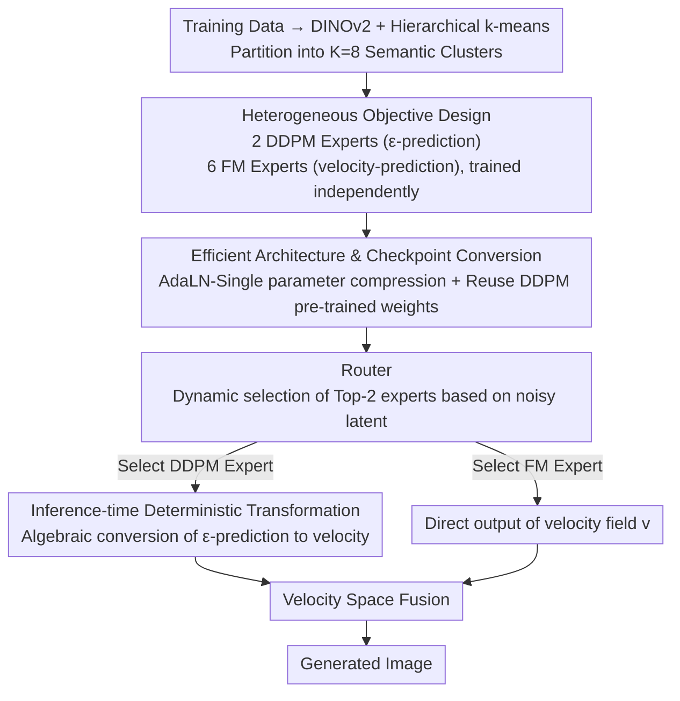

# Heterogeneous Decentralized Diffusion Models

**Conference**: CVPR2026  
**arXiv**: [2603.06741](https://arxiv.org/abs/2603.06741)  
**Code**: TBD  
**Area**: Image Generation  
**Keywords**: Decentralized Diffusion Models, Heterogeneous Training Objectives, DDPM, Flow Matching, Mixture of Experts, DiT, PixArt-α

## TL;DR

A heterogeneous decentralized diffusion framework is proposed, allowing different experts to be trained completely independently using distinct diffusion objectives (DDPM $\epsilon$-prediction and Flow Matching velocity-prediction). During inference, these are unified into the velocity space for fusion via a deterministic schedule-aware transformation. This approach improves both FID and generation diversity compared to homogeneous baselines while compressing the computational load by 16x.

## Background & Motivation

1. **High Computational Barrier**: Training state-of-the-art diffusion models requires large-scale tightly coupled clusters (e.g., hundreds of GPU-days), restricting participation to resource-rich institutions.
2. **Limitations of Prior Decentralized Schemes**: DDM (McAllister et al.) demonstrated the feasibility of training independent experts and combining them. However, it requires all experts to use homogeneous training objectives and necessitates 1176 GPU-days + 158M images.
3. **Heterogeneity in Real-world Decentralized Scenarios**: Different contributors have varying resources, preferences, and technical constraints. Mandating a unified training objective is impractical.
4. **Complementary Properties of Different Objectives**: $\epsilon$-prediction has stronger implicit weighting at low-noise timesteps (favoring detail preservation), while velocity-prediction has stronger weighting at high-noise timesteps (favoring global structure). The two are naturally complementary.
5. **Underutilization of Pre-trained Weights**: A large number of existing DDPM pre-trained checkpoints cannot be directly reused for Flow Matching training.
6. **Architectural Redundancy**: Per-layer AdaLN in standard DiT introduces significant parameter overhead. The AdaLN-Single in PixArt-α can reduce parameters by 30% while maintaining quality.

## Method

### Overall Architecture

This paper addresses the impracticality of mandating unified training objectives in "decentralized training of frontier diffusion models" where contributor resources and preferences vary. It first partitions the dataset into $K=8$ semantic clusters (e.g., portraits, landscapes, architecture) using DINOv2 features and hierarchical k-means. Each expert is trained completely independently on its own cluster without any gradient, parameter, or activation synchronization. During inference, a router network $p_\phi(k|x_t,t)$ dynamically selects and fuses expert predictions. The key breakthrough is allowing different experts to use different diffusion objectives (DDPM $\epsilon$-prediction and Flow Matching velocity-prediction), which are then deterministically unified into the velocity space during inference.

### Key Designs

**1. Heterogeneous Objective Design: Independent Training for DDPM and FM Experts**

Forcing all experts to use the same objective is inconsistent with real decentralized scenarios and wastes existing DDPM pre-trained checkpoints. The authors relax this constraint: 2 DDPM experts predict noise $\epsilon$ using a cosine noise schedule with loss $\mathcal{L}_{\text{DDPM}}^{(k)} = \mathbb{E}[\|\epsilon_{\theta_k}(\alpha_t x_0 + \sigma_t \epsilon, t) - \epsilon\|^2]$. 6 Flow Matching experts predict the velocity field $v$ using linear interpolation $x_t = (1-t)x_0 + t\epsilon$ with loss $\mathcal{L}_{\text{FM}}^{(k)} = \mathbb{E}[\|v_{\theta_k}(x_t, t) - (\epsilon - x_0)\|^2]$. DDPM is assigned to clusters 0 and 3, which contain high-fidelity subjects (e.g., cars, flowers), matching the detail-preserving objective with data that requires it most.

**2. Inference-time Deterministic Transformation: Algebraic Conversion of ε-prediction to Velocity**

To fuse DDPM expert outputs ($\epsilon_\theta$) with FM experts in the velocity space, conversion is required. The clean sample is first estimated by $\hat{x}_0 = (x_t - \sigma_t \epsilon_\theta) / \alpha_t$. For a linear interpolation schedule ($\alpha_t=1-t, \sigma_t=t$), the conversion formula simplifies to $v(x_t,t) = \epsilon_\theta(x_t,t) - \hat{x}_0$. For numerical stability, $\hat{x}_0$ is clamped to $[-20, 20]$, $\alpha_{\text{safe}} = \max(\alpha_t, 0.01)$ is used, and adaptive velocity scaling is added at high noise levels ($t>0.85$). This is a purely algebraic operation requiring no retraining.

**3. Implicit Timestep Weighting Complementarity: Theoretical Explanation for Heterogeneity**

Heterogeneity is not just an engineering compromise; the authors prove its theoretical foundation. By writing the losses of both objectives as weighted estimation errors of the clean sample, the $\epsilon$-prediction weight is $w_\epsilon(t) = \alpha_t^2 / \sigma_t^2$ and the v-prediction weight is $w_v(t) = 1 / \sigma_t^2$. The ratio $w_v / w_\epsilon = 1/\alpha_t^2 \geq 1$ approaches infinity at high-noise timesteps. This implies that velocity-prediction receives stronger gradients at high noise (focusing on global structure), while $\epsilon$-prediction is relatively stronger at low noise (focusing on local details). This complementarity is the root cause for simultaneous improvements in FID and diversity.

**4. Efficient Architecture & Checkpoint Conversion: Parameter Compression and Weight Reuse**

Standard DiT's per-layer AdaLN is redundant, and many DDPM checkpoints are underutilized. The authors adopt PixArt-α's AdaLN-Single: a global MLP computes modulation parameters $\mathbf{c} \in \mathbb{R}^{6Ld}$ for all layers at once, combined with per-block learnable embeddings $\mathbf{E}_b$. This reduces DiT-XL/2 parameters from 891M to 605M. Checkpoint conversion from ImageNet DDPM DiT weights is supported by retaining patch/positional embeddings and transformer blocks while re-initializing the final layer and text projection. Continuous timesteps $t \in [0,1]$ are mapped to $t_{\text{DiT}} = \text{round}(999t)$, accelerating convergence by 1.2×.

**5. Router: Dynamic Expert Selection Based on Noisy Latents**

The router is a DiT-B/2 (129M parameters, 12 layers) that takes the noisy latent $x_t$ and timestep $t$ as input (without text conditions). It is trained using cross-entropy on the full dataset with true cluster labels for 25 epochs. At inference, it supports Top-1, Top-K, and Full Ensemble modes, with Top-2 found to be optimal in experiments.

## Key Experimental Results

### Decentralized vs. Monolithic Training (DiT-B/2, LAION-Art 3.9M)

| Inference Strategy | FID-50K ↓ |
|---------|-----------|
| Monolithic Model | 29.64 |
| Top-1 | 30.60 |
| **Top-2** | **22.60** |
| Full Ensemble | 47.89 |

Top-2 expert selection improves FID by 23.7% over the monolithic model, whereas Full Ensemble leads to degradation.

### Resource Efficiency Comparison (DiT-XL/2)

| Method | Data Volume | Compute | FID-50K ↓ |
|------|-------|--------|-----------|
| DDM (Prior Work) | 158M | 1176 A100-days | 5.5–10.5 |
| Ours Homogeneous (8FM) | 11M | 72 A100-days | 12.45 |
| **Ours Heterogeneous (2DDPM:6FM)** | **11M** | **72 A100-days** | **11.88** |

Compute is reduced by **16×** and data volume by **14×**.

### Homogeneous vs. Heterogeneous Comparison (CFG=7.5, 50 steps)

| Model | FID-50K ↓ | Intra-prompt LPIPS ↑ |
|------|-----------|---------------------|
| Homogeneous 8FM | 12.45 | 0.617 (±0.074) |
| **Heterogeneous 2DDPM:6FM** | **11.88** | **0.631 (±0.078)** |

The heterogeneous scheme improves both quality (FID) and diversity (LPIPS).

### Ablation: DDPM→FM Conversion and Mixed Sampling

| Sampling Mode | LPIPS ↑ | FID ↓ | CLIP ↑ |
|---------|---------|-------|--------|
| Native DDPM | 0.787 | 27.04 | 0.316 |
| Native FM | 0.752 | 20.23 | 0.324 |
| DDPM→FM Conversion | 0.761 | 25.61 | 0.319 |
| Mixed (Same Schedule) | 0.782 | 32.67 | 0.312 |

DDPM→FM conversion effectively improves DDPM quality without retraining (FID 27.04→25.61); mixed sampling significantly boosts diversity but sacrifices some FID.

### Ablation: Routing Threshold

A threshold of 0.2 achieves the optimal FID (38.28), while a threshold of 0.5 reaches the highest diversity (LPIPS), demonstrating a quality-diversity trade-off.

## Highlights & Insights

1. **True Heterogeneous Decentralization**: First to support independent training of experts using different diffusion objectives, breaking the homogeneity constraint of prior work like DDM.
2. **Elegant Inference-time Unification**: A schedule-aware algebraic transformation deterministically maps $\epsilon$-prediction to velocity space without requiring any retraining.
3. **Solid Theoretical Foundation**: Proposition 1 rigorously proves the complementarity of $\epsilon/v$-prediction in terms of timestep weighting, providing theoretical support for the heterogeneous design.
4. **Significant Reduction in Resource Barriers**: 16× compute compression and 14× data compression, where a single expert only requires 20-48GB VRAM.
5. **Simultaneous Improvement in Quality and Diversity**: The heterogeneous approach improves both FID and LPIPS over the homogeneous baseline.

## Limitations & Future Work

1. **Objective Ratios Not Fully Explored**: Only a few DDPM:FM ratios (e.g., 2:6) were evaluated; optimal allocation likely depends on data distribution and downstream requirements.
2. **Numerical Stability of Conversion**: Clamping, safe denominators, and adaptive scaling at high-noise timesteps rely on manual tuning.
3. **Limited to Two Objective Families**: Other parameterizations like $x_0$-prediction or consistency objectives were not covered.
4. **Router Does Not Support Dynamic Experts**: Adding or removing experts requires retraining the router.
5. **Resolution Constraints**: Experiments were limited to 256×256; performance at high resolutions remains unverified.
6. **FID Comparison with Prior Work**: Absolute FID for DDM was achieved with a training scale over 10 times larger, making direct comparison difficult.

## Related Work & Insights

| Method | Key Difference |
|------|---------|
| DDM (McAllister 2025) | Requires homogeneous objectives + 1176 GPU-days; Ours supports heterogeneity + 72 GPU-days |
| Diff2Flow (Schusterbauer 2025) | Single-model DDPM→FM fine-tuning conversion; Ours is zero-shot inference-time conversion for multi-experts |
| PixArt-α (Chen 2024) | Proposed AdaLN-Single for efficient monolithic training; Ours applies it to decentralized multi-expert scenarios |
| DiT (Peebles 2023) | Base Transformer diffusion architecture; Ours adds heterogeneous objectives + checkpoint conversion |
| DistriFusion (Li 2024) | Distributed parallel inference (patch parallelism); Ours focuses on decentralized training |
| VDM (Kingma 2021) | Unified variational framework for implicit weighting of objectives; Ours utilizes this theory for heterogeneous complementarity |

## Rating

- Novelty: ⭐⭐⭐⭐ — Heterogeneous decentralized diffusion training is a novel direction, and the inference-time algebraic conversion is elegant.
- Experimental Thoroughness: ⭐⭐⭐⭐ — Covers multi-scale model comparisons, ablations, routing analysis, and qualitative results, though lacks high-resolution and diverse objective ratio exploration.
- Writing Quality: ⭐⭐⭐⭐ — Clear structure, complete theoretical derivations, and consistent notation.
- Value: ⭐⭐⭐⭐ — Significantly lowers the barrier for decentralized diffusion training, offering a viable path for community-driven model development.

<!-- RELATED:START -->

## Related Papers

- [\[CVPR 2025\] Decentralized Diffusion Models](../../CVPR2025/image_generation/decentralized_diffusion_models.md)
- [\[CVPR 2026\] HAM: A Training-Free Style Transfer Approach via Heterogeneous Attention Modulation for Diffusion Models](ham_a_training-free_style_transfer_approach_via_heterogeneous_attention_modulati.md)
- [\[ICLR 2026\] Bridging Generalization Gap of Heterogeneous Federated Clients Using Generative Models](../../ICLR2026/image_generation/bridging_generalization_gap_of_heterogeneous_federated_clients_using_generative_.md)
- [\[CVPR 2026\] Fusion in Your Way: Aligning Image Fusion with Heterogeneous Demands via Direct Preference Optimization](fusion_in_your_way_aligning_image_fusion_with_heterogeneous_demands_via_direct_p.md)
- [\[CVPR 2026\] CFG-Ctrl: Control-Based Classifier-Free Diffusion Guidance](cfg-ctrl_control-based_classifier-free_diffusion_guidance.md)

<!-- RELATED:END -->
