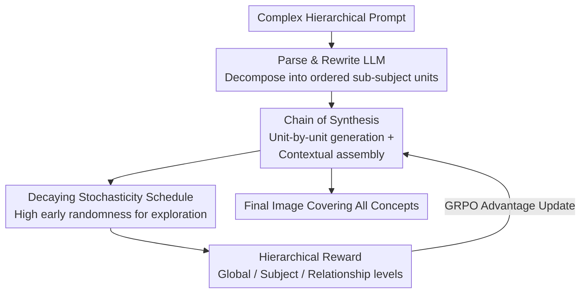

# HiCoGen: Hierarchical Compositional Text-to-Image Generation in Diffusion Models via Reinforcement Learning

**Conference**: CVPR 2026  
**Paper**: [CVF Open Access](https://openaccess.thecvf.com/content/CVPR2026/html/Yang_HiCoGen_Hierarchical_Compositional_Text-to-Image_Generation_in_Diffusion_Models_via_Reinforcement_CVPR_2026_paper.html)  
**Code**: None (The paper states that the HiCoPrompt dataset will be open-sourced)  
**Area**: Diffusion Models / Compositional Text-to-Image  
**Keywords**: Compositional T2I, Chain of Synthesis, Diffusion RL, GRPO, Hierarchical Reward  

## TL;DR
Addressing complex prompts with "multi-subject + hierarchical attributes," HiCoGen moves away from monolithic single-step generation. Instead, it utilizes an LLM to decompose prompts into minimal semantic units following a "Chain of Synthesis (CoS)," where each step generates a unit using previous images as visual context. Combined with Group Relative Policy Optimization (GRPO) featuring hierarchical rewards and a decaying stochasticity schedule, it significantly improves concept coverage (Acc$_{exist}$ 0.71) and compositional accuracy over existing T2I/subject-driven models.

## Background & Motivation
**Background**: Text-to-image diffusion models such as SD3, FLUX, and Qwen-Image can generate high-fidelity images for "short prompts and single subjects." However, real-world requirements often involve long, complex descriptions with hierarchical structures—e.g., "a cat wearing a gradient sweater and toy glasses, holding an LED sign in its paws."

**Limitations of Prior Work**: When complex prompts involve multiple subjects and a "subject-attribute-sub-attribute" hierarchical structure, monolithic one-step generation typically suffers from three types of failure: concept omission (failing to draw an object), concept confusion (misattributing attributes, like placing a "floral top" on the wrong person), and poor compositionality. The authors demonstrate examples in Figure 1 where FLUX/SD3 experience missing elements and attribute leakage.

**Key Challenge**: The fundamental cause is that single-step generation must resolve all "concept-attribute" compositional bindings in a single denoising process. As prompts become more complex, the semantic gap between text and image widens, leading to binding failures. Furthermore, applying Reinforcement Learning (RL) to align fine-grained compositions faces a second challenge: standard diffusion samplers have limited exploration space, resulting in nearly identical samples that provide ineffective gradients for algorithms like GRPO, which rely on intra-group sample variance to calculate advantages.

**Goal**: (1) Decompose the difficult task of "generating complex scenes in one step" into solvable sub-problems; (2) Provide sufficient exploration and fine-grained rewards for diffusion RL; (3) Propose an evaluation benchmark with a genuine hierarchical compositional structure.

**Key Insight**: The authors observe that individual T2I models generate "single objects" effectively; the failure occurs when "generating many objects simultaneously with specific relationships." Rather than doing everything at once, the model should generate one semantic unit first and use that intermediate image as a visual anchor to gradually assemble the scene.

**Core Idea**: Replace monolithic generation with a "Chain of Synthesis (CoS)" involving "unit-by-unit generation + context assembly," and optimize this chain using GRPO with "hierarchical rewards + decaying stochasticity scheduling" for maximum compositional accuracy.

## Method
HiCoGen takes a complex hierarchical prompt and outputs an image covering all concepts. The pipeline consists of three stages: First, an LLM performs Parse & Rewrite to decompose the prompt into an ordered set of sub-subject units. Next, the Chain of Synthesis (CoS) generates units sequentially, stitching previously generated images back into the context. Finally, a GRPO-based RL phase—utilizing a three-level "Global/Subject/Relationship" reward and decaying stochasticity—fine-tunes the chain generator. The overall architecture is shown below.

### Overall Architecture
Given a complex prompt $O$, the **Parse & Rewrite LLM** decomposes it into an ordered set of sub-subjects. Each sub-subject can be further divided into fine-grained attributes and rewritten to ensure it can be "rendered independently." The **Chain of Synthesis** generates these units one by one, concatenating the clean latents from each step into the input of the next step, progressively building all concepts into the same scene. To optimize this chain, the authors apply RL based on **GRPO**, where a **Decaying Stochasticity Schedule** ensures sample diversity for exploration, and **Hierarchical Rewards** provide fine-grained supervision across global, subject, and relationship levels. The RL training is performed on FLUX + UNO LoRA, with updates based on the weighted sum of the three reward tiers.

### Key Designs

**1. Chain of Synthesis (CoS): Replacing Monolithic Generation with Unit-by-Unit Assembly**

This is HiCoGen’s core defense against "concept omission/confusion." Monolithic generation fails because it attempts all bindings in one denoising pass. CoS treats the task as a sequence of "single-subject generation + contextual composition." In a DiT using multimodal attention, the input is a concatenation of text tokens $c$ and noisy latents $z_t$: $z=\mathrm{concat}(c, z_t)$. After generating clean latents $\{z_0^0, z_0^1, \cdots, z_0^m\}$ for specific content, CoS retains them and concatenates them with the current level prompt $P^{(i)}$ for the next step:

$$\hat{z} = \mathrm{concat}(P^{(i)}, \hat{z}_t, z_0^0, z_0^1, \cdots, z_0^m)$$

The previously rendered blocks serve as "visual representations carrying specific textual information," eliminating the need for the model to re-describe these details via text in subsequent steps. This process continues until the entire prompt is covered:

$$z' = \mathrm{concat}(O, z'_t, \hat{z}_0^0, \hat{z}_0^1, \cdots, \hat{z}_0^n)$$

This is effective because each step only requires the model to perform a single-subject task—adding one unit to an existing visual context—which distributes the difficulty of complex binding across the chain. The authors utilize FLUX + UNO (in-context subject-driven generation) for this assembly.

**2. Hierarchical Reward: Fine-grained Supervision at Global, Subject, and Relationship Levels**

Standard RLHF rewards usually assess "image-text alignment / aesthetics," making them blind to internal details like attribute accuracy or spatial relationships. HiCoGen decomposes the reward into a weighted sum of three levels:

$$R_{total} = R_{global} + R_{subject} + R_{relationship}$$

- **Global Reward**: Evaluates overall quality using CLIP alignment $S_{clip}$ and human preference score HPSv2 $S_{hps}$: $R_{global}=w_{clip}\cdot S_{clip}+w_{hps}\cdot S_{hps}$.
- **Subject Reward**: Uses GroundingDINO to locate and crop each key subject, then applies DINOv2 to calculate the cosine similarity between the crop and the reference intermediate image: $S_{DINOv2}=\cos(\mathrm{DINOv2}(I_{cropped}), \mathrm{DINOv2}(I_{ref}))$. For attributes like color/pose that embedding similarity might miss, a VLM provides a rule-based score $S_{vlm}$. The average across $N$ subjects is $R_{subject}=\frac{1}{N}\sum_{i=1}^{N}(w_{dino}\cdot S_{DINOv2}^{(i)}+w_{vlm}\cdot S_{vlm}^{(i)})$.
- **Relationship Reward**: Addresses CoS side effects such as "floating objects or poor scaling." A VLM checks the hierarchical relationships and relative scales between subjects: $R_{relationship}=\frac{1}{N}\sum_{i=1}^{N}S_{vlm}^{(i)}$.

**3. Decaying Stochasticity Schedule: Concentrating Exploration Budget in Early Denoising**

This is crucial for making diffusion RL viable. Standard samplers lack exploration space, causing GRPO's intra-group samples to be nearly identical, which leads to advantage $A_i=\frac{r_i-\mathrm{mean}(\{r\})}{\mathrm{std}(\{r\})}$ degradation. The authors add a controllable stochastic term $\eta(t)\ge 0$ to the reverse SDE and theoretically determine how to allocate $\eta(t)$ to maximize final sample diversity $\mathrm{Tr}(\mathrm{Cov}(z_0))$ under a fixed budget $\int_0^T\eta(t)^2 dt=C$.

Theorem 1 concludes that the optimal $\eta(t)$ is monotonically decreasing with respect to $t$ (from $T$ to $0$)—concentrating randomness at the beginning of generation. This aligns with the intuition that denoising has two phases: an early "generalization time" for global structure and a late "collapse time" for fine details. Since the Jacobian becomes more contractive in later stages (Assumption 2), early perturbations have a larger impact on final variance. The authors implement this as a cosine decay on Rectified Flow:

$$\eta(t)=\eta_{min}+\tfrac{1}{2}(\eta_{max}-\eta_{min})\left(1+\cos\frac{\pi(T_{max}-t)}{T_{max}}\right),\quad t\in[0,T_{max}]$$

### Loss & Training
RL is performed using GRPO: $n$ samples are drawn for condition $c$, total rewards are calculated, and advantages are normalized as $A_i=\frac{r_i-\mathrm{mean}}{\mathrm{std}}$. The clipped GRPO objective is maximized:
$$J(\theta)=\mathbb{E}\Big[\tfrac{1}{n}\sum_{i=1}^n\tfrac{1}{T}\sum_{t=1}^T\min(\rho_{t,i}A_i,\ \mathrm{clip}(\rho_{t,i},1-\epsilon,1+\epsilon)A_i)\Big]$$
where $\rho_{t,i}$ is the policy ratio. Implementation uses FLUX + UNO LoRA (rank/alpha 512), AdamW, LR 1e-4, group size 16, and $\eta_{max}=1.0$. Qwen2.5-VL-3B serves as both the parsing LLM and the reward VLM.

## Key Experimental Results

### Main Results
The benchmark is the authors' HiCoPrompt (3k test + 12k RL training prompts, 4–12 subjects per prompt with hierarchical structures, avg. length 219). Performance is measured via GPT-4o on Acc$_{exist}$/Acc$_{attribute}$/Acc$_{relationship}$, plus CLIP Score and HPSv2.

| Method | Acc$_{exist}$↑ | Acc$_{attr}$↑ | Acc$_{rel}$↑ | CLIP↑ | HPSv2↑ |
|------|------|------|------|------|------|
| SDXL | 0.2672 | 0.0825 | 0.0760 | 0.2676 | 0.2379 |
| SD3 | 0.3669 | 0.2991 | 0.3026 | 0.2774 | 0.2810 |
| FLUX.1-dev | 0.4456 | 0.3805 | 0.4035 | 0.2628 | 0.2974 |
| Qwen-Image | 0.6292 | 0.6907 | 0.7829 | 0.2687 | 0.2913 |
| UNO (Subject-driven) | 0.4400 | 0.6923 | 0.3697 | 0.2691 | 0.2698 |
| **Ours (HiCoGen)** | **0.7127** | **0.7673** | **0.8203** | **0.3192** | **0.3357** |

HiCoGen leads across all metrics. Compared to Qwen-Image, which is strong at complex prompts, subject existence and attribute accuracy improve by ~9%.

### Ablation Study
Reward Component Ablation (Tab. 3):

| Reward Config | Acc$_{exist}$ | Acc$_{attr}$ | Acc$_{rel}$ | Note |
|------|------|------|------|------|
| Global+Subject+Relationship (Full) | 0.7128 | 0.7672 | 0.8202 | Best overall |
| Global+Subject only (w/o Rel) | 0.6828 | 0.7743 | 0.7810 | Rel accuracy drops ~4% |
| Global+Relationship only (w/o Sub) | 0.6924 | 0.6206 | 0.7164 | Attr accuracy drops ~14% |

### Key Findings
- **Subject reward is most critical**: Removing it drops attribute accuracy by ~14%, proving that "Subject localization + DINOv2/VLM scoring" is vital for attribute binding.
- **Compositional scaling**: When moving from 1-2 subjects to 3 subjects, existence accuracy drops by ~51% and attribute accuracy by ~33.5%, though HiCoGen still outperforms Qwen-Image and UNO.
- **Stochasticity verification**: Samples from the decaying stochasticity schedule show higher diversity (SSIM/PSNR/LPIPS), validating that early randomness provides effective exploration for GRPO.

## Highlights & Insights
- **Decomposing complexity**: CoS bypasses binding failures by turning a complex scene task into "single object generation + assembly." This "difficulty distribution" approach can migrate to any in-context generation or editing task.
- **Theoretical Grounding for Diffusion RL Exploration**: Theorem 1 provides a mathematical basis for the "early stochasticity" intuition, offering a clean cosine decay schedule that serves as a valuable reference for anyone applying GRPO/DPO to diffusion.
- **Hierarchical Reward Template**: The combination of GroundingDINO for localization, DINOv2 for fidelity, and VLM for attributes/relationships provides a reusable template for "compositional alignment" in multi-subject tasks.

## Limitations & Future Work
- Complexity scaling is still an issue; accuracy drops significantly at 3+ subjects, suggesting that CoS suffers from error accumulation over long chains.
- The pipeline is heavy, relying on multiple models (LLM for rewrite, FLUX+UNO for assembly, Qwen2.5-VL for rewards, GPT-4o for evaluation), leading to high training (8×A100) and inference costs.
- **Potential Bias**: There is a risk of self-consistency bias since LLMs are used for prompt generation, parsing, and evaluation. Quantitative results should be interpreted with caution.

## Related Work & Insights
- **Vs. Monolithic T2I (SD3 / FLUX / Qwen-Image)**: While monolithic models attempt everything at once, HiCoGen uses CoS to solve concept omission/confusion at the cost of slower multi-step inference.
- **Vs. Subject-driven Generation (MS-Diffusion / UNO)**: These models handle single subject injection. HiCoGen reuses UNO as an in-context assembler but wraps it in a chain optimized by RL.
- **Vs. Diffusion RL (DDPO / Flow-GRPO)**: While others also use RL for alignment, HiCoGen specifically addresses the "exploration bottleneck" using a decayed stochasticity schedule, providing a targeted enhancement for GRPO in diffusion models.

## Rating
- Novelty: ⭐⭐⭐⭐⭐ CoS chain generation plus the theoretical analysis of RL exploration (Theorem 1) provides dual innovation.
- Experimental Thoroughness: ⭐⭐⭐⭐ Solid benchmark and ablation studies, though it lacks human evaluation and relies heavily on GPT-4o.
- Writing Quality: ⭐⭐⭐⭐ Clear logic from motivation to theory; intuitive visualizations.
- Value: ⭐⭐⭐⭐ Reusable methods for compositional T2I and diffusion RL; high potential value once the benchmark is released.

<!-- RELATED:START -->

- **UNO**: [Unified No-reference Object-centric generative models for subject-driven T2I](https://arxiv.org/abs/2410.12345)
- **Flow-GRPO**: [Group Relative Policy Optimization for Rectified Flow Transformers](https://arxiv.org/abs/2412.00000)

<!-- RELATED:END -->

## Related Papers

- [\[CVPR 2026\] Synthetic Curriculum Reinforces Compositional Text-to-Image Generation](synthetic_curriculum_reinforces_compositional_text-to-image_generation.md)
- [\[CVPR 2026\] Leveraging Verifier-Based Reinforcement Learning in Image Editing](leveraging_verifier-based_reinforcement_learning_in_image_editing.md)
- [\[ICLR 2026\] Hierarchical Entity-centric Reinforcement Learning with Factored Subgoal Diffusion](../../ICLR2026/image_generation/hierarchical_entity-centric_reinforcement_learning_with_factored_subgoal_diffusi.md)
- [\[CVPR 2026\] CSF: Black-box Fingerprinting via Compositional Semantics for Text-to-Image Models](csf_black-box_fingerprinting_via_compositional_semantics_for_text-to-image_model.md)
- [\[CVPR 2026\] Compositional Text-to-Image Generation Via Region-aware Bimodal Direct Preference Optimization](compositional_text-to-image_generation_via_region-aware_bimodal_direct_preferenc.md)

<!-- RELATED:END -->
