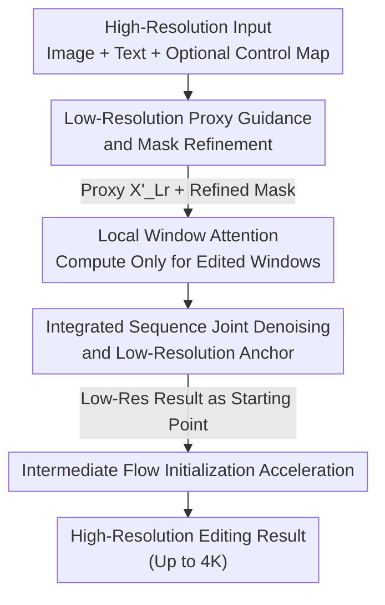

# HierEdit: Region-Aware Hierarchical Diffusion for Efficient High-Resolution Editing

**Conference**: CVPR 2026  
**Paper**: [CVF Open Access](https://openaccess.thecvf.com/content/CVPR2026/html/Zhang_HierEdit_Region-Aware_Hierarchical_Diffusion_for_Efficient_High-Resolution_Editing_CVPR_2026_paper.html)  
**Code**: To be confirmed (Project Page provided in the paper)  
**Area**: Diffusion Models / Image Editing  
**Keywords**: High-Resolution Editing, Local Window Attention, Hierarchical Diffusion, Low-Resolution Proxy, Inference Acceleration

## TL;DR
HierEdit adopts a hierarchical approach where editing is performed on a low-resolution proxy first and then mapped back to high resolution. By computing sparse attention only on edited local windows, it achieves 4K local editing **without requiring any 4K training data** while running over 6x faster than existing methods at 1K resolution.

## Background & Motivation
**Background**: Text-to-image editors based on Diffusion Transformers (DiT / MMDiT) such as FLUX, GPT-Image-1, and Gemini can perform high-fidelity editing at around 1K×1K resolutions, serving as the current backbone for controllable generation.

**Limitations of Prior Work**: The computational complexity of self-attention in these models increases quadratically with resolution ($O(N^2)$ where $N = H \cdot W$ is the token count). Consequently, most are limited to sub-1K resolutions, failing to meet professional demands in digital advertising, film, and high-fidelity visualization that require 4K output. Worse, most practical requirements are **local edits** ("remove the person on the far right" or "replace the apple with an orange"), whereas existing approaches either re-render the entire image (wasting computation on unmodified regions) or employ inpainting (which ignores interactions with external regions, resulting in boundary artifacts).

**Key Challenge**: The real challenge is not just "increasing the resolution," but **how to perform local edits efficiently while maintaining global consistency**. One wants to avoid the penalty of dense attention over the entire image for a small local change, as well as the loss of global semantic coherence caused by block-wise independent processing, all while being bottlenecked by the scarcity of high-resolution training data.

**Goal**: To achieve fast, high-fidelity local editing up to 4K resolution without collecting 4K training data or computing full-resolution attention.

**Key Insight**: It is observed that since only a local area needs to be modified, semantic editing can first be executed on a cheap, low-resolution proxy image. This proxy serves as: ① a semantic reference, ② a mask for precise localization of edited areas, and ③ an intermediate initialization to bypass early denoising steps. The high-resolution branch then computes sparse attention limited to the local windows covered by the mask.

**Core Idea**: Decouple computational complexity from image resolution via "low-resolution proxy guidance + local sparse attention restricted to target windows," making 4K editing computationally viable.

## Method

### Overall Architecture
HierEdit takes a high-resolution image $X_{Hr}$, a text prompt, and an optional control map $X_{Control}$. It first downsamples $X_{Hr}$ to a low-resolution proxy $X_{Lr}$ (e.g., 1K→256) and edits it using an off-the-shelf SOTA editing model (FLUX) to obtain $X'_{Lr}$. By comparing $X'_{Lr}$ and $X_{Lr}$ pixel-by-pixel, a refined mask $\tilde{M}$ is obtained to precisely isolate the modified regions. Then, the process enters the core **Local-Window MMDiT**, which computes sparse attention exclusively on the local windows overlapping with the mask. Unmodified regions are reused as "conditioning tokens," and the edited low-resolution image acts as a "global anchor" to preserve semantic coherence. Finally, **Intermediate Flow Initialization** uses the low-resolution result as the starting point for high-resolution sampling, skipping early denoising steps for further speedup. The most critical property of this pipeline is that **computational complexity scales with the number of edited windows, not the entire image resolution**, resulting in almost linear scaling from 1K to 4K.

### Key Designs

**1. Low-Resolution Proxy Guidance and Mask Refinement: "Decide how to edit" on a cheap thumbnail first**

Directly editing at high resolution is computationally expensive and makes localizing the edited region difficult. Furthermore, user-provided bounding box masks $M$ are often imprecise for complex effects like reflections, shadows, or occlusions. HierEdit downsamples the high-resolution input to a small proxy $X_{Lr}$ (e.g., 256×256) and applies an off-the-shelf editor to perform text- or multimodal-conditioned editing, yielding $X'_{Lr}$. This proxy image serves three purposes: providing **semantic guidance**, providing a **refined mask**, and acting as an **text-to-image initialization to skip early denoising steps**. The refined mask is generated by pixel-wise comparison between $X'_{Lr}$ and $X_{Lr}$, automatically incorporating pixels that underwent actual changes (including dependent regions like shadows and reflections that are hard to mask manually) into $\tilde{M}$. This step completes semantic decision-making ("where to edit and what to change") on a low-computational-cost image, defining a precise workspace for the high-resolution branch and enabling subsequent acceleration.

**2. Local-Window Attention: Compressing quadratic attention into sparse attention proportional to the edited area**

Global self-attention in DiT scales as $O(N^2)$, which becomes prohibitive at high resolutions. HierEdit partitions the high-resolution latent space $X\in\mathbb{R}^{H\times W}$ into non-overlapping windows $x_i$, with window side length $l$ bounded by the pre-training resolution (e.g., 1024), yielding $\frac{H}{l}\times\frac{W}{l}$ windows. Attention is computed only within each window, reducing the complexity to $O\!\left(\frac{H}{l}\cdot\frac{W}{l}\cdot (l^2)^2\right)=O(N\cdot l^2)$. The paper provides an intuitive figure: scaling from 1024×1024 to 4096×4096 reduces computations by 256x. In practice, $l=16$ (corresponding to 256 pixels in the raw image) is chosen, as extremely small windows can cause under-utilization of GPU kernels despite being faster. More importantly, **attention is computed only for windows that overlap with the mask**. This allows runtime complexity to scale linearly with the number of windows to edit, which decouples computational cost from entire-image resolution. To avoid boundary artifacts from non-overlapping partitioning, each window is allowed to attend to boundary tokens of neighboring windows, enabling information flow without breaking linear complexity. Since each local window resides within the positional encoding range supported by pre-training, the model can generate content reliably inside each block, natively supporting ultra-high-resolution synthesis.

**3. Integrated Sequence Joint Denoising and Low-Resolution Anchor: Reusing unmodified regions + preserving global semantics with small images**

Independent denoising of segregated blocks leads to two issues: sequence concatenation overloading GPU memory, and localized blocks acting independently to destroy global coherence. HierEdit addresses both with two techniques. First is **Integrated Token Sequence**: the unmodified source image region $C_{mask=0}$ is treated as **static conditioning tokens** (not participating in denoising), while the masked region $X_{noise}^{mask=1}$ is treated as noise tokens. They are concatenated into a single sequence $X_{integrated}=[\,C_{mask=0};\,X_{noise}^{mask=1}\,]$, squeezing the length back to the scale of a single image. This avoids the quadrupling of memory and doubling of sequence length caused by naive concatenation of the source image and noise. Since conditioning tokens remain constant across diffusion steps, their Key/Value projections require only a single forward pass and can be cached (**Feature Caching**), significantly accelerating the process. To prevent noise contamination, conditioning tokens only attend to other conditioning tokens and do not interact with noise or text tokens. This mechanism reuses pre-trained DiT weights without architectural modifications, **only fine-tuning a lightweight LoRA** to adapt to the new conditioning method. Second is the **Low-Resolution Anchor**: the edited low-resolution image $X'_{Lr}\in\mathbb{R}^{h\times w}$ acts as a global anchor carrying global context and layout. Using a scale factor $\rho=\frac{H}{h}$ (heuristically set to 4), low-resolution coordinates are mapped to high-resolution space $(\tilde m,\tilde n)=(\rho m,\rho n)$. The anchor, control map, and other tokens are concatenated into a unified sequence $[C_T, X_{integrated}, X'_{Lr}, X_{control}, \dots]$ and processed together. The authors observe that long-range dependencies primarily determine global structure and layout, while high-frequency details rely on local interactions. Thus, using a low-resolution anchor is perfect for filling in the missing global semantics of local windows. Training employs a standard flow-matching loss to teach the model this new attention pattern. Consequently, it ① only updates a small number of LoRA parameters, ② uses only 1K commercial resolution data, and ③ is **natively resolution-agnostic** because local window attention is focused on blocks of pre-trained size, enabling seamless extrapolation to 4K.

**4. Intermediate Flow Initialization: Skipping early denoising steps using low-resolution results**

If high-resolution generation starts denoising from pure Gaussian noise, the first few steps merely reconstruct low-frequency structures, which are already present in the low-resolution proxy. Therefore, HierEdit upsamples the low-resolution reference to the target size, sharpens it, and adds noise to an intermediate timestep $t$ to obtain $X^t_{ref}$. High-resolution sampling directly starts from this noisy variant: $X^t_{hr}=\alpha X^1_{hr}+(1-\alpha)X^t_{ref}$, where $X^1_{hr}$ is Gaussian noise and $\alpha\in(0,1)$ is the noise ratio. This skips early denoising steps, allowing low-frequency components from the proxy to take over and reducing the denoising steps from $T{=}28$ to $T'{=}10$, further cutting down redundant computation.

### Loss & Training
Training uses standard flow-matching (rectified flow) loss to teach the model the new attention pattern rather than retraining generation capabilities. Only lightweight LoRA modules on the attention projection layers are fine-tuned, while backbone DiT weights are frozen; the training data is limited to 1K commercial resolution, requiring no 4K high-resolution training data.

## Key Experimental Results

### Main Results
Instruction editing comparison (Table 1): HierEdit matches strong baselines like FLUX.1 Kontext across four benchmarks while securing substantial speedups discussed later.

| Task | Method | CompBench CLIP↑ | CompBench SSIM↑ | EmuEdit CLIPdir↑ | EmuEdit DINO↑ | ImgEdit Composite↑ | I2EBench SSIM↑ |
|------|------|------|------|------|------|------|------|
| Text-Guided Editing | SDEdit | 18.5 | 0.351 | 0.053 | 0.159 | 1.46 | 0.355 |
| | FLUX.1 Kontext | 20.8 | 0.954 | 0.116 | 0.840 | 3.45 | 0.501 |
| | GPT-Image-1 | 18.9 | 0.191 | 0.132 | 0.697 | 4.45 | 0.478 |
| | **Ours** | 20.6 | 0.949 | 0.117 | 0.833 | 3.51 | **0.508** |

Inpainting editing comparison (Table 2, 1K×1K): HierEdit achieves comparable or superior fidelity (FID/PSNR/CLIP) while maintaining the lowest latency and time per iteration.

| Task | Method | FID↓ | PSNR↑ | CLIP-T↑ | CLIP-I↑ | Latency↓ | Time/iter↓ |
|------|------|------|------|------|------|------|------|
| Text-Guided Inpainting | FLUX-Fill | 56.1 | 19.23 | 0.338 | 0.923 | 21.4s | 0.42s |
| | OminiControl2* | 39.2 | 19.11 | 0.339 | 0.921 | 8.25s | 0.29s |
| | ACE++ | 37.2 | 18.81 | 0.342 | 0.929 | 22.5s | 0.80s |
| | EasyControl | 108.6 | 15.38 | 0.331 | 0.887 | 14.5s | 0.55s |
| | **Ours** | 39.5 | **19.31** | 0.340 | 0.926 | **6.97s** | **0.24s** |

Speed at different edit ratios / resolutions (Table 3, in seconds; "—" denotes Out of Memory on 96GB GPU): HierEdit is the fastest across all configurations. Since it only computes for modified regions, its speedup increases as the edit ratio decreases, whereas competitors maintain nearly constant runtimes.

| Edit Ratio | Method | 1K | 2K | 3K | 4K |
|------|------|------|------|------|------|
| 25% | OminiControl2 | 5.98 | 21.5 | 63.3 | 155 |
| | FLUX-Fill | 21.4 | 113 | 383 | 1064 |
| | **Ours** | **4.51** | **15.6** | **35.6** | **91.4** |
| 50% | OminiControl2 | 8.47 | 35.8 | 113 | 286 |
| | **Ours** | **6.74** | **19.2** | **55.7** | **173** |
| 75% | OminiControl2 | 11.0 | 53.8 | 164 | 408 |
| | **Ours** | **8.32** | **23.0** | **84.1** | **227** |

### Ablation Study
Evaluating the speedup components step-by-step (Table 4, 1K, 50% edited area; Speed refers to relative processing time, lower is faster, slowdown factor compared to the full pipeline in parentheses):

| Config | Speed↓ | PSNR↑ | CLIP-T↑ | CLIP-I↑ | Note |
|------|------|------|------|------|------|
| Ours (Full) | 2.34 | 19.01 | 0.339 | 0.931 | Local window attention, feature caching, and token integration all enabled |
| −LWA | 4.98 (×2.13) | 18.84 | 0.336 | 0.922 | Without Local-Window Attention (Flash Sparse Attention kernel), 2.13× slower |
| −LWA−FC | 9.32 (×3.98) | 18.96 | 0.338 | 0.923 | Additionally removing Feature Caching, 3.98× slower |
| −LWA−FC−TI | 29.12 (×12.4) | 19.03 | 0.339 | 0.923 | Additionally removing conditioning/noise Token Integration, 12.4× slower |

### Key Findings
- **Local-Window Attention (LWA) is the primary engine for speedup**: Disabling it alone causes a 2.13× slowdown. It is the core algorithm compressing $O(N^2)$ to $O(N\cdot l^2)$. Disabling all three components leads to a 12.4× slowdown, proving that Feature Caching (FC) and Token Integration (TI) provide secondary and tertiary acceleration layers built on top of LWA.
- **Fidelity is virtually unaffected by acceleration**: The PSNR/CLIP scores across all four configurations remain within a narrow band, suggesting that the acceleration is "almost free"—providing substantial speedups without sacrificing quality.
- **Advantages scale with resolution and edited area**: The proposed method is about 6x faster than competitors at 1K, and the gap widens further at 4K (91.4s at 4K/25% vs FLUX-Fill's 1064s). Moreover, only HierEdit can generate images stably at 4K, whereas most competitors either OOM (on 96GB GPU memory) or fail to generate content inside the mask.
- **Mask refinement is indispensable**: Directly using the provided bounding box results in artifacts like incorrect shadows in EasyControl. Incorporating dependent areas (e.g., shadows/reflections) via the refined mask enables accurate editing.

## Highlights & Insights
- **"Think at low resolution first, execute at high resolution" is a highly efficient paradigm**: Keeping semantic editing decisions on a 256 proxy image allows the high-resolution branch to act as a "draftsman following directions." This saves computation, automatically provides refined masks, and yields starting points for denoising, hitting three birds with one stone.
- **Decoupled execution complexity from image resolution**: By computing only for edited windows, the runtime scales with the modified area rather than the overall image size. This makes small local edits at 4K almost as cheap as at 1K, unlocking professional ultra-high-resolution (UHR) workflows.
- **No architectural changes, only LoRA insertion**: All conditions (unmodified regions, low-resolution anchor, control maps) enter the pre-trained DiT's self-attention as additional tokens, preserving pre-trained weights and fine-tuning only the attention projection LoRAs. This makes implementation trivial and leverages the existing FLUX ecosystem.
- **Feature Caching for condition tokens**: Since unmodified regions remain constant across diffusion steps, their KV computations are performed once and cached, serving as a transferrable acceleration trick for other local editing or inpainting tasks.

## Limitations & Future Work
- **Heavy reliance on the quality of off-the-shelf low-resolution editors**: Semantic correctness depends entirely on FLUX editing on the proxy. If the proxy edit fails (e.g., wrong object placement, semantic drift), the high-resolution branch will faithfully upscale these errors.
- **Mask refinement relies on pixel differences**: Pixel-wise comparison between $X'_{Lr}$ and $X_{Lr}$ may be inaccurate under low contrast or global style edits. The paper focuses on local editing and has limited adaptability for global edits like style transfer.
- **Heuristic window sizes and scale factors**: Parameters like $l=16$ and $\rho=4$ are heuristic. Whether they remain optimal for extreme aspect ratios or fragmented multi-region edits is not fully discussed ⚠️ subject to the original text.
- **Evaluation details in supplementary material**: The main text lacks complete definitions and implementation details of the benchmark metrics (referred to the supplementary material), making the reproducibility of main results dependent on external sections.

## Related Work & Insights
- **vs FLUX.1 Kontext / GPT-Image-1 (Instruction Editing)**: While they perform full-image dense attention for editing, HierEdit speeds up local editing by over 6× while matching their fidelity. The difference lies in delegating "where/what to edit" to a low-res proxy and restricting "where to compute" to local windows.
- **vs OminiControl2 / ACE++ / FLUX-Fill (Inpainting)**: These methods also attempt to restrict computation to masked regions but rely on user-defined masks and predefined scopes. HierEdit **automatically localizes** editable regions using a low-res proxy and applies content-aware sparse attention without manual masks or retraining.
- **vs Local-Window Attention like Swin/Longformer**: Although they use local windows, they still perform static attention over the whole image. HierEdit computes dynamically only for edited windows and restores global semantics using low-resolution anchors—successfully applying local-window architectures to editing rather than pure generation for the first time.
- **vs PixArt-Σ / SANA (High-Resolution Synthesis)**: They rely on large-scale high-resolution pre-training or fine-tuning to reach near-4K. In contrast, HierEdit **requires no 4K training data**, extrapolating to 4K leveraging its resolution-agnostic local window design.

## Rating
- Novelty: ⭐⭐⭐⭐ The combination of "triple-use low-resolution proxy + sparse attention on edited windows" is clever, successfully transferring local-window architectures to editing scenarios.
- Experimental Thoroughness: ⭐⭐⭐⭐ Complete evaluation over four benchmarks, multi-resolution/edit-ratio speed tables, and component ablations, though some metric definitions are relegated to the supplementary material.
- Writing Quality: ⭐⭐⭐⭐ The motivation and methodology are clearly stated, with rigorous formula and complexity derivations, supported by adequate illustrations.
- Value: ⭐⭐⭐⭐⭐ Realizing 4K local editing without 4K training data while significantly accelerating inference holds high practical value for professional UHR workflows.

<!-- RELATED:START -->

## Related Papers

- [\[CVPR 2026\] Training-free, Perceptually Consistent Low-Resolution Previews with High-Resolution Image for Efficient Workflows of Diffusion Models](training-free_perceptually_consistent_low-resolution_previews.md)
- [\[CVPR 2026\] Low-Resolution Editing is All You Need for High-Resolution Editing](low-resolution_editing_is_all_you_need_for_high-resolution_editing.md)
- [\[CVPR 2026\] SpotEdit: Selective Region Editing in Diffusion Transformers](spotedit_selective_region_editing_in_diffusion_transformers.md)
- [\[ICLR 2026\] RegionE: Adaptive Region-Aware Generation for Efficient Image Editing](../../ICLR2026/image_generation/regione_adaptive_region-aware_generation_for_efficient_image_editing.md)
- [\[CVPR 2026\] Diffusion-Based Makeup Transfer with Facial Region-Aware Makeup Features](diffusion-based_makeup_transfer_with_facial_region-aware_makeup_features.md)

<!-- RELATED:END -->
