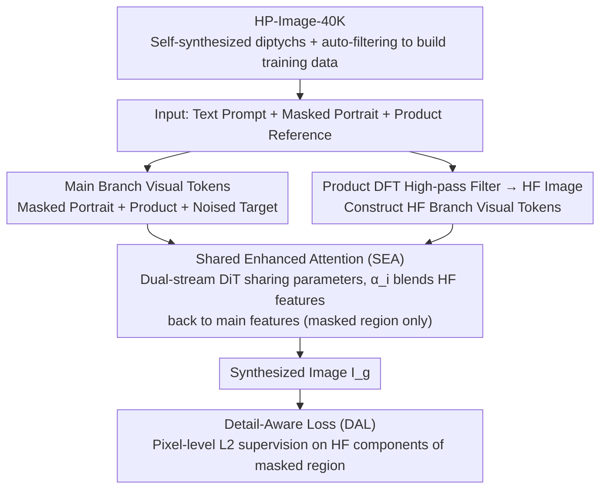

# HiFi-Inpaint: Towards High-Fidelity Reference-Based Inpainting for Generating Detail-Preserving Human-Product Images

**Conference**: CVPR 2026  
**arXiv**: [2603.02210](https://arxiv.org/abs/2603.02210)  
**Code**: [Project Page](https://correr-zhou.github.io/HiFi-Inpaint)  
**Area**: Diffusion Models / Image Generation  
**Keywords**: Reference-based Inpainting, High-Fidelity Detail Preservation, Human-Product Image Generation, High-Frequency Information Guidance, DiT

## TL;DR

The HiFi-Inpaint framework is proposed, utilizing Shared Enhanced Attention (SEA) to leverage high-frequency information for enhancing product detail features, combined with Detail-Aware Loss (DAL) for pixel-level high-frequency supervision, achieving SOTA detail fidelity in human-product image generation.

## Background & Motivation

Human-product images (depicting interactions between people and products) are crucial in advertising, e-commerce, and digital marketing. The core challenge in generating such images is **high-fidelity maintenance of product details**—shapes, colors, patterns, and text must be precisely restored, as minor deviations can undermine consumer trust.

Existing methods have three limitations:

**Lack of data**: Deficiency in large-scale, diverse training data for human-product images.

**Weak detail preservation**: Current models (e.g., image customization, text editing) focus on global/high-level semantics, making it difficult to robustly maintain fine-grained details; the denoising process of diffusion models tends to "average" or "hallucinate" content.

**Coarse supervision**: Reliance solely on latent space MSE loss provides insufficient guidance for precise pixel-level details.

Reference-based inpainting guides the restoration process through product reference images, but existing methods (Paint-by-Example, ACE++, Insert Anything) still cannot achieve high fidelity in textures, shapes, and branding elements.

## Method

### Overall Architecture

HiFi-Inpaint addresses the task of "losslessly inserting a product reference image into a masked region of a human portrait"—ensuring product shapes, patterns, logos, and text remain undistorted. Based on the MMDiT architecture of FLUX.1-Dev, it takes text prompts $T$, a masked portrait $\mathbf{I}_h$, and a product reference image $\mathbf{I}_p$ as inputs to output a composite image $\mathbf{I}_g$ where the product is naturally integrated. The pipeline is supported by three components: a self-synthesis pipeline creates the HP-Image-40K dataset to solve data scarcity; a high-frequency branch (SEA) is attached to the DiT to boost product detail features; and the Detail-Aware Loss (DAL) monitors high-frequency reconstruction at the pixel level.

### Key Designs

**1. HP-Image-40K: Large-scale training data via self-synthesis + automatic filtering**

The biggest bottleneck for human-product images is paired training data, as manual collection is extremely costly. The authors utilize FLUX.1-Dev to generate images in a diptych format (product on the left, human-product on the right) and use an automatic pipeline to filter poor-quality samples: Sobel edge detection for segmentation, YOLOv8+CLIP to calculate semantic similarity between cropped regions and reference images, and InternVL to verify text consistency. This yields 40,000+ high-quality samples without manual intervention, each containing a description, masked portrait, product image, and target image.

**2. High-Frequency Guided DiT + Shared Enhanced Attention (SEA): Dedicated channels for product texture**

The denoising process of diffusion models naturally tends to "average" features, often smoothing out high-frequency details like textures, text, and logos. SEA creates a dedicated high-frequency channel for these details. The product image is transformed into the frequency domain via DFT, where a circular high-pass filter with radius $r$ suppresses low frequencies before an inverse DFT brings it back to the spatial domain, resulting in a high-frequency image $H(\mathbf{I}_p)$ (which focuses more on critical details than Canny edges). The VAE tokens of the masked portrait, product, and noised target are concatenated into joint visual tokens $\mathbf{z}_0 = \text{Concat}(\mathcal{E}(\mathbf{I}_h), \mathcal{E}(\mathbf{I}_p), N(\mathcal{E}(\mathbf{I}_{gt}), t))$, while high-frequency visual tokens are constructed as $\mathbf{z}_0' = \text{Concat}(\mathcal{E}(\mathbf{I}_h), \mathcal{E}(H(\mathbf{I}_p)), N(\mathcal{E}(\mathbf{I}_{gt}), t))$. Within each dual-stream DiT block, the high-frequency and main branches share parameters, with a learnable weight $\alpha_i$ fusing high-frequency features back into the main features specifically within the masked region:

$$\mathbf{z}_i = B_i(\mathbf{z}_{i-1}) + \alpha_i \cdot \text{Mask}(B_i(\mathbf{z}_{i-1}'), \mathbf{M}_{ds})$$

Parameter sharing ensures SEA adds only one scalar $\alpha_i$ per layer, keeping the model size nearly unchanged; making $\alpha_i$ learnable (rather than fixed at 1) avoids visual artifacts caused by conflicts between high-frequency and main branches.

**3. Detail-Aware Loss (DAL): Targeting high-frequency reconstruction in pixel space**

Relying only on latent space MSE loss makes the model "blurry" regarding fine-grained details. DAL shifts supervision to pixel space, specifically applying an L2 constraint on the high-frequency components of the masked region:

$$\mathcal{L}_{\text{DA}} = \|H(\hat{\mathbf{I}}_{gt}) \odot \mathbf{M} - H(\mathbf{I}_{gt}) \odot \mathbf{M}\|_2^2$$

where $H(\cdot)$ denotes high-frequency extraction and $\mathbf{M}$ is the masked region. This forces the model to focus on restoring high-frequency details, addressing the gap left by latent space losses.

### Loss & Training

The total loss is the sum of the latent space MSE loss and the pixel-level DAL:

$$\mathcal{L}_{\text{Overall}} = \mathcal{L}_{\text{MSE}} + \mathcal{L}_{\text{DA}}$$

Training uses flow matching with a learning rate of $5 \times 10^{-5}$, a batch size of 24, for 10,000 steps at $1024 \times 576$ resolution. Training data includes approximately 14,000 internal samples + HP-Image-40K.

## Key Experimental Results

### Main Results

Evaluated on 1,000 test samples from HP-Image-40K ($1024 \times 576$ resolution):

| Method | CLIP-T↑(%) | CLIP-I↑(%) | DINO↑(%) | SSIM↑(%) | SSIM-HF↑(%) | LAION-Aes↑ | Q-Align-IQ↑ |
| :--- | :--- | :--- | :--- | :--- | :--- | :--- | :--- |
| Paint-by-Example | 31.6 | 69.1 | 63.4 | 54.0 | 34.9 | 4.09 | 4.06 |
| ACE++ | 34.9 | 93.1 | 90.7 | 58.3 | 37.2 | 4.18 | 4.00 |
| Insert Anything | 35.3 | 94.1 | 89.8 | 62.1 | 40.0 | 4.20 | 3.89 |
| FLUX-Kontext | 36.6 | 82.5 | 63.1 | 51.6 | 32.0 | 4.54 | 3.74 |
| **Ours** | **36.1** | **95.0** | **91.9** | **63.4** | **42.9** | **4.40** | **4.36** |

Ours achieves the best performance in visual consistency (CLIP-I, DINO, SSIM, SSIM-HF) and image quality (Q-Align-IQ).

### Ablation Study

| Scheme | Syn.Data | DAL | SEA | CLIP-I↑(%) | DINO↑(%) | SSIM↑(%) | SSIM-HF↑(%) | Notes |
| :--- | :--- | :--- | :--- | :--- | :--- | :--- | :--- | :--- |
| A | ✗ | ✗ | ✗ | 91.8 | 85.4 | 57.7 | 38.4 | Baseline |
| B | ✓ | ✗ | ✗ | 94.5 | 89.9 | 62.4 | 41.2 | +Dataset, major gain |
| C | ✓ | ✓ | ✗ | 94.6 | 90.7 | 62.3 | 41.8 | +DAL, detail improvement |
| E | ✓ | ✓ | ✓ | 95.0 | 91.9 | 63.4 | 42.9 | All components, Best |

### Key Findings

- **Dataset contributes the most**: HP-Image-40K brought the most significant performance gains (A→B: DINO +4.5, SSIM +4.7).
- **SEA is vital for details**: C→E shows continuous improvement in all consistency metrics; qualitative results indicate SEA leads to more precise alignment of textures and patterns.
- **DAL focuses on details**: In B→C, SSIM-HF improved by 0.6, showing DAL effectively guides the reconstruction of high-frequency details.
- **User Study** (31 participants / 11 groups): HiFi-Inpaint significantly outperformed other methods in text alignment (36.4%), visual consistency (41.5%), and generation quality (39.5%).
- **FLUX-Kontext performs poorly**: The general instruction editing approach fails to establish effective associations between reference images and masked regions, often generating independent product images instead of composite ones.

## Highlights & Insights

- **Clever use of high-frequency information**: High-frequency maps are extracted from the frequency domain and integrated throughout the framework—as input for an additional branch (SEA) and as a target for pixel-level supervision (DAL), forming a complete "high-frequency enhancement" system.
- **Parameter-efficient SEA design**: By sharing dual-stream DiT block parameters and introducing only a learnable scalar $\alpha_i$, no significant network parameter overhead is incurred.
- **Practical self-synthesis data pipeline**: Leverages the consistent generation capabilities of FLUX.1-Dev + multi-stage automatic filtering to build large-scale high-quality data at low cost.
- **SSIM-HF novel metric**: Computing SSIM after applying a high-pass filter to the generated image allows for more accurate assessment of detail preservation capabilities.

## Limitations & Future Work

- Specifically targeted at human-product scenes; generalization to more general reference-based inpainting (e.g., scene replacement, multi-object composition) has not been verified.
- HP-Image-40K is based on FLUX.1-Dev synthesis, which may possess generation biases; the gap between synthetic and real data is not fully analyzed.
- High-frequency extraction depends on a fixed-radius $r$ circular high-pass filter; different product types might require adaptive strategies.
- Inference efficiency is not reported; the additional SEA branch still requires forward propagation during inference.
- Evaluation was conducted on a self-built test set; there is a lack of standard public benchmarks.

## Related Work & Insights

- **FLUX-Kontext**, as a general editing model, performs poorly in this scenario, indicating that reference-based inpainting tasks require specialized detail-preservation mechanisms.
- **High-frequency supervision ideas** can be transferred to other generation tasks requiring detail preservation (e.g., texture transfer, virtual try-on).
- The **self-synthesis data + auto-filtering** pipeline can be generalized to other generation tasks lacking large-scale training data.
- The design philosophy of SEA (shared parameters + learnable weights) is highly versatile and can be applied to any DiT framework requiring auxiliary information enhancement.

## Rating

- Novelty: ⭐⭐⭐⭐ Systematic utilization of high-frequency information in DiT (SEA + DAL) is a novel and effective design.
- Experimental Thoroughness: ⭐⭐⭐⭐ Comprehensive evaluation with 7 metrics, 4 comparison methods, full ablation, and user studies combining quantitative and qualitative results.
- Writing Quality: ⭐⭐⭐⭐ Clear structure with a complete logical chain from motivation to method and experiment.
- Value: ⭐⭐⭐⭐ Directly valuable for e-commerce/advertising scenarios with high transferability of design ideas.

<!-- RELATED:START -->

## Related Papers

- [\[CVPR 2026\] FlowFixer: Towards Detail-Preserving Subject-Driven Generation](flowfixer_towards_detail-preserving_subject-driven_generation.md)
- [\[CVPR 2026\] Preserving Source Video Realism: High-Fidelity Face Swapping for Cinematic Quality](preserving_source_video_realism_high-fidelity_face_swapping_for_cinematic_qualit.md)
- [\[CVPR 2026\] Garments2Look: A Multi-Reference Dataset for High-Fidelity Outfit-Level Virtual Try-On with Clothing and Accessories](garments2look_a_multi-reference_dataset_for_high-fidelity_outfit-level_virtual_t.md)
- [\[CVPR 2026\] Towards High-resolution and Disentangled Reference-based Sketch Colorization](towards_high-resolution_and_disentangled_reference-based_sketch_colorization.md)
- [\[CVPR 2026\] Refracting Reality: Generating Images with Realistic Transparent Objects](refracting_reality_generating_images_with_realistic_transparent_objects.md)

<!-- RELATED:END -->
