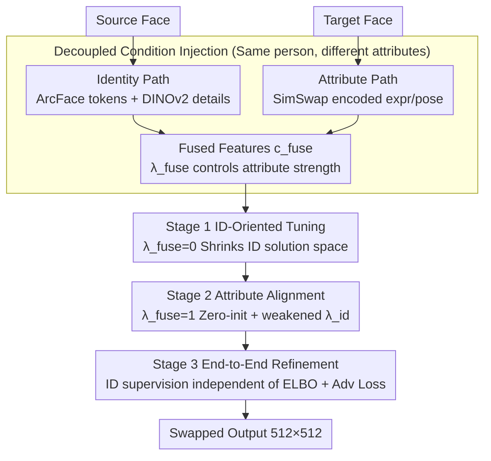

# High-Fidelity Diffusion Face Swapping with ID-Constrained Facial Conditioning

**Conference**: CVPR 2026  
**arXiv**: [2503.22179](https://arxiv.org/abs/2503.22179)  
**Code**: None  
**Area**: Diffusion Models/Image Generation  
**Keywords**: Face Swapping, Diffusion Models, Identity Constraint, Condition Decoupling, Multi-stage Training

## TL;DR

Proposes an ID-constrained attribute tuning framework for diffusion-based face swapping: the approach first constrains the identity solution space, then injects attribute conditions, and finally performs end-to-end refinement using identity and adversarial losses. Combined with a decoupled condition injection design, it achieves SOTA FID (3.61) and identity retrieval accuracy (97.9% Top-1) on FFHQ.

## Background & Motivation

Face swapping transfers the identity of a source face to a target face while maintaining target attributes such as expression and pose. This has significant applications in film production, gaming, and digital twins.

Limitations of Prior Work: Traditional GAN methods (SimSwap, E4S, InfoSwap) are limited by GAN-related image quality issues and mode collapse. While diffusion models offer stronger generative capabilities, existing diffusion methods (DiffFace, DiffSwap, REFace) face two core challenges:

**Priority of Identity vs. Attributes**: In face swapping, identity maintenance should take priority over attribute consistency—the result must first "look like" the source identity before aligning with target expression/pose. Existing methods often inject all conditions simultaneously, lacking priority control.

**Identity-Attribute Condition Conflict**: Identity conditions drive the output towards the source, while attribute conditions drive it towards the target. These directions are often contradictory during training (see Fig.3 in the paper), leading joint training to suboptimal solutions.

## Method

### Overall Architecture

This paper addresses a long-standing contradiction in diffusion face swapping: identity conditions pull toward the source face, while attribute conditions pull toward the target face, causing them to conflict during training. The proposed solution establishes a hierarchy—"Identity first, precision second." The framework is built on Stable Diffusion 1.5 inpainting. Given source and target faces, it outputs a swapped result. Training proceeds in three stages: shrinking the solution space to identity-consistent regions, aligning attributes within that subspace, and finally refining realism end-to-end.

### Key Designs

**1. Decoupled Condition Injection: Separating ID and Attributes via Data and Features**

Prior methods often used data augmentation on the same image to create condition pairs, leading to information leakage where the model cannot distinguish identity from attributes. Ours decouples at the data level by using **same-person-different-attribute** image pairs. The identity path extracts $d$-dimensional features via ArcFace, expands them into a sequence of $n \times d$ tokens $c_{\text{face}}$ via MLP, and incorporates spatial details $c_{\text{dino}}$ using DINOv2. These are fused via cross-attention:

$$c_{\text{id}} = c_{\text{face}} + \lambda_{\text{id}} \cdot \text{Attention}(c_{\text{face}}, c_{\text{dino}}, c_{\text{dino}})$$

The attribute path utilizes the 3-layer downsampling network from SimSwap to extract expression features $c_{\text{attr}}$ from the target. Finally, identity features act as the query and attribute features as key-value pairs, with a fusion factor $\lambda_{\text{fuse}}$ controlling attribute injection intensity:

$$c_{\text{fuse}} = c_{\text{id}} + \lambda_{\text{fuse}} \cdot \text{Attention}(c_{\text{id}}, c_{\text{attr}}, c_{\text{attr}})$$

When $\lambda_{\text{fuse}} = 0$, the model degrades to pure identity conditioning. Fused features are injected into UNet cross-attention layers via GLIGEN adapters, allowing the multi-stage training to control priority via this switch.

**2. ID-Constrained Multi-Stage Training: Constrain Space, Align Attributes, Then Refine**

Stage 1 is ID-oriented tuning: the UNet input layer is expanded to receive noisy latent $x_t$, inpainting mask $m$, and background context $(1-m) \odot x_t$. Attribute conditions are disabled ($\lambda_{\text{fuse}} = 0$), forcing the model to learn identity and compress the solution space. Stage 2 enables attribute conditions ($\lambda_{\text{fuse}} = 1$) to align expression and pose within the identity constraint. Key details: the fusion module output layer is zero-initialized to avoid overwhelming learned identity features; simultaneously, the identity enhancement factor $\lambda_{\text{id}}$ is reduced to 0.2. Stage 3 is end-to-end refinement: treating 50-step DDIM sampling as a cascaded generation model, identity and adversarial losses are applied to the results:

$$\mathcal{L} = \lambda_{\text{adv}} \mathcal{L}_{\text{adv}} + \lambda_{\text{id}} \mathcal{L}_{\text{id}}$$

To manage memory costs during backpropagation, gradients are calculated for only $k$ randomly sampled steps from the 50-step trajectory.

**3. Independent ID Supervision: Preserving ELBO in Diffusion Training**

DiffSwap/DiffFace direct apply ID loss to noise prediction, which relaxes the ELBO theoretical boundary and compromises generation quality. While REFace applies ID loss to multi-step DDIM results, the computational cost is high. Ours places ID supervision entirely in Stage 3, ensuring ELBO in the first two stages is undisturbed. Realism is further enhanced using an SNGAN discriminator, gaining ID supervision benefits without degrading the diffusion training process.

### Loss & Training

- **Stage 1-2**: Standard diffusion noise prediction MSE loss $\mathcal{L}_{\text{diff}} = \sum_t \lambda_t \|\epsilon_\theta(x_t; t) - \epsilon\|_2^2$
- **Stage 3**: SNGAN hinge loss $\mathcal{L}_{\text{adv}}$ + ArcFace identity loss $\mathcal{L}_{\text{id}}$, with random $k$-step gradient calculation.
- Training Data: 4.5 million internet-paired face images (same person, different attributes), with text descriptions annotated by BLIP-2.
- Stage 3 uses random paired face data filtered from LAION-5B.
- Output resolution: $512 \times 512$.

## Key Experimental Results

### Main Results

Evaluation on 1000 pairs from the FFHQ validation set:

| Method | FID↓ | Pose↓ | Expr.↓ | ID Top-1↑(%) | ID Top-5↑(%) |
|------|------|-------|--------|-------------|-------------|
| SimSwap (GAN) | 13.74 | 2.62 | **0.95** | 93.37 | 97.29 |
| E4S (GAN) | 12.22 | 4.55 | 1.32 | 77.80 | 87.40 |
| InfoSwap (GAN) | 4.26 | 3.26 | 1.00 | 92.82 | 97.69 |
| DiffFace | 8.82 | 3.76 | 1.31 | 91.50 | 97.50 |
| DiffSwap | 5.80 | **2.43** | 1.01 | 67.00 | 81.90 |
| REFace | 5.62 | 3.75 | 1.04 | 89.10 | 96.10 |
| **Ours** | **3.61** | 3.69 | 0.97 | **97.90** | **99.70** |

The FID significantly leads (3.61 vs. the second-best 4.26), and identity retrieval accuracy far exceeds all methods (97.9% vs. 93.4%), while expression distance remains competitive.

### Ablation Study

| Configuration | Key Indicator | Description |
|------|---------|------|
| Non-decoupled Injection | Weak identity, overfits to attributes | ID/Attribute leakage from same-image augmentation |
| Stage 1 Only | Good identity, poor expr/pose | No attribute guidance |
| Stage 1+2 | Good identity, improved expr/pose/lighting | Attribute tuning is effective; SimSwap encoder captures lighting |
| Stage 1+2+3 | Significant gain in identity and realism | End-to-end refinement with GAN+ID loss is essential |

### Key Findings

- **Decoupled injection is core**: Without decoupling, the model overfits to attributes, causing a sharp drop in identity maintenance.
- **Multi-stage training is effective**: Each stage provides observable improvements. Stage 2 also unexpectedly assists with lighting alignment and face shape adjustments.
- **End-to-end refinement enhances realism**: Stage 3's combination of ID loss and GAN loss significantly boosts identity similarity and generation fidelity.
- **Strengths of Diffusion Models**: Pre-trained base models provide out-of-the-box generalization, handling stylized images (oil paintings, cartoons) robustly even when they comprise <1% of training data.
- **User Study** (39 participants): Ours received 57.1% of votes for fidelity (far exceeding the second-place 15.3%) and ranked first in attribute consistency with 33.2%.

## Highlights & Insights

- **Identity-Priority Intuition**: Formalizing the intuition of "ID first, precision second" into constrained optimization—shrinking the solution space to ID-consistent regions before optimizing attributes—prevents contradictory conditions from competing in the full space.
- **Stage-wise loss avoids theoretical conflicts**: Separating ID loss into an independent Stage 3 prevents contamination of the ELBO in Stages 1-2, providing a more elegant approach than DiffSwap or DiffFace.
- **Zero-initialization + weakened ID factor**: The fine-tuned design of Stage 2 effectively prevents catastrophic forgetting and conditional imbalance.
- **Unexpected benefits of the SimSwap encoder**: It not only encodes expression/pose but also implicitly captures lighting conditions, serving as a notable byproduct.

## Limitations & Future Work

- Based on SD 1.5 ($512 \times 512$), limited by the base model's resolution and lack of more modern DiT/FLUX architectures.
- Pose distance (3.69) is higher than DiffSwap (2.43), indicating that identity constraints sacrifice some pose alignment.
- Stage 3 requires 50-step DDIM sampling plus backpropagation, which is computationally expensive (partially mitigated by random $k$-step calculation).
- 4.5 million training images are sourced from the internet; data quality and privacy issues remain undiscussed.
- Lacks systematic evaluation of difficult scenarios like cross-ethnicity or extreme age gaps.

## Related Work & Insights

- The concept of **conditional priority** can be extended to other multi-condition generation tasks (e.g., managing the priority between identity, style, and layout).
- The **staged condition injection** paradigm is applicable to any diffusion model fine-tuning scenario involving conflicting conditions.
- End-to-end DDIM refinement with random-step gradients is a general post-training strategy useful for optimizing generation quality.
- The reuse of the SimSwap attribute encoder within a diffusion framework demonstrates that GAN-era modules still hold transfer value.

## Rating

- Novelty: ⭐⭐⭐⭐ The ID-constrained multi-stage training paradigm and decoupled injection design are novel with clear intuition.
- Experimental Thoroughness: ⭐⭐⭐⭐ Comparison against 6 methods, quantitative metrics, user studies, and comprehensive ablation/visual analysis.
- Writing Quality: ⭐⭐⭐⭐ Motivations are well-explained; Fig. 2/3 provide intuitive visualizations of condition conflicts.
- Value: ⭐⭐⭐⭐ The concepts of multi-condition decoupling and priority training are generalizable beyond the specific task of face swapping.

<!-- RELATED:START -->

## Related Papers

- [\[CVPR 2026\] Preserving Source Video Realism: High-Fidelity Face Swapping for Cinematic Quality](preserving_source_video_realism_high-fidelity_face_swapping_for_cinematic_qualit.md)
- [\[CVPR 2026\] Attribute-Preserving Pseudo-Labeling for Diffusion-Based Face Swapping](attribute-preserving_pseudo-labeling_for_diffusion-based_face_swapping.md)
- [\[CVPR 2026\] APPLE: Attribute-Preserving Pseudo-Labeling for Diffusion-Based Face Swapping](apple_attribute-preserving_pseudo-labeling_for_diffusion-based_face_swapping.md)
- [\[CVPR 2026\] MMFace-DiT: A Dual-Stream Diffusion Transformer for High-Fidelity Multimodal Face Generation](mmface-dit_a_dual-stream_diffusion_transformer_for_high-fidelity_multimodal_face.md)
- [\[CVPR 2026\] High-Fidelity Virtual Try-On beyond Paired Data Scarcity via Diffusion-based Cycle-Consistent Learning](high-fidelity_virtual_try-on_beyond_paired_data_scarcity_via_diffusion-based_cyc.md)

<!-- RELATED:END -->
