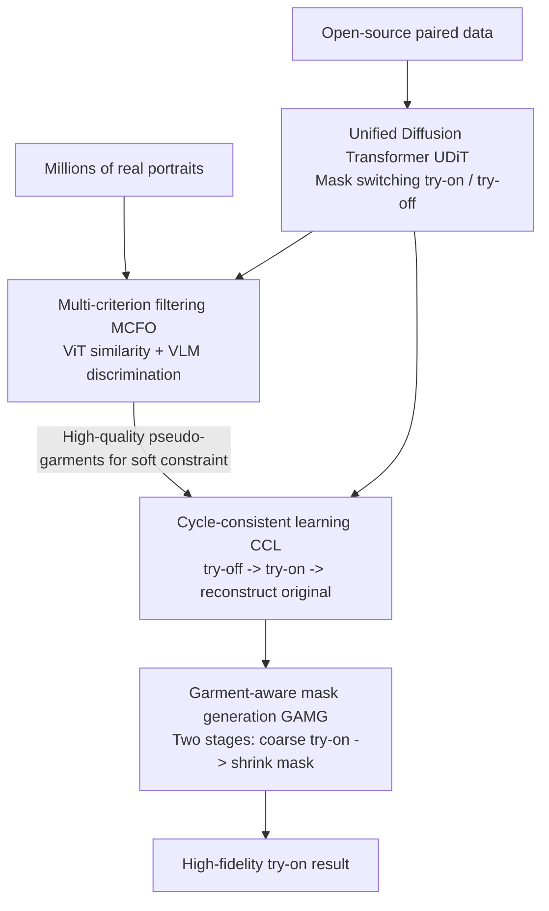

# High-Fidelity Virtual Try-On beyond Paired Data Scarcity via Diffusion-based Cycle-Consistent Learning

**Conference**: CVPR 2026  
**Paper**: [CVF Open Access](https://openaccess.thecvf.com/content/CVPR2026/html/Wu_High-Fidelity_Virtual_Try-On_beyond_Paired_Data_Scarcity_via_Diffusion-based_Cycle_Consistent_CVPR_2026_paper.html)  
**Code**: TBD  
**Area**: Diffusion Models / Virtual Try-On  
**Keywords**: Virtual Try-On, Cycle Consistency, Diffusion Model, Unpaired Data, Mask Generation

## TL;DR
CCVTON utilizes a unified diffusion Transformer to simultaneously learn "try-off" and "try-on" tasks. It organizes massive unlabeled real-world portraits into a "de-clothing and re-clothing" reconstruction cycle for training, thereby eliminating dependence on scarce paired data. Complemented by a two-stage garment-aware masking mechanism to suppress original garment leakage, it achieves SOTA performance on VITON-HD and DressCode.

## Background & Motivation

**Background**: Diffusion models have become the mainstream for virtual try-on (VTON). Typical approaches use the target garment as a condition (extracting features via ReferenceNet or concatenating the portrait and garment as a joint input) and allow the diffusion backbone to complete the garment-to-body transfer via in-context attention.

**Limitations of Prior Work**: These methods almost entirely rely on **aligned "garment-person" paired data** for supervision. However, open-source datasets (VITON-HD, DressCode) contain only tens of thousands of pairs, far from covering the diversity of garments, poses, and scenes in the real world. While real-world portraits are abundant, the cost of organizing them into high-quality pairs is extremely high. Some works use generative data augmentation, but synthetic pairs often suffer from noise like correspondence misalignment or unrealistic pose-garment combinations, which can degrade training.

**Key Challenge**: The performance ceiling of VTON is constrained by "clean, large-scale paired data"—data is scarce, and generating it introduces noise. Additionally, there is a second conflict: the inpainting paradigm relies heavily on garment masks. **A mask that is too small leads to leakage of the original garment's shape and texture, while a mask that is too large covers essential body parts (hands, waistline), causing structural distortion.** Balancing these two is difficult.

**Goal**: (1) Enable the model to be trained directly on massive "unpaired" real-world portraits; (2) Design a masking mechanism that efficiently suppresses garment leakage while maintaining human body consistency.

**Key Insight**: The authors observe that a single portrait inherently contains both "person" and "clothing worn" information. If a model can first "take off" (try-off) the garment from the person and then "put it back" (try-on) onto the same person, the **original portrait itself serves as a natural supervision signal**, requiring no paired annotations.

**Core Idea**: A **weight-shared unified model** is employed to handle both try-off and try-on tasks, forming a "try-off $\rightarrow$ try-on $\rightarrow$ original image reconstruction" cycle-consistent training loop. This transforms unpaired real portraits into usable training data.

## Method

### Overall Architecture
CCVTON is based on the Flux.1 rectified flow diffusion backbone. The pipeline consists of four steps: first, a **Unified Diffusion Transformer (UDiT)** is pre-trained on open-source paired data to enable it to switch between try-on and try-off tasks via task masks. Then, the pre-trained UDiT is used to "try-off" garments from millions of real portraits to obtain pseudo-garments, followed by **MCFO (Multi-Criterion Filtration Optimization)** to retain high-quality samples. Next comes the core **Cycle-Consistent Learning (CCL)**—performing try-off to extract a garment followed by try-on to put it back on the same masked person, fine-tuning end-to-end using an original image reconstruction loss. During inference, the **GAMG (Garment-Aware Mask Generation)** two-stage mechanism suppresses leakage and preserves body structure.

The inputs are a portrait $P$ and (optionally) a garment $G$. The output is the portrait wearing the target garment. Try-on/try-off is controlled by binary masks applied to the concatenated input $I=[G\,\|\,P]$: try-on uses $M_{on}=[0\,\|\,M_p]$ to cover the garment area on the person, while try-off uses $M_{off}=[1\,\|\,0]$ to mask the garment side, achieving **full parameter sharing**.

### Key Designs

**1. Unified Diffusion Transformer (UDiT): One model + task masks for both try-on and try-off**

VTON cycles require both "removal" and "wearing" capabilities. Using two separate networks would be parameter-heavy and make semantic sharing difficult. UDiT integrates both into **the same DiT**: the input is always the horizontally concatenated $I=[G\,\|\,P]\in\mathbb{R}^{H\times 2W\times 3}$, and the applied binary mask $M\in\{M_{on}, M_{off}\}$ determines the current task, reaching full parameter sharing. Pre-training on open-source paired data uses a rectified flow matching loss $\mathcal{L}^{(a)}_{\text{flow}}=\mathbb{E}\big[\|\upsilon_\theta(z_t, M, t, c)-(\epsilon-z_0)\|_2^2\big]$ and an additional DISTS perceptual loss calculated only in the masked region $\mathcal{L}^{(a)}_{\text{perc}}=\mathcal{DISTS}(\hat I^{(a)}\odot(1-M), I\odot(1-M))$, with the total loss being $\mathcal{L}_{\text{uni}}=\mathcal{L}^{(a)}_{\text{flow}}+\lambda\mathcal{L}^{(a)}_{\text{perc}}$. This step provides the foundation for subsequent cycles: the model must first gain basic try-on/off capabilities to perform self-reconstruction on unpaired data.

**2. Multi-Criterion Filtration Optimization (MCFO): Double-checking to block low-quality try-off samples**

Pseudo-garments $\hat G^{(b)}$ obtained by "trying off" garments from real portraits vary in quality. Direct training on these introduces noise. MCFO performs two independent tests on each $\hat G^{(b)}$: **ViT Similarity** uses CondViT to calculate the cosine similarity between $\hat G^{(b)}$ and the corresponding garment area in the portrait. Low scores, indicating try-off errors or artifacts, result in rejection. **VLM Discrimination** uses Qwen-VL for binary judgment of the $(\hat G^{(b)}, P)$ pair, specifically detecting semantic flaws like watermarks, residual limbs, or shape abnormalities. Only samples passing both checks are retained as high-quality pseudo-pairs $(\hat G^{(b)}, P)$. Approximately 70% of 1 million real-world portraits are retained after filtering.

**3. Cycle-Consistent Learning (CCL): Original portraits as supervision with soft constraints**

This is the core of the paper. For a portrait, the try-off branch first extracts the garment $\hat G^{(c)}=\mathrm{CCL}_{\text{off}}([G^{(c)}\,\|\,P]\odot(1-M_{off}))$, which is then fed into the try-on branch to be worn by the same masked person $\hat P^{(c)}=\mathrm{CCL}_{\text{on}}([\hat G^{(c)}\,\|\,P]\odot(1-M_{on}))$. The cycle-consistent loss only constrains **portrait reconstruction**—measuring the difference between $\hat P^{(c)}$ and the original $P$ ($\mathcal{L}_{cyc}=\mathcal{L}^{(c)}_{\text{flow}}+\lambda\mathcal{L}^{(c)}_{\text{perc}}$). $\hat G^{(c)}$ acts as an intermediate representation, while the **original portrait $P$ serves as a universal supervision signal** without paired labels.

To prevent the try-off branch from "cheating" (e.g., merely copying the garment from $P$ to close the cycle), a VGG perceptual regularization $\mathcal{L}_{\text{reg}}=\|\phi(G^{(c)})-\phi(\hat G^{(c)})\|_2^2$ is introduced. This forces the extracted garment to semantically align with the reference garment $G^{(c)}$ (the ground truth $G$ for open-source data, or the MCFO-filtered $\hat G^{(b)}$ for in-the-wild data). Crucial to this is **using perceptual regularization rather than pixel loss**—since $\hat G^{(b)}$ is a pseudo-label that may contain artifacts, the perceptual constraint intentionally reduces sensitivity to fine details, forcing try-off to learn structurally decoupled and semantically faithful garment representations. The total objective is $\mathcal{L}_{ccl}=\mathcal{L}_{cyc}+\beta\mathcal{L}_{reg}$.

**4. Garment-Aware Mask Generation (GAMG): Two-stage "expand then shrink" for leakage and consistency**

Addressing the mask-size dilemma, GAMG works in two steps during inference. First, a **cloth-bbox mask** is constructed by finding the intersection of the garment's minimal bounding box and a cloth-agnostic mask, followed by random dilation during training/inference—expanding by a random ratio $\delta\sim U(0, 0.3)$ in four directions. This erases clues about the original garment's length or looseness, forcing the model to rely on the target garment and pose priors rather than copying the original. **Stage 1** uses this dilated cloth-bbox mask for a coarse try-on; the large coverage provides sufficient freedom for deformations (e.g., short-to-long sleeves), while DensePose priors preserve body structure, yielding a coarse result $\hat P^{(c,1)}$. In **Stage 2**, $\hat P^{(c,1)}$ and the original $P$ are analyzed to locate the actual coverage of the synthesized garment. Combined with a DensePose semantic body mask, this is **shrunk** into a tight, semantically clear mask that excludes stable body parts like hands/feet, which is then fed back into the try-on branch for the final result $\hat P^{(c,2)}$, ensuring identity consistency and precise generation.

### Loss & Training
- Pre-training (UDiT): $\mathcal{L}_{\text{uni}}=\mathcal{L}^{(a)}_{\text{flow}}+\lambda\mathcal{L}^{(a)}_{\text{perc}}$ (Rectified flow matching + masked DISTS perceptual loss).
- Cycle fine-tuning (CCL): $\mathcal{L}_{ccl}=\mathcal{L}_{cyc}+\beta\mathcal{L}_{reg}$ (Portrait reconstruction + VGG perceptual regularization).
- Inference: 35 denoising steps (10 for Stage 1, 25 for Stage 2), resolution $1024\times768$.

## Key Experimental Results

### Main Results
Evaluated on VITON-HD (11,647/2,032 training/test pairs) and DressCode (48,392/5,400) under both paired and unpaired settings. Approximately 1 million real portraits were collected, with ~70% retained after MCFO for cycle fine-tuning.

| Dataset | Setting | Metric | Prev. SOTA (Leffa) | Ours (CCVTON) |
|--------|------|------|------------------|--------|
| VITON-HD | Paired | FID↓ / KID↓ | 5.189 / 0.488 | **4.814 / 0.171** |
| VITON-HD | Paired | SSIM↑ / LPIPS↓ | 0.857 / 0.065 | **0.895 / 0.056** |
| VITON-HD | Unpaired | FID↓ / KID↓ | 8.534 / 0.609 | **8.521 / 0.561** |
| DressCode | Paired | FID↓ / KID↓ | 4.806 / 1.218 | **2.930 / 0.543** |
| DressCode | Paired | SSIM↑ / LPIPS↓ | 0.877 / 0.073 | **0.911 / 0.042** |
| DressCode | Unpaired | FID↓ / KID↓ | 6.610 / 1.781 | **5.820 / 1.727** |

> Note: FID/KID measure the distance between generated and real distributions (lower is more realistic); SSIM/LPIPS measure structural/perceptual similarity to ground truth. CCVTON achieves SOTA on almost all metrics across both datasets and settings, with the most significant improvement in DressCode paired KID, dropping from the 1.02 level (CatVTON) to 0.543.

### Ablation Study
Controlled variants run on VITON-HD using the Flux.1.Fill backbone (✓ indicates the component is enabled):

| Exp | UDiT | CCL | GAMG | Paired FID↓ | Paired KID↓ | Paired SSIM↑ | Unpaired FID↓ |
|-----|------|-----|------|-------------|-------------|--------------|---------------|
| 0 (BASE) | | | | 5.995 | 0.737 | 0.884 | 9.023 |
| 1 (GAMG only) | | | ✓ | 5.890 | 0.567 | 0.868 | 8.903 |
| 2 (+UDiT) | ✓ | | | 5.995 | 0.557 | 0.840 | 9.068 |
| 3 (+MCFO Pseudo-pairs) | ✓ | (typical) | ✓ | 6.439 | 0.636 | 0.861 | 9.135 |
| 4 (+CCL) | ✓ | ✓ | | 5.148 | 0.407 | 0.883 | 8.561 |
| 5 (CCVTON Full) | ✓ | ✓ | ✓ | **4.814** | **0.171** | **0.895** | **8.521** |

### Key Findings
- **Conventional paired training with MCFO pseudo-pairs (Exp. 3) actually degraded performance**: FID rose from 5.995 in Exp. 2 to 6.439—the non-realistic textures and residual artifacts of synthetic garments pollute training. This validates the motivation for CCL to "exclude pseudo-garments from the reconstruction loss and treat them only as perceptual regularization."
- **CCL is the primary driver of performance (Exp. 4 vs Exp. 3)**: Switching from pseudo-pair training to cycle-consistent learning improved all metrics significantly (Paired FID 6.439 $\rightarrow$ 5.148), proving that "using original images as supervision + soft constraints" is more effective than "hard-crafting pairs."
- **GAMG is the final piece of the puzzle (Exp. 5 vs Exp. 4)**: Adding the two-stage mask during inference caused Paired KID to drop sharply from 0.407 to 0.171, verifying the direct contribution of leakage suppression to perceptual fidelity.
- In difficult scenarios such as cross-category, person-to-person transfer, and non-frontal views in the wild, CCVTON shows fewer limb distortions, seam misalignments, and structural deformities compared to baselines.

## Highlights & Insights
- **The "try-off as data generation" perspective is ingenious**: Turning the inverse operation of virtual try-on into a data engine allows any portrait to carry its own supervision signal, bypassing the persistent bottleneck of paired data. This self-supervision logic can be transferred to any generative task where an inverse operation exists.
- **Replacing pixel loss with perceptual regularization to prevent collapse** is a masterstroke: Cycle consistency often suffers from models taking shortcuts (copying). Instead of stronger pixel constraints, which would incorporate artifacts from pseudo-labels, the authors use VGG perceptual constraints to lock semantics while relaxing details, perfectly matching the "correct structure, dirty details" nature of pseudo-labels.
- **The "expand then shrink" two-stage masking** transforms a static hyperparameter (mask size) into a dynamic process: Stage 1 uses a large mask for deformation flexibility, and Stage 2 uses coarse results to infer a tight mask to protect the body. This logic is applicable to other inpainting-based editing tasks.

## Limitations & Future Work
- Relies on a sufficiently capable pre-trained UDiT to produce usable pseudo-garments; if try-off quality is poor, MCFO will filter out significant amounts of data, reducing the data dividends of cycle training.
- VLM discrimination (Qwen-VL) and ViT similarity thresholds in MCFO are heuristic engineering choices; the paper lacks a sensitivity analysis for these thresholds, leaving the robustness of the filtering standard in question ⚠️.
- Two-stage inference requires 35 denoising steps plus two rounds of mask construction (DensePose/parsing), leading to higher inference overhead than single-stage methods and limiting real-time potential.
- Evaluation remains largely on standard datasets like VITON-HD/DressCode; in-the-wild performance is primarily shown through qualitative figures and lacks quantitative in-the-wild benchmarks.

## Related Work & Insights
- **vs CatVTON**: CatVTON directly concatenates portraits and garments for joint input via attention but still requires paired supervision. CCVTON uses a similar joint input but organizes it into a try-off/try-on cycle to utilize unpaired data.
- **vs ReferenceNet-based (IDM-VTON / OOTDiffusion / Leffa)**: These methods use extra branches for garment features, which are heavier in parameters and pairing dependency. CCVTON uses a single weight-shared UDiT, eliminating the need for a separate ReferenceNet.
- **vs GAN-based cycle methods (DCTON / CycleVTON) and diffusion cycle variants**: While these use reconstruction cycles, they often still rely on paired garment-portrait data to supervise the cycle. The key difference in CCVTON is that the **cycle only constrains portrait reconstruction while treating the garment as an intermediate variable**, truly enabling training on in-the-wild portraits.
- **vs PromptDresser / TPD stage-specific masks**: PromptDresser often produces over-expanded masks, and TPD is limited by segmentation accuracy. GAMG achieves a finer balance between leakage and consistency through cloth-bbox + random expansion + DensePose-based contraction.

## Rating
- Novelty: ⭐⭐⭐⭐⭐ "Try-off as data engine + cycle consistency" transforms the data bottleneck into a self-supervised problem.
- Experimental Thoroughness: ⭐⭐⭐⭐ Clear five-level ablation and dual-dataset testing, though quantitative in-the-wild benchmarks are missing.
- Writing Quality: ⭐⭐⭐⭐ Logical flow from motivation to method and ablation; good coordination between formulas and figures.
- Value: ⭐⭐⭐⭐ Directly addresses the core pain point of VTON (data scarcity) with highly reusable methodologies.

<!-- RELATED:START -->

## Related Papers

- [\[CVPR 2026\] PROMO: Promptable Outfitting for Efficient High-Fidelity Virtual Try-On](promo_promptable_virtual_tryon_efficient.md)
- [\[CVPR 2026\] Garments2Look: A Multi-Reference Dataset for High-Fidelity Outfit-Level Virtual Try-On with Clothing and Accessories](garments2look_a_multi-reference_dataset_for_high-fidelity_outfit-level_virtual_t.md)
- [\[CVPR 2026\] Cycle-Consistent Tuning for Layered Image Decomposition](cycle-consistent_tuning_for_layered_image_decomposition.md)
- [\[CVPR 2025\] Shining Yourself: High-Fidelity Ornaments Virtual Try-on with Diffusion Model](../../CVPR2025/image_generation/shining_yourself_high-fidelity_ornaments_virtual_try-on_with_diffusion_model.md)
- [\[CVPR 2026\] PG-VTON: Single-Pass Training-Free Virtual Try-On via Patch-Guided Reference Alignment](pg-vton_single-pass_training-free_virtual_try-on_via_patch-guided_reference_alig.md)

<!-- RELATED:END -->
