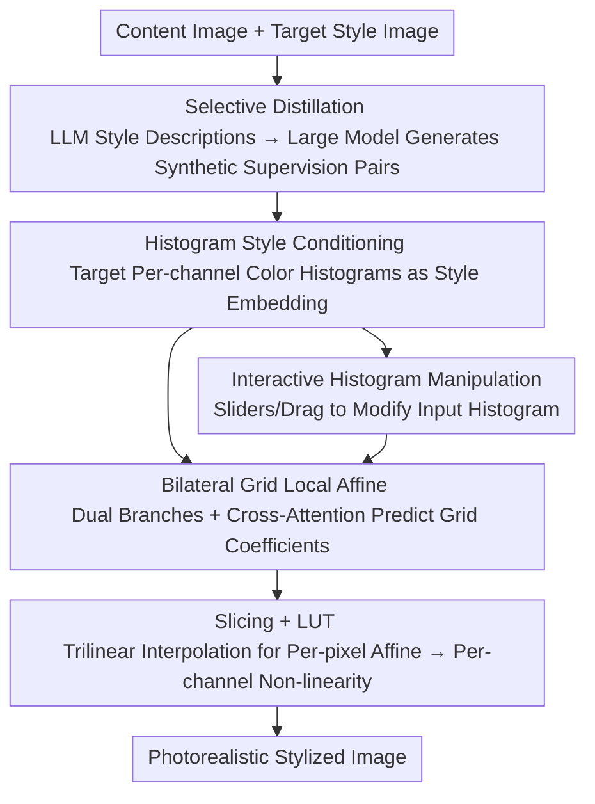

# Hist2Style: Histogram-Guided Stylization with Bilateral Grids

**Conference**: CVPR 2026  
**Paper**: [CVF Open Access](https://openaccess.thecvf.com/content/CVPR2026/html/Galor_Hist2Style_Histogram-Guided_Stylization_with_Bilateral_Grids_CVPR_2026_paper.html)  
**Code**: Project page dgalor.github.io/hist2style/ (the paper does not provide an explicit repository link)  
**Area**: Image Generation / Photorealistic Style Transfer  
**Keywords**: Photorealistic Style Transfer, Bilateral Grids, Histogram Conditioning, Model Distillation, Real-time Color Grading

## TL;DR
Hist2Style distills a large image editing model into a lightweight network with only 1.5M parameters. By utilizing "bilateral grids + color histogram conditioning," it constrains style transfer to locally affine tone/color transformations. This approach preserves content structure and eliminates hallucinations while achieving real-time performance at high resolutions and enabling interactive color grading via direct histogram manipulation.

## Background & Motivation
**Background**: Photorealistic style transfer aims to migrate the color and tone of a target image to an input image while strictly preserving content structure and edges. Classic approaches rely on global color statistics matching (e.g., Reinhard, IDT). In recent years, neural style transfer and photorealistic methods that apply constraints via bilateral grids or local LUTs (e.g., Xia et al., PhotoWCT2, SA-LUT) have been developed.

**Limitations of Prior Work**: The authors target the emerging trend of "color grading using large image editing models" (foundation models like Flux Kontext or Qwen Image Edit), pointing out three critical flaws: **performance** (sacrificing efficiency for generality, leading to high computational, memory, and inference costs), **hallucinations** (introducing artifacts such as identity drift and structural distortion that destroy photorealism), and **controllability** (difficulty in expressing precise color and tone intentions through text/image prompts). Conversely, traditional global color statistics methods lack spatial and semantic awareness, often producing "grainy" artifacts when source and target images differ significantly.

**Key Challenge**: There is a contradiction between expressiveness (the semantic priors of large models) and photorealistic constraints / efficiency / controllability—the more general a model, the more it is prone to hallucinations and is slower/harder to control; the more constrained a model (e.g., pure distribution matching), the less spatial awareness it possesses.

**Goal**: To develop a photorealistic stylizer that leverages the semantic priors of large editing models without hallucinations, supports real-time high-resolution processing, and provides users with precise control over color and tone.

**Key Insight**: "Selectively distill" a large editing model into a specialized small network and **constrain the editing space to local affine transformations using bilateral grids**. This ensures structural preservation "by construction" while replacing style representation with interpretable and editable color histograms.

**Core Idea**: Replace "text prompts + free generation" with "histogram conditioning + bilateral grids." This regresses photorealistic style transfer from conditional generation back to constrained local color transformation, ensuring hallucination-free, real-time, and interactive control.

## Method

### Overall Architecture
Hist2Style takes a content image $I_c$ and a style embedding (per-channel color histograms of a target image) as input and outputs a photorealistically stylized image. The pipeline consists of two parts: **offline selective distillation**, where an LLM programmatically generates diverse style descriptions (e.g., "Golden Hour," "1950s Film Noir") to drive a large image editing model to transform a standard photo dataset into various style variants, forming "content-stylized ground truth" pairs for supervision. The **online lightweight network** employs a dual-branch structure—the content branch uses a ConvNeXt convolutional encoder to encode the downsampled content image, while the style branch uses a 1D ConvNeXt to encode color histogram sequences into a global style token. These are fused via cross-attention to predict a spatially adaptive **bilateral grid** (local affine coefficients). The grid is "sliced" to every pixel via trilinear interpolation to obtain per-pixel affine transformations, which are applied to the content image followed by a learnable per-channel non-linearity (LUT). Training is supervised using the histograms of synthesized ground truths as conditions within a VGG perceptual space regression loss.

### Key Designs

**1. Selective Distillation: Learning Only the Color Grading Capability of Large Models**

To address the "slow + hallucination + hard to control" issues of large models, the authors do not use them for direct inference. Instead, they treat them as a **teacher** to distill a specialized "student" network. Specifically, an LLM generates a large number of photorealistic style names and descriptions, which are then used as instructions for the large editing model to transform images from a standard photography dataset (Unsplash Lite, ~25K images) into multiple style variants (averaging 6–7 per image). These variants maintain style consistency across different content images. The small network only imitates the teacher's **color/tone editing** and discards the generative capacity, thus naturally avoiding structural hallucinations. Problematic samples from the teacher are automatically filtered before training. This step compresses the semantic priors of foundation models into a 1.5M parameter network, reducing inference costs by an order of magnitude.

**2. Bilateral Grids for Photorealistic Constraints: Restricting Edits to Local Affine Transforms**

To resolve "hallucinations/structural destruction," bilateral grids are used to guarantee photorealism structurally. A bilateral grid stores an affine transformation in each grid cell and uses a learned guidance dimension $g:\mathbb{R}^3\to\mathbb{R}$ (equivalent to a luma dimension) derived from RGB to encode image edges. This compactly represents a "local affine, edge-preserving" image-to-image function. It decouples transformation resolution from image resolution: for a content image $I_c$ ($H\times W\times 3$), the network predicts a grid of $(G_g,G_h,G_w)=(8,16,16)$, where each cell stores $3\times4=12$ affine scalars plus a premultiplied $\alpha$ for uncertainty. During inference, trilinear interpolation "slices" the grid into per-pixel affine transforms. Because the transformation is restricted to local affine operations, the content structure cannot be rewritten—this is "photorealism by construction," which is key to scaling directly to 4096² resolution.

**3. Histogram Style Conditioning + Dual-Objective Loss: Interpretable, Controllable, and Spatially Aware**

To address "poor controllability," the authors use **per-channel color histograms** of the target image as style embeddings instead of VGG features or text. Histograms are fundamental tools in traditional editing, remaining naturally interpretable and directly editable; however, simple distribution matching without spatial awareness causes artifacts. Thus, two objectives are optimized: a spatial MSE between the output and ground truth, and a distribution loss approximated via the squared 1D Wasserstein-2 distance (calculated by sorting pixels per channel and computing MSE). Both losses are computed in VGG perceptual space, which the authors found generalizes better than pixel-space losses when using synthetic datasets with imperfections. This allows the model to learn both "distribution alignment" and "spatial consistency," ensuring histogram controllability while avoiding distribution-matching artifacts.

**4. Interactive Histogram Manipulation: Translating Global Intent into Locally Consistent Edits**

Histogram conditioning naturally supports an interaction interface: users do not modify the output directly but instead modify the input histogram fed to the network. The network then translates this global intent into adaptive local modifications. The authors implemented sliders in Y'CbCr space: Exposure $E\in[0,1]$, Contrast $C\in[0,\infty]$ (interpolating between a delta function at the luma peak and the original histogram), U-shift / V-shift $\in[-1,1]$, Smoothing $S\in[0,1]$, and an "Amount" slider $A\in[-\infty,\infty]$ (interpolating between identity at $A=0$ and the model prediction at $A=1$). Users can also "directly drag the histogram" to sculpt weight in specific luma/chroma bins, while the model ensures the result adheres to photorealistic statistics. This design replicates the workflow of curves/histograms familiar to photographers while providing precise control.

### Loss & Training
The model is implemented in PyTorch + PyTorch Lightning using Adam ($lr = 3\times10^{-4}$, $\beta=(0.9, 0.99)$) with a one-epoch linear warm-up. The 1.5M parameter model was trained for 1127 epochs (22.5K images per epoch) on a single A100 with a batch size of 64. During training, two style variants are randomly sampled for each content image: one serves as the input content, and the other serves as both the style target and the ground truth, accompanied by augmentations like horizontal flips and resized crops.

## Key Experimental Results

### Main Results
The training data was synthesized from Unsplash Lite (25K high-quality images), with 6–7 variants per image at 256×256 resolution. The evaluation set consists of 200 content images from Unsplash, 136 manually selected natural images, and 19 style images not seen during training. A blind two-alternative forced choice (2AFC) user study was conducted to compare against SOTA photorealistic transfer methods, reporting runtime, memory, cycle consistency, and color scores.

User Research (3,000 trials by 31 photography experts), reporting the Ratio of Win / Tie / Lose for Hist2Style (H2S) against each baseline:

| Comparison Method | H2S Win % | Tie % | Lose % |
|-------------------|-----------|-------|--------|
| SA-LUT            | 82.57     | 3.56  | 13.86  |
| WCT2              | 72.58     | 5.85  | 21.57  |
| Xia et al.        | 73.24     | 4.10  | 22.66  |
| IDT               | 73.75     | 3.01  | 23.25  |
| D-LUT             | 70.59     | 3.04  | 26.37  |
| PhotoWCT2         | 61.62     | 6.26  | 32.12  |

H2S wins >61% of comparisons against every individual method. Against the strongest competitor, PhotoWCT2, the baseline's win rate remains <33% after accounting for ties.

Runtime Comparison (seconds, across resolutions); Hist2Style and Xia et al. are the fastest for new content-style pairs:

| Method      | 256²  | 512²  | 1024² | 2048² | 4096² |
|-------------|-------|-------|-------|-------|-------|
| Hist2Style  | 0.001 | 0.003 | 0.009 | 0.04  | 0.1   |
| Xia et al.  | 0.003 | 0.003 | 0.004 | 0.008 | 0.03  |
| D-LUT       | 100   | 100   | 100   | 100   | 100   |
| SA-LUT      | 0.2   | 0.2   | 0.2   | 0.2   | 0.2   |
| PhotoWCT2   | 0.3   | 0.3   | 0.3   | 0.4   | 1     |
| IDT         | 0.1   | 0.2   | 0.3   | 0.4   | 0.9   |
| WCT2        | 0.04  | 0.07  | 0.1   | 0.4   | OOM   |
| ReHistoGAN  | 0.01  | 0.08  | 0.47  | 2.22  | 8.83  |

H2S shows an order-of-magnitude improvement in runtime and peak memory consumption compared to PhotoWCT2.

### Ablation Study
The ablation study primarily uses qualitative figures to demonstrate the impact of components. Key conclusions are summarized below:

| Dimension | Conclusion | Description |
|-----------|------------|-------------|
| Bilateral Grid (Local Affine Constraint) | Ensures photorealism + scales to 4096² | Structure cannot be overwritten; resolution is decoupled from transformation. |
| Perceptual Loss (VGG) | Superior to pixel color space | More robust to synthetic data artifacts; better generalization. |
| Histogram Conditioning | Provides interpretable, interactive control | Replaces VGG/text embeddings; supports sliders and dragging. |

### Key Findings
- Embedding photorealistic constraints into the network architecutre (bilateral grid local affine) is the fundamental reason for being hallucination-free and scalable, rather than relying on post-processing.
- Histogram conditioning provides more than just controllability: as an editable global statistic, user modifications to the input histogram drive the model to make adaptive local edits.
- Computing losses in VGG perceptual space is more effective than in color space, which the authors attribute to the imperfect nature of the synthetic training set.

## Highlights & Insights
- **Photorealism "by construction"**: Rather than constraining after training, constraints are built into the architecture—a bilateral grid can only express local affine transforms, naturally preserving structure. This is a prime example of upgrading "hallucination prevention" from a loss term to a structural prior.
- **Histogram as both Condition and UI**: The same representation is fed to the network and manipulated by the user, providing both interpretability and control in a single stroke, aligning with a photographer's intuition for grading curves.
- **Portability of Selective Distillation**: Using LLMs to programmatically generate prompts and large editing models to create supervision pairs allows specialists to distill specific capabilities into small networks. This "synthetic data → distillation → structural constraint" pattern can be applied to other real-time, hallucination-free image editing tasks.

## Limitations & Future Work
- The performance upper bound is constrained by the "teacher" (large editing model) and synthetic data quality.
- Style is defined as "color + tone" and content as "structure + edges," meaning the method **only performs photorealistic color grading** and cannot handle edits requiring content generation, relighting, or object replacement.
- While the user study is large (3,000 trials), it is inherently subjective. The authors proposed a VLM-based SQA (Stylization Quality Assessment) metric, but its alignment with human preference still depends on the VLM's judgment.

## Related Work & Insights
- **vs. Large Image Editing Models**: Those models perform general conditional generation and are expressive but slow, prone to hallucinations, and hard to control; Ours sacrifices generality for efficiency and precision by distilling them.
- **vs. Xia et al.**: Both use bilateral grids for local affine constraints; Ours introduces histogram conditioning and an interactive UI, and is trained on large-model distilled data.
- **vs. PhotoWCT2 / SA-LUT / D-LUT**: All involve "constraining the transformation space." Ours leads in user preference and offers an order-of-magnitude advantage in runtime and memory.
- **vs. Classic Statistics (Reinhard / IDT)**: Inherits the photorealistic spirit of "structure preservation" but adds spatial and semantic awareness to avoid graininess.

## Rating
- Novelty: ⭐⭐⭐⭐ Combining bilateral grids, histogram conditioning, and large model distillation into a cohesive pipeline is a strong combination.
- Experimental Thoroughness: ⭐⭐⭐⭐ Solid 3,000-trial expert user study and cross-resolution runtime comparisons.
- Writing Quality: ⭐⭐⭐⭐ Clear logic chain from motivation to constraint to benefit.
- Value: ⭐⭐⭐⭐ The real-time, hallucination-free, and interactive color grading is highly practical for production workflows.

<!-- RELATED:START -->

## Related Papers

- [\[CVPR 2026\] EmoStyle: Emotion-Driven Image Stylization](emostyle_emotion-driven_image_stylization.md)
- [\[CVPR 2026\] Mixture of Style Experts for Diverse Image Stylization](mixture_of_style_experts_for_diverse_image_stylization.md)
- [\[CVPR 2026\] Learnability-Guided Diffusion for Dataset Distillation](learnability-guided_diffusion_for_dataset_distillation.md)
- [\[ICCV 2025\] Balanced Image Stylization with Style Matching Score](../../ICCV2025/image_generation/balanced_image_stylization_with_style_matching_score.md)
- [\[CVPR 2026\] Prototype-Guided Concept Erasure in Diffusion Models](prototype-guided_concept_erasure_in_diffusion_models.md)

<!-- RELATED:END -->
