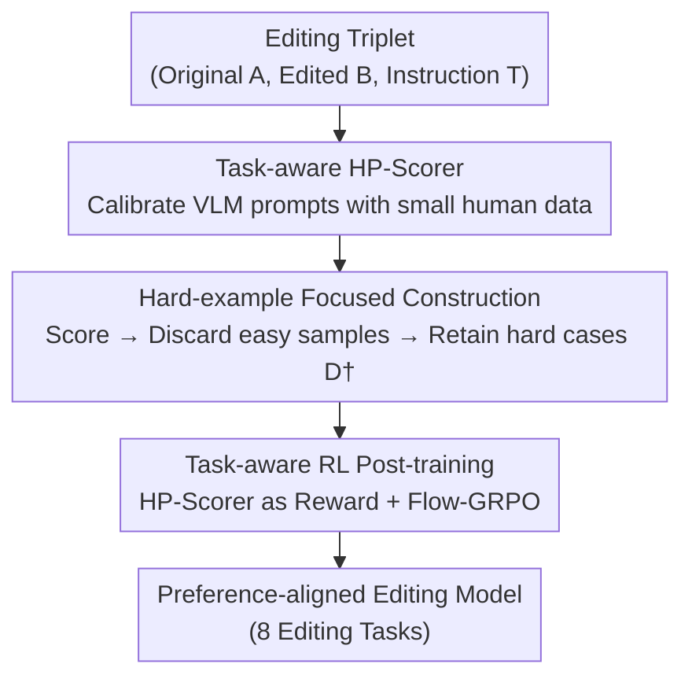

# HP-Edit: A Human-Preference Post-Training Framework for Image Editing

**Conference**: CVPR 2026  
**Paper**: [CVF Open Access](https://openaccess.thecvf.com/content/CVPR2026/html/Li_HP-Edit_A_Human-Preference_Post-Training_Framework_for_Image_Editing_CVPR_2026_paper.html)  
**Code**: To be confirmed  
**Area**: Image Generation / Image Editing / RLHF Alignment  
**Keywords**: Image Editing, Human Preference Alignment, RLHF, Flow-GRPO, VLM Reward Model

## TL;DR
This paper proposes **HP-Edit**, a human-preference post-training framework for image editing. It fine-tunes a VLM-based automatic scorer, **HP-Scorer**, using a small amount of human-scored data to construct preference datasets and serve as a reward model. Through online Flow-GRPO post-training, pre-trained editing models (e.g., Qwen-Image-Edit-2509) are aligned with human preferences. The authors also release the RealPref-50K dataset and RealPref-Bench benchmark.

## Background & Motivation
**Background**: The dominant paradigm for image editing (I2I) involves supervised fine-tuning (SFT) on pre-trained T2I diffusion backbones using large-scale I2I data. Recently, RL methods like Diffusion-DPO, Flow-GRPO, and Dance-GRPO have demonstrated potential in improving T2I generation quality.

**Limitations of Prior Work**: The SFT approach faces two major issues: first, SFT data sources are mixed (cartoons, synthetic images, etc.) and often do not align with real-world human preferences. Second, constructing preference-aligned editing datasets requires expensive human annotation, making large-scale alignment nearly impossible. Applying RLHF efficiently to diffusion-based **editing** remains largely unexplored due to the lack of scalable preference datasets and frameworks tailored for diverse editing sub-tasks.

**Key Challenge**: Unlike open-ended T2I synthesis, I2I editing must simultaneously satisfy **task accuracy** (e.g., faithfully removing an object) and **preference alignment** (results should be natural and aesthetically pleasing). This dual objective requires a framework capable of low-cost preference data construction and providing a **task-aware** reward model—neither of which is addressed by existing work, alongside a lack of real-world, object-balanced evaluation benchmarks.

**Goal**: To build a post-training framework that integrates an automatic scorer, efficient data construction, and task-aware RL using minimal human scoring, aligning models with human preferences while maintaining editing accuracy.

**Key Insight**: It is observed that strong pre-trained editing models (e.g., Qwen-Image-Edit-2509) perform well in most scenarios, where **many samples already receive full scores**, diluting the RL training signal with "easy samples." Instead of increasing data volume, focusing on **hard samples** with a reward model that approximates human judgment is more effective.

**Core Idea**: Use "minimal human scoring $\rightarrow$ distilled VLM HP-Scorer $\rightarrow$ filter out full-score easy samples to retain only hard cases $\rightarrow$ use HP-Scorer as a reward for Flow-GRPO post-training" to transform expensive human alignment into a scalable, automatic closed loop.

## Method

### Overall Architecture
HP-Edit is a three-stage post-training pipeline centered around **HP-Scorer** (an automatic scorer based on a pre-trained VLM with task-specific prompts). **Stage 1** calibrates HP-Scorer with human 0–5 scores to approximate human judgment. **Stage 2** uses HP-Scorer to rate large-scale editing cases, discarding easy full-score samples to construct the RL training set RealPref-50K. **Stage 3** utilizes HP-Scorer as the reward model for online Flow-GRPO post-training. Given an input "original image A + instruction T," the model samples candidates via SDE. HP-Scorer rates each image, and scores are normalized as rewards. GRPO updates the model using relative advantages within the group to favor results with higher human preference scores.

### Key Designs

**1. Task-aware HP-Scorer: Distilling a VLM for Task-specific Scoring with Minimal Human Data**

Human preference labeling is the primary bottleneck. HP-Edit addresses this by collecting only 50–100 triplets per sub-task samples rated by humans on a **0–5 scale** (0: failure, 3: basic following but poor quality, 5: high-quality following). A pre-trained VLM (e.g., GPT-4o) is used with **customized system prompts for each sub-task** to approximate human judgment. Prompts start with general standards and **iteratively add task-specific reasoning questions** (e.g., for object swapping, asking if the replacement is clear and the original object is fully removed) until HP-Scorer aligns with human scores. This encapsulates human preference into a scalable automatic scorer, where scores also serve as the evaluation metric (HP-Score).

**2. Hard-example Focused Data Construction: Focusing Signal on Model Failure Points**

Strong pre-trained models often achieve full scores on many cases. If RL is applied directly to the original data $D$, rewards saturate (near 5), resulting in weak gradient signals and stagnant reward curves. HP-Edit employs **dataset filtering**: it collects real-world cases balanced by MS-COCO categories, scores them using HP-Scorer, and **discards full-score (score 5) samples** to create $D^\dagger$. This increases training difficulty and focuses the model on low-score hard cases, providing more informative gradients. Ablation shows this step alone improves HP-Score from 4.391 (original) to 4.577.

**3. Task-aware Flow-GRPO Post-training: Aligning SDE Sampling with HP-Scorer Rewards**

Flow Matching typically uses deterministic ODEs ($dx_t=v_t\,dt$), which lack exploration. Flow-GRPO converts this to a marginal density-equivalent SDE by adding a drift term $\frac{\sigma_t^2}{2t}(x_t+(1-t)v_t)$ and Wiener noise $\sigma_t\,dw$, allowing the sampling of $G$ candidate images for intra-group comparison. For each image, the HP-Scorer score $s$ is normalized via sigmoid to $[0,1]$ as the reward: $r=\frac{1}{1+\exp(-\alpha s+\beta)}$ ($\alpha=2,\beta=5$). Advantages are computed via group-relative normalization $\hat A_i=\frac{R_i-\mathrm{mean}(\{R_j\})}{\mathrm{std}(\{R_j\})}$, and the model is updated using the GRPO objective with clipping and KL regularization: $J=J_{\text{clip}}-\beta D_{KL}(\pi_\theta\|\pi_{\text{ref}})$. Training focuses on rank-32 LoRA to maintain stability and pre-trained capabilities. **Task-awareness** is achieved by switching HP-Scorer prompts based on the editing task type within the same GRPO framework.

### Loss & Training
Post-training uses online Flow-GRPO with rewards from a task-customized HP-Scorer (Qwen3-VL-32B-Instruct is used during training to avoid external API latency and failures). The base model Qwen-Image-Edit-2509 is frozen except for rank-32 LoRA. The AdamW optimizer is used with a learning rate of $3\times10^{-4}$. The GRPO objective includes clipping and KL regularization for stability.

## Key Experimental Results

### Main Results
Selected HP-Score (0–5, scored by GPT-4o via HP-Scorer, higher is better) on RealPref-Bench (1,638 cases, 8 tasks, ~200/task):

| Model | Overall HP-Score | Human Score | Relighting | Bokeh | Color |
|------|---------------|--------|-----------|-------|-------|
| Step1X-Edit | 4.07 | 3.89 | 3.922 | 4.696 | 4.174 |
| Qwen-Image-Edit | 3.919 | 4.005 | 4.549 | 4.539 | 4.574 |
| FLUX.1-Kontext-Dev | 3.59 | 3.345 | 3.99 | 4.23 | 4.116 |
| Qwen-Image-Edit-2509 (Baseline) | 4.472 | 4.337 | 4.358 | 4.539 | 4.781 |
| **HP-Edit (Ours)** | **4.667** | **4.554** | **4.75** | **4.733** | 4.781 |

HP-Edit improves the overall HP-Score from 4.472 (baseline) to 4.667, ranking first across all 8 sub-tasks. Significant gains are observed in tasks like color change, bokeh, relighting, and background replacement, where fine-grained consistency and realism priors—areas where pre-trained models often struggle—are critical.

Generalization: HP-Edit also achieves SOTA on the GEdit-Bench-EN benchmark (Step1X-Edit), leading in semantic consistency (G_SC), quality (G_PQ), and overall (G_O) scores.

### Ablation Study

| Configuration | HP-Score | Description |
|------|----------|------|
| Baseline (Pre-trained) | 4.472 | No post-training |
| BaseData + Base-Scorer | 4.391 | Unfiltered data + simple prompts (Performance drops) |
| RealPref-50K + Base-Scorer | 4.577 | Hard-example filtering added |
| RealPref-50K + HP-Scorer (HP-Edit) | **4.667** | Hard-example filtering + task-aware scorer |

### Key Findings
- **Filtering and Refined Scoring are Interdependent**: Using original data with a simple scorer (4.391) performs worse than the baseline (4.472), indicating that simple/noisy samples provide weak or misleading RL signals. Using RealPref-50K improves the score to 4.577, and adding the task-aware HP-Scorer reaches 4.667.
- **Reward Curves Confirm Hypothesis**: The reward curve for original data (BaseData) starts high but remains stagnant due to saturation. Filtered data shows clear upward trends, and HP-Edit remains the most stable, validating the hard-example focus.
- **HP-Scorer Alignment**: User studies with 5 annotators on 1k+ pairs show that human ratings for instruction following and quality distribution closely match HP-Scorer results.

## Highlights & Insights
- **Scaling via "Small Human Data $\rightarrow$ VLM Distillation"**: Using only 50–100 human scores per task to create a task-aware reward model bypasses the bottleneck of RLHF in editing and can be transferred to other alignment tasks.
- **Hard-example Filtering is an Undervalued "Free Lunch"**: Simply discarding full-score samples yields a +0.1 gain, suggesting that for strong base models, RL data value lies in difficulty rather than volume.
- **Task-aware Rewards**: Using task-specific prompts allows the reward criteria to switch automatically (e.g., asking "is it clean?" for removal vs. "is color bleeding?" for recoloring), proving more effective than a generic reward model.

## Limitations & Future Work
- HP-Scorer serves as the performance ceiling; if the VLM has systematic biases relative to humans in specific tasks, the RL will align to the "scorer's preference."
- Evaluation "Referee" and "Reward" are derived from the same system; while human studies support the results, more cross-system comparisons are needed.
- Validation is primarily on Qwen-Image-Edit-2509; effectiveness on weaker or fundamentally different architectures is not fully explored.
- Filtering currently uses a binary threshold ("discard score 5"); more granular difficulty weighting schemes could be explored.

## Related Work & Insights
- **vs. Diffusion-DPO / Flow-GRPO (T2I Alignment)**: While these focus on open-ended synthesis, HP-Edit targets I2I editing, addressing the dual objective of task accuracy and preference alignment through task-aware scoring.
- **vs. Qwen-Image-Edit-2509 / FLUX.1-Kontext (SFT Baselines)**: These models derive capability from large-scale SFT but lack preference alignment. HP-Edit acts as a post-training layer to enhance aesthetics and realism.
- **vs. Step1X-Edit / BAGEL / X2Edit**: HP-Edit consistently leads in benchmarks and fills the gap for real-world preference evaluation standards.

## Rating
- Novelty: ⭐⭐⭐⭐ Systematic application of RLHF to image editing with VLM-based filtering is novel, though individual components are known.
- Experimental Thoroughness: ⭐⭐⭐⭐ Comprehensive tasks and benchmarks; however, crossover between reward and referee systems remains a point for scrutiny.
- Writing Quality: ⭐⭐⭐⭐ Clear three-stage process and solid motivation regarding signal dilution.
- Value: ⭐⭐⭐⭐⭐ Provides a scalable paradigm and high-quality real-world datasets/benchmarks for the editing community.

<!-- RELATED:START -->

## Related Papers

- [\[CVPR 2026\] CARE-Edit: Condition-Aware Routing of Experts for Contextual Image Editing](care-edit_condition-aware_routing_of_experts_for_contextual_image_editing.md)
- [\[CVPR 2026\] Group Editing: Edit Multiple Images in One Go](group_editing_edit_multiple_images_in_one_go.md)
- [\[CVPR 2026\] OneHOI: Unifying Human-Object Interaction Generation and Editing](onehoi_unifying_human-object_interaction_generation_and_editing.md)
- [\[CVPR 2026\] GDRO: Group-level Reward Post-training Suitable for Diffusion Models](gdro_group-level_reward_post-training_suitable_for_diffusion_models.md)
- [\[CVPR 2026\] UniEdit-I: Training-free Image Editing for Unified VLM via Iterative Understanding, Editing and Verifying](uniedit-i_training-free_image_editing_for_unified_vlm_via_iterative_understandin.md)

<!-- RELATED:END -->
