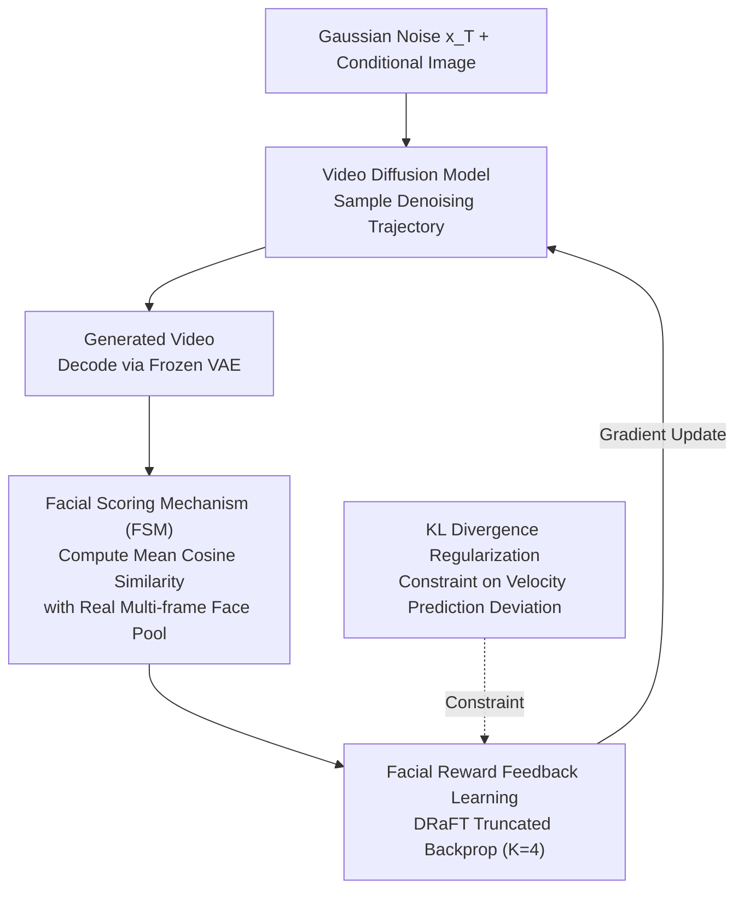

# Identity-Preserving Image-to-Video Generation via Reward-Guided Optimization

**Conference**: CVPR 2026  
**arXiv**: [2510.14255](https://arxiv.org/abs/2510.14255)  
**Code**: [https://ipro-alimama.github.io/](https://ipro-alimama.github.io/) (Project Page)  
**Area**: Diffusion Models / Video Generation  
**Keywords**: Image-to-Video, Identity Preservation, Reinforcement Learning, Facial Reward, Diffusion Model Fine-tuning

## TL;DR

This paper proposes IPRO, which directly optimizes video diffusion models using reinforcement learning and a differentiable facial identity scorer. Without modifying the model architecture, it significantly improves facial identity consistency in image-to-video generation, achieving a 20%-45% increase in FaceSim on Wan 2.2.

## Background & Motivation

**Background**: Image-to-Video (I2V) generation has made significant progress. Diffusion Transformer models like CogVideoX, HunyuanVideo, and Wan can synthesize high-quality videos with temporal coherence from static images. Human video generation is a critical application scenario for I2V.

**Limitations of Prior Work**: Existing I2V models struggle to maintain the identity consistency of the input portrait, especially during large facial expression changes or high-motion actions. This problem is exacerbated when the face occupies a small portion of the image. As the frame count increases, error propagation across frames leads to gradual identity degradation, causing the character's appearance to drift from the initial frame.

**Key Challenge**: On one hand, identity information is fully encoded in the first frame. On the other hand, existing methods (e.g., injecting additional identity modules) suffer from "exposure bias"—they are trained on ground-truth intermediate states but rely on self-generated states during inference, leading to accumulated errors and identity drift. Furthermore, these architecture-intrusive methods are inherently designed for single characters and are difficult to scale to multi-person scenarios.

**Goal**: Can the identity preservation capability of general foundation I2V models be enhanced without altering the architecture or compromising the original generation quality?

**Key Insight**: From a reinforcement learning perspective, a facial identity scorer (ArcFace) can be treated as a reward model. The diffusion model parameters can then be optimized directly via gradient backpropagation to generate more identity-consistent videos.

**Core Idea**: Use the cosine similarity of ArcFace facial embeddings as a differentiable reward signal to fine-tune the video diffusion model through truncated gradient backpropagation.

## Method

### Overall Architecture

IPRO does not insert any identity modules into the diffusion model; instead, it reformulates "identity preservation" as a differentiable reward optimization problem. A complete training iteration proceeds as follows: starting from Gaussian noise $x_T$ and a conditional image, the video diffusion model runs the full sampling trajectory to produce a generated video. A frozen VAE decoder maps it back to pixel space, and a frozen face recognition network (ArcFace) provides a score. This score serves as the reward, which is backpropagated along the sampling trajectory to update the diffusion model parameters. The framework includes three core designs: Facial Reward Feedback Learning, a Facial Scoring Mechanism (FSM), and KL divergence regularization.

### Key Designs

**1. Facial Reward Feedback Learning: Converting Identity Consistency into a Backpropagatable Objective**

The most critical issue with architecture-intrusive methods is exposure bias. IPRO ensures the training and inference paths are identical: the objective function $J(\theta) = \mathbb{E}_{x_T \sim N(0,I)}[R_{face}(\text{sample}(\theta, x_T))]$ directly maximizes the reward of videos sampled from random noise. This aligns the training distribution with the inference distribution, eliminating exposure bias. Unlike frame-wise $L_2$ supervised fine-tuning (SFT), it optimizes the global reward of the entire video sequence, allowing it to perceive subtle, accumulating drifts. To manage VRAM constraints, the DRaFT truncation strategy is employed, backpropagating gradients only through the final $K=4$ denoising steps:

$$\nabla_\theta R_{face}^K = \sum_{t=0}^{K} \frac{\partial R_{face}}{\partial x_t} \cdot \frac{\partial x_t}{\partial \theta}$$

Late-stage (low-noise) steps are selected because they determine fine-grained facial details. Experiments show late-stage gradients yield higher FaceSim than early-stage gradients (0.694 vs. 0.646).

**2. Facial Scoring Mechanism (FSM): Scoring with a Multi-angle Face Pool**

There is an inherent conflict in identity preservation: the face should resemble the reference but should not be "locked" into the exact expression of the first frame. The FSM collects facial embeddings from **all frames** of the real video into a feature pool. For each generated frame $i$, it calculates the average cosine similarity with all real frames in the pool:

$$s_i = \frac{1}{F}\sum_{j=1}^{F} \cos\big(\phi(\hat{x}_i), \phi(x_j)\big)$$

The final reward is the average of $s_i$ across all generated frames. By comparing against the entire pool rather than just the first frame, the model learns to maintain identity across various angles and expressions without "copy-pasting" a static face.

**3. KL Divergence Regularization: Preventing Reward Hacking**

Aggressively optimizing for facial rewards can lead the model to find a shortcut: generating static videos with stiff expressions to get high scores. This is reward hacking (FaceSim reaching 0.754 while the visual quality fails). IPRO adds a KL constraint at each step of the sampling trajectory to penalize deviations in velocity prediction between the optimized model and the reference model:

$$D_{KL}\big(p_\theta(x_{0:T}) \,\|\, p_{\theta_{ref}}(x_{0:T})\big) = \sum_{t=1}^{K} \omega_t' \,\big\|v_\theta(x_t, t) - v_{\theta_{ref}}(x_t, t)\big\|^2$$

This anchors the optimization near the original model, ensuring identity gains do not compromise general video generation capabilities. Removing KL increases the hacking rate from 10% to 58%.

### Loss & Training

The approach uses the Adam optimizer with a learning rate of 2e-5 for 100 steps and a batch size of 64. The truncated gradient step $K=4$, facial reward weight is 0.1, and KL loss weight is 1. For Wan 2.2 27B-A14B, only the low-noise expert is trained. The Wan 2.2-Lightning distilled version (8 steps, no CFG) is used to improve training efficiency. Training data consists of 960p videos collected from the internet, including scenes with small faces (bounding box $\le 100 \times 100$ pixels).

## Key Experimental Results

### Main Results

| Method | FaceSim↑ | SC↑ | BC↑ | AQ↑ | IQ↑ | DD↑ |
|------|----------|-----|-----|-----|-----|-----|
| In-house I2V (15B) | 0.477 | 0.977 | 0.978 | 0.664 | 0.729 | 8.93 |
| + IPRO | **0.696** (+45.9%) | 0.981 | 0.981 | 0.664 | 0.726 | 8.31 |
| Wan 2.2 5B | 0.379 | 0.942 | 0.955 | 0.648 | 0.727 | 27.79 |
| + IPRO | **0.546** (+44.1%) | 0.946 | 0.956 | 0.649 | 0.724 | 27.26 |
| Wan 2.2 A14B | 0.578 | 0.951 | 0.971 | 0.659 | 0.727 | 19.45 |
| + IPRO | **0.694** (+20.1%) | 0.954 | 0.972 | 0.661 | 0.725 | 19.17 |

**Comparison with other methods (Based on Wan 2.2 A14B)**:

| Method | FaceSim↑ |
|------|----------|
| Wan 2.2 | 0.578 |
| MoCA† (T2V adapted) | 0.582 |
| Concat-ID† (T2V adapted) | 0.606 |
| DPO | 0.628 |
| GRPO | 0.633 |
| **IPRO (Ours)** | **0.694** |

### Ablation Study

| Configuration | FaceSim↑ | Hacking↓ | Description |
|------|----------|----------|------|
| Original Wan 2.2 | 0.578 | 7% | Baseline |
| w/o KL Regularization | 0.754 | **58%** | High FaceSim but severe hacking |
| w/o FSM | 0.739 | **52%** | Similar severe hacking |
| **Full IPRO** | **0.694** | **10%** | Balances identity and motion |

| Training Framework | FaceSim↑ |
|----------|----------|
| SFT† | 0.639 |
| CLIP Reward† | 0.610 |
| **IPRO (ArcFace Reward)** | **0.694** |

### Key Findings

- KL Regularization and FSM are essential to prevent reward hacking: removing either leads to a >50% hacking rate.
- ArcFace as a reward model significantly outperforms CLIP (0.694 vs. 0.610) due to its superior discriminative power for fine-grained facial features.
- Utilizing late-stage (low-noise) gradient steps is superior to early-stage (high-noise) steps (FaceSim 0.694 vs. 0.646).
- IPRO improves identity preservation without compromising standard video quality metrics.

## Highlights & Insights

- **Architecture-Agnostic Universality**: IPRO is a pure policy optimization method that requires no additional modules and can be applied to any I2V foundation model. The "reward-guided fine-tuning" approach is highly efficient, requiring only 100 steps.
- **Multi-view Pool Design in FSM**: Using all frames of the ground-truth video as a reference pool avoids the "copy-paste" trap while providing richer supervision, effectively balancing identity consistency and natural motion.
- **Quantitative Analysis of Reward Hacking**: Using a VLM like Gemini 2.5 Pro to quantify hacking rates provides a robust and convincing evaluation method.

## Limitations & Future Work

- The focus is strictly on facial identity; consistency for non-facial attributes (e.g., jewelry, clothing) is not addressed.
- Training depends on datasets with small faces; improvements for large, close-up face scenarios may be limited.
- Biases within ArcFace (e.g., performance variances across ethnicities or extreme angles) may propagate to the generated results.
- Future work could design a unified "full-body identity" reward model covering both facial and non-facial features.

## Related Work & Insights

- **vs. MoCA / Concat-ID**: These T2V identity methods requires extra modules and architectural changes. IPRO achieves better results without modification, suggesting that the "correct optimization objective" is more impactful than "additional modules."
- **vs. DPO**: DPO optimizes relative preference ranking and lacks absolute calibration. Given that facial identity is an absolutely quantifiable metric, direct reward optimization in IPRO is more suitable.
- **vs. GRPO**: GRPO relies on within-group response diversity, but videos generated from the same prompt are often highly similar, leading to ineffective advantage estimation.

## Rating

- Novelty: ⭐⭐⭐⭐ First work to apply facial reward feedback learning to I2V identity preservation with specialized FSM and KL designs.
- Experimental Thoroughness: ⭐⭐⭐⭐⭐ Validated across three foundation models with multiple baselines, detailed ablations, and user studies.
- Writing Quality: ⭐⭐⭐⭐ Clear motivation and logical flow in ablation analysis.
- Value: ⭐⭐⭐⭐ Addresses a critical practical issue in I2V with a generalizable and transferable method.

## Related Papers

- [\[CVPR 2026\] ConsID-Gen: View-Consistent and Identity-Preserving Image-to-Video Generation](consid-gen_view-consistent_and_identity-preserving_image-to-video_generation.md)
- [\[CVPR 2026\] EvoID: Reinforced Evolution for Identity-Preserving Video Generation](evoid_reinforced_evolution_for_identity-preserving_video_generation.md)
- [\[CVPR 2026\] VIVA: VLM-Guided Instruction-Based Video Editing with Reward Optimization](viva_vlm-guided_instruction-based_video_editing_with_reward_optimization.md)
- [\[CVPR 2026\] PLACID: Identity-Preserving Multi-Object Compositing via Video Diffusion with Synthetic Trajectories](placid_identity-preserving_multi-object_compositing_via_video_diffusion_with_syn.md)
- [\[CVPR 2026\] Diverse Video Generation with Determinantal Point Process-Guided Policy Optimization](diverse_video_generation_with_determinantal_point_process-guided_policy_optimiza.md)

<!-- RELATED:END -->

<!-- RELATED:START -->

## Related Papers

- [\[CVPR 2026\] EvoID: Reinforced Evolution for Identity-Preserving Video Generation](evoid_reinforced_evolution_for_identity-preserving_video_generation.md)
- [\[CVPR 2026\] ConsID-Gen: View-Consistent and Identity-Preserving Image-to-Video Generation](consid-gen_view-consistent_and_identity-preserving_image-to-video_generation.md)
- [\[CVPR 2026\] Goal-Driven Reward by Video Diffusion Models for Reinforcement Learning](goal-driven_reward_by_video_diffusion_models_for_reinforcement_learning.md)
- [\[CVPR 2026\] VIVA: VLM-Guided Instruction-Based Video Editing with Reward Optimization](viva_vlm-guided_instruction-based_video_editing_with_reward_optimization.md)
- [\[CVPR 2026\] PLACID: Identity-Preserving Multi-Object Compositing via Video Diffusion with Synthetic Trajectories](placid_identity-preserving_multi-object_compositing_via_video_diffusion_with_syn.md)

<!-- RELATED:END -->
