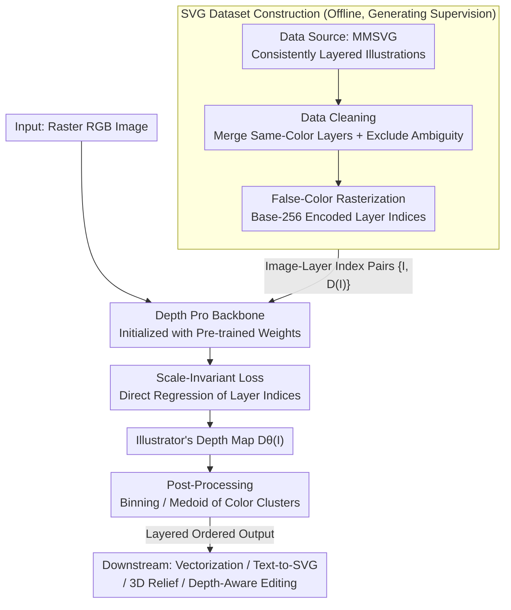

# Illustrator's Depth: Monocular Layer Index Prediction for Image Decomposition

**Conference**: CVPR 2026  
**Paper**: [CVF Open Access](https://openaccess.thecvf.com/content/CVPR2026/html/Maruani_Illustrators_Depth_Monocular_Layer_Index_Prediction_for_Image_Decomposition_CVPR_2026_paper.html)  
**Code**: None  
**Area**: Image Generation / Vector Graphics / Image Layer Decomposition  
**Keywords**: Illustrator's Depth, Layer Index Prediction, Image Vectorization, Editable Layering, Monocular Depth

## TL;DR
This paper proposes "Illustrator's Depth"—a novel concept that maps each pixel to a **layer index** rather than physical depth. Using a Depth Pro-based network, it predicts this globally consistent layer ordering directly from a single raster image. This decomposes flat images into editable, ordered layers, significantly surpassing the state-of-the-art in image vectorization while unlocking downstream applications such as text-to-vector, automatic 3D relief, and depth-aware editing.

## Background & Motivation
**Background**: Layers are the core paradigm of creative software (such as Photoshop and Illustrator), organizing a composition into several layers stacked from bottom to top so that each composition element can be edited independently. This layering is naturally related to "physical depth" (closer elements occlude distant ones), leading to intuitive attempts to restore layers automatically using monocular depth estimation (MDE, e.g., Depth Pro, Depth Anything) or panoptic segmentation.

**Limitations of Prior Work**: However, neither class of methods can recover "useful, ordered layers." MDE models predict physical geometric depth in the real world and are **specifically trained to ignore** content printed on flat media (e.g., patterns on posters, prints on T-shirts, shadows cast on objects). Consequently, elements without real volume appear "flat" to MDE, whereas in illustrations, they are exactly the key elements that need to reside in separate layers. Segmentation models (instance/panoptic) provide high-quality masks but **do not encode any relative ordering**, solving "what is this" rather than "what is on top of what."

**Key Challenge**: The "layer depth" of an illustration is neither pure physical depth nor pure semantic segmentation, but a subtle mix of both. It requires a **discrete, globally consistent, orderable** pixel-wise sequence. For instance, while dominoes overlap continuously in physical depth, they should be mapped to discrete orderable layers; shadows have no real physical depth but must be placed on top of the objects they are cast upon. No existing method provides such a single transitive order relation across the entire image.

**Goal**: To define and predict a new formulation of "depth" that prioritizes **editability** over metric accuracy, thereby decomposing any image into ordered layers from bottom (background) to top (foreground).

**Key Insight**: The authors observe that Vector Graphics (SVG) files are naturally layered by the stacking order of paths—presenting a goldmine of ground-truth layer structures. Thus, "layer inference" is reformulated as a **supervised monocular dense prediction** task: training a network directly on large-scale SVG datasets to predict the layer index of each pixel.

**Core Idea**: Redefining "depth" from a physical quantity to a creative abstraction—**predicting pixel-wise layer indices** $i\in\{1\dots N\}$—and repurposing strong MDE priors to generalize beyond the training set to complex artistic images.

## Method

### Overall Architecture
Given a raster RGB image $I\in\mathbb{R}^{H\times W}$, the goal is to predict an "Illustrator's Depth map" $D_\theta(I)\in\mathbb{R}^{H\times W}$, where each pixel value corresponds to its layer index in the artist's composition (represented as continuous values to preserve relative ordering, which can be binarized into discrete layers when needed). The entire pipeline consists of three components: constructing training pairs with ground-truth layer indices from SVG data sources, directly regressing layer indices using a network with Depth Pro as the backbone and a scale-invariant loss, and finally post-processing the continuous predictions to discretize them for downstream tasks (vectorization, text-to-vector, 3D relief, editing).

### Key Designs

**1. Illustrator's Depth: Redefining Depth as Pixel-wise Layer Index**

Addressing the fundamental contradiction where MDE outputs physical depth and segmentation yields unordered masks, both failing to recover editable layers, the authors propose a novel target: Illustrator's Depth. This is defined as a mapping from each pixel to its **layer index** $i\in\{1\dots N\}$, where $N$ is the number of layers the artwork is decomposed into, and indices monotonically increase from 1 (background) to $N$ (foreground). Its key property is a **globally consistent discrete order**—yielding a clear "above or below" relationship between any two pixels that satisfies transitivity, which is exactly what segmentation (unordered) and MDE (continuous physical quantity that ignores flat elements) fail to provide. In practice, the network outputs continuous values $D_\theta(I)$ instead of hard discrete indices, as a continuous representation preserves relative order, allows straightforward binning into discrete layers when required, and stabilizes training. This redefinition is the foundation of the paper: it transforms the ambiguous "layer inference" task into a supervised, evaluable dense regression problem.

**2. Distilling Supervision from SVGs: Data Source, Cleaning, and False-Color Rasterization**

Since Illustrator's Depth lacks readily available annotations, this paper addresses this by utilizing the fact that **SVG files naturally contain layer ordering**—the stacking order of each path represents the ground-truth layering. To handle noise in raw data, the authors convert SVGs into clean supervision via three steps: (a) choosing MMSVG-Illustration as the data source due to its consistent and intuitive layer organization (low index for background, high index for foreground, outlines always on top of their corresponding fills); (b) cleaning data to remove ambiguity by merging consecutive layers with the same RGB color to simplify structure, and discarding pathological samples like "non-adjacent layers of the same color overlapping in the rendered image," which significantly stabilizes training; (c) false-color rasterization to generate supervision maps, replacing the original color of each layer with a unique color encoding its index $i$, distributing the index into the RGB channels using base-256:

$$\big(\, i \bmod 256,\ \lfloor i/256\rfloor \bmod 256,\ \lfloor i/256^2\rfloor \bmod 256 \,\big)$$

Its rasterized counterpart can then be decoded back to a pixel-wise integer depth via $D(I)=R+256\cdot G+256^2\cdot B$. This encoding scheme represents a massive number of layers with virtually zero loading overhead. Finally, approximately 100k consistently layered SVG images (cleaned and rasterized to $1536\times1536$) form the training dataset.

**3. Leveraging Depth Pro Priors + Scale-Invariant Direct Regression of Layer Indices**

The network must simultaneously reason about object boundaries, occlusion, and grouping—capabilities that MDE models have already mastered. The authors employ **Depth Pro** (based on DINO-v2 with a multi-scale encoder) as the backbone and **initialize it with its pre-trained weights**, treating its understanding of geometry and occlusion as a crucial prior. This is the primary reason why the model can generalize from "simple vector graphics training sets" to "complex artistic images." Regarding loss, there is a counter-intuitive but key choice: physical MDE typically trains in **disparity space** $1/d$ (where foreground is closer and has larger values, prioritizing foreground precision). However, illustrations are structured and arranged from background to foreground, and **background layers are not intrinsically harder to estimate than foreground layers**. Thus, the authors **directly regress discrete layer indices** $(1\dots N)$ rather than disparity, assigning equal weight to all layers. Furthermore, since the relative order is desired rather than absolute index values, and $N$ can change, the authors apply the scale-invariant normalization from MiDaS: computing median $m$ and mean absolute deviation $s$ of the depth map to normalize each value as $\hat d:=(d-m)/s$, and minimizing MAE loss on the normalized map:

$$\mathcal{L}_{\text{MAE}}\big(D(I), D_\theta(I)\big) = \big|\,\hat D(I) - \hat D_\theta(I)\,\big|$$

Ablation studies confirm that although "direct index training" achieves comparable global ranking scores to disparity training, it yields more balanced foreground-background optimization and significantly better MAE/MSE.

**4. Post-processing Discretization + Seamless Integration into Legacy Vectorization Pipelines**

Since the network outputs pixel-wise continuous Illustrator's Depth, and downstream tasks require discrete layers, the authors offer two post-processing strategies depending on the task: (1) direct binning/thresholding of depth values (suitable for raster image editing); (2) clustering in RGB space first, then assigning each cluster its median depth value (suitable for vectorization, as inputs are typically regions of uniform color; clusters with similar colors and depths can be further merged to simplify paths). For vectorization, the paper's killer feature is **replacing the fragile heuristic sorting in legacy pipelines with the predicted layer indices**: taking VTracer as an example, they first compute color clusters, sort these clusters using Illustrator's Depth, apply inpainting to fill holes, and finally perform layer-by-layer vectorization with Potrace. The entire pipeline (including depth prediction) takes only a few seconds. This step achieves both strengths simultaneously for the first time: the reconstruction fidelity of traditional vectorizers and the layer order quality of data-driven methods.

### Loss & Training
The main loss is the scale-invariant normalized MAE (formula shown above). Training is conducted for 40 epochs on 8 A100 GPUs using a cosine learning rate scheduler (peak $5\times10^{-6}$) and a batch size of 8. Data augmentation includes color jitter, random inversion, and random blur. Following Depth Pro, different learning rates are applied to the encoder (DINO-v2) and the CNN decoder.

## Key Experimental Results

### Main Results
**Illustrator's Depth Prediction Quality (MMSVG Test Set)**: Evaluated using layer index maps rendered from GT SVGs. *Order* represents the proportion of randomly sampled pixel pairs where the relative order is correctly maintained.

| Method | Order ↑ | MAE ↓ | MSE ↓ |
|------|--------|-------|-------|
| Depth Pro (Physical Depth) | 0.636 | 1.44 | 4.76 |
| Depth Anything-v2 (Physical Depth) | 0.791 | 1.16 | 3.58 |
| **Ours** | **0.987** | **0.12** | **0.26** |

Physical depth models lag significantly in layer ordering, while the near-perfect layer ordering (0.987) of this method confirms that "physical depth $\neq$ Illustrator's Depth."

**Vectorization Quality (MMSVG Validation Set, grouped by layering strategy)**:

| Method | Layering Prior | Order ↑ | MAE ↓ | Path Count Error ↓ | RGB MSE(×10⁻²) ↓ | SSIM ↑ | LPIPS ↓ |
|------|---------|--------|-------|------|------|------|------|
| VTracer+Potrace | Heuristic | 0.694 | 1.67 | 0.83 | 0.019 | 0.997 | 0.005 |
| Less Is More | Heuristic | 0.746 | 2.43 | 5.54 | 0.663 | 0.961 | 0.043 |
| LIVE | Optimization | 0.838 | 4.88 | 8.62 | 0.297 | 0.946 | 0.053 |
| Starvector | Data-driven | 0.918 | 1.52 | 0.53 | 9.123 | 0.858 | 0.302 |
| OmniSVG | Data-driven | 0.925 | 1.31 | 0.54 | 9.997 | 0.830 | 0.317 |
| **Ours + [VTracer, Potrace]** | Data-driven | **0.987** | **0.46** | **0.16** | **0.018** | **0.997** | **0.005** |

Ours leads comprehensively in layer order accuracy and path compactness while maintaining reconstruction fidelity (SSIM 0.997, LPIPS 0.005) at the same top-tier level as VTracer. While other methods either reconstruct well but have poor layer order (VTracer, Less Is More) or have good layer order but poor reconstruction (StarVector, OmniSVG), this method achieves the best of both worlds.

### Ablation Study

| Configuration | Order ↑ | MAE ↓ | MSE ↓ | Description |
|------|--------|-------|-------|------|
| w/o Depth Prior Init | 0.903 | 0.51 | 1.17 | Without Depth Pro weights, layer order drops noticeably |
| w/o Data Cleaning | 0.905 | 0.53 | 1.21 | Without removing ambiguity, layer order drops similarly |
| Disparity Space Training (Non-direct index) | 0.980 | 0.50 | 1.88 | Order is comparable but MAE/MSE are significantly worse |
| **Full Model** | **0.981** | **0.16** | **0.29** | All three components equipped |

### Key Findings
- **Depth Prior Initialization and Data Cleaning** both pull layer order consistency (Order) from ~0.90 up to 0.98 and serve as the main sources of generalization capability. Specifically, the occlusion/geometric priors learned by Depth Pro on millions of real-world images allow the model, though trained on simple vector graphics, to generalize to complex artistic images.
- **Direct Layer Index Regression vs. Disparity Space Training**: While both yield almost identical global *Order* (0.980 vs. 0.981), direct index training balances foreground-background optimization, dropping MAE from 0.50 to 0.16 and MSE from 1.88 to 0.29, with cleaner transitions. This is a direct benefit of the insight that "each layer in an illustration is equally important and should not prioritize the foreground like physical depth does."
- Generalization is a pleasant surprise: although trained only on simple SVGs, the model outputs reasonable layer structures on complex illustrations, oil paintings, and even some real photographs, owing to the pre-trained priors.

## Highlights & Insights
- **Redefining the problem has more leverage than designing a new network**: The paper keeps the network structure virtually untouched (directly employing Depth Pro); its main contribution is reformulating "layer inference" into a supervised dense regression task and identifying SVGs as natural ground truths. This approach of "changing the target prediction variable" is highly transferable.
- **Base-256 False-Color Encoding**: Encoding arbitrarily large layer indices using three RGB channels, then decoding with a linear formula back to integers, embeds "up to hundreds of layers" into standard image I/O with zero overhead—an engineering trick highly worth repurposing.
- **"All Illustration Layers are Equally Important" Refutes the MDE Disparity Convention**: Physical MDE trains in the $1/d$ space to prioritize foreground accuracy. Since background and foreground layers are equally important in illustrations, training directly in index space is preferred. This domain difference analysis is well-founded and demonstrated via significant MAE/MSE improvements in the ablation study.
- **Plug-and-Play**: The layer index simply replaces the heuristic sorting in legacy vectorization pipelines, allowing mature tools like VTracer to achieve SOTA layer order without retraining the vectorizer, drastically lowering adoption barriers.

## Limitations & Future Work
- **Narrow Training Distribution**: Trained only on simple vector graphics (MMSVG), and although generalization to complex real-world photos yields surprises, it lacks quantitative evaluation (due to missing GT layers). Failure cases are delegated to supplementary materials, leaving robustness boundaries unmapped.
- **Subjectivity in Layering**: Different artists have different layering habits. The authors normalize the training signals by merging identical-color layers and removing ambiguous samples. However, this means the model learns a "mean/standardized" layering style, which may mismatch artworks that deliberately break conventions.
- **Dependency on Post-Processing for Discretization**: Post-processing parameters (binning thresholds, clustering merges) affect the final layer count and quality. The paper manually selects these strategies per task, leaving room for improvements in automation and robustness.
- **Lack of Reliable Guarantees for Absolute Layer Count**: The network regresses relative order; determining $N$ and aligning layer boundaries still rely on post-processing, where discretization errors in complex scenarios might propagate to downstream vectorization or relief tasks.

## Related Work & Insights
- **vs Monocular Depth Estimation (Depth Pro / Depth Anything-v2)**: These predict physical geometric depth and are trained to ignore flat printed content, whereas this work predicts layer indices, prioritizing editability. By leveraging their architectures and priors, this work significantly outperforms them in layer ordering (Order 0.987 vs. 0.636/0.791) despite the different target format.
- **vs Instance/Panoptic/Amodal Segmentation**: Segmentation provides high-quality masks but fails to encode any global order. This work provides a single transitive order relation across the entire image, addressing exactly what segmentation lacks.
- **vs Generative Layering (Portrait Matting, RGBA Layer Generation, Video Layer Atlases)**: Those methods yield independent object-level RGBA layers unconstrained by a globally coherent pixel-wise depth order. This work seeks a coherent, ordered "Illustrator's Depth" map for all pixels.
- **vs Vectorization Methods (VTracer/Potrace Heuristics, LIVE Optimization, StarVector/OmniSVG Data-Driven)**: Heuristic methods rebuild high-fidelity paths with messy layer orders, and generative/LLM approaches provide good layer orders but often fail to reconstruct high-fidelity paths. This work combines the best of both worlds with predicted layer indices, achieving compact paths and dual SOTA in both fidelity and layer ordering.

## Rating
- Novelty: ⭐⭐⭐⭐⭐ Redefines "depth" from physical measurements to creative abstractions (layer indices) and identifies SVGs as natural supervision; highly original problem formulation.
- Experimental Thoroughness: ⭐⭐⭐⭐ Solid main results and ablation studies, comprehensive vectorization comparison. However, generalization to real-world images relies primarily on qualitative presentation, lacking quantitative evaluation.
- Writing Quality: ⭐⭐⭐⭐⭐ Motivation is clearly derived (explaining in depth why existing methods fail), equipped with diverse illustrations and downstream applications.
- Value: ⭐⭐⭐⭐⭐ Plug-and-play enhancement for vectorization, unlocking multiple downstream applications like text-to-vector, 3D relief, and depth-aware editing; highly actionable.

<!-- RELATED:START -->

## Related Papers

- [\[CVPR 2026\] From Inpainting to Layer Decomposition: Repurposing Generative Inpainting Models for Image Layer Decomposition](from_inpainting_to_layer_decomposition_repurposing_generative_inpainting_models_.md)
- [\[CVPR 2026\] Qwen-Image-Layered: Towards Inherent Editability via Layer Decomposition](qwen-image-layered_towards_inherent_editability_via_layer_decomposition.md)
- [\[ICLR 2026\] Referring Layer Decomposition](../../ICLR2026/image_generation/referring_layer_decomposition.md)
- [\[CVPR 2026\] Cycle-Consistent Tuning for Layered Image Decomposition](cycle-consistent_tuning_for_layered_image_decomposition.md)
- [\[CVPR 2026\] Towards Robust Sequential Decomposition for Complex Image Editing](towards_robust_sequential_decomposition_for_complex_image_editing.md)

<!-- RELATED:END -->
