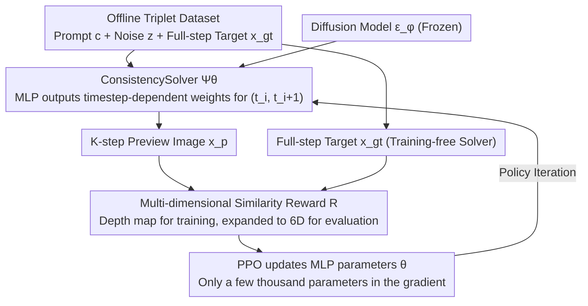

# Image Diffusion Preview with Consistency Solver

**Conference**: CVPR 2026  
**arXiv**: [2512.13592](https://arxiv.org/abs/2512.13592)  
**Code**: [https://github.com/G-U-N/consolver](https://github.com/G-U-N/consolver)  
**Area**: Diffusion Models / Image Generation  
**Keywords**: Diffusion Model Acceleration, ODE Solver, Reinforcement Learning, Preview-and-Refine, Sampling Efficiency

## TL;DR

This paper proposes the Diffusion Preview paradigm and ConsistencySolver—a lightweight high-order ODE solver trained via reinforcement learning. It generates high-quality preview images during low-step sampling while ensuring consistency with full-step outputs. It achieves an FID comparable to Multistep DPM-Solver with 47% fewer steps and reduces user interaction time by nearly 50%.

## Background & Motivation

**Background**: Diffusion models demonstrate excellence in high-fidelity image generation, but inference requires numerically solving reverse differential equations, which is computationally expensive. Existing acceleration methods fall into two categories: training-free ODE solvers (DDIM, DPM-Solver, UniPC, etc.) and post-training distillation methods (LCM, DMD2, etc.).

**Limitations of Prior Work**: Training-free solvers rely on theoretical assumptions and produce poor generation quality at low steps. Distillation methods require expensive retraining, destroy the deterministic mapping of the PF-ODE (the correspondence between noise space and data space), and suffer from accumulated distillation errors leading to quality degradation. Crucially, distilled models often lose the flexibility of choosing inference steps.

**Key Challenge**: In interactive generation (such as design prototyping), users need to quickly preview multiple variants to choose a satisfactory direction before refinement. Existing methods are either "fast but low quality and inconsistent" (training-free solvers) or "high quality but expensive and determinism-breaking" (distillation).

**Goal**: Design a Preview-and-Refine workflow that satisfies three requirements: (1) high preview fidelity (close to the final output); (2) high preview efficiency (low steps); (3) consistency between preview and final output (the same random seed produces visually consistent results).

**Key Insight**: Instead of modifying the diffusion model itself, this work optimizes the ODE solver. The integration coefficients of the solver are treated as a learnable strategy, and reinforcement learning is used to search for the optimal integration strategy.

**Core Idea**: Parameterize the ODE solver coefficients as a lightweight MLP and optimize them using PPO reinforcement learning, enabling low-step sampling to maximize similarity with full-step outputs.

## Method

### Overall Architecture

Given a text prompt and noise map, the diffusion model $\epsilon_\phi$ predicts the denoising direction. The learnable ODE solver $\Psi_\theta$ generates a preview image $\mathbf{x}_p$ using a few steps, while a training-free solver $\Psi$ generates the target image $\mathbf{x}_{gt}$ using full steps. Similarity rewards $\mathcal{R}$ are calculated based on depth maps, segmentation masks, DINO features, etc., and $\theta$ is updated via PPO.

### Key Designs

**1. Learnable Parameterization of ConsistencySolver: Replacing Fixed Theoretical Coefficients with Timestep-dependent Weights**

The poor quality of training-free solvers at low steps stems from their use of **hard-coded integration coefficients**. These coefficients are derived under theoretical assumptions of "sufficient steps and negligible discretization error," which collapse when steps are compressed to 5–8. Starting from the general Linear Multi-step Method (LMM), this work formulates each update as $\mathbf{y}_{t_{i+1}} = \mathbf{y}_{t_i} + (n_{t_{i+1}} - n_{t_i}) \cdot \big[\sum_{j=1}^{m} w_j(t_i, t_{i+1}) \cdot \epsilon_{i+1-j}\big]$ (where $\mathbf{y}_t = \mathbf{x}_t / \alpha_t$ is the state normalized by noise scale). The key modification is that the multi-step weights $w_j$ are no longer constants but are dynamically generated by a lightweight MLP $\mathbf{f}_\theta(t_i, t_{i+1})$ based on "current timestep and target timestep."

The advantage of this form is its **backward compatibility** with the entire family of classical solvers: DDIM is a special case of first-order fixed weights, and DPM-Solver-2 is a special case of midpoint approximation—both simply represent specific fixed weight values within this framework. By making the weights learnable, the solver can fit the **actual** sampling dynamics of the model rather than adhering to theoretical values, which is why it outperforms fixed-coefficient solvers in the 5–8 step range.

**2. Searching for Coefficients via PPO Instead of Distilling Them**

How is the weight MLP trained? The ultimate consistency goal is that "low-step previews should closely match full-step outputs," but consistency metrics (like depth map similarity) are often **non-differentiable**, preventing direct backpropagation through diffusion trajectories. This work treats the solving process as a sequential decision problem and uses PPO to search: first, an offline dataset of fixed triplets $\{(c^{(k)}, z^{(k)}, x_{gt}^{(k)})\}$ (prompt, noise, full-step target) is generated for reuse; in each episode, a batch of triplets is sampled, and the MLP-driven solver executes a $K$-step preview trajectory. After the trajectory, a similarity reward $\mathcal{R} = \text{Sim}(x_{gt}, x_p)$ is computed, and the policy is updated using the standard PPO clipped surrogate objective, with advantages self-normalized by batch mean/standard deviation.

Choosing RL over distillation is not for novelty's sake: distillation requires either differentiable rewards or backpropagation through the entire diffusion trajectory, which is expensive and prone to error accumulation. RL is **compatible with non-differentiable rewards**, does not touch the gradients of the diffusion trajectory, and only involves a few thousand parameters of the MLP in gradient calculations, resulting in extremely low training overhead and better generalization (FID 20.39 vs. 22.91 for the distilled version in ablations).

**3. Multi-dimensional Similarity Reward: Consistency Beyond a Single Metric**

The "consistency between preview and final output" is multifaceted—involving semantic correctness, structural stability, and geometric accuracy. During training, **depth map similarity** is used as the default RL reward (geometric structure is most sensitive to low-step sampling and provides the most stable signal). During evaluation, this is expanded to six dimensions for cross-validation: CLIP semantic alignment, DINO structural consistency, Inception perceptual similarity, SegFormer segmentation accuracy, pixel-level PSNR, and depth consistency. This ensures the training signal is concentrated while confirming that previews are faithful across semantic, structural, and geometric levels during evaluation.

### Loss & Training

A PPO clipped surrogate objective is used with a clipping parameter $\epsilon \in (0,1)$. Advantages are normalized with batch mean and standard deviation. Only the lightweight MLP parameters (a few thousand) are updated during training; the diffusion model is fully frozen. Once trained on Stable Diffusion, the solver can be directly migrated to different architectures and scales like SD1.4, DreamShaper, and even SDXL.

## Key Experimental Results

### Main Results

**Stable Diffusion Text-to-Image Generation (COCO 2017)**:

| Method | Steps | FID↓ | CLIP↑ | DINO↑ | Depth↑ |
|------|------|------|-------|-------|--------|
| DDIM | 5 | 52.59 | 87.8 | 73.2 | 14.2 |
| Multistep DPM | 5 | 25.87 | 93.1 | 85.5 | 19.1 |
| UniPC | 5 | 23.15 | 93.2 | 85.5 | 18.7 |
| **ConsistencySolver** | **5** | **20.39** | **94.2** | **86.5** | **19.3** |
| Multistep DPM | 10 | 19.29 | 97.0 | 93.0 | 24.1 |
| **ConsistencySolver** | **8** | **18.82** | **96.4** | **91.2** | **22.2** |
| LCM (Distill) | 4 | 22.00 | 90.0 | 75.1 | 14.3 |
| DMD2 (Distill) | 1 | 19.88 | 89.3 | 73.8 | 12.6 |

**Cross-model Generalization (Trained on SD1.5 → Direct Migration)**:

| Target Model | Steps | Multistep DPM FID | ConsistencySolver FID |
|----------|------|-------------------|----------------------|
| SDXL | 10 | 26.32 | **23.32** |
| SD1.4 | 5 | 25.22 | **20.22** |

### Ablation Study

| Comparison Dimension | Configuration | FID↓ | DINO↑ |
|----------|------|------|-------|
| Training Method | RL (PPO) | **20.39** | **86.5** |
| | Distillation (Ours-Distill) | 22.91 | 85.1 |
| | AMED (Distill) | 31.09 | 80.8 |
| Efficiency Comparison | ConsistencySolver 8 steps | 18.82 | 91.2 |
| | DPM-Solver 10 steps (Similar quality) | 19.29 | 93.0 |

### Key Findings

- The FID of ConsistencySolver-5 steps (20.39) is already superior to Multistep DPM-Solver-5 steps (25.87), a reduction of approximately 21%.
- 8-step ConsistencySolver (FID 18.82) can match or even exceed 10-step Multistep DPM-Solver (FID 19.29), achieving a 47% step reduction (8 vs. ~15 steps to reach equivalent quality).
- RL training is significantly better than distillation training (FID 20.39 vs. 22.91) and exhibits better generalization.
- Solvers trained on SD1.5 can be directly migrated to SDXL, suggesting that different diffusion models share similar optimal sampling dynamics.
- User studies indicate a nearly 50% reduction in overall interaction time.

## Highlights & Insights

- **Paradigm of "Optimizing the Solver, Not the Model"**: Without touching the diffusion model weights, only a lightweight MLP with a few thousand parameters is trained, yielding significant results with minimal investment. This approach can be extended to any generative model requiring accelerated sampling.
- **Discovery of Cross-model Generalization**: The effectiveness of a solver trained on SD1.5 when applied to SDXL suggests that optimal sampling strategies for different diffusion models share commonalities—a valuable theoretical insight.
- **Practical Value of the Preview-and-Refine Workflow**: Dividing diffusion model usage into "rapid exploration" and "refinement" stages aligns perfectly with the actual needs of designers.

## Limitations & Future Work

- Currently only validated on image generation and image editing; not yet extended to video generation acceleration.
- The choice of reward function (defaulting to depth maps) may not be optimal for all tasks.
- The MLP only accepts two scalar inputs $(t_i, t_{i+1})$, without considering the state of the current image, which may limit adaptive capabilities.
- Future work could explore combining ConsistencySolver with distillation methods.

## Related Work & Insights

- **vs. DPM-Solver / UniPC (Training-free Solvers)**: These methods use fixed theoretical coefficients, whereas ConsistencySolver uses learned adaptive coefficients, showing a clear advantage at low steps.
- **vs. LCM / DMD2 (Distillation Methods)**: Distillation methods modify model weights, destroy PF-ODE mapping, and require expensive training. ConsistencySolver leaves the model untouched, maintains complete deterministic mapping, and has extremely low training costs.
- **vs. AMED (Distillation Solver)**: Also trains solver coefficients, but AMED uses trajectory distillation, while ConsistencySolver uses RL, resulting in better generalization for the latter.

## Rating

- Novelty: ⭐⭐⭐⭐ Training an ODE solver via RL is a novel angle, and the Preview-and-Refine paradigm is highly practical.
- Experimental Thoroughness: ⭐⭐⭐⭐⭐ Validation across two models, cross-model generalization, multiple baseline comparisons, user research, and detailed ablations.
- Writing Quality: ⭐⭐⭐⭐⭐ Clear theoretical derivation and well-articulated relationship with classical solvers.
- Value: ⭐⭐⭐⭐ High practical value, extremely low training cost, and plug-and-play capability.

<!-- RELATED:START -->

## Related Papers

- [\[ICLR 2026\] Dual-Solver: A Generalized ODE Solver for Diffusion Models with Dual Prediction](../../ICLR2026/image_generation/dual-solver_a_generalized_ode_solver_for_diffusion_models_with_dual_prediction.md)
- [\[CVPR 2026\] PSR: Scaling Multi-Subject Personalized Image Generation with Pairwise Subject-Consistency Rewards](psr_scaling_multi-subject_personalized_image_generation_with_pairwise_subject-co.md)
- [\[ICLR 2026\] LVTINO: LAtent Video consisTency INverse sOlver for High Definition Video Restoration](../../ICLR2026/image_generation/lvtino_latent_video_consistency_inverse_solver_for_high_definition_video_restora.md)
- [\[CVPR 2026\] SpatialReward: Verifiable Spatial Reward Modeling for Fine-Grained Spatial Consistency in Text-to-Image Generation](spatialreward_verifiable_spatial_reward_modeling_for_fine-grained_spatial_consis.md)
- [\[ICCV 2025\] LATINO-PRO: LAtent consisTency INverse sOlver with PRompt Optimization](../../ICCV2025/image_generation/latino-pro_latent_consistency_inverse_solver_with_prompt_optimization.md)

<!-- RELATED:END -->
