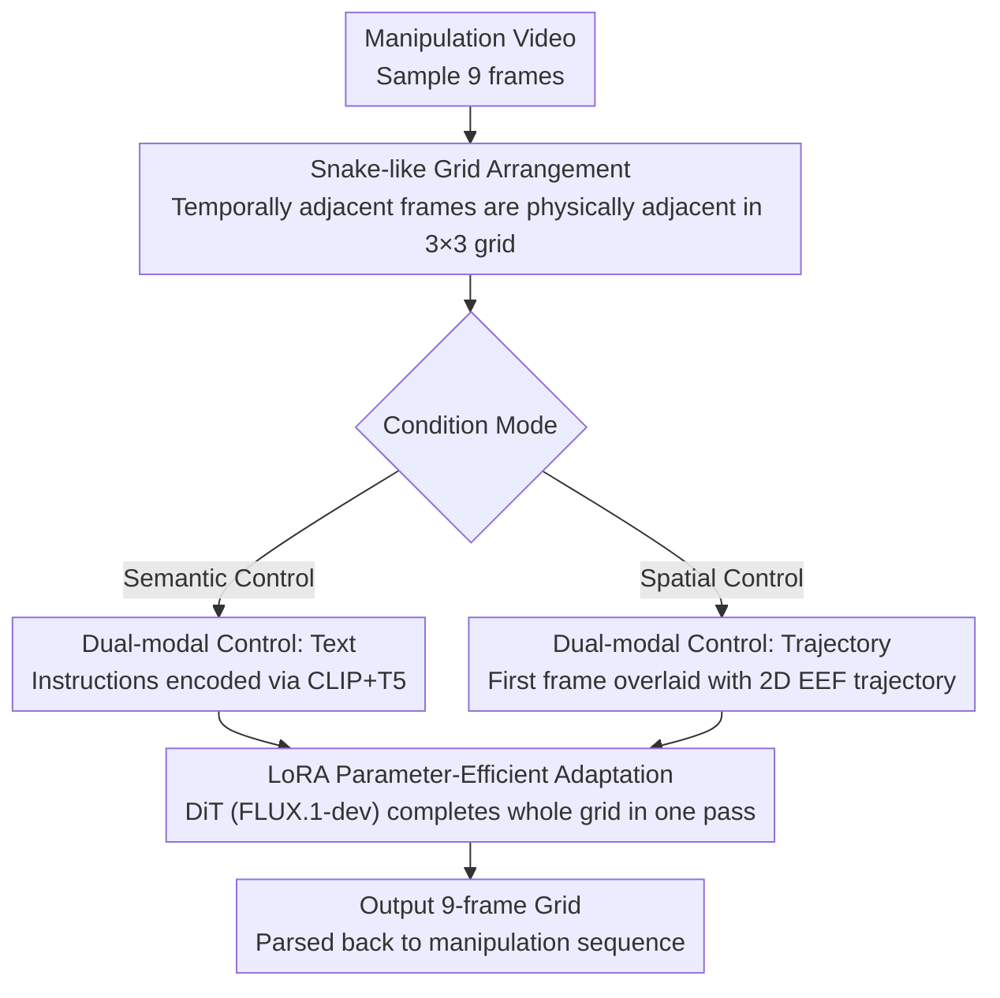

# Image Generation as a Visual Planner for Robotic Manipulation

**Conference**: CVPR 2026  
**arXiv**: [2512.00532](https://arxiv.org/abs/2512.00532)  
**Code**: [GitHub](https://github.com/pangye202264690373/Image-Generation-as-a-Visual-Planner-for-Robotic-Manipulation)  
**Area**: Image Generation / Robotic Manipulation  
**Keywords**: Visual Planning, Robotic Manipulation, Diffusion Models, Grid Image Generation, LoRA

## TL;DR

A pre-trained image generation model (DiT) is adapted via LoRA fine-tuning as a visual planner for robotic manipulation. By generating temporally coherent manipulation sequences in the form of $3 \times 3$ grid images, it supports both text-conditioned and trajectory-conditioned control modes.

## Background & Motivation

Generating realistic robotic manipulation videos is a key step towards unifying perception, planning, and action. Existing video diffusion models require large-scale domain-specific datasets, suffer from limited generalization, and entail high computational costs. Meanwhile, large-scale image generation models (such as FLUX.1-dev) trained on image-language pairs have demonstrated **strong compositional generation capabilities**—arranging multiple semantically consistent sub-images within a single grid layout, implicitly representing temporal transitions similar to short videos.

The core hypothesis of this work is: **Pre-trained image generators have already encoded transferable temporal priors.** Through lightweight LoRA fine-tuning, they can serve as visual planners for robotic manipulation without the need for specialized video architectures.

## Method

### Overall Architecture

The core premise of this paper is that pre-trained image generation models have implicitly learned temporal priors. Instead of designing dedicated video architectures, lightweight fine-tuning allows them to function as visual planners for robotic manipulation. Specifically, a manipulation video is sampled into 9 frames and arranged in a $3 \times 3$ grid following a snake-like pattern to form a single image. Consequently, "video generation" is transformed into "grid image generation." During training, only the first frame in the top-left corner is provided as a condition while others are masked. The DiT (based on FLUX.1-dev) learns to complete the entire 9-frame grid using Parameter-Efficient Fine-Tuning (PEFT) via LoRA.

### Key Designs

**1. Snake-like Grid Arrangement: Spatial Adjacency for Temporal Proximity**

A challenge in fitting video into a grid is the temporal relationship—if the spatial layout does not match the temporal order, the local attention of the Transformer cannot capture continuous motion. The snake-like arrangement addresses this: 9 frames are laid out in a loop order of $1\to2\to3$, $6\leftarrow5\leftarrow4$, $7\to8\to9$:

$$\mathbf{D} = \begin{bmatrix} D^{\text{img}_1} & D^{\text{img}_2} & D^{\text{img}_3} \\ D^{\text{img}_6} & D^{\text{img}_5} & D^{\text{img}_4} \\ D^{\text{img}_7} & D^{\text{img}_8} & D^{\text{img}_9} \end{bmatrix}$$

This ensures that any two temporally adjacent frames are physically adjacent in the grid, allowing local attention to naturally model short-range temporal dependencies and guarantee consistency across frames without explicit temporal modules.

**2. Dual-modal Conditioning: Text for Semantics, Trajectory for Spatial Control**

The planner provides two control methods for different needs. Text-conditioned generation receives language instructions (e.g., "pick up the red cup") plus the initial frame. Text is encoded via CLIP + T5 into $c_{\text{text}} = \{e_{\text{clip}}, E_{\text{t5}}\}$ and injected via cross-attention, excelling at deriving reasonable action sequences from high-level semantics. Trajectory-conditioned generation renders the 2D trajectory of the end-effector on the first frame (red to blue indicating time progression). The overlaid image $\tilde{\mathbf{D}}^{\tau}$ replaces the first frame as the condition, guiding the model along a specific path. These modes are complementary: text for semantic reasoning and trajectory for geometric precision.

**3. LoRA Parameter-Efficient Adaptation: Cross-domain Transfer via Low-rank Increments**

To transfer a general image generator to the robotic video domain, full fine-tuning is expensive and prone to overfitting. LoRA (with rank $r \ll d$) is applied only to the query/value projections of self-attention and feed-forward layers in the DiT. Training parameters are reduced from $O(d^2)$ to $O(rd)$, achieving low-cost migration without increasing inference latency. Ablation studies show this is critical—the model fails completely without LoRA.

### Loss & Training

A latent space MSE loss is utilized: $\mathcal{L}_{\text{lat}} = \|\mathcal{E}(\mathbf{D}_{gt}) - \mathcal{E}(\hat{\mathbf{D}})\|_2^2$, where $\mathcal{E}$ is the VAE encoder. The model performs **single-pass grid generation** (non-autoregressive), predicting the full 9-frame grid at once by leveraging the compositional priors of the image generation model for implicit temporal reasoning.

## Key Experimental Results

### Main Results

| Dataset | Method | FVD↓ | SSIM↑ | MSE↓ | Success↑ |
|---------|--------|------|-------|------|----------|
| JacoPlay | Text | 490.7 | 0.797 | 0.00695 | **80.6%** |
| JacoPlay | Traj | 503.37 | **0.802** | **0.00680** | 74.0% |
| BridgeV2 | Text | **644.2** | **0.733** | **0.0135** | **73.2%** |
| BridgeV2 | Traj | 693.2 | 0.726 | 0.0152 | 70.9% |
| RT-1 | Text | 698.0 | 0.727 | 0.0118 | 72.4% |
| RT-1 | Traj | **688.1** | **0.731** | **0.0117** | **81.7%** |

### Ablation Study (BridgeV2)

| Configuration | FVD↓ | SSIM↑ | Success↑ | Description |
|---------------|------|-------|----------|-------------|
| Full (Traj) | 644.2 | 0.733 | 73.2% | Complete model |
| Full (Text) | 693.2 | 0.726 | 70.9% | Complete model |
| w/o LoRA | 4377.1 | 0.064 | 0% | Frozen backbone fails completely |
| w/o Prompt Template | 843.4 | 0.754 | 2.5% | Severe degradation in semantic guidance |
| w/o Trajectory Overlay | 720.0 | 0.749 | 3.9% | Loss of spatial control |

### Key Findings

- LoRA is a critical component: without it, FVD jumps from 644 to 4377 and success rate drops to 0%.
- Text templates are vital for semantic understanding: removing them drops the success rate from 73.2% to 2.5%.
- Text conditions perform better on JacoPlay/BridgeV2 (semantic following), while trajectory conditions excel on RT-1 (spatial following).
- The two conditioning modes are complementary: text is better for semantic reasoning, and trajectory is better for geometric accuracy.

## Highlights & Insights

1. **Novel Perspective**: First systematic verification that pre-trained image generation models can serve as robotic visual planners—transforming image generators into video synthesizers through LoRA fine-tuning.
2. **Simplified Temporal Modeling**: No temporal modules are used; frame consistency is achieved solely through grid layout and local attention.
3. **Cost-Effectiveness**: Leverages compositional priors of pre-trained image generators using LoRA without requiring large-scale video datasets or specialized video architectures.

## Limitations & Future Work

1. Occasional inconsistencies in tone/texture between grid blocks; slight misalignments may occur at grid boundaries.
2. The 9-frame sequence length is short, making it difficult to cover long-horizon manipulation tasks.
3. Success rates are based on visual judgment rather than closed-loop verification with real robot execution.
4. Testing is limited to 3 datasets; cross-domain generalization (e.g., JacoPlay to BridgeV2) has not been verified.
5. Trajectory conditioning requires pre-provided 2D trajectories, limiting practical utility for autonomous planning.

## Related Work & Insights

- **RIGVid**: Uses AI-generated task videos to estimate 6-DoF trajectories for real robot execution.
- **Gen2Act**: Generates human execution videos and conditions policies to generalize to new scenarios.
- **ControlNet**: Injects spatial conditions into frozen text-to-image models, inspiring the trajectory condition design in this work.
- **Insight**: Compositional priors of image models might be applicable to more planning tasks, such as navigation path planning or assembly sequence planning.

## Rating

- Novelty: ⭐⭐⭐⭐⭐ Re-positioning image generators as visual planners is an innovative and inspiring idea.
- Experimental Thoroughness: ⭐⭐⭐⭐ Complete across 3 datasets and ablations, though lacks direct comparison with video generation baselines and real-world hardware validation.
- Writing Quality: ⭐⭐⭐⭐ Clear structure, though mathematical descriptions are slightly redundant and some content repeats.
- Value: ⭐⭐⭐⭐ Provides an interesting research direction, but practical value is limited by the lack of closed-loop execution verification.

<!-- RELATED:START -->

## Related Papers

- [\[ICCV 2025\] A0: An Affordance-Aware Hierarchical Model for General Robotic Manipulation](../../ICCV2025/image_generation/a0_affordance_aware_hierarchical_model_robotic_manipulation.md)
- [\[AAAI 2026\] MP1: MeanFlow Tames Policy Learning in 1-step for Robotic Manipulation](../../AAAI2026/image_generation/mp1_meanflow_tames_policy_learning_in_1-step_for_robotic_manipulation.md)
- [\[ICLR 2026\] Self-Improving Loops for Visual Robotic Planning](../../ICLR2026/image_generation/self-improving_loops_for_visual_robotic_planning.md)
- [\[CVPR 2026\] Exploring Conditions for Diffusion Models in Robotic Control](exploring_conditions_for_diffusion_models_in_robotic_control.md)
- [\[ICCV 2025\] EC-Flow: Enabling Versatile Robotic Manipulation from Action-Unlabeled Videos via Equivariant Flow Matching](../../ICCV2025/image_generation/ec-flow_enabling_versatile_robotic_manipulation_from_action-unlabeled_videos_via.md)

<!-- RELATED:END -->
