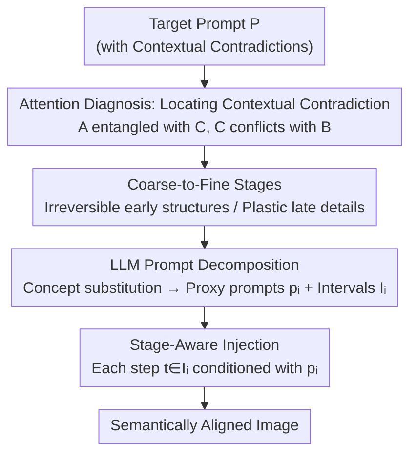

# Image Generation from Contextually-Contradictory Prompts

**Conference**: CVPR 2026  
**Paper**: [CVF Open Access](https://openaccess.thecvf.com/content/CVPR2026/html/Huberman_Image_Generation_from_Contextually-Contradictory_Prompts_CVPR_2026_paper.html)  
**Code**: Project Page https://tdpc2025.github.io/SAP/ (No public code seen)  
**Area**: Image Generation / Diffusion Models  
**Keywords**: Text-to-Image, Contextual Contradiction, Stage-Aware Prompting, Prompt Decomposition, LLM-Guided Diffusion

## TL;DR
Text-to-image diffusion models often fail when encountering "contextually-contradictory" prompts (e.g., "a butterfly in a beehive," where butterflies are strongly bound to flowers by the model, thereby conflicting with the beehive). This paper proposes a training-free framework, Stage-Aware Prompting (SAP): it leverages LLMs to decompose the target prompt into a sequence of "proxy prompts + timestep intervals," injecting different prompts at different stages corresponding to the "coarse-to-fine" diffusion denoising process. This significantly improves semantic alignment without requiring retraining.

## Background & Motivation

**Background**: Text-to-image diffusion models such as FLUX and SD3 can generate high-quality and diverse images from natural language. However, achieving precise semantic alignment between the generated images and the prompts remains a challenge, particularly when prompts fall outside the model's training distribution—specifically, when combining two concepts that are individually reasonable but rare or unusual when combined.

**Limitations of Prior Work**: The authors identify a specific and overlooked failure mode: when prompted with "a butterfly in a beehive," models often depict a butterfly on a flower. The issue is not that the two concepts are directly contradictory, but that the model has learned a strong correlation between "butterfly" and "flower" during training. This implicit "flower" conflicts with the "beehive" in the prompt, prompting the model to quietly ignore or distort parts of the semantics. Existing improvements (such as enhanced text embeddings, attention modifications, attention-map-guided losses, and CFG annealing) mostly fail to specifically address this type of contradiction caused by prior associations.

**Key Challenge**: The authors term this **Contextual Contradiction**: concept A contradicts concept B not because their semantics are directly opposite, but because the model's prior entangles A with some concept C, and B conflicts with C (for example, "a dragon spraying something" is prior-entangled with "fire," which conflicts with "water" in the prompt). This is essentially a manifestation of "spurious correlation / shortcut learning" in generative models—the model relies on statistically strong but semantically misleading correlations in training data rather than robust compositional reasoning.

**Goal**: To enable diffusion models to faithfully generate images from such prompts that are "seemingly plausible yet violate the model's hidden biases" without retraining or fine-tuning the base model.

**Key Insight**: The authors leverage a well-known property of diffusion denoising—**coarse-to-fine**: early timesteps settle low-frequency structures (layout, pose, shape), while later steps develop high-frequency details (textures, identity). Since different concepts emerge at different levels of detail, contradictory concepts can be **disengaged along denoising stages**, feeding only the most relevant and non-contradictory information at each stage.

**Core Idea**: Use an LLM to **decompose contradictory prompts into a sequence of proxy prompts**. Each proxy prompt targets attributes that should emerge at a specific denoising stage and deliberately avoids contradictions at that stage. These are then injected into the diffusion process sequentially across timestep intervals—using a "re-skinning" approach to lock in the correct structure first, and then switching back to the real identity.

## Method

### Overall Architecture
SAP (Stage-Aware Prompting) is a training-free framework consisting of two components: **(i) Prompt Decomposition**: using an LLM (GPT-4o) to process the target prompt $P$, identify contextual contradictions, and output a sequence of proxy prompts $\{p_1,\dots,p_n\}$ and corresponding timestep intervals $\{I_1,\dots,I_n\}$; **(ii) Stage-Aware Injection**: during each denoising timestep $t$, conditioning the diffusion model with the prompt $p_i$ that satisfies $t\in I_i$. This mechanism requires no architectural changes or retraining, is plugged directly into existing inference pipelines, and is compatible with various pre-trained diffusion models (validated on FLUX.1[dev] and SD3.0).

The essence of the entire pipeline is to "use a structurally appropriate, non-contradictory proxy to lock in the early irreversible structure, and then swap back to the actual concept to modify mutable details later." For example, with "a lion doing a handstand," the LLM outputs: steps 1–4 use "a man doing a handstand in the park" (locking the "handstand" pose/layout structure first, as humans naturally do handstands, posing no contradiction); steps 5–6 transition to "a man in a lion costume doing a handstand in the park"; and steps 7–50 switch to "a lion doing a handstand in the park" (since the layout is locked, only the identity details need to be adapted to a lion).

### Key Designs

**1. Contextual Contradiction: Diagnosing "Hidden Conflicts" using Attention Maps**

To solve the problem, its nature must first be clarified. The authors formally define: if the model prior entangles concept A with C, and B contradicts C, then A and B are **contextually contradictory**—distinguished from "direct contradiction" (such as a girl cannot laugh and cry simultaneously). This conflict is not explicit in the prompt text but resides in the learned prior biases of the model: "duck" is almost always associated with water, and "polar bear" with snow. The authors substantiate this by analyzing cross-attention maps: text tokens attend not only to their literal corresponding regions but also to contextually related elements—the token "howling" lights up both the mouth and the moon, and "dragon" attends to flames even when fire is not mentioned. Crucially, regarding the mechanism when contradiction occurs: given "a woman writing with a dart," both 'writing' and 'dart' attend to the hand/tool region. However, log-ratio maps reveal that 'writing' dominates and suppresses 'dart', resulting in the dart being drawn as a pen. This diagnosis serves as both the problem definition and the rationale for the subsequent "stage-wise re-skinning" strategy: deep-rooted associations override atypical ones.

**2. Two Properties of Coarse-to-Fine: Irreversible Structures + Plastic Details**

This is the physical foundation of the proposed method. Diffusion denoising is coarse-to-fine: early steps establish low-frequency structures, and later steps generate high-frequency details. From this, the authors extract two key observations: **(i) Irreversibility of structure**: as denoising progresses, the model incrementally "locks in" layouts and global shapes; once established, they cannot be reversed in later stages even if they conflict with the prompt. **(ii) Plasticity of high-frequency details**: early on, high-frequency details do not yet exist and are unaffected by the prompt, allowing flexible guidance in early stages without polluting eventual details. The paper provides evidence via $x_0$ prediction visualizations (Figure 4): using the target prompt "a howling wolf and flying bats at high noon" directly locks in structures of night and the moon early on, contradicting "high noon". Conversely, using a proxy containing "dog" and "bird" first and then switching back to the target preserves the noon layout (irreversible coarse structure) while adapting identities to wolf and bats (plastic high-frequency details). These two properties lead directly to the strategy: **fix structural decisions early, and maintain attribute flexibility late**.

**3. LLM Prompt Decomposition: Concept Substitution, Interval Assignment, and Explicit Reasoning**

Making judgments on "which concepts contradict, at which stage they should be introduced, and what non-conflicting stand-ins to use" requires extensive world knowledge, which the authors delegate to an LLM (GPT-4o). Given a contradictory prompt $P$, the LLM outputs a sequence of proxy prompts along with their timestep intervals. Each proxy $p_i$ must satisfy two conditions: (i) preserve semantics relevant to "attributes that typically form in the interval $I_i$" from $P$ (since structures are irreversible, missing them cannot be resolved later); (ii) avoid contradictions likely to emerge during that stage (leveraging the plasticity of high-frequency details). Practically, a structured prompt template is used, consisting of instruction text, **20 in-context examples** (including both cases that require decomposition and those that do not, enabling the LLM to generalize), and explanations of contextual contradiction. The most common strategy is **Concept Substitution**: temporarily replacing conflicting concepts with a structurally appropriate proxy instead of simply omitting them. Omitting and then introducing an object late in the game without a pre-allocated structural placeholder causes size distortion or total omit (Figure 6: a snowman introduced at step 5 becomes too small). Furthermore, the paper forces the LLM to output a brief **explanation/reasoning** before generating the decomposition. Ablations show this step is critical for coherent semantic decision-making (performance drops significantly without it).

**4. Stage-Aware Prompt Injection: Aligning Proxy Prompts to Denoising Intervals**

With $\{p_1,\dots,p_n\}$ and intervals $\{I_1,\dots,I_n\}$, the injection process is straightforward: at each timestep $t$, the prompt $p_i$ satisfying $t\in I_i$ is used to condition the T2I model. This ensures that at each step of denoising, the model sees concepts that match the detail level currently being formed and do not conflict with the model's priors, thereby progressively constructing the image while bypassing contradictions. This step requires no architectural modifications and seamlessly integrates into existing inference. The choice of intervals is important (Figure 7): introducing the full prompt too early fails to decouple the contradiction timely, while introducing it too late only affects minor details. Nonetheless, experiments demonstrate that as long as the prompts fall into the correct coarse stages, the method remains highly robust to minor perturbations around interval boundaries.

### An Example: From "Lion Handstand" to the Correct Image
Target prompt: "A lion is doing a handstand". A lion is bound to poses like "standing on four legs/upright" by priors, which contradicts "doing a handstand". Direct generation fails to render the handstand. SAP operates as follows:
- **Steps 1–4**: "A man is doing a handstand in the park" — Using "man" as a proxy, since humans naturally do handstands, locking in the handstand layout/pose structure early (irreversible stage).
- **Steps 5–6**: "A man in a lion costume is doing a handstand in the park" — Transitioning, beginning to inject lion identity elements while maintaining the handstand structure.
- **Steps 7–50**: "A lion is doing a handstand in the park" — The structure is locked. The real target is reintroduced to modify only high-frequency identity details (turning the man into a lion).

The final result is a lion genuinely doing a handstand, rather than a lion standing on four legs with a handstand label forced upon it.

## Key Experimental Results

**Implementation**: The base T2I model is FLUX.1[dev], prompt decomposition uses GPT-4o, and inference runs for $T=50$ steps with a maximum of 3 proxies per prompt. Additionally, the same LLM-generated proxies and intervals are evaluated on SD3.0 to verify robustness.  
**Baselines**: FLUX, SD3.0, R2F (evaluated in three settings: original SD3.0, official FLUX-schnell, and replication on FLUX), Annealing Guidance, Ella, and VL-DNP.  
**Datasets**: Whoops! (500 counter-commonsense prompts), Whoops-Hard (a challenging subset of 100 prompts curated by the authors from Whoops!), and ContraBench (a newly constructed evaluation set of 40 prompts specifically focusing on contextual contradictions, generated by ChatGPT and filtered manually).  
**Metrics**: Prompt alignment evaluated by GPT-4o (VLM) on a scale of 1–5, averaged over 3 fixed seeds and scaled to 20–100.

### Main Results

| Method | Whoops | Whoops-Hard | ContraBench |
|------|--------|-------------|-------------|
| SD3.0 | 82.63 | 55.73 | 57.5 |
| FLUX | 78.85 | 44.3 | 57.16 |
| Ella | 69.09 | 45.19 | 55.16 |
| Annealing | 79.59 | 59.06 | 58.33 |
| VL-DNP | 82.79 | 56.26 | 58.83 |
| R2F | 83.50 | 57.06 | 59.16 |
| R2F (schnell) | 79.58 | 54.80 | 59.33 |
| R2F (FLUX) | 48.68 | 32.80 | 25.33 |
| **SAP (SD3.0)** | **85.87** | **64.40** | 65.33 |
| **SAP (FLUX)** | 85.10 | 62.13 | **66.16** |

SAP outperforms all baselines across all three benchmarks. Notably regarding the base models: SD3.0 exhibits stronger alignment under contradiction, while FLUX achieves higher visual quality. SAP yields improvements on both base models—raising FLUX from 44.3 to 62.13 and SD3.0 from 55.73 to 64.40 on Whoops-Hard. This substantial gain demonstrates its effectiveness against "hard" contradictions. The replication of R2F on FLUX (R2F_FLUX) suffers severe collapse (25.33), confirming that its alternating prompt strategy is designed for attribute binding and does not adapt well to contextual contradictions.

**User Study**: Randomly selecting 24 prompts evaluated by 61 users (totaling 1464 evaluations), the win rate of SAP against various baselines (Alignment / Quality) is as follows:

| Comparison | Alignment Win Rate | Quality Win Rate |
|------|---------|---------|
| vs SD3 | 70% | 72% |
| vs FLUX | 81% | 63% |
| vs Ella | 81% | 74% |
| vs Annealing | 73% | 79% |
| vs R2F | 75% | 68% |

Human evaluations judge SAP as superior in both alignment and quality, complementing the limitations of VLM metrics that can be insensitive to subtle semantic inconsistencies and image quality.

### Ablation Study

Ablating individual designs of the prompt decomposition on Whoops-Hard (alignment score):

| Configuration | Alignment | Description |
|------|------|------|
| static | 44.3 | Degenerates to static/no decomposition (≈ base FLUX) |
| w/o in-context | 48.0 | Removes 20 in-context examples |
| w/o reasoning | 46.46 | Removes forced explanation/reasoning |
| 2 proxy | 60.26 | Restricts to a maximum of 2 proxies |
| **Full** | **62.13** | Full method (≤3 proxies) |

**Robustness to Interval Perturbations** (keeping proxy prompts unchanged and uniformly shifting interval boundaries within a window $w$):

| Configuration | Whoops | Whoops-Hard | ContraBench |
|------|--------|-------------|-------------|
| FLUX | 78.85 | 44.3 | 57.16 |
| SAP | 85.10 | 62.13 | 66.16 |
| SAP (w=3, ±1 step) | 84.18 | 62.06 | 65.5 |
| SAP (w=5, ±2 steps) | 81.46 | 58.46 | 62.5 |

### Key Findings
- **In-context examples contribute most**: Removing them causes a drop on Whoops-Hard from 62.13 to 48.0, close to the base model performance. This indicates that LLMs struggle to decompose contradictory prompts without examples. Forced reasoning is also critical (dropping to 46.46), showing that "explaining the contradiction before decomposing" prompts more coherent substitutions.
- **Proxy count 2 → 3 still yields gains**: Restricting to 2 proxies still achieves 60.26, but allowing up to 3 provides additional flexibility for harder cases, reaching 62.13.
- **Insensitive to interval boundaries, sensitive to stages**: A shift of ±1 step has almost no impact, and ±2 steps shows only minor degradation (even though this is quite a perturbation given the relative stage lengths of ~12 steps). However, misplacing proxies in the wrong coarse stage (too early or too late, see Figure 7) significantly damages alignment. This confirms that the "stage of information introduction" is key rather than the precise timestep.

## Highlights & Insights
- **Introducing "spurious correlation/shortcut learning" to generative models with an actionable definition**: The concept of contextual contradiction (A entangled with C, C conflicts with B) simultaneously explains a common class of generation failures and provides visual evidence through attention log-ratio maps, lending significant value to the definition itself.
- **Using the denoising "timeline" as a decoupling dimension**: While existing works focus on spatial allocation (region masking) or attention manipulation, this work cleverly utilizes the "irreversible coarse structures, plastic details" property to decouple contradictory concepts across timesteps—locking the structure with non-contradictory proxies first and switching back to the true identity later. The pipeline is clean and training-free.
- **LLM acting as a "director" rather than an "artist"**: Letting the LLM solely handle contradiction identification, proxy prompt generation, and interval scheduling, while delegating the generation process to the diffusion model, sets a clear division of labor. It is plug-and-play and transferable to any T2I model with cross-attention.
- **Concept substitution is superior to concept omission**: Using structurally appropriate placeholder proxies (e.g., man → man in a lion costume → lion) is more robust than "inserting out of thin air in later stages", preventing object size distortion or omission. This "placeholder" design offers highly valuable insights for reusability.

## Limitations & Future Work
- **Constrained by base model capabilities**: Since the method operates purely through text guidance, it cannot control attributes that the base model itself struggles with, such as precise counting (six-fingered gloves), orientation (cat's shadow facing the wrong direction), or upside-down flower bouquets (Figure 10 failure cases).
- **Dependence on LLM's world knowledge and decomposition quality**: Identifying contradictions, choosing proxies, and determining intervals rely entirely on the LLM. If the LLM misinterprets the contradiction or provides unsuitable proxies, the generation fails. Additionally, the 20 manually constructed in-context examples carry the authors' strategic biases.
- **Proxy count restricted to ≤3**: For complex prompts containing multiple overlapping contradictions, three stages might not be sufficiently granular. The paper does not deeply explore using more proxies or adaptive proxy counts.
- **Future Work**: The authors suggest moving toward a hybrid architecture where VLM and generative models are more tightly coupled, utilizing the VLM's world knowledge to resolve conflicts directly during the generation process, rather than the current two-stage "LLM plan, diffusion execute" paradigm.

## Related Work & Insights
- **vs R2F**: R2F also alternates prompts across timesteps, but it is designed for "attribute binding/strengthening rare concepts" and switches prompts based on pre-defined timesteps rather than aligning prompts with "stages of semantic feature emergence during denoising." Consequently, it often generates mixtures combining conflicting elements. SAP, conversely, explicitly schedules proxies according to coarse-to-fine stages, specifically addressing contextual contradictions.
- **vs Annealing Guidance**: This method trains a small MLP to predict the CFG scale at each step for dynamic guidance, requiring training and not being designed for contradictions. SAP is training-free and targets contradictions driven by prior associations.
- **vs Ella / VL-DNP**: Ella fine-tunes text representations on SD1.5, and VL-DNP leverages VLM-guided negative prompting. Neither specifically handles contextual contradictions that emerge only upon composition, lagging significantly on hard benchmarks like Whoops-Hard.
- **vs Multi-prompt/Regional conditioning methods**: Existing works mostly assign sub-prompts to different spatial regions or learned tokens in different layers (for personalization). SAP differs by using multiple prompts to **resolve internal semantic tension generated by concept compositions**, distributing them across time rather than space.

## Rating
- Novelty: ⭐⭐⭐⭐⭐ "Contextual contradiction" definition and the perspective of decoupling contradictions using the denoising timeline are highly novel, supported by attention-map evidence.
- Experimental Thoroughness: ⭐⭐⭐⭐ Comprehensive evaluation with three benchmarks + multiple baselines + user study + ablations + interval robustness; however, exploration on proxy numbers and complex multi-contradictions is limited.
- Writing Quality: ⭐⭐⭐⭐⭐ Clear logical chain and strong visualizations, spanning from problem definition, mechanism analysis (Figures 3 and 4), to the proposed method.
- Value: ⭐⭐⭐⭐ Training-free, plug-and-play, and transferable to multiple T2I models. It directly assists in practical prompt alignment, though its upper bound is constrained by base model capability.

<!-- RELATED:START -->

## Related Papers

- [\[CVPR 2026\] Beyond Text Prompts: Precise Concept Erasure through Text–Image Collaboration](beyond_text_prompts_precise_concept_erasure_through_text-image_collaboration.md)
- [\[CVPR 2026\] Interpretable Prompts made Edit-Friendly: Token-to-Token Similarity Reduction in dLLMs for Edit-Friendly Hard Prompt Inversion](interpretable_prompts_made_edit-friendly_token-to-token_similarity_reduction_in_.md)
- [\[CVPR 2025\] Learning to Sample Effective and Diverse Prompts for Text-to-Image Generation](../../CVPR2025/image_generation/learning_to_sample_effective_and_diverse_prompts_for_text-to-image_generation.md)
- [\[ECCV 2024\] MultiGen: Zero-Shot Image Generation from Multi-modal Prompts](../../ECCV2024/image_generation/multigen_zero-shot_image_generation_from_multi-modal_prompts.md)
- [\[CVPR 2026\] PixelDiT: Pixel Diffusion Transformers for Image Generation](pixeldit_pixel_diffusion_transformers_for_image_generation.md)

<!-- RELATED:END -->
